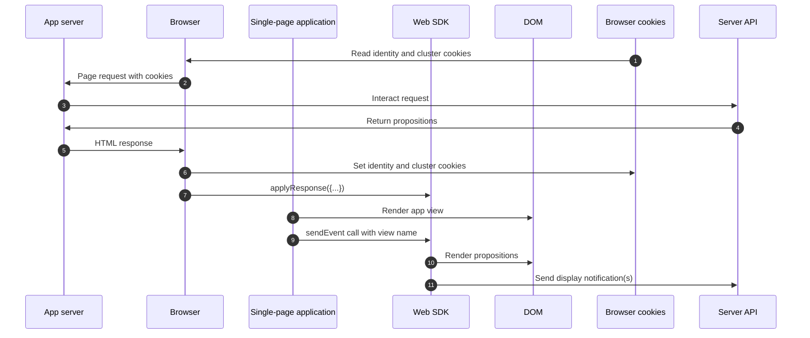

# Personalization via hybrid implementation

## Overview {#overview}

Hybdrid implementation describes a way of deploying personalization while eliminating page flicker and reducing latency.

This is done by retrieving personalization content server-side, using the [Edge Network Server API](../../..//server-api/overview.md), and rendering the personalized content on the client side, using the [Web SDK](../../home.md) `applyResponse` command.

The table below shows an example of personalized and non-personalized content.

| Sample page without personalization | Sample page with personalization|
|---|---|
|  |  |

## Sample React application {#sample-app}

The process described below uses a sample [!DNL React] application that can serve as a starting point for you to experiment and learn more about this type of personalization. 

You can download this sample and customize it for your own needs. For example, you can change environment variables so that the sample app pulls in offers from your own Experience Platform configuration.

To do so, open the `.env` file at the root of the repository and modify the variables according to your configuration. Restart the sample app, and you're ready to experiment using your own personalization content.

### Running the sample {#running-sample}

Follow the steps below to run the sample app.

1. Clone [this repository](https://github.com/adobe/alloy-samples) to your local machine.
2. Open a terminal and navigate to the `personalization-hybrid-spa` folder.
3. Run `npm install`.
4. Run `npm start`.
5. Open your web browser and navigate to `http://localhost`

## Process overview

1. [Express](https://expressjs.com/) is used for a lean server-side implementation. This handles basic server requests and routing.
2. The browser requests the web page. Any cookies previously stored by the browser, prefixed with `kndctr_` are included.
3. When the page is requested from the app server, an event is sent to the [interactive data collection endpoint](../../../server-api/interactive-data-collection.md) to fetch personalization content. The sample app uses helper methods to simplify building and sending requests to the API (see [aepEdgeClient.js](https://github.com/adobe/alloy-samples/blob/main/common/aepEdgeClient.js)). The `POST` request contains an `event` and a `query`. The cookies from the previous step, if available, are included in the `meta>state>entries` array.
4. The application server returns a response with the HTML content and the identity and cluster cookies.
5. On the client app page, the [!DNL Web SDK] `applyResponse` command is invoked, passing in the headers and body of the server-side response.
6. The client app uses the `sendEvent` command to tell the Web SDK when a view has been rendered. Each time a primary navigation link is clicked, a `sendEvent` command is invoked, with the corresponding view name. When the command is fired, the Web SDK automatically updates the page with relevant personalization experiences.

### Flow diagram



## Server-side request {#server-side-request}

The browser requests the web page. Any cookies previously stored by the browser, prefixed with `kndctr_` are included.

When the page is requested from the app server, an event is sent to the [interactive data collection endpoint](../../../server-api/interactive-data-collection.md) to fetch personalization content.

The `POST` request contains an `event` and a `query`. The cookies from the previous step, if available, are included in the `meta>state>entries` array.

**API format**

```http
POST /ee/v2/interact
```

**Request**

```shell
curl -X POST "https://edge.adobedc.net/ee/v2/interact?dataStreamId={DATASTREAM_ID}&requestId={REQUEST_ID}" \
-H "Content-Type: application/json" \
-d '{
   "event":{
      "xdm":{
         "web":{
            "webPageDetails":{
               "URL":"http://localhost/"
            },
            "webReferrer":{
               "URL":""
            }
         },
         "identityMap":{
            "FPID":[
               {
                  "id":"xyz",
                  "authenticatedState":"ambiguous",
                  "primary":true
               }
            ]
         },
         "timestamp":"2022-06-23T22:21:00.878Z"
      },
      "data":{
         
      }
   },
   "query":{
      "identity":{
         "fetch":[
            "ECID"
         ]
      },
      "personalization":{
         "schemas":[
            "https://ns.adobe.com/personalization/default-content-item",
            "https://ns.adobe.com/personalization/html-content-item",
            "https://ns.adobe.com/personalization/json-content-item",
            "https://ns.adobe.com/personalization/redirect-item",
            "https://ns.adobe.com/personalization/dom-action"
         ],
         "decisionScopes":[
            "__view__",
            "sample-json-offer"
         ]
      }
   },
   "meta":{
      "state":{
         "domain":"localhost",
         "cookiesEnabled":true,
         "entries":[
            {
               "key":"kndctr_XXX_AdobeOrg_identity",
               "value":"abc123"
            },
            {
               "key":"kndctr_XXX_AdobeOrg_cluster",
               "value":"or2"
            }
         ]
      }
   }
}'
```

Cookies are used to persist user identity and cluster information.  When using a hybrid implementation, the application server must handle the storing and sending of these cookies during the request lifecycle.

| Cookie | Purpose | Stored by | Sent by |
|---|---|---|---|
| `kndctr_AdobeOrg_identity` | Contains user identity details. | Application server | Application server |
| `kndctr_AdobeOrg_cluster`  | Indicates which Edge Network cluster should be used to fulfill the requests. | Application server | Application server |

## Server-side response {#server-side-response}

The application server returns a response with the HTML content and the identity and cluster cookies.


```json
{
   "requestId":"5c539bd0-33bf-43b6-a054-2924ac58038b",
   "handle":[
      {
         "payload":[
            {
               "id":"XXX",
               "namespace":{
                  "code":"ECID"
               }
            }
         ],
         "type":"identity:result"
      },
      {
         "payload":[
            {
               "..."
            },
            {
               "..."
            }
         ],
         "type":"personalization:decisions",
         "eventIndex":0
      }
   ]
}
```


## Client-side request {#client-side-request}

On the client app page, the [!DNL Web SDK] `applyResponse` command is invoked, passing in the headers and body of the server-side response.

The `personalize` command is a custom example designed to illustrate the handling of offers that are not automatically rendered by the Web SDK, such as [!DNL JSON] offers. It is not a command from the Web SDK.

The `applyResponse` command returns information from the response, similar to the `sendEvent` command.

```javascript
alloy("applyResponse", {
    "renderDecisions": true,
    "responseHeaders": {
      "cache-control": "no-cache, no-store, max-age=0, no-transform, private",
      "connection": "close",
      "content-encoding": "deflate",
      "content-type": "application/json;charset=utf-8",
      "date": "Mon, 11 Jul 2022 19:42:01 GMT",
      "server": "jag",
      "strict-transport-security": "max-age=31536000; includeSubDomains",
      "transfer-encoding": "chunked",
      "vary": "Origin",
      "x-adobe-edge": "OR2;9",
      "x-content-type-options": "nosniff",
      "x-konductor": "22.6.78-BLACKOUTSERVERDOMAINS:7fa23f82",
      "x-rate-limit-remaining": "599",
      "x-request-id": "5c539bd0-33bf-43b6-a054-2924ac58038b",
      "x-xss-protection": "1; mode=block"
    },
    "responseBody": {
      "requestId": "5c539bd0-33bf-43b6-a054-2924ac58038b",
      "handle": [
        {
          "payload": [
            {
              "id": "XXX",
              "namespace": {
                "code": "ECID"
              }
            }
          ],
          "type": "identity:result"
        },
        {
          "payload": [
            {...}, 
            {...}
          ],
          "type": "personalization:decisions",
          "eventIndex": 0
        }
      ]
    }
  }
).then(personalize("sample-json-offer"));
```

|Parameter|Description|
|---|---|
|`renderDecisions:true`|*Optional.* You can use this command to request the Web SDK to render the available offers.|


The client app must use the `sendEvent` command to tell the Web SDK when a view has been rendered. Each time a primary navigation link is clicked, a `sendEvent` command is invoked, with the corresponding view name.

When the command is fired, the Web SDK automatically updates the page with relevant personalization experiences.

```javascript
alloy("sendEvent", {
  "renderDecisions": true,
  "xdm": {
    "web": {
      "webPageDetails": {
        "viewName":"home"
      }
    }
  }
});
```

