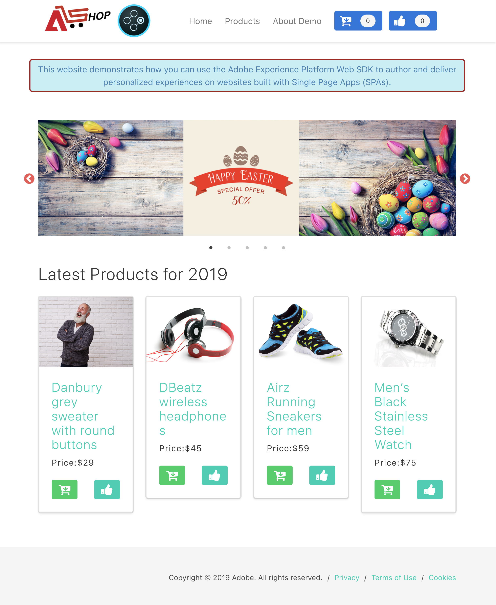
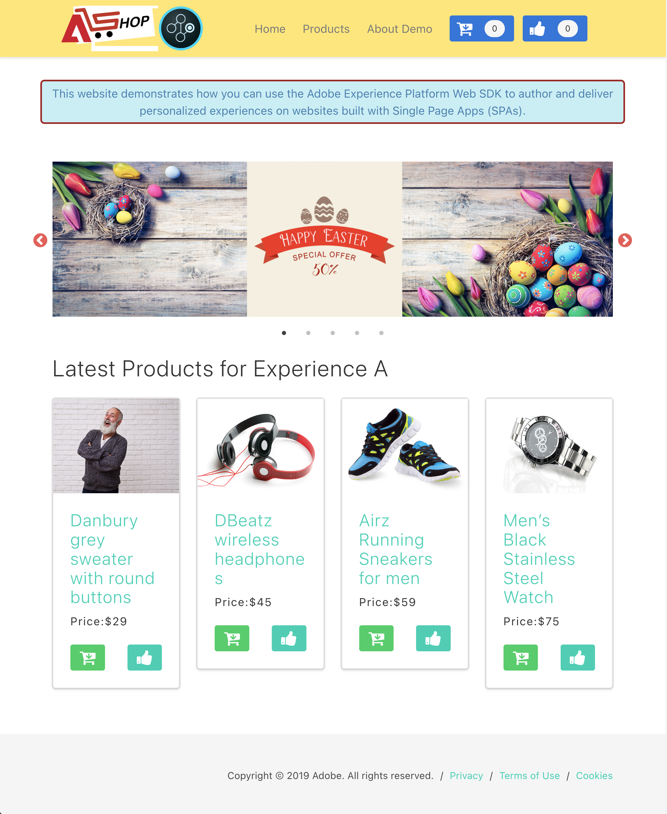

# Hybrid personalization using Web SDK and Edge Network Server API

## Overview {#overview}

Hybdrid personalization describes the process of retrieving personalization content server-side, using the [Edge Network Server API](../../..//server-api/overview.md), and rendering it client-side, using the [Web SDK](../../home.md) `applyResponse` command.

The table below shows an example of personalized and non-personalized content.

| Sample page without personalization | Sample page with personalization|
|---|---|
|  |  |

## Considerations {#considerations}

### Cookies {#cookies}

Cookies are used to persist user identity and cluster information.  When using a hybrid implementation, the Web application server handles the storing and sending of these cookies during the request lifecycle.

| Cookie | Purpose | Stored by | Sent by |
|---|---|---|---|
| `kndctr_AdobeOrg_identity` | Contains user identity details. | Application server | Application server |
| `kndctr_AdobeOrg_cluster`  | Indicates which Edge Network cluster should be used to fulfill the requests. | Application server | Application server |

### Request placement {#request-placement}

Server API requests are required to get propositions and send a display notification. When using a hybrid implementation, the application server makes these requests to the Server API.

| Request | Made by | 
|---|---|
| Interact request to retrieve propositions | Application server |
| Interact request to send display notifications | Application server |

### Analytics implications {#analytics}

When implementing hybrid personalization, you must pay special attention so that page hits are not counted multiple times in Analytics.

When you [configure a datastream](../datastreams/overview.md) for Analytics, events are automatically forwarded so that page hits are captured. 

The sample from this implementation uses two different datastreams:

* A datastream configured for Analytics. This datastream is used for Web SDK interactions.
* A second datastream without an Analytics configuration. This datastream is used for Server API requests.

This way, the server-side request do not register any Analytics events, but the client-side requests do. This leads to Analytics requests being accurately counted.

## Sample application {#sample-app}

The process described below uses a sample application which can serve as a starting point for you to experiment and learn more about this type of personalization. 

You can download this sample and customize it for your own needs. For example, you can change environment variables so that the sample app pulls in offers from your own Experience Platform configuration.

To do so, open the `.env` file at the root of the repository and modify the variables according to your configuration. Restart the sample app, and you're ready to experiment using your own personalization content.

### Running the sample {#running-sample}

Follow the steps below to run the sample app.

1. Clone [this repository](https://github.com/adobe/alloy-samples) to your local machine.
2. Open a terminal and navigate to the `personalization-hybrid` folder.
3. Run `npm install`.
4. Run `npm start`.
5. Open your web browser and navigate to `http://localhost`.

## Process overview

1. [Express](https://expressjs.com/) is used for a lean server-side implementation. This handles basic server requests and routing.
2. The browser requests the web page. Any cookies previously stored by the browser, prefixed with `kndctr_`, are included.
3. When the page is requested from the app server, an event is sent to the [interactive data collection endpoint](../../../server-api/interactive-data-collection.md) to fetch personalization content. The sample app uses helper methods to simplify building and sending requests to the API (see [aepEdgeClient.js](https://github.com/adobe/alloy-samples/blob/main/common/aepEdgeClient.js)). The `POST` request contains an `event` and a `query`. The cookies from the previous step, if available, are included in the `meta>state>entries` array.

   ```js
   fetch(
   "https://edge.adobedc.net/ee/v2/interact?dataStreamId=abc&requestId=123",
   {
      headers: {
         accept: "*/*",
         "accept-language": "en-US,en;q=0.9",
         "cache-control": "no-cache",
         "content-type": "text/plain; charset=UTF-8",
         pragma: "no-cache",
         "sec-fetch-dest": "empty",
         "sec-fetch-mode": "cors",
         "sec-fetch-site": "cross-site",
         "sec-gpc": "1",
         "Referrer-Policy": "strict-origin-when-cross-origin",
         Referer: "http://localhost/",
      },
      body: JSON.stringify({
         event: {
         xdm: {
            web: {
               webPageDetails: {
               URL: "http://localhost/",
               },
               webReferrer: {
               URL: "",
               },
            },
            identityMap: {
               FPID: [
               {
                  id: "xyz",
                  authenticatedState: "ambiguous",
                  primary: true,
               },
               ],
            },
            timestamp: "2022-06-23T22:21:00.878Z",
         },
         data: {},
         },
         query: {
         identity: {
            fetch: ["ECID"],
         },
         personalization: {
            schemas: [
               "https://ns.adobe.com/personalization/default-content-item",
               "https://ns.adobe.com/personalization/html-content-item",
               "https://ns.adobe.com/personalization/json-content-item",
               "https://ns.adobe.com/personalization/redirect-item",
               "https://ns.adobe.com/personalization/dom-action",
            ],
            decisionScopes: ["__view__", "sample-json-offer"],
         },
         },
         meta: {
         state: {
            domain: "localhost",
            cookiesEnabled: true,
            entries: [
               {
               "key": "kndctr_XXX_AdobeOrg_identity",
               "value": "abc123"
               },
               {
               "key": "kndctr_XXX_AdobeOrg_cluster",
               "value": "or2"
               }
            ],
         },
         },
      }),
      method: "POST",
   }
   ).then((res) => res.json());
   ```

4. The application server returns a response with the HTML content and the identity and cluster cookies.
5. On the client app page, the [!DNL Web SDK] `applyResponse` command is invoked, passing in the headers and body of the server-side response.

   ```js
   alloy("applyResponse", {
      "renderDecisions": true,
      "responseHeaders": {
         "cache-control": "no-cache, no-store, max-age=0, no-transform, private",
         "connection": "close",
         "content-encoding": "deflate",
         "content-type": "application/json;charset=utf-8",
         "date": "Mon, 11 Jul 2022 19:42:01 GMT",
         "server": "jag",
         "strict-transport-security": "max-age=31536000; includeSubDomains",
         "transfer-encoding": "chunked",
         "vary": "Origin",
         "x-adobe-edge": "OR2;9",
         "x-content-type-options": "nosniff",
         "x-konductor": "22.6.78-BLACKOUTSERVERDOMAINS:7fa23f82",
         "x-rate-limit-remaining": "599",
         "x-request-id": "5c539bd0-33bf-43b6-a054-2924ac58038b",
         "x-xss-protection": "1; mode=block"
      },
      "responseBody": {
         "requestId": "5c539bd0-33bf-43b6-a054-2924ac58038b",
         "handle": [
         {
            "payload": [
               {
               "id": "XXX",
               "namespace": {
                  "code": "ECID"
               }
               }
            ],
            "type": "identity:result"
         },
         {
            "payload": [
               {...}, 
               {...}
            ],
            "type": "personalization:decisions",
            "eventIndex": 0
         }
         ]
      }
   }
   ).then(applyPersonalization("sample-json-offer"));
   ```

6. The [!DNL Web SDK] renders page load [!DNL Visual Experience Composer (VEC)](https://experienceleague.adobe.com/docs/target/using/experiences/vec/visual-experience-composer.html?lang=en) offers automatically, because the `renderDecisions` flag is set to `true`.
7. Form-based [!DNL JSON] offers are manually applied by the sample implementation code through the `applyPersonalization` method, to update the [!DNL DOM] based on the personalization offer.
8. For form-based activities, display events must manually be sent, to indicate when the offer has been displayed. This is done via the `sendEvent` command.

   ```js
   function sendDisplayEvent(decision) {
   const { id, scope, scopeDetails = {} } = decision;

   alloy("sendEvent", {
      xdm: {
         eventType: "decisioning.propositionDisplay",
         _experience: {
         decisioning: {
            propositions: [
               {
               id: id,
               scope: scope,
               scopeDetails: scopeDetails,
               },
            ],
         },
         },
      },
   });
   }
   ```
