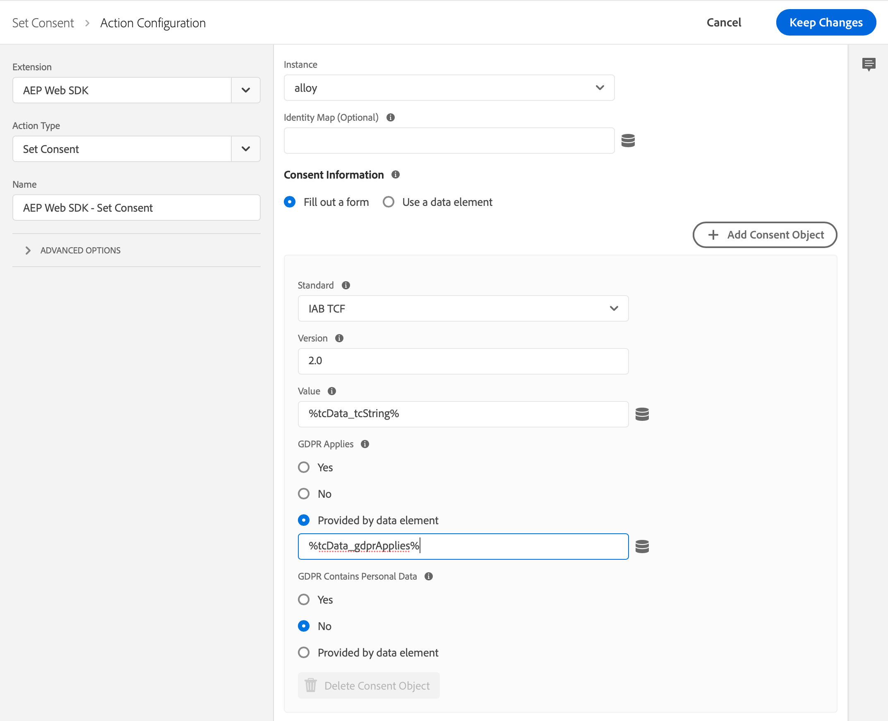

# Using IAB TCF 2.0 with Experience Platform Launch and the AEP Web SDK extension

The Adobe Experience Platform Web Software Development Kit (Adobe Experience Platform Web SDK) supports the Interactive Advertising Bureau Transparency & Consent Framework, version 2.0 (IAB TCF 2.0). This guide shows you how to set up an Adobe Experience Platform Launch property for sending IAB TCF 2.0 consent information to Adobe using the AEP Web SDK Launch extension.

If you do not wish to use Experience Platform Launch, please refer to the guide on [using IAB TCF 2.0 without Experience Platform Launch](./without-launch.md).

## Getting started

In order to utilized IAB TCF 2.0 with Experience Platform Launch and the AEP Web SDK extension, you need to have an XDM schema and dataset available. If you have not set either of these up, start by viewing the [Adobe Experience Platform Web SDK Launch quick start guide](../../getting-started/quick-start-with-launch.md) before proceeding.

Additionally, this guide requires you to have a working understanding of the Adobe Experience Platform Web SDK. For a quick refresher, please read the [Adobe Experience Platform Web SDK overview](../../home.md) and the [Frequently asked questions](../../getting-started/web-sdk-faq.md) documentation.

## Setting default consent

Within the extension configuration, there is a setting for default consent. This controls the behavior of customers who do not have a consent cookie. If you want to queue Experience Events for customers who do not have a consent cookie, set this to "pending".

>[!NOTE]
>
>Currently, there is no way to set this dynamically through the Experience Platform Launch extension.

For more information on default consent, refer to the [default consent section](../../fundamentals/configuring-the-sdk.md#default-consent) in the SDK configuration documentation.

## Updating Profile with consent information {#consent-code-1}

To call the `setConsent` action when your customers consent preferences have changed, you need to create a new Experience Platform Launch rule. Start by adding a new event and choose the Core extension's "Custom Code" event type.

Use the following code sample for your new event:

```javascript
// Wait for window.__tcfapi to be defined, then trigger when the customer has completed their consent and preferences.
function addEventListener() {
  if (window.__tcfapi) {
    window.__tcfapi("addEventListener", 2, function (tcData, success) {
      if (success && tcData.eventStatus === "useractioncomplete") {
        // save the tcData.tcString in a data element
        _satellite.setVar("IAB TCF Consent String", tcData.tcString);
        _satellite.setVar("IAB TCF Consent GDPR", tcData.gdprApplies);
        trigger();
      }
    });
  } else {
    // window.__tcfapi wasn't defined. Check again in 100 milliseconds
    setTimeout(addEventListener, 100);
  }
}
addEventListener();
```

This custom code does two things:

* Sets two data elements, one with the consent string and one with the `gdprApplies` flag. This is useful later when filling out the "Set Consent" action. 

* Triggers the rule when the consent preferences have changed. The "Set Consent" action should be used whenever consent preferences have changed. Add a "Set Consent" action in the extension and fill out the form as follows:

* Standard: "IAB TCF"
* Version: "2.0"
* Value: "%IAB TCF Consent String%"
* GDPR Applies: "%IAB TCF Consent GDPR%"



>[!IMPORTANT]
>
>You cannot choose these data elements using the data element selector because they were created through custom code. You must type in the data element name with the percent signs. This code updates your customers profile with their new consent preferences whenever they change. Additionally, the server returns a cookie value, which could prevent the Adobe Experience Platform Web SDK from recording Experience Events.

## Creating an XDM data element for Experience Events

The consent string should be included in the XDM ExperienceEvent. To do this, use the XDM Object data element. Start by creating a new XDM Object data element, or alternatively, use one you already created for sending events. If you have added the Experience Event Privacy mixin to your schema, you should have a `consentStrings` key in the XDM object. 

1. Select **[!UICONTROL consentStrings]**.

1. Choose **[!UICONTROL Provide individual items]** and select **[!UICONTROL Add Item]**. 

1. Expand the **[!UICONTROL consentString]** heading, and expand the first item, then fill in the following values:

* `consentStandard`: IAB TCF
* `consentStandardVersion`: 2.0
* `consentStringValue`: %IAB TCF Consent String%
* `gdprApplies`: %IAB TCF Consent GDPR%

>[!IMPORTANT]
>
>You cannot choose these data elements using the data element selector because they were created through custom code. You must type in the data element name with the percent signs.

## Sending an initial Experience Event with IAB TCF 2.0 consent information

If the initial Experience Event on the page is triggered with a page load event, the consent string might not have loaded yet. This rule is intended to replace your current page load event. To make sure the consent information is loaded first, create a new rule and add the following code as a custom code event:

```javascript
// Wait for window.__tcfapi to be defined, then trigger when there is a consent string
function addEventListener() {
  if (window.__tcfapi) {
    window.__tcfapi("addEventListener", 2, function (tcData, success) {
      if (success && (tcData.eventStatus === "useractioncomplete" || tcData.eventStatus === "tcloaded")) {
        // save the tcData.tcString in a data element
        _satellite.setVar("IAB TCF Consent String", tcData.tcString);
        _satellite.setVar("IAB TCF GDPR Applies", tcData.gdprApplies);
        trigger();
      }
    });
  } else {
    // window.__tcfapi wasn"t defined. Check again in 100 milliseconds
    setTimeout(addEventListener, 100);
  }
}
addEventListener();
```

This code is identical to the previous custom code, except that both `useractioncomplete` and `tcloaded` events are handled. The [previous custom code](#consent-code-1) only triggers when the customer chooses their preferences for the first time. This code also triggers when the customer has already chosen their preferences. For example, on the second page load.

Add a "Send Event" action from the Adobe Experience Platform Web SDK extension. Within the XDM field, choose the XDM data element you created in the previous section.

## Sending other events with IAB TCF 2.0 consent information

When events are triggered after the initial Experience Event, the two data elements are still defined and can be used to send the IAB consent information. Use the same XDM data element to send future events. The IAB TCF 2.0 information is included.

## Next steps

Now that you have learned how to use IAB TCF 2.0 with the Adobe Experience Platform Web SDK extension, you also choose to integrate with other Adobe solutions such as Adobe Analytics or Real-time Customer Data platform. See the [IAB Transparency & Consent Framework 2.0 overview](./overview.md) for more information.