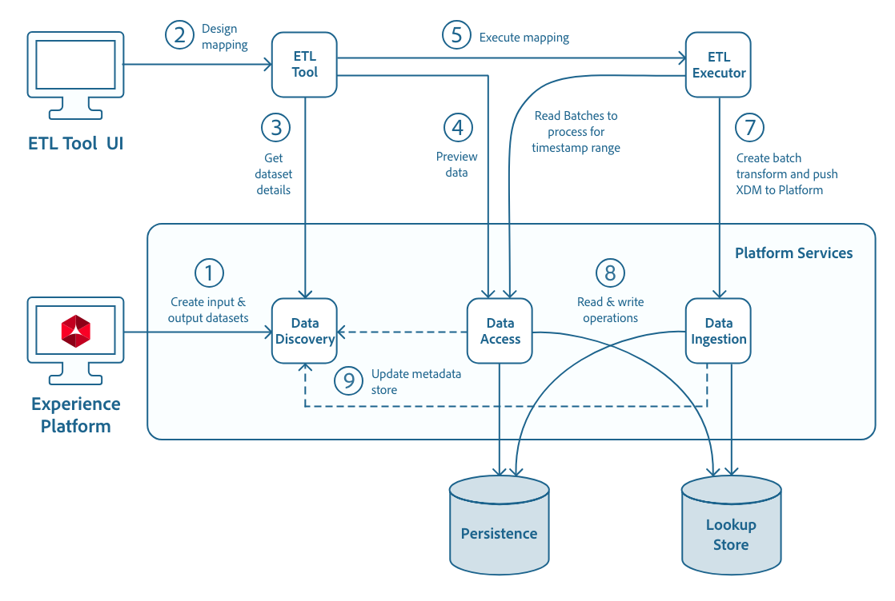

# Developing ETL Integrations for Adobe Experience Platform

The ETL integration guide outlines general steps for creating high-performance, secure connectors for [!DNL Experience Platform] and ingesting data into [!DNL Platform].


- [[!DNL Catalog]](https://www.adobe.io/experience-platform-apis/references/catalog/)
- [[!DNL Data Access]](https://www.adobe.io/experience-platform-apis/references/data-access/)
- [[!DNL Batch Ingestion]](https://developer.adobe.com/experience-platform-apis/references/batch-ingestion/)
- [[!DNL Streaming Ingestion]](https://developer.adobe.com/experience-platform-apis/references/streaming-ingestion/)
- [Authentication and Authorization for Experience Platform APIs](https://www.adobe.com/go/platform-api-authentication-en)
- [[!DNL Schema Registry]](https://www.adobe.io/experience-platform-apis/references/schema-registry/)

This guide also includes sample API calls to use when designing an ETL connector, with links to documentation that outlines each [!DNL Experience Platform] service, and use of its API, in more detail. 

A sample integration is available on [!DNL GitHub] via the [ETL Ecosystem Integration Reference Code](https://github.com/adobe/acp-data-services-etl-reference) under the [!DNL Apache] License Version 2.0.

## Workflow

The following workflow diagram provides a high-level overview for the integration of Adobe Experience Platform components with an ETL application and connector.



## Adobe Experience Platform components 

There are multiple Experience Platform components involved in ETL connector integrations. The following list outlines several key components and functionalities:

- **Adobe Identity Management System (IMS)** - Provides framework for authentication to Adobe services.
- **IMS Organization** - A corporate entity that can own or license products and services and allow access to its members.
- **IMS User** - Members of an IMS Organization. The Organization to User relationship is many to many.
- **[!DNL Sandbox]** - A virtual partition a single [!DNL Platform] instance, to help develop and evolve digital experience applications.
- **Data Discovery** - Records the metadata of ingested and transformed data in [!DNL Experience Platform].
- **[!DNL Data Access]** - Provides users with an interface to access their data in [!DNL Experience Platform].
- **[!DNL Data Ingestion]** – Pushes data to [!DNL Experience Platform] with [!DNL Data Ingestion] APIs.
- **[!DNL Schema Registry]** - Defines and stores schema that describe the structure of data to be used in [!DNL Experience Platform]. 

## Getting started with [!DNL Experience Platform] APIs

The following sections provide additional information that you will need to know or have on-hand in order to successfully make calls to [!DNL Experience Platform] APIs.

### Reading sample API calls

This guide provides example API calls to demonstrate how to format your requests. These include paths, required headers, and properly formatted request payloads. Sample JSON returned in API responses is also provided. For information on the conventions used in documentation for sample API calls, see the section on [how to read example API calls](../landing/troubleshooting.md#how-do-i-format-an-api-request) in the [!DNL Experience Platform] troubleshooting guide.

### Gather values for required headers

In order to make calls to [!DNL Platform] APIs, you must first complete the [authentication tutorial](https://www.adobe.com/go/platform-api-authentication-en). Completing the authentication tutorial provides the values for each of the required headers in all [!DNL Experience Platform] API calls, as shown below:

- Authorization: Bearer `{ACCESS_TOKEN}`
- x-api-key: `{API_KEY}`
- x-gw-ims-org-id: `{ORG_ID}`

All resources in [!DNL Experience Platform] are isolated to specific virtual sandboxes. All requests to [!DNL Platform] APIs require a header that specifies the name of the sandbox the operation will take place in:

- x-sandbox-name: `{SANDBOX_NAME}`

>[!NOTE]
>
>For more information on sandboxes in [!DNL Platform], see the [sandbox overview documentation](../sandboxes/home.md). 

All requests that contain a payload (POST, PUT, PATCH) require an additional header:

- Content-Type: application/json

## General user flow

To begin, an ETL user logs into the [!DNL Experience Platform] user interface (UI) and creates datasets for ingestion using a standard connector or push-service connector.

In the UI, the user creates the output dataset by selecting a dataset schema. The choice of schema depends on the type of data (record or time series) being ingested into [!DNL Platform]. By clicking on the Schemas tab within the UI, the user will be able to view all available schemas, including the behavior type that the schema supports.

In the ETL tool, the user will start designing their mapping transforms after configuring the appropriate connection (using their credentials). The ETL tool is assumed to already have [!DNL Experience Platform] connectors installed (process not defined in this Integration Guide).

Mockups for a sample ETL tool and workflow have been provided in the [ETL workflow](./workflow.md). While ETL tools may differ in format, most expose similar functionality.

>[!NOTE]
>
>The ETL connector must specify a time stamp filter marking the date to ingest data and offset (i.e. The window for which data is to be read). The ETL tool should support taking these two parameters in this or another relevant UI. In Adobe Experience Platform, these parameters will be mapped to either available dates (if present) or captured date present in batch object of dataset.

### View list of datasets

Using the source of data for mapping, a list of all available datasets can be fetched using the [[!DNL Catalog API]](https://www.adobe.io/experience-platform-apis/references/catalog/). 

You can issue a single API request to view all available datasets (e.g. `GET /dataSets`), with best practice being to include query parameters that limit the size of the response. 

In cases where full dataset information is being requested the response payload can reach past 3GB in size, which can slow overall performance. Therefore, using query parameters to filter only the information needed will make [!DNL Catalog] queries more efficient.

#### List filtering

When filtering responses, you can use multiple filters in a single call by separating parameters with an ampersand (`&`). Some query parameters accept comma-separated lists of values, such as the "properties" filter in the sample request below. 

[!DNL Catalog] responses are automatically metered according to configured limits, however the "limit" query parameter can be used to customize the constraints and limit the number of objects returned. The pre-configured [!DNL Catalog] response limits are:

- If a limit parameter is not specified, the maximum number of objects per response payload is 20.
- The global limit for all other [!DNL Catalog] queries is 100 objects.
- For dataset queries, if observableSchema is requested using the properties query parameter, the maximum number of datasets returned is 20.
- Invalid limit parameters (including `limit=0`) are met with an HTTP 400 error that outlines proper ranges.
- If limits or offsets are passed as query parameters, they take precedence over those passed as headers.

Query parameters are covered in more detail in the [Catalog Service overview](../catalog/home.md).

**API format**

```http
GET /catalog/dataSets
GET /catalog/dataSets?{filter1}={value1},{value2}&{filter2}={value3}
```

**Request**

```shell
curl -X GET "https://platform.adobe.io/data/foundation/catalog/dataSets?limit=3&properties=name,description,schemaRef" \
  -H "Authorization: Bearer {ACCESS_TOKEN}" \
  -H "x-api-key: {API_KEY}" \
  -H "x-gw-ims-org-id: {ORG_ID}" \
  -H "x-sandbox-name: {SANDBOX_NAME}"
```

Please refer to the [Catalog Service overview](../catalog/home.md) for detailed examples of how to make calls to the [[!DNL Catalog API]](https://www.adobe.io/experience-platform-apis/references/catalog/).

**Response**

The response includes three (`limit=3`) datasets showing the "name", "description", and "schemaRef" as indicated by the `properties` query parameter.

```json
{
    "5b95b155419ec801e6eee780": {
        "name": "Store Transactions",
        "description": "Retails Store Transactions",
        "schemaRef": {
            "id": "https://ns.adobe.com/{TENANT_ID}/schemas/274f17bc5807ff307a046bab1489fb18",
            "contentType": "application/vnd.adobe.xed+json;version=1"
        }
    },
    "5c351fa2f5fee300000fa9e8": {
        "name": "Loyalty Members",
        "description": "Loyalty Program Members",
        "schemaRef": {
            "id": "https://ns.adobe.com/{TENANT_ID}/schemas/fbc52b243d04b5d4f41eaa72a8ba58be",
            "contentType": "application/vnd.adobe.xed+json;version=1"
        }
    },
    "5c1823b19e6f400000993885": {
        "name": "Web Traffic",
        "description": "Retail Web Traffic",
        "schemaRef": {
            "id": "https://ns.adobe.com/{TENANT_ID}/schemas/2025a705890c6d4a4a06b16f8cf6f4ca",
            "contentType": "application/vnd.adobe.xed+json;version=1"
        }
    }
}
```

### View dataset schema

The "schemaRef" property of a dataset contains a URI referencing the XDM schema upon which the dataset is based. The XDM schema ("schemaRef") represents all potential fields that could be used by the dataset, not necessarily the fields that are being used (see "observableSchema" below). 

The XDM schema is the schema you use when you need to present the user with a list of all available fields that could be written to.

The first "schemaRef.id" value in the previous response object (`https://ns.adobe.com/{TENANT_ID}/schemas/274f17bc5807ff307a046bab1489fb18`) is a URI that points to a specific XDM schema in the [!DNL Schema Registry]. The schema can be retrieved by making a lookup (GET) request to the [!DNL Schema Registry] API.

>[!NOTE]
>
>The "schemaRef" property replaces the now deprecated "schema" property. If "schemaRef" is absent from the dataset or does not contain a value, you will need to check for the presence of a "schema" property. This could be done by replacing "schemaRef" with "schema" in the `properties` query parameter in the previous call. More details on the "schema" property are available in the [Dataset "schema" Property](#dataset-schema-property-deprecated---eol-2019-05-30) section that follows.

**API format**

```http
GET /schemaregistry/tenant/schemas/{url encoded schemaRef.id}
```

**Request**

The request uses the URL encoded `id` URI of the schema (the value of the "schemaRef.id" attribute) and requires an Accept header. 

```shell
curl -X GET \
  https://platform.adobe.io/data/foundation/schemaregistry/tenant/schemas/https%3A%2F%2Fns.adobe.com%2F{TENANT_ID}%2Fschemas%2F274f17bc5807ff307a046bab1489fb18 \
  -H 'Authorization: Bearer {ACCESS_TOKEN}' \
  -H 'x-api-key: {API_KEY}' \
  -H 'x-gw-ims-org-id: {ORG_ID}' \
  -H 'x-sandbox-name: {SANDBOX_NAME}' \
  -H 'Accept: application/vnd.adobe.xed-full+json; version=1' \
``` 

The response format depends on the type of Accept header sent in the request. Lookup requests also require a `version` be included in the Accept header. The following table outlines available Accept headers for lookups:

| Accept | Description |
| ------ | ----------- |
| `application/vnd.adobe.xed-id+json` | List (GET) requests, titles, ids and versions |
| `application/vnd.adobe.xed-full+json; version={major version}` | $refs and allOf resolved, has titles and descriptions |
| `application/vnd.adobe.xed+json; version={major version}` | Raw with $ref and allOf, has titles and descriptions |
| `application/vnd.adobe.xed-notext+json; version={major version}` | Raw with $ref and allOf, no titles or descriptions |
| `application/vnd.adobe.xed-full-notext+json; version={major version}` |$refs and allOf resolved, no titles or descriptions |
| `application/vnd.adobe.xed-full-desc+json; version={major version}` | $refs and allOf resolved, descriptors included |

>[!NOTE]
>
>`application/vnd.adobe.xed-id+json` and `application/vnd.adobe.xed-full+json; version={major version}` are the most commonly used Accept headers. `application/vnd.adobe.xed-id+json` is preferred for listing resources in the [!DNL Schema Registry] as it returns only the "title", "id", and "version". `application/vnd.adobe.xed-full+json; version={major version}` is preferred for viewing a specific resource (by its "id"), as it returns all fields (nested under "properties"), as well as titles and descriptions.

**Response**

The JSON schema that is returned describes the structure and field-level information ("type", "format", "minimum", "maximum", etc.) of the data, serialized as JSON. If using a serialization format other than JSON for ingestion (such as Parquet or Scala), the [Schema Registry Guide](../xdm/tutorials/create-schema-api.md) contains a table showing the desired JSON type ("meta:xdmType") and its corresponding representation in other formats.

Along with this table, the [!DNL Schema Registry] Developer Guide contains in-depth examples of all possible calls that can be made using the [!DNL Schema Registry] API.

### Dataset "schema" property (DEPRECATED - EOL 2019-05-30)

Datasets may contain a "schema" property that is now deprecated and remains available temporarily for backwards compatibility. For example, a listing (GET) request similar to the one made previously, where "schema" was substituted for "schemaRef" in the `properties` query parameter, might return the following:

```json
{
  "5ba9452f7de80400007fc52a": {
    "name": "Sample Dataset 1",
    "description": "Description of Sample Dataset 1.",
    "schema": "@/xdms/context/person"
  }
}
```

If the "schema" property of a dataset is populated, this signals that the schema is a deprecated `/xdms` schema and, where supported, the ETL connector should use the value in the "schema" property with the `/xdms` endpoint (a deprecated endpoint in the [[!DNL Catalog API]](https://www.adobe.io/experience-platform-apis/references/catalog/)) to retrieve the legacy schema. 

**API format**

```http
GET /catalog/{"schema" property without the "@"}
```

**Request**

```shell
curl -X GET "https://platform.adobe.io/data/foundation/catalog/xdms/context/person?expansion=xdm" \
  -H "x-gw-ims-org-id: {ORG_ID}" \
  -H "x-sandbox-name: {SANDBOX_NAME}" \
  -H "Authorization: Bearer {ACCESS_TOKEN}" \
  -H "x-api-key: {API_KEY}"
```

>[!NOTE]
>
>An optional query parameter, `expansion=xdm`, tells the API to fully expand and in-line any referenced schemas. You may want to do this when presenting a list of all potential fields to the user.

**Response**

Similar to the steps for [viewing dataset schema](#view-dataset-schema), the response contains a JSON schema that describes the structure and field-level information of the data, serialized as JSON.

>[!NOTE]
>
>When the "schema" field is empty or absent entirely, the connector should read the "schemaRef" field and use the [Schema Registry API](https://www.adobe.io/experience-platform-apis/references/schema-registry/) as shown in the previous steps to [view a dataset schema](#view-dataset-schema).

### The "observableSchema" property

The "observableSchema" property of a dataset has a JSON structure matching that of the XDM schema JSON. The "observableSchema" contains the fields that were present in the incoming input files. When writing data to [!DNL Experience Platform], a user is not required to use every field from the target schema. Instead they should supply only those fields that are being used. 

The observable schema is the schema that you would use if reading the data or presenting a list of fields that are available to read/map from.

```json
{
    "598d6e81b2745f000015edcb": {
        "observableSchema": {
            "type": "object",
            "meta:xdmType": "object",
            "properties": {
                "name": {
                    "type": "string",
                },
                "age": {
                    "type": "string",
                }
            }
        }
    }
}
```

### Preview data

The ETL application may provide a capability to preview data (["Figure 8" in the ETL Workflow](./workflow.md)). The data access API provides several options to preview data. 

Additional information, including step-by-step guidance for previewing data using the data access API, can be found in the [data access tutorial](../data-access/tutorials/dataset-data.md).

### Get dataset details using the "properties" query parameter 

As shown in the steps above to [view a list of datasets](#view-list-of-datasets), you can request "files" using the "properties" query parameter.

You can refer to the [Catalog Service overview](../catalog/home.md) for detailed information on querying datasets and available response filters.

**API format**

```http
GET /catalog/dataSets?limit={value}&properties={value}
```

**Request**

```shell
curl -X GET "https://platform.adobe.io/data/foundation/catalog/dataSets?limit=1&properties=files" \
  -H "Authorization: Bearer {ACCESS_TOKEN}" \
  -H "x-api-key: {API_KEY}" \
  -H "x-gw-ims-org-id: {ORG_ID}" \
  -H "x-sandbox-name: {SANDBOX_NAME}"
```

**Response**

The response will include one dataset (`limit=1`) showing the "files" property.

```json
{
  "5bf479a6a8c862000050e3c7": {
    "files": "@/dataSets/5bf479a6a8c862000050e3c7/views/5bf479a654f52014cfffe7f1/files"
  }
}
```

### List dataset files using the "files" attribute

You can also use a GET request to fetch file details using the "files" attribute.

**API format**

```http
GET /catalog/dataSets/{DATASET_ID}/views/{VIEW_ID}/files
```

**Request**

```shell
curl -X GET "https://platform.adobe.io/data/foundation/catalog/dataSets/5bf479a6a8c862000050e3c7/views/5bf479a654f52014cfffe7f1/files" \
  -H "Accept: application/json" \
  -H "x-gw-ims-org-id: {ORG_ID}" \
  -H "x-sandbox-name: {SANDBOX_NAME}" \
  -H "Authorization: Bearer {ACCESS_TOKEN}" \
  -H "x-api-key: {API_KEY}"
```

**Response**

The response includes the Dataset File ID as the top-level property, with file details contained within the Dataset File ID object.

```json
{
    "194e89b976494c9c8113b968c27c1472-1": {
        "batchId": "194e89b976494c9c8113b968c27c1472",
        "dataSetViewId": "5bf479a654f52014cfffe7f1",
        "imsOrg": "{ORG_ID}",
        "availableDates": {},
        "createdUser": "{USER_ID}",
        "createdClient": "{API_KEY}",
        "updatedUser": "{USER_ID}",
        "version": "1.0.0",
        "created": 1542749145828,
        "updated": 1542749145828
    },
    "14d5758c107443e1a83c714e56ca79d0-1": {
        "batchId": "14d5758c107443e1a83c714e56ca79d0",
        "dataSetViewId": "5bf479a654f52014cfffe7f1",
        "imsOrg": "{ORG_ID}",
        "availableDates": {},
        "createdUser": "{USER_ID}",
        "createdClient": "{API_KEY}",
        "updatedUser": "{USER_ID}",
        "version": "1.0.0",
        "created": 1542752699111,
        "updated": 1542752699111
    },
    "ea40946ac03140ec8ac4f25da360620a-1": {
        "batchId": "ea40946ac03140ec8ac4f25da360620a",
        "dataSetViewId": "5bf479a654f52014cfffe7f1",
        "imsOrg": "{ORG_ID}",
        "availableDates": {},
        "createdUser": "{USER_ID}",
        "createdClient": "{API_KEY}",
        "updatedUser": "{USER_ID}",
        "version": "1.0.0",
        "created": 1542756935535,
        "updated": 1542756935535
    }
}
```

### Fetch file details

The dataset file IDs returned in the previous response can be used in a GET request to fetch further file details via the [!DNL Data Access] API. 

The [data access overview](../data-access/home.md) contains details on how to use the [!DNL Data Access] API.

**API format**

```http
GET /export/files/{DATASET_FILE_ID}
```

**Request**

```shell
curl -X GET "https://platform.adobe.io/data/foundation/export/files/ea40946ac03140ec8ac4f25da360620a-1" \
  -H "x-gw-ims-org-id: {ORG_ID}" \
  -H "x-sandbox-name: {SANDBOX_NAME}" \
  -H "Authorization: Bearer {ACCESS_TOKEN}" \
  -H "x-api-key: {API_KEY}"
```

**Response**

```json
[
    {
    "name": "{FILE_NAME}.parquet",
    "length": 2576,
    "_links": {
        "self": {
            "href": "https://platform.adobe.io/data/foundation/export/files/ea40946ac03140ec8ac4f25da360620a-1?path=samplefile.parquet"
            }
        }
    }
]
```

### Preview file data

The "href" property can be used to fetch preview data via the [[!DNL Data Access API]](../data-access/home.md).

**API format**

```http
GET /export/files/{FILE_ID}?path={FILE_NAME}.{FILE_FORMAT}
```

**Request**

```shell
curl -X GET "https://platform.adobe.io/data/foundation/export/files/ea40946ac03140ec8ac4f25da360620a-1?path=samplefile.parquet" \
  -H "x-gw-ims-org-id: {ORG_ID}" \
  -H "x-sandbox-name: {SANDBOX_NAME}" \
  -H "Authorization: Bearer {ACCESS_TOKEN}" \
  -H "x-api-key: {API_KEY}"
```

The response to the above request will contains a preview of the contents of the file. 

More information on the [!DNL Data Access] API, including detailed requests and responses, is available in the [data access overview](../data-access/home.md).

### Get "fileDescription" from dataset

The destination component as output of transformed data, the Data Engineer will choose an Output Dataset (["Figure 12" in the ETL Workflow](workflow.md)). The XDM schema is associated with the output Dataset. The data to be written will be identified by the "fileDescription" attribute of the dataset entity from the Data Discovery APIs. This information can be fetched using a dataset ID (`{DATASET_ID}`). The "fileDescription" property in the JSON response will provide the requested information. 

**API format**

```shell
GET /catalog/dataSets/{DATASET_ID}
```

| Property | Description |
| -------- | ----------- |
| `{DATASET_ID}` | The `id` value of the dataset you are trying to access. |

**Request**

```shell
curl -X GET "https://platform.adobe.io/data/foundation/catalog/dataSets/59c93f3da7d0c00000798f68" \
-H "accept: application/json" \
-H "x-gw-ims-org-id: {ORG_ID}" \
-H "x-sandbox-name: {SANDBOX_NAME}" \
-H "Authorization: Bearer {ACCESS_TOKEN}" \
-H "x-api-key: {API_KEY}"
```

**Response**

```JSON
{
  "59c93f3da7d0c00000798f68": {
    "version": "1.0.4",
    "fileDescription": {
        "persisted": false,
        "format": "parquet"
    }
  }
}
```

Data will be written to [!DNL Experience Platform] using the [Batch Ingestion API](https://developer.adobe.com/experience-platform-apis/references/batch-ingestion/).  Writing of data is an asynchronous process. When data is written to Adobe Experience Platform, a batch is created and marked as a success only after data is fully written.

Data in [!DNL Experience Platform] should be written in the form of Parquet files.

## Execution phase

As the execution starts, the connector (as defined in the source component) will read the data from [!DNL Experience Platform] using the [[!DNL Data Access API]](https://www.adobe.io/experience-platform-apis/references/data-access/). The transformation process will read the data for a certain time range. Internally, it will query batches of source datasets. While querying, it will use a parameterized (rolling for time series data, or incremental data) start date and list dataset files for those batches, and start making requests for data for those dataset files.

### Example transformations

The [sample ETL transformations](./transformations.md) document contains a number of example transformations, including identity handling and data-type mappings. Please use these transformations for reference.

### Read data from [!DNL Experience Platform]

Using the [[!DNL Catalog API]](https://www.adobe.io/experience-platform-apis/references/catalog/), you can fetch all batches between a specified start time and end time, and sort them by the order they were created.

**Request** 

```shell
curl -X GET "https://platform.adobe.io/data/foundation/catalog/batches?dataSet=DATASETID&createdAfter=START_TIMESTAMP&createdBefore=END_TIMESTAMP&sort=desc:created" \
  -H "Accept: application/json" \
  -H "Authorization:Bearer {ACCESS_TOKEN}" \
  -H "x-api-key: {API_KEY}" \
  -H "x-gw-ims-org-id: {ORG_ID}" \
  -H "x-sandbox-name: {SANDBOX_NAME}"
```

Details on filtering batches can be found in the [Data Access tutorial](../data-access/tutorials/dataset-data.md).

### Get files out of a batch

Once you have the ID for the batch you are looking for (`{BATCH_ID}`), it is possible to retrieve a list of files belonging to a specific batch via the [[!DNL Data Access API]](https://www.adobe.io/experience-platform-apis/references/data-access/).  Details for doing so are available in the [[!DNL Data Access] tutorial](../data-access/tutorials/dataset-data.md).

**Request**

```shell
curl -X GET "https://platform.adobe.io/data/foundation/export/batches/{BATCH_ID}/files" \
  -H "x-gw-ims-org-id: {ORG_ID}" \
  -H "x-sandbox-name: {SANDBOX_NAME}" \
  -H "Authorization: Bearer {ACCESS_TOKEN}" \
  -H "x-api-key: {API_KEY}"
```

### Access files by using file ID

Using the unique ID of a file (`{FILE_ID`), the [[!DNL Data Access API]](https://www.adobe.io/experience-platform-apis/references/data-access/) can be used to access the specific details of the file, including its name, size in bytes, and a link to download it.

**Request** 

```shell
curl -X GET "https://platform.adobe.io/data/foundation/export/files/{FILE_ID}" \
  -H "Authorization: Bearer {ACCESS_TOKEN}" \
  -H "x-gw-ims-org-id: {ORG_ID}" \
  -H "x-sandbox-name: {SANDBOX_NAME}" \
  -H "x-api-key: {API_KEY}"
```

The response may point to a single file, or a directory. Details on each can be found in the [[!DNL Data Access] tutorial](../data-access/tutorials/dataset-data.md).

### Access file content

The [[!DNL Data Access API]](https://www.adobe.io/experience-platform-apis/references/data-access/) can be used to access the contents of a specific file. To fetch the contents, a GET request is made using the value returned for `_links.self.href` when accessing a file using the file ID.

**Request**

```shell
curl -X GET "https://platform.adobe.io/data/foundation/export/files/{DATASET_FILE_ID}?path=filename1.csv" \
  -H "Authorization: Bearer {ACCESS_TOKEN}" \
  -H "x-gw-ims-org-id: {ORG_ID}" \
  -H "x-sandbox-name: {SANDBOX_NAME}" \
  -H "x-api-key: {API_KEY}"
```

The response to this request contains the contents of the file. For more information, including details on response pagination, see the [How to Query Data via data access API](../data-access/tutorials/dataset-data.md) tutorial.

### Validate records for schema compliance

When data is being written, users can opt to validate data according to the validation rules defined in the XDM schema. More information on schema validation can be found in the [ETL Ecosystem Integration Reference Code on [!DNL GitHub]](https://github.com/adobe/experience-platform-etl-reference/blob/fd08dd9f74ae45b849d5482f645f859f330c1951/README.md#validation).

If you are using the reference implementation found on [[!DNL GitHub]](https://github.com/adobe/experience-platform-etl-reference/blob/fd08dd9f74ae45b849d5482f645f859f330c1951/README.md), you can turn on schema validation in this implementation using the system property `-DenableSchemaValidation=true`.

Validation can be performed for logical XDM types, using attributes such as `minLength` and `maxlength` for strings, `minimum` and `maximum` for integers, and more. The [Schema Registry API developer guide](../xdm/api/getting-started.md) contains a table that outlines XDM types and the properties that can be used for validation. 

>[!NOTE]
>
>The minimum and maximum values provided for various `integer` types are the MIN and MAX values that the type can support, but these values can be further constrained to minimums and maximums of your choosing.

### Create a batch

Once the data is processed, the ETL tool will write the data back to [!DNL Experience Platform] using the [Batch Ingestion API](https://developer.adobe.com/experience-platform-apis/references/batch-ingestion/). Before data can be added to a dataset, it must be linked to a batch which will later be uploaded into a specific dataset.

**Request**

```SHELL
curl -X POST "https://platform.adobe.io/data/foundation/import/batches" \
  -H "accept: application/json" \
  -H "x-gw-ims-org-id: {ORG_ID}" \
  -H "x-sandbox-name: {SANDBOX_NAME}" \
  -H "Authorization: Bearer {ACCESS_TOKEN}" \
  -H "x-api-key: {API_KEY}" \
  -d '{
        "datasetId":"{DATASET_ID}"
      }'
```

Details for creating a batch, including sample requests and responses can be found in the [Batch Ingestion overview](../ingestion/batch-ingestion/overview.md).

### Write to dataset

After successfully creating a new batch, files can then be uploaded to a specific dataset. Multiple files can be posted in a batch until it is promoted. Files can be uploaded using the Small File Upload API; however, if your files are too large and the gateway limit is exceeded, you can use the Large File Upload API. Details for using both Large and Small File Upload can be found in the [Batch Ingestion overview](../ingestion/batch-ingestion/overview.md).

**Request**

Data in [!DNL Experience Platform] should be written in the form of Parquet files.

```shell
curl -X PUT "https://platform.adobe.io/data/foundation/import/batches/{BATCH_ID}/dataSets/{DATASET_ID}/files/{FILE_NAME}.parquet" \
  -H "accept: application/json" \
  -H "x-gw-ims-org-id:{ORG_ID}" \
  -H "Authorization:Bearer ACCESS_TOKEN" \
  -H "x-api-key: API_KEY" \
  -H "content-type: application/octet-stream" \
  --data-binary "@{FILE_PATH_AND_NAME}.parquet"
```

### Mark batch upload complete

After all files have been uploaded to the batch, the batch can be signaled for completion. By doing this, the [!DNL Catalog] "DataSetFile" entries are created for the completed files and associated with the generate batch. The [!DNL Catalog] batch is then marked as successful, which triggers downstream flows to ingest the available data. 

Data will first land in the staging location on Adobe Experience Platform and then will be moved to the final location after cataloging and validation. Batches will be marked as successful once all the data is moved to a permanent location.

**Request**

```shell
curl -X POST "https://platform.adobe.io/data/foundation/import/batches/{BATCH_ID}?action=COMPLETE" \
  -H "x-gw-ims-org-id: {ORG_ID}" \
  -H "x-sandbox-name: {SANDBOX_NAME}" \
  -H "Authorization:Bearer {ACCESS_TOKEN}" \
  -H "x-api-key: {API_KEY}"
```

If successful, the response will return HTTP Status 200 OK and the response body will be empty.

The ETL tool will make sure to note the timestamp of source dataset(s) as the data is read.

In next transformation execution, likely by schedule or event invocation, the ETL will start requesting the data from the previously-saved timestamp and all data going forward.

### Get last batch status

Before running new tasks in the ETL tool, you must ensure that the last batch was successfully completed. The [[!DNL Catalog Service API]](https://www.adobe.io/experience-platform-apis/references/catalog/) provides a batch-specific option which provides the details of the relevant batches.

**Request**

```shell
curl -X GET "https://platform.adobe.io/data/foundation/catalog/batches?limit=1&sort=desc:created" \
  -H "Accept: application/json" \
  -H "x-gw-ims-org-id: {ORG_ID}" \
  -H "x-sandbox-name: {SANDBOX_NAME}" \
  -H "Authorization: Bearer {ACCESS_TOKEN}" \
  -H "x-api-key: {API_KEY}"
```

**Response**

New tasks can be scheduled if the previous batch "status" value is "success" as shown below:

```json
"{BATCH_ID}": {
    "imsOrg": "{ORG_ID}",
    "created": 1494349962314,
    "createdClient": "{API_KEY}",
    "createdUser": "CLIENT_USER_ID@AdobeID",
    "updatedUser": "CLIENT_USER_ID@AdobeID",
    "updated": 1494349963467,
    "status": "success",
    "errors": [],
    "version": "1.0.1",
    "availableDates": {}
}
```

### Get last batch status by ID

An individual batch status can be retrieved through the [[!DNL Catalog Service API]](https://www.adobe.io/experience-platform-apis/references/catalog/) by issuing a GET request using the `{BATCH_ID}`. The `{BATCH_ID}` used would be the same as the ID returned when the batch was created.

**Request**

```shell
curl -X GET "https://platform.adobe.io/data/foundation/catalog/batches/{BATCH_ID}" \
  -H "Accept: application/json" \
  -H "x-gw-ims-org-id: {ORG_ID}" \
  -H "x-sandbox-name: {SANDBOX_NAME}" \
  -H "Authorization: Bearer {ACCESS_TOKEN}" \
  -H "x-api-key: {API_KEY}"
```

**Response - Success**

The following response shows a "success":

```json
"{BATCH_ID}": {
    "imsOrg": "{ORG_ID}",
    "created": 1494349962314,
    "createdClient": "{API_KEY}",
    "createdUser": "{CREATED_USER}",
    "updatedUser": "{UPDATED_USER}",
    "updated": 1494349962314,
    "status": "success",
    "errors": [],
    "version": "1.0.1",
    "availableDates": {}
}
```

**Response - Failure**

In case of failure the "errors" can be extracted from the response and surfaced on the ETL tool as error messages.

```json
"{BATCH_ID}": {
    "imsOrg": "{ORG_ID}",
    "created": 1494349962314,
    "createdClient": "{API_KEY}",
    "createdUser": "{CREATED_USER}",
    "updatedUser": "{UPDATED_USER}",
    "updated": 1494349962314,
    "status": "failure",
    "errors": [
        {
            "code": "200",
            "description": "Error in validating schema for file: 'adl://dataLake.azuredatalakestore.net/connectors-dev/stage/BATCHID/dataSetId/contact.csv' with errorMessage=adl://dataLake.azuredatalakestore.net/connectors-dev/stage/BATCHID/dataSetId/contact.csv is not a Parquet file. expected magic number at tail [80, 65, 82, 49] but found [57, 98, 55, 10] and errorType=java.lang.RuntimeException",
            "rows": []
        }
    ],
    "version": "1.0.1",
    "availableDates": {}
}
```    

## Incremental vs snapshot data and events vs profiles

Data can be represented in a two by two matrix as follows:

| Incremental events            | Incremental profiles |
|-------------------------------|----------------------|
| Snapshot events (less likely) | Snapshot profiles    |

Event data is typically when there are indexed time stamp columns in each row.

Profile data is typically when there is not a time stamp in data and each row can be identified by a primary/composite key.

Incremental data is where only new/updated data comes into the system and appends to current data in the datasets.

Snapshot data is when all data comes into the system and replaces some or all previous data in a dataset.

In the case of incremental events, the ETL tool should use the available dates/create date of the batch entity. In case of push service, available dates will not be present, so tool will use batch created/updated date for marking increments. Every batch of incremental events is required to be processed.

For incremental profiles, ETL tool will use created/updated dates of batch entity. Commonly every batch of incremental profile data is required to be processed.

Snapshot events are very less likely due to sheer size of the data. But if this were to be required, the ETL tool must pick only the last batch for processing.

When snapshot profiles are used, the ETL tool will have to pick the last batch of the data that arrived in the system. But if requirement is to keep track of the versions of changes, then all batches will be required to be processed. De-duplication processing within the ETL process will help in controlling storage costs.

## Batch replay and data reprocessing

Batch replay and data reprocessing may be required in cases where a client discovers that for the past 'n' days, data being ETL processed has not occurred as expected or source data itself may not have been correct. 

To do this, the client's data administrators will use the [!DNL Platform] UI to remove the batches containing corrupt data. Then, the ETL will likely need to be re-run, thus repopulating with correct data. If the source itself had corrupt data, the data engineer/administrator will need to correct the source batches and re-ingest the data (either into Adobe Experience Platform or via ETL connectors).

Based upon the type of data being generated, it will be the data engineer's choice to remove a single batch or all batches from certain datasets. Data will be removed/archived as per [!DNL Experience Platform] guidelines.

It is a likely scenario that the ETL functionality to purge data will be important.

Once purging is complete, the client admins will have to reconfigure Adobe Experience Platform to restart processing for core services from the time when the batches are deleted.

## Concurrent batch processing

At the client's discretion, data admins/engineers may decide to extract, transform, and load data in sequential manner or concurrent manner depending of the characteristics of a particular dataset. This will also be based upon the use case the client is targeting with the transformed data.

For example, if the client is persisting to an updatable persistence store and the sequence or order of events is important, the client may need to strictly process jobs with sequential ETL transformations.

In other cases, out of order data can be processed by downstream applications/processes that internally sort using a specified time stamp. In those cases, parallel ETL transformations may be viable to improve processing times.

For source batches, it will again be dependent upon client preference and consumer constraint. If the source data can be picked up in parallel without regard to the regency/ordering of a row, then the transformation process can create process batches with a higher degree of parallelism (optimization based on out of order processing). But if the transform has to honor time stamps or change precedence ordering, the data access API or ETL tool scheduler/invocation will have to ensure that batches are not processed out of order where possible.

## Deferral

Deferral is a process in which input data is not yet complete enough to be sent out to downstream processes, but may be usable in the future. Clients will determine their individual tolerance for data windowing for future matching versus the cost of processing to inform their decision to put aside data and reprocess it in the next transformation execution, hoping it can be enriched and reconciled/stitched at some future time inside the retention window. This cycle is ongoing until the row is processed sufficiently or it is deemed too stale to continue investing in. Every iteration will generate deferred data which is a superset of all deferred data in previous iterations.

Adobe Experience Platform does not identify deferred data currently, so client implementations must rely on the ETL and Dataset manual configurations to create another dataset in [!DNL Platform] mirroring the source dataset which can be used to keep deferred data. In this case, deferred data will be similar to snapshot data. In every execution of the ETL transform, the source data will be united with deferred data and sent for processing.

## Changelog

| Date | Action | Description |
| ---- | ------ | ----------- |
| 2019-01-19 | Removed "fields" property from datasets | Datasets previously included a "fields" property that contained a copy of the schema. This capability should no longer be used. If the "fields" property is found, it should be ignored and the "observedSchema" or "schemaRef" used instead. |
| 2019-03-15 | "schemaRef" property added to datasets | The "schemaRef" property of a dataset contains a URI referencing the XDM schema upon which the dataset is based and represents all potential fields that could be used by the dataset. |
| 2019-03-15 | All end-user identifiers map to "identityMap" property | The "identityMap" is an encapsulation of all unique identifiers of a subject, such as CRM ID, ECID, or loyalty program ID. This map is used by [[!DNL Identity Service]](../identity-service/home.md) to resolve all known and anonymous identities of a subject, forming a single identity graph for each end-user.|
| 2019-05-30 | EOL and Remove "schema" property from datasets | The dataset "schema" property provided a reference link to the schema using the deprecated `/xdms` endpoint in the [!DNL Catalog] API. This has been replaced by a "schemaRef" that provides the "id", "version", and "contentType" of the schema as referenced in the new [!DNL Schema Registry] API. |
