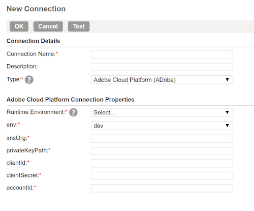
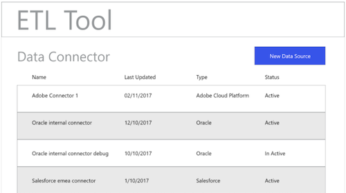
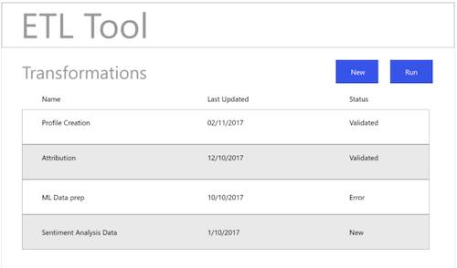
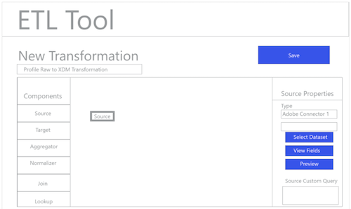
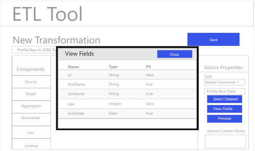
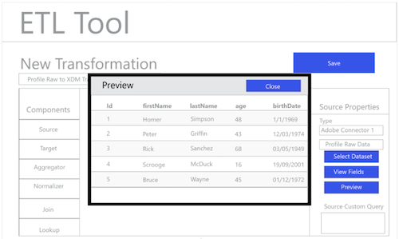
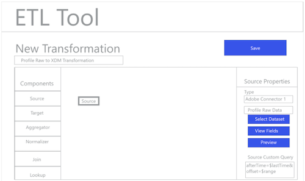
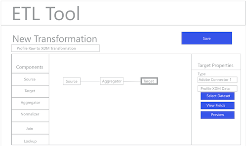
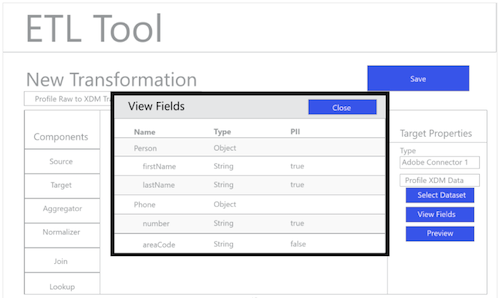
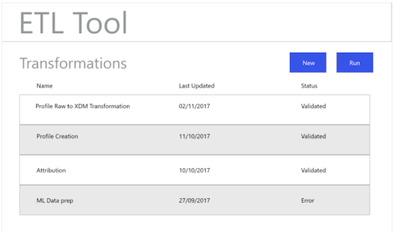

# ETL workflow

Various extract, transform, and load (ETL) tools may differ in format, but most expose similar functionality to assist with the combining of multiple data sources.

## ETL tool example

The following diagrams provide mock-ups of common ETL actions and a generic user experience based on standard interactions. These images could easily be adapted for a specific ETL user experience. 
 
The actions illustrated below are described in the steps outlined within the [ETL Integration Guide](home.md). Some steps reference specific "Figures", others describe similar actions to the workflow shown here.

### Figure 1 - Configure New Adobe Experience Platform Connector:

### Figure 2 - [!DNL Experience Platform] Connector Activated:

### Figure 3 - ETL Transformation Management UI:

### Figure 4 - New Transformation UI, selecting [!DNL Experience Platform] Connection:

### Figure 5 - Browsing for source [!DNL Experience Platform] Datasets:

### Figure 6 – Metadata and sample data from the Dataset in the ETL UI:

### Figure 7 - Viewing field schema information from Datasets:

### Figure 8 - Previewing data from Datasets:

### Figure 9 – Defining data sync parameters for the operation of the transformation:

### Figure 10 - Defining the [!DNL Experience Data Model] (XDM) target Dataset:

### Figure 11 - Viewing the XDM hierarchical schemas and metadata to support mapping/transformations:

### Figure 12 - Save and run/schedule the Transforms:

