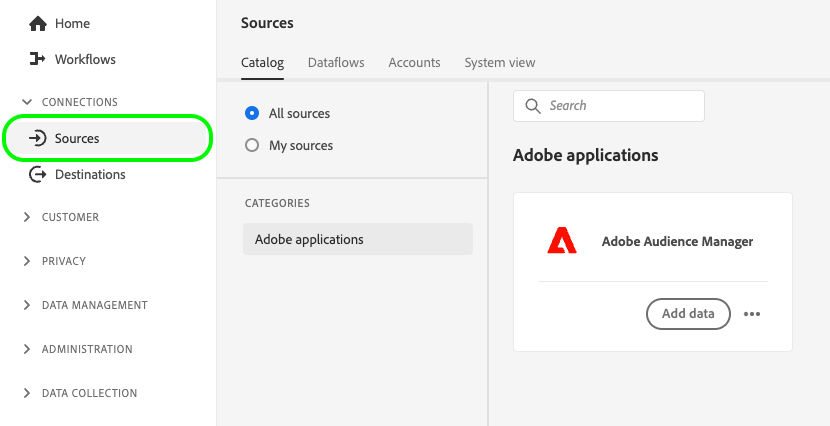
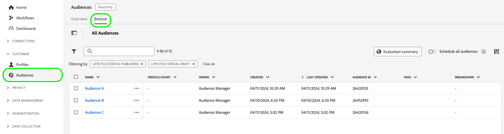
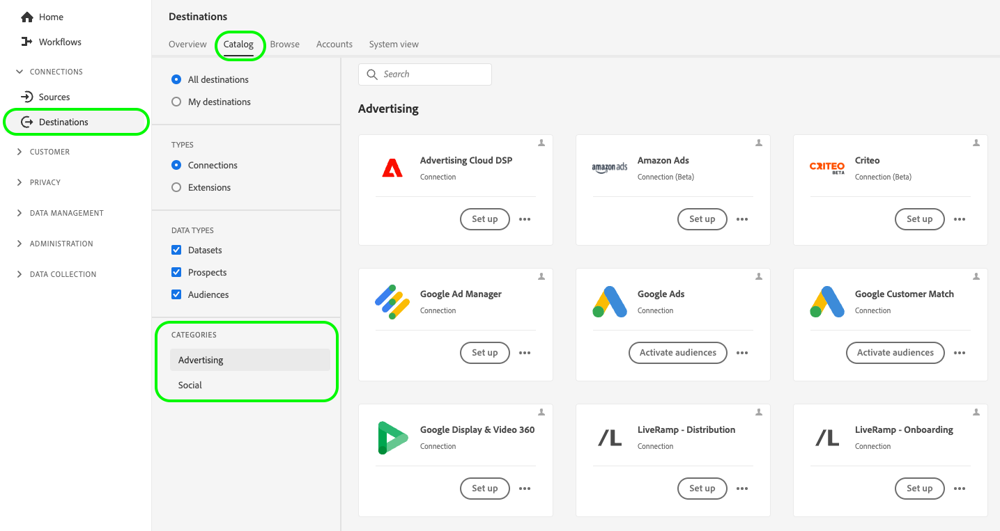

# Activate audiences through Audience Manager Expanded Activation

This page describes the end-to-end workflow that you must follow to activate audiences from Audience Manager to the destination platforms supported by Expanded Activation.

## Before you begin {#before-you-begin}

The steps described in this guide assume you have read the [Expanded Activation overview page](overview.md) and you have confirmed that you meet the prerequisites for audience activation.

>[!IMPORTANT]
>
>To activate audiences through [!DNL Expanded Activation], make sure your Audience Manager audiences are based on **hashed email addresses**. See the [prerequisites](overview.md#prerequisites) for more details.

## Step 1: Configure the Audience Manager source connection {#configure-source}

The [Audience Manager source connector](../sources/connectors/adobe-applications/audience-manager.md) sends audience data collected in Adobe Audience Manager for activation in the destination platforms supported by Expanded Activation.

Follow the guide on how to [create an Audience Manager source connection](../sources/tutorials/ui/create/adobe-applications/audience-manager.md) to configure your source connector.

>[!TIP]
>
>The Adobe Audience Manager source connector is the only source connector available in Expanded Activation.
>
>If you want to ingest audiences based on additional identifiers, you must purchase an edition of [Real-Time CDP](../rtcdp/overview.md). Contact your Adobe representative for more details.

### View and monitor ingested audiences {#view-audiences}

The audiences that you bring into Expanded Activation from Audience Manager are available for you to view in the **[!UICONTROL Audiences]** dashboard.

To view your audiences, go to **[!UICONTROL Customer]** -> **[!UICONTROL Audiences]** -> **[!UICONTROL Browse]**.

>[!IMPORTANT]
>
>* Audiences can take up to 48 hours to fully populate in Expanded Activation. This also applies to updates to existing Audience Manager audiences.
>* Newly created Audience Manager audiences do not automatically appear in Expanded Activation. To ingest new segments in Expanded Activation, you must add them through the Audience Manager source connector.

After you have configured your Audience Manager source connector, move to [step 2](#create-destination-connection).

## Step 2: Create a new destination connection {#create-destination-connection}

Before you can send your Audience Manager audiences to your destination platform of choice, you must first create a connection to a destination platform.

In the left sidebar, go to **[!UICONTROL Connections]** -> **[!UICONTROL Destinations]** -> **[!UICONTROL Catalog]**.

The available destination categories for [!DNL Expanded Activation] are [advertising](../destinations/catalog/advertising/overview.md) and [social](../destinations/catalog/social/overview.md).

To create a new connection to a destination platform, follow the guide on [how to create a new destination connection](../destinations/ui/connect-destination.md). Then, move to [step 3](#activate-audiences).

## Step 3: Activate audiences to your destination {#activate-audiences}

After you have successfully [ingested Audience Manager audiences](#configure-source) and [created a new destination connection](#create-destination-connection), you can now activate your audiences to the destination platform of your choice.

To activate audiences to your destination, follow the guide on [how to activate audiences to streaming destinations](../destinations/ui/activate-segment-streaming-destinations.md).

## Verify audience activation {#verify}

Check the [destination monitoring documentation](../dataflows/ui/monitor-destinations.md) for detailed information on how to monitor the flow of data to your destinations.
