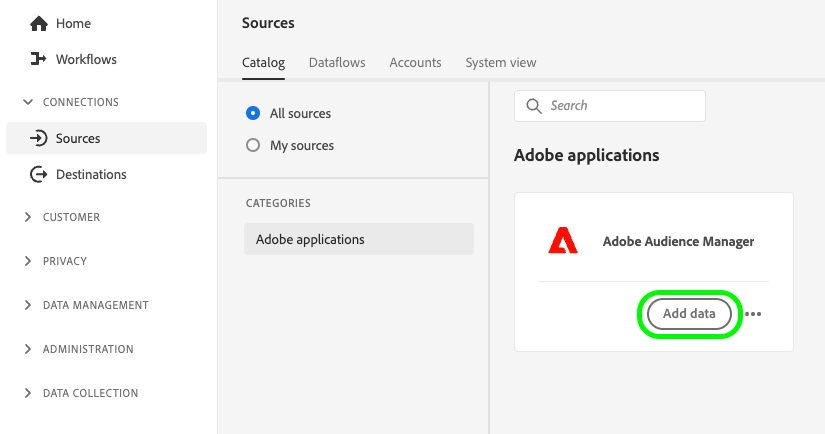
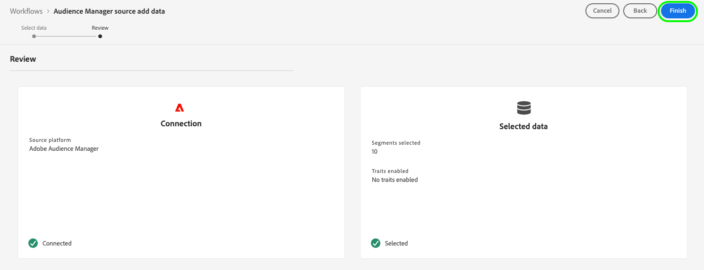

# Audience Manager Expanded Activation

## Step 1: Configure the Audience Manager source connection {#configure-source}

1. Log in to [experience.adobe.com](https://experience.adobe.com) and select **[!UICONTROL Experience Platform]**.
1. In the left sidebar, go to **[!UICONTROL Connections]** -> **[!UICONTROL Sources]**. In the [!UICONTROL Sources] page you can see the Adobe Audience Manager source connector.

    

    >[!NOTE]
    >
    >The Adobe Audience Manager source connector is the only source connector available in Expanded Activation.

1. Select **[!UICONTROL Add data]** on the Adobe Audience Manager source connector.

    

1. Select the traits and audiences that you want to activate, as described in the [Audience Manager source connection documentation](../sources/tutorials/ui/create/adobe-applications/audience-manager.md#select-traits-and-segments), then select **[!UICONTROL Next]**.
1. In the [!UICONTROL Review] page, you can see a summary of your source connection and the data that you selected. Review the details and select **[!UICONTROL Finish]**.
    

## Step 2: Create a new destination connection {#create-destination-connection}

Before you can send your Audience Manager audiences to your destination platform of choice, you must first create a connection to a destination platform.

In the left sidebar, go to **[!UICONTROL Connections]** -> **[!UICONTROL Destinations]** -> **[!UICONTROL Catalog]**.

The available destination categories for [!DNL Expanded Activation] are [advertising](../destinations/catalog/advertising/overview.md) and [social](../destinations/catalog/social/overview.md).

To create a new connection to a destination platform, follow the guide on [how to create a new destination connection](../destinations/ui/connect-destination.md).

## Step 3: Activate audiences to your destination {#activate-audiences}

After you have successfully [ingested Audience Manager audiences](#configure-source) and [created a new destination connection](#create-destination-connection), you can now activate your audiences to the destination platform.

To activate audiences to your destination, follow the guide on [how to activate audiences to streaming destinations](../destinations/ui/activate-segment-streaming-destinations.md).

