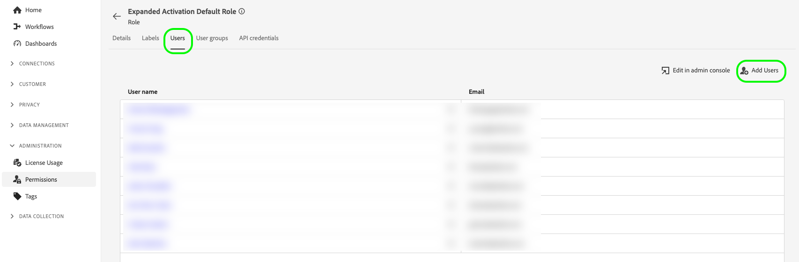
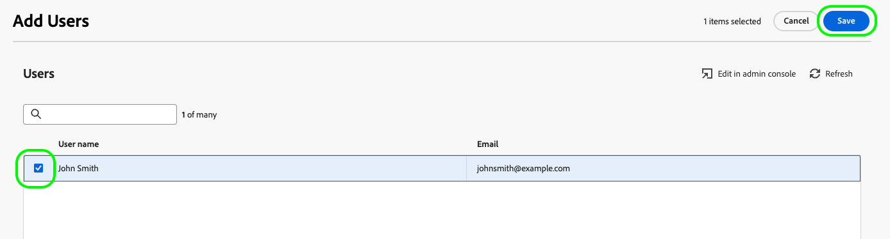
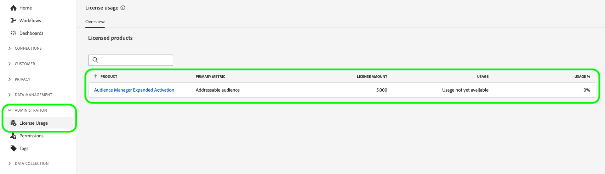

# Account administration

## Create user accounts {#create-users}

Before you can use [!DNL Audience Manager Expanded Activation], you must create a user account.

To create a user account for [!DNL Expanded Activation], follow the instructions on managing users from the [Adobe Admin Console](https://helpx.adobe.com/enterprise/using/manage-users-individually.html) documentation.

## Add users to permission role {#permissions}

After you have created a user account, you must add it to the [!DNL Expanded Activation] permission role, in the [!DNL Expanded Activation] user interface.

Go to **[!UICONTROL Administration]** -> **[!UICONTROL Permissions]** -> **[!UICONTROL Roles]**, and select the **[!UICONTROL Expanded Activation Default Role]**.

Go to the **[!UICONTROL Users]** tab and select **[!UICONTROL Add Users]**.

Select the newly created user from the available list and select **[!UICONTROL Save]**.

The user account is now created and assigned to the correct role. It is now ready to access the **[!UICONTROL Expanded Activation]** user interface.

## Monitor license usage {#license-usage}

Your [!DNL Audience Manager Expanded Activation] contract specifies the maximum number of hashed emails you can ingest to your account.

You can find this information by going to the **[!UICONTROL Administration]** -> **[!UICONTROL License Usage]** page.

In this page you can find the following information:

* **[!UICONTROL Product]**: the Adobe product that you are licensed for. This will always be **[!UICONTROL Audience Manager Expanded Activation]**.
* **[!UICONTROL Primary metric]**: the name of the metric being tracked for usage. This will always be **[!UICONTROL Addressable audience]**.
* **[!UICONTROL License amount]**: the maximum number of hashed emails that you are licensed to ingest.

    >[!TIP]
    >
    >You ingest hashed emails through the [Audience Manager source connector](../sources/connectors/adobe-applications/audience-manager.md). See the documentation on [how to activate audiences](activate-audiences.md) for more details.

* **[!UICONTROL Usage]**: the number of hashed emails that you have ingested.
* **[!UICONTROL Usage %]**: the percentage of your license amount that you have used.

## Next steps {#next-steps}

Now that you have configured at least one user account with the correct access to Expanded Activation, you can start using the account to [activate audiences](activate-audiences.md).
