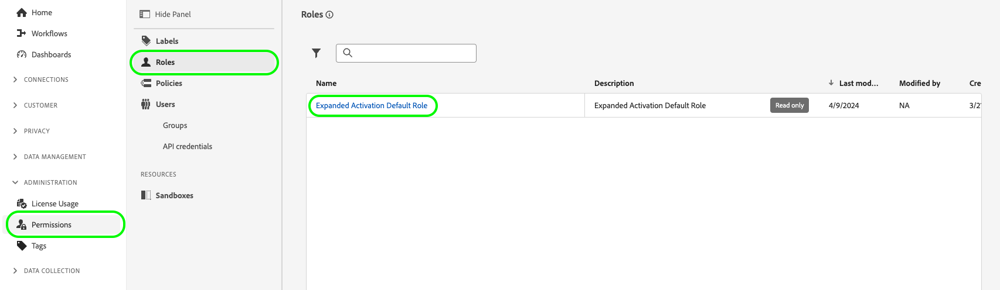
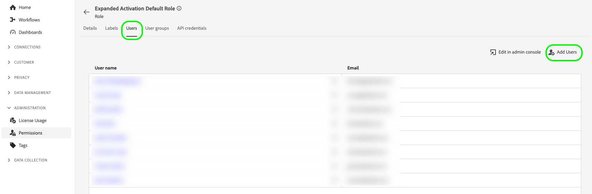
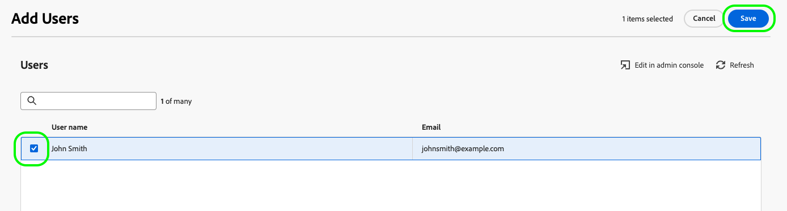
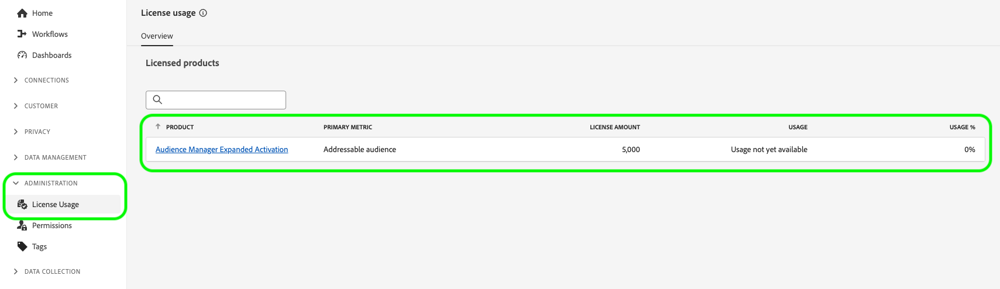

# Account administration

To ingest audiences from Audience Manager and activate them to social and advertising destinations, you must first create an Expanded Activation user account and assign the account to the correct permission role.

This page explains how to creata a user account in the Admin Console and assing the correct permissions for Expanded Activation.

## Create user accounts {#create-users}

Before you can use [!DNL Audience Manager Expanded Activation], you must create a user account.

To create a user account for [!DNL Expanded Activation], follow the instructions on managing users from the [Adobe Admin Console](https://helpx.adobe.com/enterprise/using/manage-users-individually.html) documentation.

## Add users to permission role {#permissions}

After you have created a user account, you must add it to the [!DNL Expanded Activation] permission role, in the [!DNL Expanded Activation] user interface.

Go to **[!UICONTROL Administration]** -> **[!UICONTROL Permissions]** -> **[!UICONTROL Roles]**, and select the **[!UICONTROL Expanded Activation Default Role]**.

Go to the **[!UICONTROL Users]** tab and select **[!UICONTROL Add Users]**.

Select the newly created user from the available list and select **[!UICONTROL Save]**.

The user account is now created and assigned to the correct role. It is now ready to access the **[!UICONTROL Expanded Activation]** user interface.

## Monitor license usage {#license-usage}

Your [!DNL Audience Manager Expanded Activation] contract specifies the maximum number of hashed emails you can ingest to your account.

You can find this information by going to the **[!UICONTROL Administration]** -> **[!UICONTROL License Usage]** page.

On this page you can find the following information:

* **[!UICONTROL Product]**: The Adobe product that you are licensed for. This will always be **[!UICONTROL Audience Manager Expanded Activation]**.
* **[!UICONTROL Primary metric]**: The name of the metric being tracked for usage. This will always be **[!UICONTROL Addressable audience]**.
* **[!UICONTROL License amount]**: The maximum number of hashed emails that you are licensed to ingest.

    >[!TIP]
    >
    >You ingest hashed emails through the [Audience Manager source connector](../sources/connectors/adobe-applications/audience-manager.md). See the documentation on [how to activate audiences](activate-audiences.md) for more details.

* **[!UICONTROL Usage]**: the number of hashed emails that you have ingested.
* **[!UICONTROL Usage %]**: the percentage of your license amount that you have used.

To learn more about license usage in Experience Platform, see the [license usage documentation](../dashboards/guides/license-usage.md).

## Next steps {#next-steps}

Now that you have configured at least one user account with the correct access to Expanded Activation, you can start using the account to [activate audiences](activate-audiences.md).
