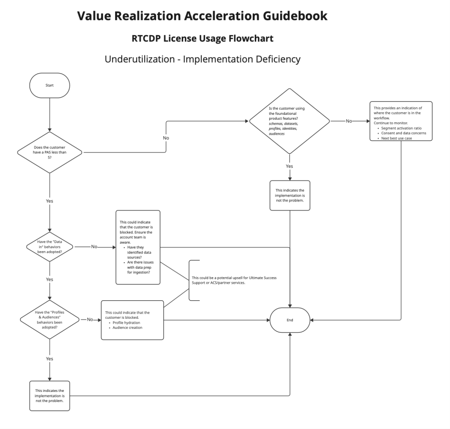
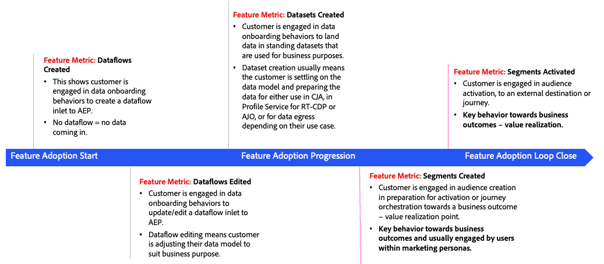
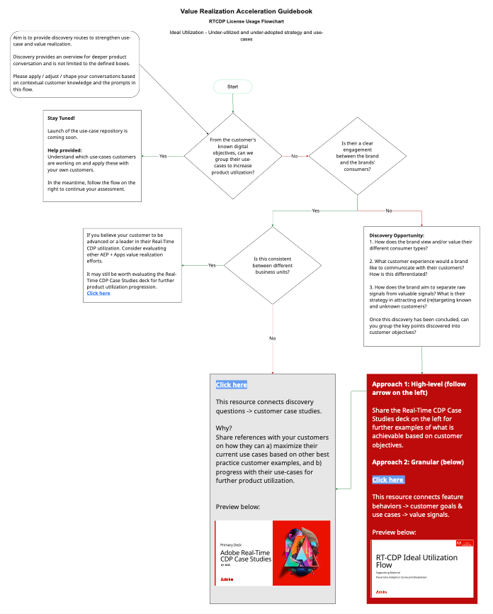
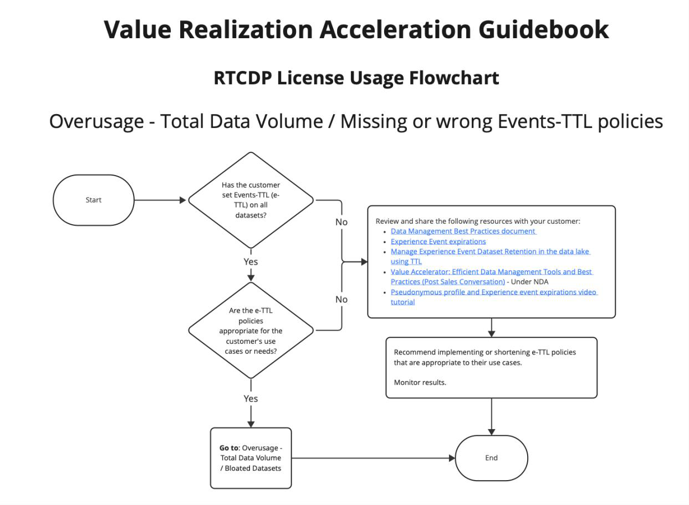
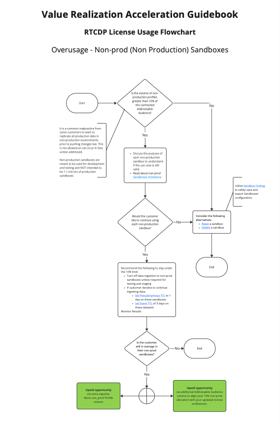
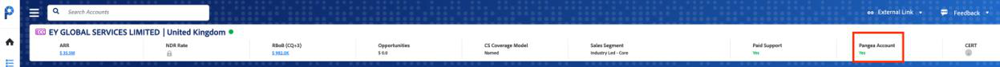
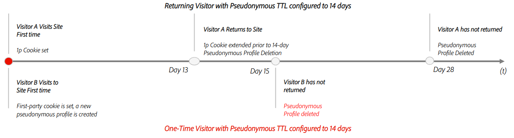
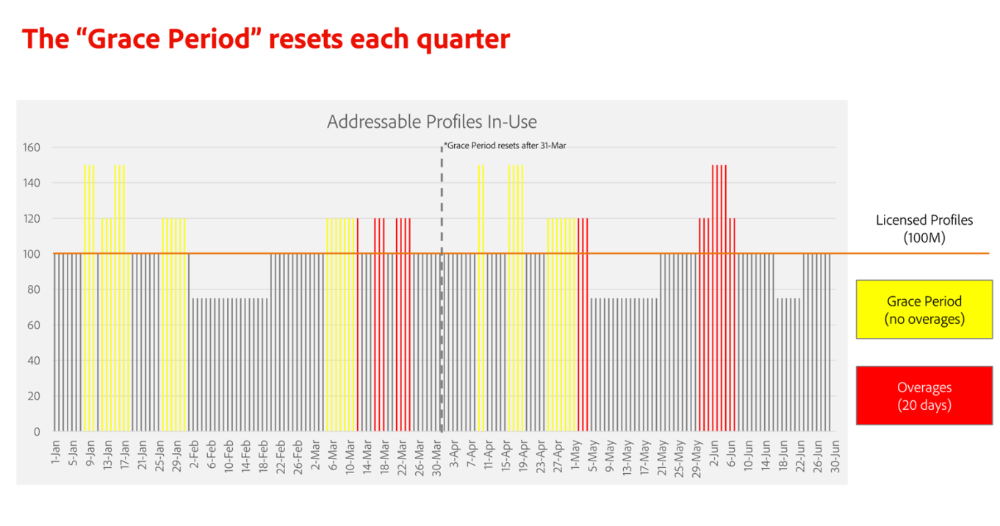

# Value Realization Acceleration program – Guidebook

> Converted from the provided PDF. Images extracted where available.

## Table of Contents

- [Introduction](#introduction)
- [Your Role in Applying the Guidebook](#your-role-in-applying-the-guidebook)
- [Navigating this Document](#navigating-this-document)
- [Where to Start](#where-to-start)
- [Structure of Each Application's Section](#structure-of-each-applications-section)
- [Using Flowcharts to Guide Your Assessment](#using-flowcharts-to-guide-your-assessment)
- [Customer Evaluation Framework](#customer-evaluation-framework)
- [Evaluating a Customer's License Usage](#evaluating-a-customers-license-usage)
- [Key Concepts & Best Practices](#key-concepts--best-practices)
- [Tools, Reports and Dashboards](#tools-reports-and-dashboards)
- [Real-Time CDP](#real-time-cdp)
- [License Usage Evaluation: Flows, Recommendations and Resources](#license-usage-evaluation-flows-recommendations-and-resources)
- [Appendix](#appendix)

## Introduction

This guidebook empowers you, as a customer account team member, with the knowledge, tools, signal interpretations, and workflows to establish and execute a successful Run & Operate plan for Adobe Experience Platform and its applications.

In this guide, you'll find information about how to align your customer's business objectives to customer license usage, product adoption, critical product capabilities, and use cases. The resulting analysis will help maximize license efficiency, product performance, health and realized value your customer will derive from using Adobe Experience Platform and any of its applications.

## Your Role in Applying the Guidebook

The table below supports individual roles in using this guidebook. There is value in reviewing this entire guide. However, for ease of use, you can refer to the audience list below when following the content.

| Role Bucket | Individual Roles | Responsibility | Ultimate Success |
|-------------|------------------|----------------|------------------|
| **Ultimate Success** | Customer Success Manager, Technical Account Manager / Director, Field Engineering | Monitors a customer's health, maturity and adoption. Diagnose and dissect a customer's current product utilization status. | Value Realization: Use key signals to inform consumption and product utilization recommendations to align to customer business objectives. |
| **Sales** | Account Executive / Director, Product Sales Specialist, Renewals Sales Specialist, Solution Account Manager | Upsell: Help position relevant commercial opportunities, adding further product value. | — |
| **Solution Consulting** | Account SC | Solution Experts: collaborate closely to conduct discovery sessions and customer meetings, identifying key pain points and positioning Adobe Adobe Experience Platform + Apps Solutions accordingly, whether as targeted point solutions or part of a portfolio play (UCX). | — |

## Navigating this Document

| Purpose | This guide brings together a wide range of information and resources from various repositories into one centralized, easy-to-use guide. |
|---------|----------------------------------------------------------------------------------------------------------------------------------------|
| **Goal** | Create a clear, practical view of the tools and guidance available to support your customer conversations. |

Think of this document as a roadmap: You can take action based on what you find here, and return to it or explore the linked resources whenever you need more detail or context around a particular recommendation.

While this guide is designed to be as comprehensive and self-contained as possible, it's important to recognize that no single person may have access to all the necessary data, context, or customer history. To get the most out of this document—and to ensure accurate, actionable outcomes—be prepared to collaborate with partner teams. Whether it's technical teams, customer success, or product specialists, reaching out to the right stakeholders will help you fill in any gaps and make well-informed decisions.

## Where to Start

This guide begins with foundational concepts that apply across all Adobe Experience Platform applications. If you're already familiar with these topics (refer to the Table of Contents to confirm), skip ahead to the specific application you're working with.

## Structure of Each Application's Section

Each application section follows a consistent structure to make navigation easier.

| Section | Application | Description |
|---------|-------------|-------------|
| **Overview and Key Resources** | — | A brief introduction to the application, along with links to more in-depth documentation. |
| **Product Glossary** | — | A curated list of key terms relevant to licensing, entitlements, and guardrails. This glossary is not exhaustive. It focuses on the terms most relevant to this guide. For a complete and up-to-date list, refer to the official Product Description pages. |
| **License Usage Analysis** | — | This section includes flowcharts designed to help you diagnose potential issues and identify the most appropriate next steps. |

## Using Flowcharts to Guide Your Assessment

Throughout this document, you'll find flowcharts designed to serve as decision-making maps. These visual tools help you navigate complex customer scenarios and identify the most appropriate "next best action" based on the issue at hand.

### How to Use the Flowcharts

1. **Start with the Application:** Once you've reviewed the foundational concepts, go to the section for the specific application your customer is using (for example, Real-Time CDP, CJA).

2. **Identify the Entitlement in Question:** Determine which entitlement (for example, Addressable Audience, Rows of Data, Compute Hours) may be contributing to the issue.

3. **Open the Relevant Flowchart:** Flowcharts are structured as step-by-step guides to help you assess the situation, learn more about the potential causes, and recommend the right course of action.

4. **Follow the Path:** Begin at the top of the flowchart and follow the decision points. When you reach a step that requires deeper investigation or context:
   - Click on the linked resources, or
   - Refer back to this document for more detailed explanations.

5. **Return and Continue:** Once you've reviewed the supporting material, return to the flowchart and continue down the path until you reach a resolution or recommendation.

### Example

In the case of overusage of Addressable Audience in Real-Time CDP, the flowchart titled "Overusage of Addressable Audience" walks you through:

- Identifying whether the issue stems from the customer not having a P-TTL expiration policy in place or having one that is inadequate for their use cases
- Evaluating data deletion or expiration strategies
- If everything else fails, then considering upsell opportunities like Data Distiller or additional capacity
- Linking to tutorials, best practices, and product documentation

These flowcharts are designed to streamline your analysis, reduce guesswork, and ensure consistent, data-driven recommendations across teams.

## Customer Evaluation Framework

Evaluating your customer involves multiple inputs and metrics, which can be organized into distinct phases. Each phase is designed to uncover potential issues in the customer's maturity journey and provide clear, actionable recommendations to enhance product utilization. 

### Evaluation stages

**License Usage** is usually a good place to start. This tends to be the most straightforward and objective area to assess. Issues in this phase are often easy to identify and can typically be resolved with a punctual set of actions. Addressing these early concerns lays a solid foundation for the rest of the evaluation. 

Once license-related blockers are mitigated, move on to more subjective and variable factors such as **Product Adoption** and **Use Cases**, which can differ significantly between customers. For those already performing well within a given stage, the subsequent stages offer strategies to further increase adoption and maximize the value of their licensed products.

#### Stage 1: License Usage Evaluation

**Apply when:** The customer is exceeding their contractual entitlements or under-utilizing their licenses. Both scenarios present risks that can impact the customer's ability to realize value and grow their Adobe footprint.

When evaluating a customer's license usage, please take note of the following considerations:

| Utilization Stage | Challenge | Objective |
|-------------------|-----------|-----------|
| **Under-utilization (&lt;75%\*)** | Usually, customers using less than 75% of their licensed capacity are not fully realizing the value of their investment, putting them at higher risk of attrition. | Understand the customer's implementation timeline, product knowledge, internal sponsorship, and system maturity to identify the most relevant "next best action" that will help unlock any stoppers and strategically guide the customer toward increased product utilization. |
| **Ideal Utilization (75%–110%\*)** | Customers in this range are well-positioned to extract more value and expand their use of Adobe products. | Build on this momentum by layering in additional performance metrics—such as adoption scores (PAS), Critical Product Capabilities (CPCs), and Use Cases—to uncover new opportunities for growth and deeper product engagement. See Stage 2. |
| **Over-utilization (&gt;110%\*)** | Customers exceeding entitlements may face degraded performance, encounter product limitations, or incur overage charges. Persistent overuse can negatively affect customer experience and renewal conversations. | Recommend immediate steps to reduce usage, leverage existing tools or features to reduce utilization (for example, Data Distiller) or explore options to increase entitlements through add-on purchases. |

> **Note:** These ranges are just an estimate and may vary by application and customer. A thorough assessment must be completed to understand if a customer is under or over their license usage given their circumstances.
>
> See **Usage Reporting and Utilization Percentages** for a breakdown of these ranges.

#### Stage 2: Product Adoption & Usage Evaluation

**Apply when:** Once license usage is in check and the customer is in the ideal utilization range, the next step is to assess how effectively the customer is using the product to meet their business goals. Several metrics and data sources can support this evaluation.

**Key questions to consider:**

- Has the customer started to grow in maturity by using more advanced product features? — **PAS**
- Are they leveraging features that differentiate Adobe Experience Platform or its applications from competitors? — **CPCs**
- Is the customer actively using the product to execute use cases and discover new ones? — **Use Cases Library**

| Source | Consideration / Challenge | Objective | Additional Resources |
|--------|---------------------------|-----------|----------------------|
| **Product Adoption Scorecard (PAS)** | Are customers understanding and unlocking the right product features to support their objectives? | Map customer goals to product capabilities and proactively guide them through implementation. This helps align product usage with business outcomes and supports the full customer journey. | Product Adoption Scores Overview; Product Adoption Score Behavior Entitlement Guide; Where to Find Scores; Behavior Recommendation Tool; PAS FAQ |
| **Critical Product Capabilities (CPCs)** | Every product has key features that are essential for success and differentiate Adobe in the market. | Highlight and track these capabilities to ensure customers are leveraging the most impactful parts of the product and unlocking its full potential. | **Note:** CPCs are new metrics being introduced. CPCs will be released in the upcoming months. |
| **Use Case Repository** | Use cases reflect the customer's business objectives. | Documenting and tracking use cases helps create a roadmap to value, showing how Adobe products contribute to achieving KPIs and business outcomes. Leverage existing use case repositories to illustrate real-world results. | **Note:** The VRA Use Case repository will be released in the upcoming months. |

### Recommended Actions Before Starting a Customer Assessment

Before diving into a customer evaluation, it's important to gather the right context and ensure your data sources are aligned. The following steps will help you prepare effectively:

| Step | Action | Application of steps |
|------|--------|----------------------|
| **1. Observe** | **Review All Available Data Sources:** Consult all relevant reports and dashboards to build a comprehensive view of the customer's current state. <br><br>**Tip:** Cross-check data across tools to ensure accuracy and consistency. (See the Tools, Reports, and Dashboards section.) | — |
| **2. Diagnose** | **Identify Special Contract Circumstances:** Determine whether the customer is under a Unified Metric Contract (Pangea Model). <br><br>**Why it matters:** Overusage evaluation under this model can be complex and may require support from the Pangea team. If overusage is suspected, rescoping or shifting provisioned credits between applications is needed to avoid performance issues caused by soft or hard limits. | — |
| **3. Plan** | **Validate the Latest Contract Terms and Entitlements:** Review the most recent contract and term sheet. <br><br>**Objective:** Ensure that purchased entitlements align with what's reflected in your reporting tools. <br><br>**Watch for:** Reporting discrepancies or special terms that may not be captured in standard dashboards. | — |
| **4. Execute** | **Inventory Additional Entitlements:** Compile a list of any additional entitlements the customer may have through other applications or add-on packs. <br><br>**Why it matters:** This helps determine whether the customer is truly exceeding their license or if reporting needs to be updated to reflect all entitlements accurately. | — |


## Evaluating a Customer's License Usage

### Review the Contractual Entitlements

The first step in understanding a customer's license usage is to thoroughly review their active contract, including:

- The Sales Order
- The Product Descriptions
- The final provisioning and entitlements reflected in internal systems and reporting tools

> **Important:** These sources may not always align perfectly—differences can be either intentional (e.g., negotiated terms) or unintentional (e.g., reporting discrepancies). **The contract stored in SFDC governs**, above the product description or what has been entitled/provisioned and what is described in a "term sheet."

### Key Considerations During Contract Review

- Sales Order terms take precedence over Product Descriptions.
- Both the Sales Order and Product Description take precedence over what is shown in entitlement reporting.
- Footnotes in Sales Orders may include custom language or non-standard terms such as:
  - Grace periods
  - License usage buffers
  - Adjustments to guardrail entitlements
  - Waivers of specific terms that may not be reflected in current reporting systems

**Support and Escalation:** If you need help interpreting contract terms or entitlements, or you find discrepancies in entitlement reporting, please email: **Grp-AEP-Contractual-Entitlements-Support** — aep-contractual-entitlements-support@adobe.com — to receive further assistance.

### Usage Reporting and Utilization Percentages

To evaluate a customer's license usage for a specific contractual entitlement, compare their actual usage against the contracted entitlement. Refer to the **Tools, Reports, and Dashboards** section of this guide to access the appropriate dashboards for reviewing customer license usage data.

### Understanding Usage Categories

Customers are categorized based on their **utilization percentage**—the ratio of actual usage to entitled capacity. This categorization helps guide the next steps in your assessment and identifies whether the customer is under-utilizing, over-utilizing, or within the ideal usage range.

> **Note:** Usage and entitlement data are typically evaluated at a summary level for Production and Non-Production (Development) environments by combining the usage of the Production and Non-Production sandboxes, respectively. While some dashboards may provide actual usage at the sandbox level, entitlement data is not available at that level of granularity.

| Utilization percentage | Category | Application |
|-------------------------|----------|-------------|
| &lt;50% | **Very Low** | Customer is significantly below contractual entitlement increasing their attrition risk and potentially hindering future conversations due to lack of realized value. Please see next steps in Under-utilization Section. |
| 50%–75% | **Low** | Customer is below contractual entitlement. A well-defined plan can quickly raise their utilization and bring the customer to the ideal utilization range. Please see next steps in Under-utilization Section. |
| 76%–110% | **In Range** | Customer is in line with contractual entitlement. Please see next steps in the Ideal Utilization Section. |
| 111%–120% | **High** | Customer is above their contractual entitlement. Customer may be able to avoid overage charges if prompt action is taken. Opportunity for upsells can also be discussed. Please see next steps in Over-utilization Section. |
| &gt;120% | **Very High** | The customer has exceeded their contractual entitlement significantly and will incur additional fees if the issue is not resolved immediately. Please see next steps in Over-utilization Section. |

### Discussing License Usage Findings with the Customer

You've done the work and now have a clearer picture of what might be causing the issue. The next step is to bring your findings to the customer in a way that's constructive and value-driven.

#### Shift the Focus: From Compliance to Value

When discussing license usage with a customer, the goal is not to enforce compliance—but to help them maximize the value of their Adobe investment. Frame the conversation around business outcomes and efficiency, not just contractual limits.

**Key principles for framing the conversation:**

- **Lead with Value** — Emphasize how Adobe products are helping the customer achieve their goals. Usage metrics should be positioned as indicators of how effectively the customer is leveraging their investment—not as compliance checkpoints.
- **Make It a Business Decision** — Encourage the customer to evaluate their data usage (e.g., profiles, behavioral data, rows of data) based on the value it brings to their use cases, not just on whether it fits within a contractual limit.
- **Empower Strategic Choices** — Help the customer think through whether to retain or delete data, or whether to expand capacity, based on the impact on performance, personalization, and business outcomes.
- **Position Upsell as Optimization** — If additional capacity is needed, frame it as a way to unlock more value—not as a penalty. This approach supports a more collaborative and strategic conversation.

**Example talking point:**

> "Based on what we're seeing, it looks like your current usage is aligned with some high-value use cases. If you're planning to scale those efforts, we can explore options to ensure your infrastructure and entitlements support that growth—so you're not limited in what you can achieve."

## Key Concepts & Best Practices

The following concepts apply across all Adobe Experience Platform applications and are essential to keep in mind during any customer assessment. They help frame how we evaluate usage, performance, and entitlement alignment.

### Data Hygiene – The Importance of an Efficient Data Management Strategy

Efficient data management is about being intentional with what data is ingested, stored, and retained. A well-structured strategy helps customers stay within their entitlements, reduce system strain, and avoid unnecessary costs—often without needing to purchase additional capacity. Key considerations include aligning data to use cases, separating analytical and engagement workflows, setting appropriate retention periods, and monitoring usage regularly.

For a deeper dive into best practices across the data lifecycle, see **Appendix: Setting an Efficient Data Management Strategy**.

Additionally, **The Setup to Win checklist** provides steps that should be followed before validating an implementation for "Go Live." It is a companion guide to this guidebook that drives action before implementation to set a customer up for long term success.

### Performance Guardrails

**Performance Guardrails** are predefined thresholds that help ensure Adobe products operate efficiently and reliably. They are not hard limits, but rather guidelines that indicate the optimal range for data and system usage, performance optimization, and avoidance of errors or unexpected results.

**Why they matter:** Guardrails are designed to:

- Optimize system performance
- Prevent errors or unexpected behavior
- Help customers get the most value from their entitlements

**How they work:** Guardrails are often tied to specific license metrics—such as the number of profiles, data volume, or compute hours—and are based on what the system is provisioned to handle. If a customer consistently exceeds a guardrail, they may experience:

- Slower performance
- Delays in data processing
- System instability

Adobe is not responsible for performance degradation that results from exceeding these thresholds.

**What to do if a guardrail is exceeded:** If a customer regularly operates above a guardrail:

- They can choose to license additional capacity to support their scale and maintain performance.
- Alternatively, they may need to optimize their data strategy—such as archiving or removing low-value data—by following the recommendations outlined in this guide. In many cases, this can help customers stay within their existing entitlements while still achieving their business goals.

> **Important:** Even under flexible licensing models like Unified Metric (Pangea) contracts, guardrails still apply. These contracts may allow dynamic usage across products, but technical limits and system provisioning still need to be respected.

### Scoping Parameters

**What are Scoping Parameters?** Scoping Parameters are usage limits that are tied to the specific use case a customer has outlined during the contracting or provisioning process. These parameters help ensure that the system is sized appropriately for the customer's intended usage.

**Why they matter:** If a customer exceeds a Scoping Parameter, it may indicate that their usage has grown beyond what was originally planned. This can lead to performance issues or misalignment with the system's configuration.

**What happens if they're exceeded?**

- Adobe will work with the customer to understand the cause of the overage and explore ways to resolve it—whether through optimization or adjustments to the use case.
- If the customer consistently exceeds a Scoping Parameter, they may need to license additional capacity to support their expanded usage.

### Static Limits

**Static limits** are fixed technical boundaries built into Adobe products that define how much of a resource or feature can be used. These limits are part of the product's architecture and cannot be changed or customized.

By following the recommendations in this guide, customers can build a more efficient environment—one where conversations focus on value and outcomes, not just compliance.

### Value Pillars

**Value pillars** are foundational elements used to assess and drive customer success, product adoption, and value realization. They help us determine the account's health, identify under-utilization risks, and guide interventions.

**Core Value Pillars defined are:**

- **Sponsorship:** Executive alignment and advocacy within the customer organization.
- **Technology:** The customer's technical readiness and integration maturity.
- **Roadmap to Value:** A clear, actionable plan for achieving business outcomes.
- **Resource Investment:** Commitment of time, people, and budget to drive success.
- **Organizational Readiness:** The customer's ability to adopt and operationalize solutions.

## Tools, Reports and Dashboards

There are several resources that can be used to access license usage information and other key value realization signals. The following list will provide an overview of each tool's data availability and limitations worth noting. Please reach out to **Grp-AEP-Usage-Request** — aep-usage-request@adobe.com — if none of the following tools provide you with the information you need.

- Panorama
- SUM Usage Dashboard
- GLASS
- Customer License Usage Dashboard
- Value Realization Dashboard – Runbook Status and Consumption

### Panorama

| Attribute | Details |
|-----------|---------|
| **Overview** | Provides an indication of customer's health and usage of licensed products. |
| **Use** | Broad internal access makes for a good initial source to understand customer value signals. |
| **Metrics** | Includes Adoption Scorecard, customer contracts, contractual utilization limits. |
| **Access / Link** | [Link] |
| **Audience** | All Internal Roles |
| **Data Granularity** | Data is updated monthly |
| **View** | Account level view |
| **Restrictions & Limitations** | Data is aggregated across all IMSOrgIDs that belong to the same ECCID; Can only view one customer account at a time; Update timeframe can lead to outdated information |
| **More Information** | Product Adoption Scores Behavior Entitlement Guide; Where to find scores; Anatomy of the Adoption Scorecard; PAS FAQ |

### Solution Utilization Management (SUM) Usage Dashboard

| Attribute | Details |
|-----------|---------|
| **Overview** | SUM Dashboard provides a portfolio view of accounts for sales team (based on Anaplan assignments). |
| **Use** | Can be used to help identify customers that have a higher probability of upsell. Not intended for troubleshooting customer's usage. |
| **Metrics** | Includes key entitlements for RTCDP, AJO and CJA like: Addressable Audience, Businessperson Profiles, Average Profile Richness, Total Data Volume, contracted SKU information, ARR, Contract timing details. |
| **Access / Link** | [Link] |
| **Audience** | Sales, Product Specialists, PMMs |
| **Data Granularity** | Daily granularity available; Daily data is updated weekly |
| **View** | Portfolio view by assigned accounts |
| **Restrictions & Limitations** | Access restricted to those with account assignments through Anaplan |
| **More Information** | SUM Upsell Portal |

### GLASS

| Attribute | Details |
|-----------|---------|
| **Overview** | A research tool for understanding a customer's usage of Adobe Experience Platform plus Applications at the customer instance level. |
| **Use** | Most complete and granular data available regarding license vs actual usage. |
| **Access / Link** | [Link] |
| **Audience** | Adobe internal — Solution Consulting, Customer Support, Field Engineering; Restricted access. Requires business justification. |
| **Data Granularity** | Data is updated daily (not real time) |
| **View** | Instance (IMSORG) level view; Sandbox level detail; Global views available for certain metrics |
| **Restrictions & Limitations** | Access granted based on need; Global views for customer limited to one data center at a time; Non-standard contracts may not accurately reflect customer's usage. Always check original contract for entitlements. |
| **More Information** | Access to GLASS wiki; Slack: #glass-users |

### Customer License Usage Dashboard

| Attribute | Details |
|-----------|---------|
| **Overview** | A customer facing dashboard that provides license usage information for purchased products. |
| **Use** | Customer-only access. |
| **Metrics** | Can be found [here]. |
| **Note** | While Adobe employees typically do not have access to this dashboard unless explicitly granted by the customer, it is important to be aware of its existence. Customers may reference data from this dashboard when analyzing their license usage, so understanding its role and potential insights can be valuable during discussions. |
| **Access** | (In customer's AEP instance) Administration > License Usage |
| **Audience** | AEP + Apps customers |
| **Data Granularity** | Data is updated daily (not real time) |
| **View** | Account View (IMS Org); Sandbox level detail |
| **Restrictions & Limitations** | Customer controls access |
| **More Information** | License Usage Dashboard |

### Value Realization Dashboard – Runbook Status and Consumption

| Attribute | Details |
|-----------|---------|
| **Overview** | Provides insight on Value Pillars – sponsorship, technology, roadmap to value, resource investment, and organizational readiness for each account. |
| **Use** | Can be used to evaluate customer usage of Value Pillars and Consumption data. Provides a wholistic view of customer usage situation. |
| **Metrics** | Also includes ARR, renewal dates, consumption, and contract type (standard/Pangea). |
| **Access / Link** | [Link] |
| **Audience** | Sales, Ultimate Success |
| **Data Granularity** | Provides Value Pillar and consumption percentages by customer; Value Pillars are updated daily; consumption data is updated monthly |
| **View** | Account View (ECCID) |
| **Restrictions & Limitations** | Access Granted Based on Need; Use this Link and select the "DIVE-Prod" tile to request access; Consumption data is only for primary contractual metric |
| **More Information** | Value Realization Dashboard Wiki is under construction |

## Real-Time CDP

### Product Description

Real-Time CDP (RTCDP) enables the creation of high-value audience segments for real-time B2C and B2B use cases across the marketing funnel, without relying on third-party cookies. It enables customers to stitch data from multiple sources to create real-time profiles and activate them via prebuilt destinations.

### Product Overview

**Available editions depending on customer's end buyer:**

| Edition | Description |
|---------|-------------|
| **Real-Time CDP B2C** | For consumer brands managing consumer audiences. Available in both Prime and Ultimate packages. |
| **Real-Time CDP B2B** | For enterprise brands managing business audiences. Available in both Prime and Ultimate packages. |
| **Real-Time CDP B2P** | For corporations managing hybrid audiences. Available in both Prime and Ultimate packages. |

**Available product tiers:**

| Tier | Description |
|------|-------------|
| **Real-Time CDP Connections** | Streamline how data is collected and distributed to other systems while improving site performance and minimizing updates. |
| **Real-Time CDP Prime** | Assemble known and unknown data into unified profiles, create audiences, and personalize experiences. Complete customer data platform with unified profiles, audience activation and patented data governance. |
| **Real-Time CDP Ultimate** | Establish single view of customer across all enterprise systems and channels, with advanced personalization, API connections, and governance requirements. Advanced customer data platform for enterprise use cases. |

### Product's Glossary

Please refer to the appropriate Product Description page for a complete list of terms.

### Entitlements

Usage limits that are strictly monitored and enforced by Adobe. Should Customer exceed an Entitlement, Customer may be obligated to pay overage fees or to license additional capacity.

| Keyword | Friendly Product Description | Applying the concept |
|---------|------------------------------|------------------------|
| **Addressable Audience** | The sum of profiles or pseudonymous profiles. | The sum of Customer's Consumer Audience Entitlement and the Business Audience Entitlement multiplied by five. |
| **AI Assistant (feature)** | Generative AI Feature integrated into Real-Time Customer Data Platform designed to enhance productivity. AI Assistant helps users understand concepts, troubleshoot problems, and generate insights using a natural language interface. | Customer must have the required licensing terms in place with Adobe to access AI Assistant. Customer may consume up to the 4,000 Generative Actions per each year of the Customer's License Term. Customer's yearly Entitlement will be prorated based on the length of the License Term and does not carry over into subsequent year(s) of the License Term (or any renewal term thereafter). |
| **Real-Time CDP Connections Outgoing Calls** | A network call via Event Forwarding to forward or enrich data to a customer configured end point. | Each year Customer may process up to 500 Real-Time CDP Connections Outgoing Calls per Person Profile authorized in the Sales Order. |
| **Real-Time CDP Collaboration Credits** | Real-Time CDP Collaboration is a set of features designed to enable Customers to perform privacy-centric data collaboration. | Customer is entitled to a one-time allotment of Collaboration Credits to use in Real-Time CDP Collaboration for any combination of activities listed in the Real-Time CDP Collaboration Credit Consumption Table in the Real-Time CDP Collaboration Product Description. Prime: 2,500 Collaboration Credits. Ultimate: 5,000 Collaboration Credits. |

### Performance Guardrails (see Key Concepts for definition)

| Keyword | Friendly Product Description | Applying the concept |
|---------|------------------------------|------------------------|
| **Sandboxes** | Virtual partitions within a single instance of Experience Platform | Sandboxes can either be used for production purposes or as Non-production Sandboxes. RTCDP includes up to 5 sandboxes. Additional Sandboxes are available for purchase as an add-on in packs of 10. More information about Guardrails that apply to Real-Time CDP can be found [here]. |

### Scoping Parameters (see Key Concepts for definition)

| Keyword | Friendly Product Description | Applying the concept |
|---------|------------------------------|------------------------|
| **Average Profile Richness** | The "weight" of an average profile under management. It is calculated by dividing the Total Data Volume of the Profile Service in Production Sandboxes at any point in time by the number of authorized Person Profiles or Addressable Audience in Production Sandboxes. | The entitlement for B2C is 75 kilobytes per Person Profile, for B2B is 100 kilobytes per Person Profile and for B2P is the weighted average of 75 kilobytes per Consumer Person Profile and 100 kilobytes per Businessperson Profile. The Average Profile Richness entitlement can be increased through the purchase of richness packs at 25 kilobytes per pack. |
| **Total Data Volume** | Amount of data available in Profile Service for engagement workflows, inclusive of production and non-production data. | Customer's Total Data Volume must be less than or equal to the entitled Average Profile Richness for B2C or B2B multiplied by respective B2C and B2B Person Profiles. Total Data Volume entitlements can be increased by licensing additional capacity through an Additional Data Volume Add-on pack. |

### Static Limits (see Key Concepts for definition)

Usage limit that relates to the functional boundaries of Real-Time CDP (B2C). Customer may not modify Static Limits.

| Keyword | Friendly Product Description | Applying the concept |
|---------|------------------------------|------------------------|
| **Automated Dataset Expiration** | The Data Lifecycle workspace in the Adobe Experience Platform UI allows you to schedule expirations for datasets. When a dataset reaches its expiration date, the data lake, Identity Service, and Real-Time Customer Profile begin separate processes to remove the dataset's contents from their respective services. Once the data is deleted from all three services, the expiration is marked as complete. | Customer may schedule up to 20 automated dataset expiration work orders per month. Can be extended to 50 work orders per month if Healthcare Shield or Privacy and Security Shield Add-ons are licensed. |
| **Computed Attributes** | Aggregated profile behavioral data based on experience events that is converted into a Profile attribute and can be included in a Person Profile. | Customer has access to 25 Computed Attributes per Sandbox for Prime and 50 Computed Attributes per Sandbox for Ultimate. Customer may purchase Computed Attributes Add-on packs of 25 Computed Attributes for an aggregate total of up to 100 Computed Attributes per Sandbox. |
| **Data Ingested per Year** | Quantity of data ingested into Real-Time CDP | The total quantity of data ingested into Real-Time CDP (B2C) per year may not exceed 3 times the Total Authorized Profile Storage. |
| **Look-Alike Audiences** | Consumer Audience that is generated by modeling an existing Consumer Audience to identify Person Profiles similar to such existing Consumer Audience. | Customer will receive access to 5 Look-Alike Audiences per Sandbox for Prime and 20 Look-Alike Audiences per Sandbox for Ultimate. Regardless of how many Add-ons Customer may purchase, Customer has access to only five Look-Alike Audiences per Non-production Sandbox. |

### Definitions

Other key terms that clarify the licensing and functionality of the product.

| Keyword | Friendly Product Description | Applying the concept |
|---------|------------------------------|------------------------|
| **Additional Data Volume** | Add-on license to Increase customer's Total Data Volume entitlement. | Add-on license is per Gigabyte |
| **Additional Profile Richness** | An increase in a customer's authorized Average Profile Richness. | An increase in Customer's authorized Average Profile Richness by 25 kilobytes per Profile for each Additional Profile Richness pack. |
| **Businessperson Profile** | The profile of a directly identifiable person or company | Means a Directly Identifiable Person Profile (a) that includes connection(s) to an Account or an Opportunity, or (b) for which "company" name or field in the standard data model is populated. Only relevant in the B2B and B2P editions. For each Businessperson Profile, Customer may store and process up to four additional Person Profiles. |
| **Consumer Audience** | The number of B2C Person Profiles licensed | For B2C customers this will be the quantity of "Person Profiles" on the Sales Order. For B2P customers this will be the quantity of "Consumer Audience" on the Sales Order. |
| **Experience Event Time to Live (TTL)** | The time when expired experience events will be removed automatically. See below for how Experience Event TTLs work. | After Experience Event expirations have been enabled on a Profile-enabled dataset, Platform automatically applies the expiration values for each captured event in a two-step process: (1) All new data that is ingested into the dataset has the expiration value applied at ingestion time based on the event timestamp. (2) All existing data in the dataset has the expiration value retroactively applied as a one-time backfill system job. Once the expiration value has been placed on the dataset, events that are older than the expiration value will be immediately dropped as soon as the system job runs. All other events will be dropped off as soon as they reach their expiration values from the event timestamp. When all Experience Events have been removed, if the profile no longer has any profile attributes, the profile will no longer exist. |
| **Non-Production Sandbox** | A Sandbox that can be used exclusively for development and testing with Non-production Person Profiles | Supports a volume of Non-production Person Profiles up to 10% of Customer's Addressable Audience (measured cumulatively across all of Customer's authorized Non-production Sandboxes). Supports Average Profile Richness at the same level as production excluding any richness packs. Supports Total Data Volume based on the non-production person profiles multiplied by the Average Profile Richness – Non-Production. |
| **Over-usage Rate** | Over-usage Rate detailed in the Adobe Products and Services Pricing Detail Table of the applicable Sales Order. | See Overusage Calculation and Considerations |
| **Person Profile** | The profile of a consumer the customer is trying to reach. | A record of information representing an individual (including Directly Identifiable Person Profiles and Pseudonymous Person Profiles) in the Profile Service. |
| **Profile** | A record of stitched information representing an individual or a business in the Profile Service | A record of information representing an individual (incl. Directly Identifiable Profiles and Pseudonymous profiles) in the Profile Service. Data Included: Individual attributes, behavior, and segment membership. |
| **Pseudonymous Profile** | A profile with an unknown identity namespace | A Person Profile that includes no Directly Identifiable Information. |
| **Pseudonymous Profile Time to Live (TTL)** | The time when expired Pseudonymous Profiles will be removed automatically from the Profile store. See below for how Pseudonymous TTLs work. | A profile is considered for expiration if it meets the following conditions: (1) The stitched profile's identity namespaces match what the customer has specified as a pseudonymous or unknown identity namespace. (2) No activity has taken place in a user-defined amount of time. Activity is defined either by any Experience Events being ingested or customer-initiated updates to the profile attributes. |

### Contractual Entitlements overview

Real-Time CDP is contracted on the Sales Order using the following Primary Contractual Metrics:

- **B2C:** Person Profiles  
- **B2B:** Businessperson Profiles  
- **B2P:** Consumer Audience and Business Audience  

These Contractual Metrics along with Add-Ons contracted on the Sales Order also help drive the entitled amount of Secondary Contractual Metrics. The contractual entitlement for these metrics is determined as follows:

#### Addressable Audience Entitlement (Measured in Person Profiles)

| Edition | Calculation |
|---------|-------------|
| **B2C** | Quantity of Person Profiles contracted on the Sales Order |
| **B2B** | Quantity of Businessperson Profiles contracted on the Sales Order multiplied by 5 |
| **B2P** | Quantity of the Business Audience contracted on the Sales Order multiplied by 5 plus the quantity of the Consumer Audience contracted on the Sales Order |

#### Average Profile Richness Entitlement (Measured in kb per Person Profile)

*Please note that this metric is no longer being used in new contracts and has been replaced by the Total Data Volume metric.*

| Edition | Entitlement |
|---------|-------------|
| **B2C** | 75kb per Person Profile |
| **B2B** | 500kb per Businessperson Profile or 100kb per Person Profile. Each Businessperson Profile equals 5 Person Profiles. |
| **B2P** | Different amount for Consumer Audience and Business Audience: 75kb per Consumer Audience Profile; 500kb per Business Audience Profile or 100kb per Person Profile; Each Business Audience Profile equals 5 Person Profiles. |

*Example:* If Customer's Business Audience is 5 million Profiles and Customer's Consumer Audience is 25 million Profiles: Customer's Addressable Audience is 50 million (5M × 5 + 25M). Customer's Average Profile Richness is less than or equal to 87.5 kilobytes: (100 kB × 5 × 5M) + (75 kB × 25M) / (5 × 5M + 25M) = (2.5 TB + 1.875 TB) / 50M = 4.375 TB / 50M = 87.5 kB

#### Total Data Volume Entitlement

| Edition | Calculation |
|---------|-------------|
| **B2C** | Equals the product of Total Person Profiles and 75kb. *Example:* 10 million Person Profiles × 75kb = 750 million kb |
| **B2B** | Equals the product of Total Person Profiles and 100kb. *Example:* 1 million Businessperson Profiles × 5 × 100kb = 500 million kb |
| **B2P** | Equals the sum of the product of Consumer Audience and 75kb, and the product of Business Audience and 500kb (alternatively the Person Profiles related to the Business Audience × 100kb). Each Business Audience Profile equals 5 Person Profiles. *Example:* (10 million Consumer Audience × 75k) + (1 million Business Audience × 5 × 100kb) = 1,250 million kb |

#### Non-Production Person Profiles (10% of the Contracted Addressable Audience)

| Edition | Calculation |
|---------|-------------|
| **B2C** | 10% of the quantity of Person Profiles contracted on the Sales Order |
| **B2B** | 10% of the quantity of Businessperson Profiles contracted on the Sales Order multiplied by 5 |
| **B2P** | 10% of the quantity of the Business Audience contracted on the Sales Order multiplied by 5 plus the quantity of the Consumer Audience contracted on the Sales Order |

**How to increase entitlements:**

| Metric | How to increase |
|--------|-----------------|
| Person Profiles (B2C Contract) | Upsell contract with revised contractual quantity |
| Businessperson Profiles | Upsell contract with revised contractual quantity |
| Business Audience | Upsell contract with revised contractual quantity |
| Consumer Audience | Upsell contract with revised contractual quantity |
| Average Profile Richness Packs | Add-on pack that increases the Average Profile Richness entitlement by 25kb per pack. Packs can be purchased for the Production or Development Sandboxes. |
| Total Data Volume packs | Add-on pack that increases the Total Data Volume entitlement by the Additional Data Volume purchased. Packs can be purchased for the Production or Development Sandboxes. Total Data volume packs are generally sold in gigabytes. |
| Additional Non-Production Profiles | Add-on that increases the entitlement of Non-Production Profiles |

### Use Case Alignment

Understanding whether a customer's use cases are analytical or engagement-focused is critical to designing efficient data workflows and choosing the right tools. Analytical use cases typically require long-term data storage and are better suited for internal data lakes, while engagement use cases rely on real-time access and are ideal for Real-Time CDP. Aligning use cases with entitlements, guardrails, and product capabilities helps ensure optimal performance and value. See **Appendix: Understanding Use Cases** for more detail.

## License Usage Evaluation: Flows, Recommendations and Resources

### Stage: Under-Utilization

License usage under a 75% threshold is considered under-utilization. A customer could be under its entitlement due to a lack of provisioning, gaps in value pillars, technical/implementation challenges, lack of training for users, and/or changes in business needs or use case priority. Each of these challenges is broken into a unique flow in this section.

- Flow 1: Team Provisioning Status  
- Flow 2: Value Pillars  
- Flow 3: Implementation Deficiencies  
- Flow 4: Use Case Status  

#### Flow 1: Team Provisioning Status

Determining the provisioning status may require having a conversation with your customer since you may not have access to their Experience Cloud instance.

| Flow | Team Provisioning Status |
|------|--------------------------|
| **Common Causes** | Users have not been provisioned (granted access) to the product; Feature permissions have not been granted to users; Users have not logged into the Prod or Dev sandbox |
| **Outcome** | Identify if a lack of access and appropriate feature permissions are preventing users from logging into the product to initiate work in Prod or Dev sandbox(es). |
| **Not Applicable?** | Proceed to the next flow to assess if other issues are present. |

**What to look for:**

- Users not provisioned in the Admin Console  
- Missing or incorrect roles to grant feature permissions to users  
- No active users in Production or Development environments  

**Where to look:** (Requires access to customer's Experience Cloud instance)

- Admin Console  
- AEP Permissions UI (in AEP, Administration > Permissions)  
- To see active users in Prod or Dev and other usage information: RTCDP Paid Customer Usage Dashboard; Wiki: How to use the Customer Usage Dashboard  

**References included in the flowchart:**

- (Provisioning) Adding Users: Managing products and product profiles video; Access Control Overview  
- AEP Training: Getting Started  
- Supplemental Resources: (Provisioning) Adding Users — Access Control Overview; AEP Training — Adobe Experience Platform Tutorials; Adobe Experience Platform overview; Use Case Playbooks — Use Case Playbooks overview; Adobe Experience Platform Use Case Playbooks  


#### Flow 2: Value Pillars

Value Pillars (Sponsorship, Resource Investment, Road to Value, Organizational Readiness, and Technology) are areas beyond the product's features and capabilities that can impact customer engagements. These often require strategic conversations between the customer and account team members.

| Flow | Value Pillars |
|------|---------------|
| **Common Causes** | **Sponsorship** — Changes in customer's organizational leadership since the contract was signed. **Technology** — Customer is currently implementing another product. **Roadmap to Value** — Customer has not identified appropriate use cases. **Resource Investment** — Internal Adobe product owners have not been identified in customer organization; Customer has not staffed appropriate resources. **Org Readiness** — Customer does not have a change management plan. |
| **Outcome** | Identify if any of the value pillars are under a 40% threshold and potentially impacting product usage. |
| **Not Applicable?** | Proceed to the next flow to assess if other issues are present. |

**What to look for:** Any value pillar with a threshold under 40%

**Where to look:** VR Dashboard – Runbook Status and Consumption

**References:** Comparison & Positioning Guide — ACS Professional Services & Ultimate Success Comparison and Positioning Guide. Supplemental Resources: Ultimate Success Accelerators — Success Accelerator Overview; Consulting Services — ACS Offer Catalog


#### Flow 3: Implementation Deficiencies

Product Adoption scores (PAS) are calculations based on defined behaviors customers are expected to perform. Assessing the PAS can help identify potential implementation issues or challenges a customer may be facing and needs assistance/support.

| Flow | Implementation Deficiencies |
|------|-----------------------------|
| **Common Causes** | Customer is not using foundational product features (e.g. schemas, datasets, profiles, identities, audiences); Customer has not identified data sources |
| **Outcome** | Identify if any Product Adoption Score (PAS) behaviors are less than 5 and potentially impacting product usage. |
| **Not Applicable?** | Proceed to the next flow to assess if other issues are present. |

**What to look for:**

- Any adoption score behavior with a score less than 5 — Specifically, "Data in" and "Profiles & Audiences" adoption score behavior  
- No/minimal feature usage  

**Where to look:** Product Adoption Scores; RTCDP Paid Customer Usage Dashboard  

**References:** Comparison & Positioning Guide — ACS Professional Services & Ultimate Success Comparison and Positioning Guide; Ultimate Success Accelerators — Success Accelerator Overview; Consulting Services — ACS Offer Catalog. Supplemental Resources: Data Sources — Source connectors overview; Data Transformation — Data Prep overview; Audience Creation — Segment Builder UI guide; Audience Composition UI guide

#### Flow 4: Use Case Status

Use cases provide insight on how a customer intends to leverage Adobe products. Assessing the use case(s) captured, their status, and the time duration can help identify if a customer is having challenges executing.

| Flow | Use Case Status |
|------|-----------------|
| **Common Causes** | Previously identified use cases have been cancelled by customer, and no new use cases have been identified; Customer has had a change in business needs and previous use case(s) are no longer relevant; Implementation of use case for customer has stalled |
| **Outcome** | Identify if the customer has use case(s) defined and captured, and the progression of the use case status. |
| **Not Applicable?** | Proceed to the next flow to assess if other issues are present. |

**What to look for:** Use case has been defined and has a status:

- **Planning** — use case has been prioritized with highest potential for value  
- **In progress** — work has begun to execute a use case  
- **Live** — active tracking of value  
- **Complete** — expected value has been achieved  
- **Cancelled** — use case has been deprioritized  

**Where to look:** Panorama  

**Supplemental Resources:** Use Case — Sample use cases in Real-Time CDP  




### Stage: Ideal Utilization

**Overview:** In this section, we'll take a deeper look at your customer's overall health and maturity by combining license usage data with other key metrics—such as the Product Adoption Score (PAS), Core Product Capabilities (CPCs), and Use Case implementation. This holistic view helps assess how effectively the customer is leveraging Real-Time CDP and can uncover opportunities to unlock additional value within their current Adobe Experience Platform (AEP) applications. It may also highlight areas where introducing new applications could further support the customer in achieving their business goals.

The various flows in this section designed to support you are:

- Flow 1: Under-utilized and under-adopted features and behaviors  
- Flow 2: Under-utilized and under-adopted strategy and use-cases  

#### Flow 1: Under-utilized and under-adopted features and behaviors

*For context:* a typical Real-Time CDP adoption lifecycle resembles the below.

| Flow | Flow 1: Under-utilized and under-adopted features and behaviors |
|------|----------------------------------------------------------------|
| **Opportunity to influence** | Dive deeper into the PAS scorecard, conducting discovery into how and why customers are utilizing individual product features. |
| **Outcome** | This flow will help you (as assessors) develop contextual understanding on the features and behaviors included in the PAS scorecard, linking these to use-case and customer objective categories, with the aim of providing recommendations on how to discuss these with your customer in adoption development conversations. |



**What to look for:**

- A Product Adoption Score > 5. A score over 5 is a good reflection of product utilization. However, this metric should be paired with other readings to gain a better understanding (e.g., contract data, usage volume). The importance? Post implementation a customer could already be at a score > 5, where discovery is key to understand product utilization.  
- Which use-cases is the customer trying to achieve?  
- Are there any problem indicators? (e.g. High data onboarding activity, but low activation – high volume of dataflows being created, edited, but low segment creation and activation.)  

**Where to look:** Panorama provides a view of the Adoption Scorecard and what current use-cases are being implemented.

**References:** Real-Time CDP PAS Playbook — Here; Critical Product Capabilities (CPCs) — Here. Supplemental Resources: PAS Behavior Recommendation Tool Wiki — Here


#### Flow 2: Under-utilized and under-adopted strategy and use-cases

To build momentum on the PAS scorecard, it is important to continuously and curiously discover what customers are looking to achieve with Real-time CDP. Follow the flow below to structure but not limit your conversations.

| Flow | Flow 2: Under-utilized and under-adopted strategy and use-cases |
|------|-----------------------------------------------------------------|
| **Opportunity to influence** | Proactively support customers in developing current use-cases and building a roadmap of use-cases to unlock which are catered towards their overarching strategy. |
| **Outcome** | This flow will help you (as assessors) extract insights from customer case studies and use case repositories (soon to come!) to support your level of influence in helping customers factor in different use cases and shape conversations around how customers can progress their strategic vision. |

**What to look for:** Customer business objectives and how these feed into use-cases. Understanding the current scope can help speed up time-to-adoption and time-to-value.

**Where to look:** Runbook Assessments & Panorama are a great foundation as a single repository for knowledge transfer.

**References:** Real-Time CDP PAS Playbook — Here; Real-Time CDP Case studies — Primary Field Readiness Deck; Primary Deck + Discovery Questions Playbook

### Stage: Over-utilization

If, after following the initial flowchart, it's clear that a customer is exceeding their contractual entitlements, the next step is to determine the most appropriate course of action. The following flows and resources are designed to help you do just that—by identifying the root cause of the overage, providing relevant resources to assist in your analysis, and guiding you toward actionable recommendations.

> **Important:** Over-utilization does not automatically mean an upsell is required. These flows are structured to help you explore whether the issue can be resolved through corrective actions, optimization, existing tools or features, or better data management—often without additional cost to the customer.



- Flow 1: Overusage of Addressable Audience  
- Flow 2: Overusage of Average Profile Richness or Total Data Volume – Missing E-TTL policy  
- Flow 3: Overusage of Average Profile Richness or Total Data Volume – Bloated Datasets  
- Flow 4: Overusage of Non-production Sandboxes  

#### Flow 1: Overusage of Addressable Audience

Addressable Audience is relevant for Real-Time CDP B2C, B2B and B2P customers. See [here] for calculation of Addressable Audience for each edition.

| Flow | Flow 1: Overusage of Addressable Audience |
|------|------------------------------------------|
| **Common Causes** | Ingesting pseudonymous profiles without alignment to current or anticipated use cases; Missing or misconfigured P-TTL policies for customer-specific scenarios; Inadequate data management practices; Knowledge gaps in leveraging available tools and features to minimize addressable audience |
| **Outcome** | Determine whether Addressable Audience overages stem from improper ingestion or mismanagement of pseudonymous profiles. Develop a clear set of recommendations—including data cleanup, policy refinement, and potential upsell paths such as Data Distiller (if not already purchased) or additional volume. |

**What to look for:**

- Are pseudonymous profiles required for the customer's use cases?  
- Does customer have a P-TTL policy in place (i.e. has the customer set Pseudonymous profiles expiration timeframes)?  
- Is the policy adequate for their use cases? How long is the current TTL set at? How many of the profiles are pseudonymous?  

**Where to look:**

- Use GLASS or reach out to Grp-AEP-Usage-Request aep-usage-request@adobe.com to determine if the customer has set a P-TTL policy.  
- The SUM Dashboard also shows if P-TTLs have been set, yet lacks information about the length or specific namespace where it is set.  

**References:** Pseudonymous Profiles — Pseudonymous Profiles data expiration; Pseudonymous profile and Experience event expirations video tutorial. Data Management — Data Management Best Practices document; Value Accelerator: Efficient Data Management Tools and Best Practices (Post Sales Conversation) – under NDA; Browsing Cookie Lifespan. Profile Deletion Options — Record Delete; Real-Time Customer Profile API Guide; Profile system jobs endpoint (Delete requests); Delete profiles video tutorial. Data Distiller — Data Distiller Overview; Data Distiller Use Cases. Other Options — CJA – Create and publish Audiences; Federated Audience Composition. Supplemental Resources: Real-Time CDP — Real-Time CDP Upsell FAQs  


#### Flow 2: Overusage of Average Profile Richness or TDV (Missing or misconfigured E-TTL)

*Please note that new contracts have replaced the Average Profile Richness entitlement with Total Data Volume. Please see the appropriate Product Description for more details on which entitlement applies to the customer licenses in effect.* Both are relevant for Real-Time CDP B2C, B2B and B2P customers. See [here] for calculation of Total Data Volume for each edition. If actuals are greater than the entitlement, and the grace period has elapsed, then the customer is in overage and actions must be taken to avoid overage fees or degraded performance.

| Flow | Flow 2: Overusage of Average Profile Richness or Total Data Volume |
|------|--------------------------------------------------------------------|
| **Common Causes** | Missing or misconfigured E-TTL policies for customer-specific scenarios; Inadequate data management practices; Lack of or insufficient bot mitigation practices; Knowledge gaps in leveraging available tools and features to minimize TDV |
| **Outcome** | Use this flow to pinpoint the cause of the overage and develop a concise list of recommendations—whether that's implementing E-TTL policies, bot mitigation practices, or exploring additional tools and features to support better data governance. |

> **Tip:** If not sure where to start, start with the E-TTL flow, the most common reason for TDV overages.  
> **Tip:** A lot of these issues can be resolved through better data hygiene and lifecycle management. Poorly scoped or unmanaged data can significantly inflate Total Data Volume and lead to overage charges.

**What to look for:**

- Does customer have an E-TTL policy in place (i.e. have they set E-TTL expiration timeframes)?  
- Is the policy adequate for their use cases? How long is the current TTL set at for each dataset or sandbox?  
- Do profiles have exceedingly large event count associated to them?  

**Where to look:** Use GLASS or reach out to Grp-AEP-Usage-Request aep-usage-request@adobe.com to determine if the customer has set an E-TTL policy. The SUM Dashboard also shows if E-TTLs have been set, yet lacks information about the length or specific namespace where it is set.

**Important concepts:** Only event data that is needed for real-time activation should be maintained in the profile service. Analytical data or data needed, sporadically, for long-term personalization use cases should be stored in the data lake and later be brought into the profile service when needed.

**References:** Experience Events — Experience Event Expirations; Manage Experience Event Dataset Retention in the data lake using TTL; Pseudonymous profile and Experience event expirations video tutorial. Data Management — Data Management Best Practices document; Value Accelerator: Efficient Data Management Tools and Best Practices (Post Sales Conversation) – under NDA. Supplemental Resources: Real-Time CDP — Real-Time CDP Upsell FAQs

#### Flow 3: Overusage of TDV: Bloated Datasets

Too many known profiles and/or data that exceeds what's necessary for the customer's use cases.

| Flow | Flow 3: Overusage of Average Profile Richness or Total Data Volume – Bloated Datasets |
|------|--------------------------------------------------------------------------------------|
| **Common Causes** | Retaining unnecessary datasets that could be safely removed; Missing or incorrect dataset expiration policy; Inadequate data management practices; Lack of or insufficient bot mitigation practices; Knowledge gaps in leveraging available tools and features to minimize TDV |
| **Outcome** | Use this flow to pinpoint the cause of the overage and develop a concise list of recommendations—whether that's implementing E-TTL policies, bot mitigation practices, or exploring additional tools and features to support better data governance. |

**What to look for:**

- Is all data stored relevant and adequate for customer's use cases?  
- Is customer consistently purging old, irrelevant data?  
- Does customer have a Dataset expiration policy in place?  
- Has the customer checked for bot traffic?  

**Where to look:** Use GLASS or reach out to Grp-AEP-Usage-Request aep-usage-request@adobe.com to determine if the customer has set a Dataset expiration policy. 5K Report (Bot Traffic): email Grp-AEP-Usage-Request aep-usage-request@adobe.com to request this report to be run.

**Important concepts:** Bot Traffic — defined as "the non-human internet traffic generated by automated software, or 'bots,' that interact with websites or applications", bot traffic can really increase event count and lead to TDV overage. Relevant resources to mitigate this are provided in the flow. Signs that may indicate high levels of bot traffic: Addressable Audience utilization is at > 90%; Total Data Volume is 300% (3x) or more of the licensed amount.

**References:** Datasets — Delete datasets and batches video tutorial; Schedule dataset deletes tutorial video; Automated dataset expiration. Experience Events — Experience Event Expirations; Manage Experience Event Dataset Retention in the data lake using TTL; Pseudonymous profile and Experience event expirations video tutorial. Data Management — Data Management Best Practices document; Value Accelerator (under NDA). Profile Deletion Options; Data Distiller; Other Options (CJA, Federated Audience Composition). Bot Detection & Best Practices — Bot Detection Field Group; Bot Filtering with Query Service; Bot detection for datastreams. Default Guardrails for RTCDP Sandboxes — Sandboxes Limitations; Sandbox Tooling. Supplemental Resources: Real-Time CDP Upsell FAQs  




#### Flow 4: Overusage of Non-Production Sandboxes

| Flow | Flow 4: Overusage of Non-production Sandboxes |
|------|-----------------------------------------------|
| **Common Causes** | Improper data management practices: using non-production sandboxes to replicate production data on a 1:1 basis; Lack of defined data retention policies, such as missing or insufficient Time-to-Live (TTL) settings for datasets; Limited awareness of non-production sandbox constraints |
| **Outcome** | Identify the reason the customer is exceeding the 10% licensed Addressable Audience limit—such as data mismanagement or business growth—and recommend steps to reduce usage through better segmentation and data hygiene. If higher usage is justified, explore options to increase their limits through license upgrades or additional capacity. |

**What to look for:**

- Is the customer applying best practices for the use of non-production sandboxes?  
- Is the volume of non-prod profiles greater than 10% of the contracted Addressable Audience?  
- Does the customer have a valid use case to ingest or maintain large quantity of profiles in non-prod sandboxes?  

**Where to look:** Use GLASS or reach out to Grp-AEP-Usage-Request aep-usage-request@adobe.com to determine if the customer has set a Dataset expiration policy.

**References:** Experience Events — Experience Event Expirations. Pseudonymous Profiles — Pseudonymous Profiles data expiration. Sandboxes — Sandboxes Limitations; Sandbox Tooling; Reset and Delete a Sandbox – Sandbox UI guide. Supplemental Resources: Real-Time CDP Upsell FAQs  

> **NEXT STEPS:** After taking steps to mitigate over-usage, continue to monitor usage often while revisiting the license usage workflows in the guidebook as appropriate.



## Appendix

### Understanding Alternative Billing Models, a.k.a Unified Metric (Pangea) Contracts

A **Unified Metric—or "Pangea"—contract** is a consumption-based licensing model that gives customers flexibility in how they allocate usage across Adobe Experience Platform products. Instead of licensing individual products with fixed entitlements (e.g., Person Profiles for Real-Time CDP or Rows of Data for CJA), the customer is given a single pool of **"Interactions"** to use across all contracted products.

#### How It Works

- Each product has a conversion factor that translates its usage into Interactions.  
- For example: 1 Person Profile in Real-Time CDP = 10 Interactions; 1 Row of Data in CJA = 2 Interactions.  
- Customers can dynamically allocate their Interactions across products based on their needs, without incurring overage charges—as long as they stay within their total contracted Interactions.  
- Interactions are typically measured cumulatively over the course of a year, rather than on a daily or monthly basis.  

#### Reporting Example

- **Contract:** 20 million Interactions across Real-Time CDP and CJA  
- **Planned Allocation:** 1 million Person Profiles (RTCDP) = 10 million Interactions; 5 million Rows of Data (CJA) = 10 million Interactions  
- **Actual Usage:** 1.2 million Person Profiles = 12 million Interactions; 3 million Rows of Data = 6 million Interactions  
- **→ Total Used:** 18 million Interactions  
- **→ Result:** Although RTCDP appears overused, the customer is still within their overall entitlement and no overages apply.  

#### Use Case Flexibility

This model supports "burst" scenarios—for example, a customer may temporarily double their Person Profile usage during a seasonal campaign without penalty, as long as they remain within their total Interactions budget.

For reporting on Unified Metric contracts or questions please email: **Unified@Adobe.com**.

#### Key Risks to Monitor

**1. Perception of Unlimited Usage → Performance Issues**

- While customers can exceed individual product metrics, infrastructure is provisioned based on estimated usage at the time of contract.  
- Systems like Real-Time CDP may not scale dynamically. If usage spikes unexpectedly, it can lead to performance degradation.  
- **Action:** Work closely with customers to plan for major events or scale increases, and communicate these to Adobe Product Management.  
- *Example:* RTCDP usage may be low during the NFL offseason, but spike dramatically during the Super Bowl. If not planned for, this can strain infrastructure—even if the customer is within their Interactions entitlement.  

**2. Perception of Unlimited Usage → Guardrail Violations**

- Unified Metric contracts are still subject to static limits and product guardrails defined in the Product Descriptions.  
- For example, RTCDP's Addressable Audience is governed by the Average Profile Richness limit (typically 75KB per profile). As of August 2024, this metric is being updated to Total Data Volume for new contracts.  
- **Action:** Always review the latest Product Description to ensure customers remain within technical limits, even under a consumption-based model.  

#### How to check if a customer is under the Pangea Model

Go to Panorama and check the top bar where the customer's name appears. To the right you should see if a customer is under Pangea or not. See image below.



### Pseudonymous Profile Data Expiration

Pseudonymous Profile data expiration limits the volume of unknown profiles in profile service. The table below shows a few steps to help a customer apply pseudonymous profile deletion.

| Step | Description |
|------|-------------|
| **Step 1: Define Identity Namespaces** | Pseudonymous TTLs are set on Identity Namespaces. ECID and AAID are examples of namespaces that typically contain Pseudonymous traffic. This ensures known profiles are not deleted. **How can customers activate?** Include the IMSORG ID, Sandbox Name, Sandbox ID, ID namespaces and time-to-live in days when contacting support to set a Pseudonymous TTL. Self-serve Pseudonymous TTLs are expected to be available at the end of April 2025. |
| **Step 2: Best Practices & Application** | Expired Pseudonymous profiles are automatically removed daily, based on your specified time-to-live (Time-to-Live). Adobe generally recommends a 14-day expiration for pseudonymous profiles. **Impact:** Enables customers to manage their addressable audience. **Additional Resources:** Exp League Documentation; Tutorial video |

### Experience Events

Events and/or behavioral data are captured as part of each profile over time, increasing the size of the profile. Customers often desire to retain event or behavioral data for longer than required to execute on use cases. **Experience Event TTLs** are set at the dataset level and will delete the older events or behavioral data from the profile that are not relevant to the customer's use cases, reducing the Average Profile Richness or Total Data Volume. Adobe recommends setting Experience Event TTLs on datasets at 30 days or less; however, this recommendation should be adjusted to fit a customer's use cases.

#### Experience event expirations

Experience event expirations limit the number of days that behavioral event data lives within a dataset in profile service.

| Step | Description |
|------|-------------|
| **Step 1: Controls** | Experience Event TTLs are set on datasets within sandboxes. Include sandbox name, dataset name, dataset ID, and time-to-live in days when contacting support to set an Experience Event TTL. Self-serve Experience Event TTLs are expected to be available at the end of April 2025. |
| **Step 2: Best Practices & Application** | Experience event data that is no longer useful for your use cases is automatically removed. Adobe generally recommends starting with a 30-day expiration window for event data, but length should align to use cases. **Impact:** Enables customers to manage their Average profile richness and Total Data Volume. **Additional Resources:** Exp League Documentation; Tutorial video |



### Setting an Efficient Data Management Strategy

Efficient data management is about being intentional with the data you bring in, store, and use. A thoughtful strategy helps customers stay within entitlements, improve performance, and avoid unnecessary costs—often without needing to purchase additional capacity.

#### Key Questions to Guide Data Strategy

| Question | Misconception | Reality / Best Practice |
|----------|---------------|-------------------------|
| What data is truly needed for your use cases? | Bring in everything "just in case." | Excess data increases system load, slows processing, and drives up licensing costs. |
| What data belongs in analytical vs. engagement workflows? | Keep all data in one place. | Align data to the right workflow to improve efficiency and performance. |
| How long should data be retained? | Keep data indefinitely. | Retain data only as long as it supports active use cases to improve result quality, reduce clutter and prevent overages. |
| How often should data usage be monitored? | Set it and forget it. | Monitor usage regularly—Adobe recommends weekly reviews—to catch inefficiencies early. |

#### Practicing Data Management Across the Lifecycle

Good data management isn't a one-time task—it's a continuous process. It includes:

- Designing efficient data models  
- Applying data minimization during ingestion  
- Transforming or cleaning up existing data  
- Removing outdated or low-value data  


**Why it matters:** Without strong data management practices, organizations may face: privacy risks and regulatory issues; poor data hygiene that complicates workflows; unintended outcomes in segmentation and activation; overage charges or the need for additional products. By implementing data management best practices to promote Data Hygiene, organizations will be able to operate in a more efficient environment where conversations can be focused on value instead of compliance leading to better opportunities for upsell.

To explore these concepts in more detail, refer to the **Data Management License Entitlement Best Practices** document or the **Best Practices and Considerations – AEP & Application Services – Setup for Success** presentation.

### Recommended Actions per Application

**RTCDP:** To set organizations up for success, the following data management best practices should be deployed:

- Set ingestion filters to allow only valuable event data to be ingested from web and mobile analytics systems.  
- Choose datasets that are useful for engagement workflows. Delete unneeded datasets.  
- Set Experience Event TTLs to expire stale event data  
- Set Pseudonymous TTLs to expire profiles from brief, one-time visitors  
- Review the license usage dashboard weekly to monitor utilization for changes.  

### Real-Time CDP - Understanding Use Cases

Before implementation, it's essential to align on the customer's use cases, as these will shape data workflows, retention strategies, and entitlement needs. Use cases generally fall into two categories:

| Type | Description | Example |
|------|-------------|---------|
| **Analytical Use Cases** | Require long-term data retention and slower access. Best supported by internal data lakes or warehouses—not Real-Time CDP. | Historical trend analysis, customer lifetime value modeling. |
| **Engagement Use Cases** | Require real-time or near-real-time access to actionable data. Real-Time CDP is ideal for these scenarios. | Triggering personalized messages based on recent behavior. |

**Key considerations:**

- **Data Lifespan:** Does the use case require long-term personalization (e.g., loans, renewals) or short-term engagement?  
- **Entitlement Fit:** Do current licenses support the volume, velocity, and type of data needed?  
- **Guardrails Awareness:** Understand limitations like Yearly Ingest Volume and Total Data Volume.  
- **Tool Alignment:** Consider whether additional tools (e.g., CJA, Data Distiller, Privacy & Security features) are needed to support the use case.  

By clearly defining use cases upfront, customers can better align their data strategy, avoid inefficiencies, and ensure they're using Adobe products to their full potential.

### Bot Traffic – 5K Event Report

To request this report, email: **Grp-AEP-Usage-Request** — aep-usage-request@adobe.com.

Once run, this report will contain the profile entity ID, namespace and namespace value of offending profiles. These profiles should be checked with the customer in the AEP Profile Viewer for their event traffic, looking at the frequency of timestamps and whether they are stitched to any other namespace. Common examples: ECID only, ECID/Customer CRMID.


Once all bot-related profiles have been purged, proactive measures should be implemented to avoid future issues. Discuss with the customer Data Management Best Practices and bot filtering solutions.

### Overusage Calculations and Considerations

If a customer is over-utilizing their primary metric, they may be subject to overages. This section covers the overage calculation for Real-Time CDP B2C. The below example is based on RTCDP's B2C Edition found in the RTCDP's B2C Edition product description. Each edition may have a slightly different way to calculate overusage and the following resource: **Data Management and Upsell Field Slides: Real-Time CDP (slides 41-46)** does a great job going over each edition's nuances and examples.

#### Definition

**Overusage Rate** means the Overusage Rate detailed in the Adobe Products and Services Pricing Detail Table of the applicable Sales Order. Should Customer's use of Person Profiles exceed the committed quantity, Customer will incur overusage fees equal to the sum of all daily overages incurred when Customer's use of Person Profiles exceeds the quantity licensed. The daily Person Profiles overusage fees are calculated as follows:

```
Daily Overusage Rate per thousand Person Profiles  ×  (quantity of person profiles consumed on the day of overage) - (quantity of entitled Person Profiles)  /  1000  =  Total daily overages
```

Notwithstanding the foregoing, if Customer exceeds its contracted Person Profiles entitlement, Customer will have up to **7 consecutive days** commencing on the first day the Person Profiles entitlement is exceeded (the **"Grace Period"**), during which overage fees will not be assessed in order to allow Customer time to bring its total Person Profile usage back below its contracted entitlement during the Grace Period.

#### Key Concepts

- Overusage is only assessed after exceeding entitlement for more than seven consecutive days per contractual quarter (the "Grace Period")  
- Overusage Rate is defined in the Adobe Sales Order  
- Overage fees are the sum of all daily overages in excess of licensed quantity, divided by 365  

As seen in the example above, a customer does not incur any overusage fees until after 7 consecutive days (yellow lines) in which they have exceeded their entitlement.

**Additional Resources:** Real-Time CDP Upsell FAQs – for a more detailed explanation of how overage fees work and are calculated.


