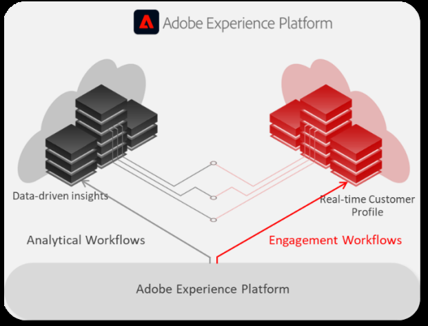

# Choose the right data lifecycle management capability

Learn to manage how long data remains in Adobe Experience Platform based on your operational, retention, and storage requirements. This guide explains the available retention and deletion options and helps you determine which one fits your goal, or when to use each, based on your needs. For step-by-step instructions, follow the implementation links in each section.

This guide is for administrators and developers who manage data volumes, retention, and entitlements in Experience Platform. It assumes you are familiar with core Experience Platform concepts, including datasets, [identities](../identity-service/home.md), [profiles](../profile/home.md), and sandboxes. The availability and permissions required for each action are described on the linked UI and API pages.

## Why manage your data lifecycle {#why-manage}

Adobe Experience Platform ingests data continuously, and the amount of data you store grows over time. Managing your data lifecycle keeps that data aligned with your active use cases, so you retain what continues to deliver value and remove what no longer does. A well-defined retention strategy also helps you meet your organization's data retention requirements and keep data volumes within your licensing entitlements.

When data accumulates beyond what your use cases require, you face several risks:

* **Reduced relevance:** Retaining signals beyond the period when they remain useful can reduce the relevance and actionability of segmentation, activation, and personalization.
* **Cost pressure:** Growing data volumes can push you toward or beyond your licensing entitlements, which can lead to overages.
* **Degraded performance:** Excess data increases system load and can slow processing.
* **Privacy exposure:** Retaining data longer than it is useful increases privacy risk and regulatory exposure.

To avoid these outcomes, Adobe recommends retaining data only as long as it supports an active use case. Apply the same principle at ingestion by using [ingestion filters](../landing/license-usage-and-guardrails/data-management-best-practices.md#ingestion-filters) to bring in only the data your use cases require. Behavioral data, such as event data, typically consumes far more storage than record data, so unmanaged behavioral data usually has the greatest impact on storage growth. Pseudonymous profiles can also accumulate over time and increase profile counts, so consider using Pseudonymous Profile data expiration to remove inactive pseudonymous profiles when they are no longer required.

All ingested data is retained in Experience Platform, and a key part of managing your data lifecycle is matching that data to the workflow it serves. Experience Platform stores data in two repositories that serve different purposes:

| Workflow | Best suited to | Typical use cases |
| --- | --- | --- |
| Analytical | Long-term retention with slower access, held in the data lake | Historical analysis, reporting, data science |
| Engagement | Real-time or near-real-time access, held in the Profile store | Segmentation, activation, personalization |

A dataset can support analytical workflows, engagement workflows, or both. When Experience Event data is available in both the Profile store and the data lake, each repository has its own retention policy. Expiring data from one repository does not automatically remove the same data from the other. Retain data only as long as it is required by the workflows that use it, and ensure that the appropriate retention policies are configured for both repositories.

>[!NOTE]
>
>Both Profile and data lake storage are subject to licensing entitlements, which vary by the products your organization has purchased. Confirm the entitlements available to your organization when you plan where data is stored and how long it is retained.

{width="600" zoomable="yes"}

For guidance on tracking and managing your license entitlements, see [Data management license entitlement best practices](../landing/license-usage-and-guardrails/data-management-best-practices.md).

## Choose the right capability {#choose-a-capability}

Your data management goal determines which retention or deletion option to use. The following table maps common goals, including privacy or regulatory deletion requests, to the option that fits. The sections that follow describe each retention and deletion option.

>[!IMPORTANT]
>
>For data subject or consumer rights requests under privacy regulations such as the General Data Protection Regulation (GDPR), use [Adobe Experience Platform Privacy Service](../privacy-service/home.md). Do not use Advanced Data Lifecycle Management capabilities to fulfill these requests. Use them for operational data management purposes such as data cleansing and data minimization.

| Your goal | Option |
| --- | --- |
| Fulfill a privacy or regulatory data-subject request | [Privacy Service](../privacy-service/home.md) |
| Operationally remove records matched by primary identity | [Record delete](#record-delete) |
| Delete an entire dataset on a date you schedule | [Dataset expiration](#dataset-expiration) |
| Automatically remove stale Experience Events from the Profile store over time | [Experience Event expiration](#experience-event-ttl) |
| Automatically remove inactive pseudonymous (unknown) profiles | [Pseudonymous Profile data expiration](#pseudonymous-profile-ttl) |
| Automatically remove old Experience Event records from the data lake while keeping the dataset | [Data lake retention policy](#data-lake-retention) |

Among the Advanced Data Lifecycle Management options, record delete and dataset expiration are targeted, one-time actions that you submit when you need them. Experience Event expiration automatically removes old Experience Events from the Profile store, while Pseudonymous Profile data expiration removes inactive unknown profiles on an ongoing basis. A data lake retention policy applies row-level expiration to ExperienceEvent datasets in the data lake. If your goal requires more than one option, for example, removing specific records while also trimming ongoing event growth, combine them as described in [Plan your retention strategy](#plan-retention).

## Record delete {#record-delete}

When you need to remove records associated with a primary identity for operational purposes such as data cleansing or data minimization, use record delete. It removes individual records from Experience Platform based on their primary identity. By default, record delete affects the data lake, Identity Service, and Real-Time Customer Profile. Record delete is not a compliance tool. For data subject or consumer rights requests, use [Adobe Experience Platform Privacy Service](../privacy-service/home.md) instead.

>[!IMPORTANT]
>
>Deleted records cannot be recovered.

Record delete acts on the primary identity used by the target service. Before you use it, note the following limitations:

* Only the primary identity is matched, and all records matching the primary identity are deleted. Records cannot be targeted by secondary identities.
* Records without a populated primary identity are skipped.
* Data ingested before the primary identity was configured in the dataset's schema cannot be deleted this way.
* A dataset with a scheduled or in-progress dataset expiration cannot receive a record delete request. Cancel the scheduled expiration or wait until the expiration completes before you submit the record delete request.
* For relational-schema datasets synchronized with an external source system through Data Mirror, deleted records may be re-ingested if they still exist in the source system. Update the source as part of your deletion workflow. See [Data Mirror](../xdm/data-mirror/overview.md) and [relational schema considerations](./ui/record-delete.md#relational-record-delete).

Depending on your organization's configuration, you can delete records from a single dataset or from all datasets.

After you submit a request, Experience Platform batches it before processing. Processing completes within the service level agreement (SLA) for your entitlement. For the processing stages and how long each takes, see [Data Lifecycle processing timelines](./data-lifecycle-processing-timelines.md). Record delete requests are also subject to daily and monthly identifier submission limits. For the current limits, see [identifier submission quotas](./ui/record-delete.md#quotas).

You can create record delete requests in the [!UICONTROL Data Lifecycle] workspace or with the API. See [Create a record delete request](./ui/record-delete.md) for the UI workflow and the [work order endpoint guide](./api/workorder.md) for the API.

## Dataset expiration {#dataset-expiration}

When you need to retire an entire dataset that is no longer needed for your use cases, use dataset expiration. It schedules the dataset for deletion on a date that you choose, and you can modify or cancel the scheduled expiration at any time before the expiration process begins. When the dataset reaches its expiration date, the data lake, Identity Service, and Real-Time Customer Profile each begin removing the dataset's contents, and the expiration completes once all three services finish.

>[!IMPORTANT]
>
>Before a dataset expires, update any dataflows that ingest data into it to avoid ingestion failures that can affect downstream workflows. The dataset is removed from the data lake before the rest of the expiration process completes, so any dataflow that still ingests into it begins to fail as soon as the dataset is removed.

You can have only a limited number of scheduled dataset expirations pending at one time. The limit depends on your product and any Shield entitlement. For the current limit, see [pending expiration limits](./ui/dataset-expiration.md#schedule-dataset-expiration). Advanced Data Lifecycle Management does not support batch dataset deletion.

You can schedule dataset expirations in the [!UICONTROL Data Lifecycle] workspace or with the API. See [Schedule a dataset expiration](./ui/dataset-expiration.md) for the UI workflow and the [dataset expiration endpoint guide](./api/dataset-expiration.md) for the API.

## Automatic retention and expiration {#automatic-expiration}

When you want to trim stale data from the Profile store or data lake automatically over time, use Experience Event expiration, Pseudonymous Profile data expiration, or a data lake retention policy for row-level expiration. Once configured, these settings remove eligible data automatically according to the retention or inactivity period you set, without requiring you to submit individual requests. The settings continue to apply until you change or remove them.

Experience Event expiration and Pseudonymous Profile data expiration are complementary features, but they are configured differently. Experience Event expiration is configured per dataset in the Datasets workspace, while Pseudonymous Profile data expiration is configured separately at the sandbox level in Profile settings.

### Experience Event expiration {#experience-event-ttl}

Experience Event expiration removes Experience Events from the Profile store after the configured retention period. For an ExperienceEvent dataset, you configure its retention period in the [!UICONTROL Datasets] workspace. This setting applies at the dataset level and removes events only, not profile attributes. If a profile has no attributes of its own, the profile stops existing after all of its events are removed. The minimum retention period is one day. See the [Set data retention policy](../catalog/datasets/user-guide.md#data-retention-policy) document for configuration guidance.

>[!NOTE]
>
>Unexpectedly high event volume can also result from bot traffic rather than genuine user activity. For guidance on identifying and filtering bot traffic, see [Bot filtering in Query Service](../query-service/use-cases/bot-filtering.md).

### Pseudonymous Profile data expiration {#pseudonymous-profile-ttl}

Pseudonymous Profile data expiration applies at the sandbox level and removes pseudonymous (unknown) profiles after they have been inactive for the period that you set. It removes both events and profile records. You can configure the setting yourself. The default expiration period is 14 days for production sandboxes and 3 days for development sandboxes. Because the removal process runs on a recurring cycle, eligible profiles are not removed immediately. For configuration guidance, see [Pseudonymous profile data expiration](../profile/pseudonymous-profiles.md).

The two expiration mechanisms differ in scope and in what they remove:

| Characteristic | Experience Event expiration   | Pseudonymous Profile data expiration              |
| -------------- | ----------------------------- | ------------------------------------------------- |
| Applies at     | Dataset level                 | Sandbox level                                     |
| Removes        | Events only                   | Events and profile records                        |
| Targets        | Events older than the set age | Pseudonymous profiles inactive for the set period |

The two settings complement each other. Set an Experience Event expiration period on your datasets to control how long event data remains in the Profile store, and use Pseudonymous Profile data expiration to remove inactive unknown profiles based on how long they remain useful. For guidance on choosing durations, see [Plan your retention strategy](#plan-retention).

>[!IMPORTANT]
>
>Data removed by either mechanism is permanently deleted and cannot be restored.

### Data lake retention policy {#data-lake-retention}

For an ExperienceEvent dataset, the configured retention period determines when Experience Events expire from the Profile store. An ExperienceEvent dataset can also have a separate data lake retention policy. Both are configured from the same [!UICONTROL Set data retention policy] workflow in the [!UICONTROL Datasets] workspace.

Use the following guidance to distinguish the available retention options:

| If you want to…                                                                  | Use                                      |
| -------------------------------------------------------------------------------- | ---------------------------------------- |
| Remove old Experience Events from the Profile store while keeping the dataset    | Experience Event expiration |
| Remove old Experience Event records from the data lake while keeping the dataset | Data lake retention policy |
| Remove the entire dataset                                                        | Dataset expiration |

Because these retention periods are independent, you can retain events in the data lake for long-term analysis after they expire from the Profile store. For data lake retention guidance, including API configuration, see [Manage Experience Event dataset retention (TTL)](../catalog/datasets/experience-event-dataset-retention-ttl-guide.md).

## Plan your retention strategy {#plan-retention}

Managing your data lifecycle is an ongoing practice, not a one-time task. Retain data only as long as it supports an active use case, and configure retention periods and expiration dates to match how long the data stays useful.

### Key considerations to guide your data strategy

Answer the following questions for each dataset before you configure retention or expiration settings:

* **Is this data still needed for an active use case?** Retaining data beyond what your use cases require increases storage and processing costs without adding value.
* **Does this data support analytical workflows, engagement workflows, or both?** Align each dataset to the [workflow it serves](#why-manage) and manage retention accordingly.
* **How long does this data need to be retained to stay useful?** Set retention periods and expiration dates according to how long the data supports your use case, rather than relying on a default or indefinite period.
* **How often do you review data usage?** Review usage regularly so you can catch inefficiencies and adjust retention settings before they affect cost or performance.

Use the following guidance when you set retention durations:

* **Experience Event expiration:** Set the retention period to cover the longest lookback your audiences need, and keep your audience lookback windows within that period so that segmentation stays accurate.
* **Pseudonymous Profile data expiration:** If inactive unknown profiles lose value sooner than the Experience Events you retain, set a shorter expiration period to remove those profiles sooner.
* **Data lake retention policy:** Set a longer period for event data you still need for analysis, independent of when the same data expires from the Profile store. Match the duration to how the data is used: shorter for frequently accessed data, longer for archival needs. See [Manage Experience Event dataset retention (TTL)](../catalog/datasets/experience-event-dataset-retention-ttl-guide.md) for recommended durations and minimums.

>[!TIP]
>
>Apply the same retention discipline to non-production sandboxes as you do to production. Avoid copying full production datasets into a non-production sandbox without a defined use case, since unmanaged non-production data still counts toward your license usage.

Apply these capabilities based on your data retention requirements. For example, for high-volume clickstream data, set an Experience Event expiration period and, if inactive unknown profiles lose value sooner, a shorter Pseudonymous Profile data expiration period to control your Profile store footprint. Set a longer data lake retention period separately to preserve the same events for long-term analysis.

Use dataset expiration to retire entire datasets you no longer need, and record delete to remove specific records on request.

For guidance on tracking and managing your license entitlements, see [Data management license entitlement best practices](../landing/license-usage-and-guardrails/data-management-best-practices.md).

## Next steps {#next-steps}

Once you've chosen the right retention or deletion option, use the linked implementation guidance to carry it out. If you're using the API for record delete or dataset expiration, also see [best practices for record delete and dataset expiration requests](./best-practices.md) for guidance on batching, throttling, and monitoring.
