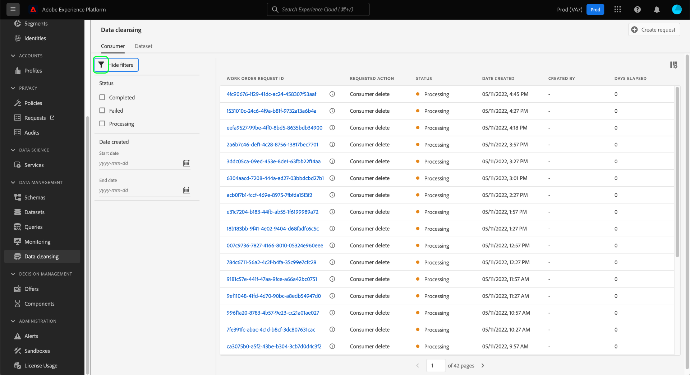
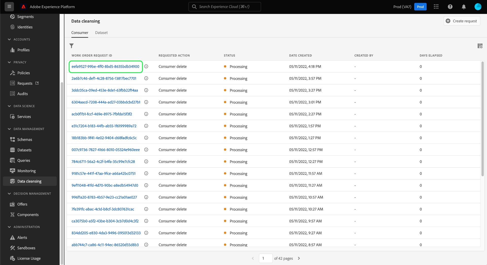
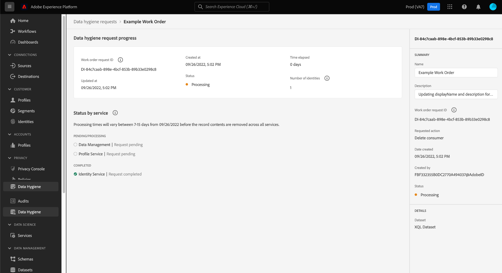
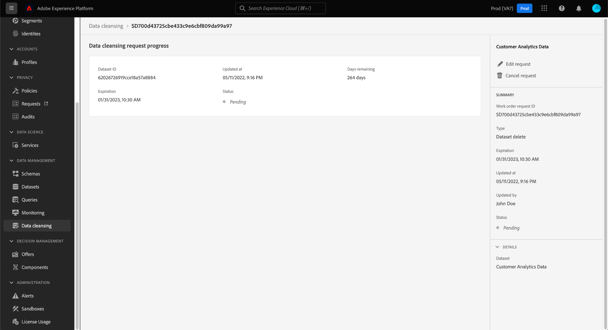

# Browse data hygiene work orders {#browse-work-orders}

>[!CONTEXTUALHELP]
>id="platform_hygiene_workorders"
>title="Work order IDs"
>abstract="When a data hygiene request is sent to the system, a work order is created to execute the requested task. In other words, a work order represents a specific data hygiene process, which includes its current status and other related details. Each work order is automatically assigned its own unique ID upon creation."
>text="See the data hygiene UI guide to learn more."

>[!IMPORTANT]
>
>Data hygiene capabilities in Adobe Experience Platform are currently only available for organizations that have purchased **Adobe Healthcare Shield** or **Adobe Privacy & Security Shield**.

When a data hygiene request is sent to the system, a work order is created to execute the requested task. A work order represents a specific data hygiene process, such as a scheduled dataset expiration, which includes its current status and other related details.

This guide covers how to view and manage existing work orders in the Adobe Experience Platform UI.

## List and filter existing work orders

When you first access the **[!UICONTROL Data Hygiene]** workspace in the UI, a list of existing work orders is shown along with their basic details.

![Image showing the [!UICONTROL Data Hygiene] workspace in the Platform UI](../images/ui/browse/work-order-list.png)

The list only shows work orders for one category at a time. Select **[!UICONTROL Consumer]** to view a list of consumer delete tasks, and **[!UICONTROL Dataset]** to view a list of scheduled dataset expirations.

![Image showing the [!UICONTROL Dataset] tab](../images/ui/browse/dataset-tab.png)

Select the funnel icon () to view a list of filters for the displayed work orders.

Depending on the type of work order you are viewing, different filter options are available.

### Filters for consumer deletes

The following filters apply to consumer delete requests:

| Filter | Description |
| --- | --- |
| [!UICONTROL Status] | Filter based on the current status of the work order:<ul><li>**[!UICONTROL Completed]**: The job has been completed.</li><li>**[!UICONTROL Failed]**: The job encountered an error and could not be completed.</li><li>**[!UICONTROL Processing]**: The request has started and is currently processing.</li></ul> |
| [!UICONTROL Date created] | Filter based on the when the work order was made. |
| [!UICONTROL Date updated] | Filter based on the when the work order was last updated. Creations are counted as updates. |

### Filters for dataset expirations

The following filters apply to dataset expiration requests:

| Filter | Description |
| --- | --- |
| [!UICONTROL Status] | Filter based on the current status of the work order:<ul><li>**[!UICONTROL Completed]**: The job has been completed.</li><li>**[!UICONTROL Pending]**: The job has been created but has not been executed yet. A [dataset expiration request](./dataset-expiration.md) assumes this status before the scheduled deletion date. Once the deletion date arrives, the status updates to [!UICONTROL Executing] unless the job is cancelled beforehand.</li><li>**[!UICONTROL Executing]**: The dataset expiration request has started and is currently processing.</li><li>**[!UICONTROL Cancelled]**: The job has been cancelled as part of a manual user request.</li></ul> |
| [!UICONTROL Date created] | Filter based on the when the work order was made. |
| [!UICONTROL Expiration date] | Filter dataset expiration requests based on the scheduled deletion date for the dataset in question. |
| [!UICONTROL Date updated] | Filter based on the when the work order was last updated. Creations and expirations are counted as updates. |

{style="table-layout:auto"}

## View the details of a work order {#view-details}

>[!CONTEXTUALHELP]
>id="platform_hygiene_statusbyservice"
>title="Status by service"
>abstract="Data hygiene requests are independently processed by multiple Experience Platform services. This section outlines the request's current processing status for each respective service. To learn more, refer to the data hygiene UI guide."

>[!CONTEXTUALHELP]
>id="platform_hygiene_numberofidentities"
>title="Number of identities"
>abstract="The number of identities whose records were requested to be updated or deleted as part of this work order. The identities included in the count may not necessarily exist in the affected datasets. To learn more, refer to the data hygiene UI guide."

>[!CONTEXTUALHELP]
>id="platform_hygiene_responsemessages"
>title="Consumer delete response"
>abstract="When a consumer delete process receives a response from the system, these messages are displayed under the **[!UICONTROL Result]** section. If a problem occurs while a work order is processing, any relevant error messages will appear in this section to help you troubleshoot the issue. To learn more, see the data hygiene UI guide."

Select the ID of a listed work order to view its details.

Depending on the type of work order selected, different information and controls are provided. These are covered in the sections below.

### Consumer delete details {#consumer-delete}

The details of a consumer delete request include its current status and the time elapsed since the request was made. Each request also includes a **[!UICONTROL Status by service]** section which provides individual status details on each downstream service involved in the deletion. On the right rail, you can use controls to update the name and description of the work order.

### Dataset expiration details {#dataset-expiration}

The details page for a dataset expiration provides information on its basic attributes, including the scheduled expiration date on the days remaining before the deletion occurs. In the right rail, you can use controls to edit or cancel the expiration.

## Next steps

This guide covered how to view and manage existing data hygiene work orders in the Platform UI. For information on creating your own work orders, refer to the following documentation:

* [Manage dataset expirations](./dataset-expiration.md)
* [Manage consumer deletes](./delete-consumer.md)
