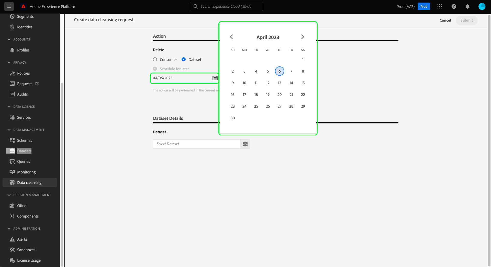
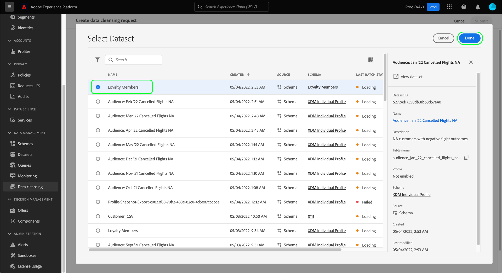

# Manage dataset expirations {#dataset-expiration}

>[!CONTEXTUALHELP]
>id="platform_privacyConsole_scheduleDatasetExpiration_description"
>title="Description"
>abstract=""

>[!IMPORTANT]
>
>Data hygiene capabilities in Adobe Experience Platform are currently only available for organizations that have purchased **Adobe Healthcare Shield** or **Adobe Privacy & Security Shield**. These capabilities are due for general release in the near future. For more information on their upcoming availability, please speak to your Adobe service representative. You can, however, immediately [delete datasets through the [!UICONTROL Datasets] UI](../../catalog/datasets/user-guide.md#delete).

The [[!UICONTROL Data Hygiene] workspace](./overview.md) in the Adobe Experience Platform UI allows you to schedule expirations for datasets. When a dataset reaches its expiration date, the data lake, Identity Service, and Real-Time Customer Profile begin separate processes to remove the dataset's contents from their respective services. Once the data is deleted from all three services, the expiration is marked as complete.

>[!WARNING]
>
>If a dataset is set to expire, you must manually change any dataflows that may be ingesting data into that dataset so that your downstream workflows are not negatively affected.

This document covers how to schedule and manage dataset expirations in the Platform UI.

## Schedule a dataset expiration {#schedule-dataset-expiration}

>[!CONTEXTUALHELP]
>id="platform_privacyConsole_scheduleDatasetExpiration_instructions"
>title="Instructions"
>abstract=""

To create a new request, select **[!UICONTROL Create request]** from the main page in the workspace.

![Image showing the [!UICONTROL Create request] button being selected](../images/ui/ttl/create-request-button.png)

The request creation dialog appears. Under the **[!UICONTROL Requested Action]** section, select **[!UICONTROL Delete Dataset]** to update the available controls for dataset expiration scheduling.

![Image showing the [!UICONTROL Create request] button being selected](../images/ui/ttl/dataset-selected.png)

### Select a date and a dataset

The request creation dialog appears. Under the **[!UICONTROL Requested Action]** section, select a date that you want the dataset to be deleted by. You can enter the date manually (in the format `mm/dd/yyyy`) or select the calendar icon () to select the date from a dialog.

Next, under **[!UICONTROL Dataset Details]**, select the database icon () to open a dataset selection dialog. Choose a dataset from the list to apply the expiration to, then select **[!UICONTROL Done]**.

>[!NOTE]
>
>Only datasets belonging to the current sandbox are shown.

### Submit the request

The [!UICONTROL Dataset Details] section populates to include the primary identity and schema for the selected dataset. Under **[!UICONTROL Request settings]**, enter a name and optional description for the request, followed by **[!UICONTROL Submit]**.

![Image showing the [!UICONTROL Submit] button being selected](../images/ui/ttl/submit.png)

You are asked to confirm the date that the dataset will be deleted by. Select **[!UICONTROL Submit]** to continue.

After the request is submitted, a work order is created and appears on the main tab of the [!UICONTROL Data Hygiene] workspace. From here, you can monitor the work order's status as it processes the request.

>[!NOTE]
>
>Refer to the overview section on [timelines and transparency](../home.md#dataset-expiration-transparency) for details on how dataset expirations are processed once they are executed.

## Edit or cancel a dataset expiration

To edit or cancel a dataset expiration, select **[!UICONTROL Dataset]** on the main page of the workspace, and select the dataset expiration from the list.

On the details page of the dataset expiration, the right rail shows controls to edit or cancel the scheduled deletion.

## Next steps

This document covered how to schedule dataset expirations in the Experience Platform UI. For information on how to perform other data hygiene tasks in the UI, refer to the [data hygiene UI overview](./overview.md).

To learn how to schedule dataset expirations using the Data Hygiene API, refer to the [dataset expiration endpoint guide](../api/dataset-expiration.md).
