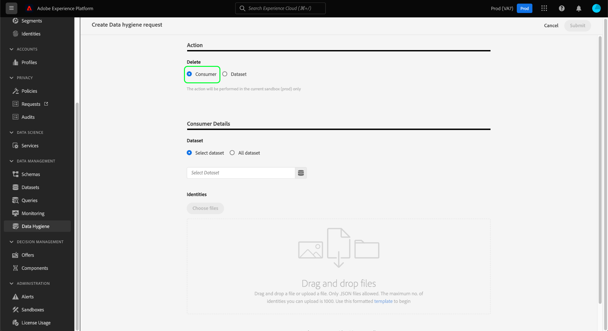
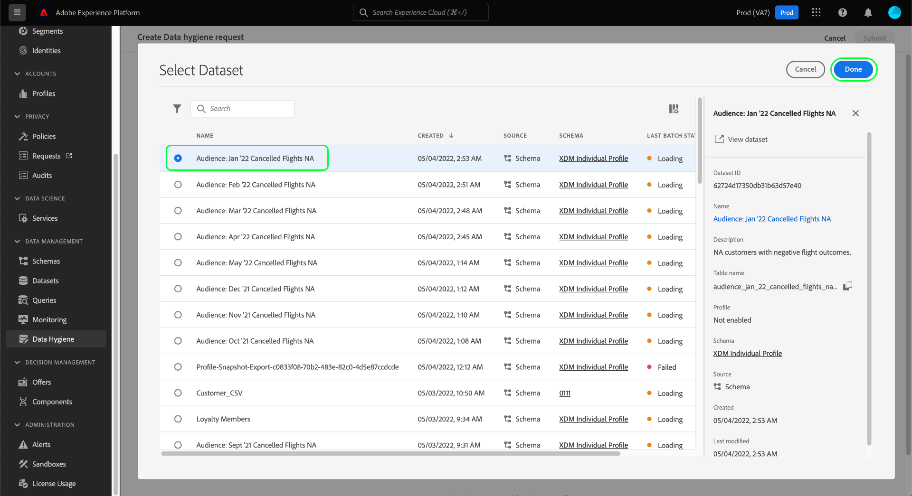
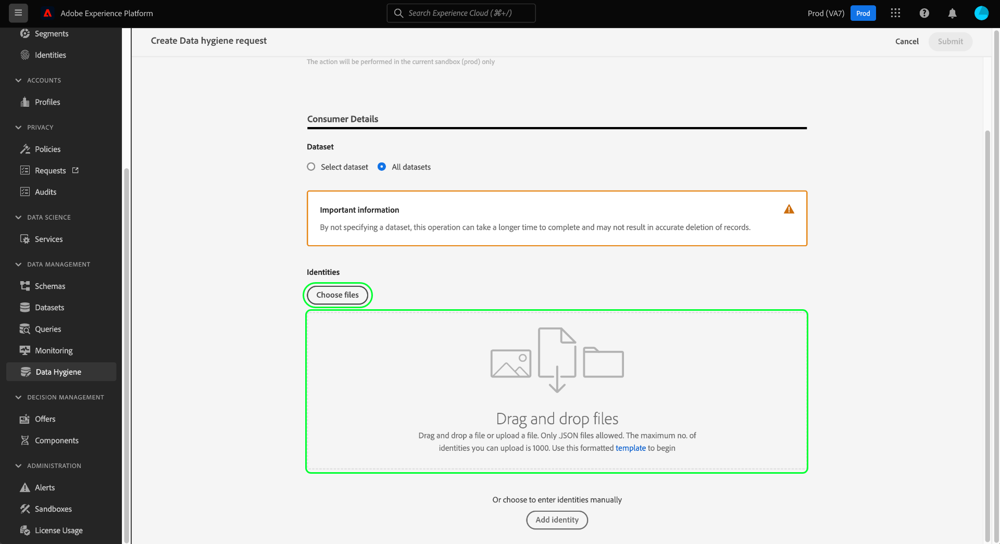
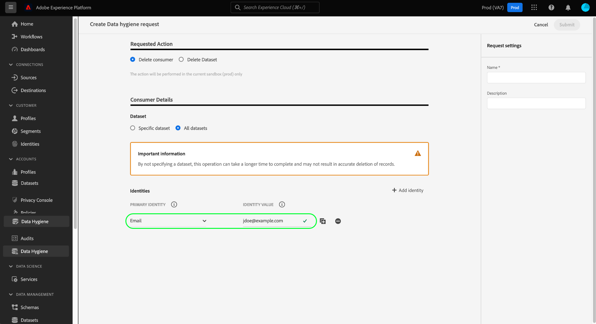
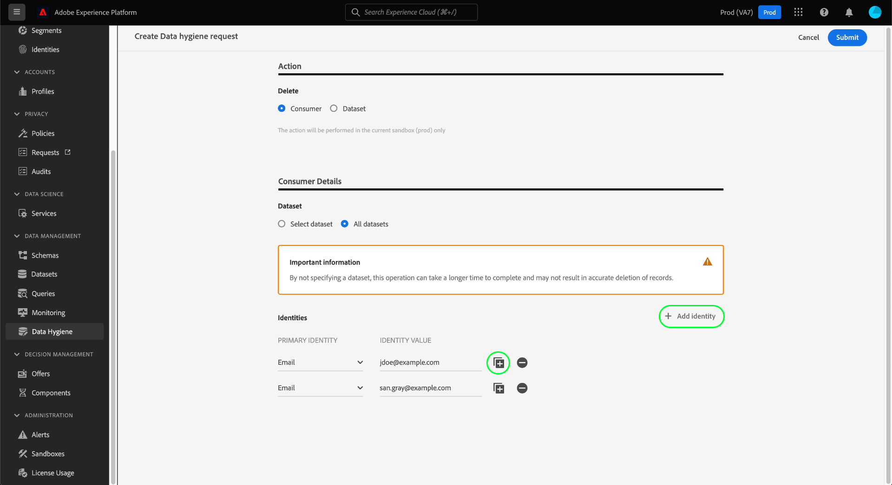
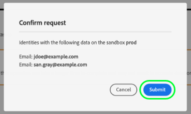

# Delete consumer records

>[!IMPORTANT]
>
>Data hygiene capabilities in Adobe Experience Platform are currently only available for organizations that have purchased Adobe Healthcare Shield.

The [[!UICONTROL Data Hygiene] workspace](./overview.md) in the Adobe Experience Platform UI allows you to delete consumer records that are participating in Identity Service and Real-time Customer Profile.

## Prerequisites

Deleting consumer records requires a working understanding of how identity fields function in Experience Platform. Specifically, you must know the primary identity values of the consumers whose records you want to delete, depending on the dataset (or datasets) you are deleting them from.

Refer to the following documentation for more information on identities in Platform:

* [Adobe Experience Platform Identity Service](../../identity-service/home.md): Bridges identities across devices and systems, linking datasets together based on the identity fields defined by the XDM schemas they conform to.
  * [Identity namespaces](../../identity-service/namespaces.md): Identity namespaces define the different types of identity information that can relate to a single person, and are a required component for each identity field.
* [Real-time Customer Profile](../../profile/home.md): Leverages consumer identity graphs to provide unified  consumer profiles based on aggregated data from multiple sources, updated in near-real-time.
* [Experience Data Model (XDM)](../../xdm/home.md): Provides standard definitions and structures for Platform data through the use of schemas. All Platform datasets conform to a specific XDM schema, and the schema defines which fields are identities.
  * [Identity fields](../../xdm/ui/fields/identity.md): Learn how an identity field is defined in an XDM schema.

## Create a new request

To start the process, select **[!UICONTROL Create request]** from the main page in the workspace.

![Image showing the [!UICONTROL Create request] button being selected](../images/ui/delete-consumer/create-request-button.png)

The request creation dialog appears. By default, the **[!UICONTROL Consumer]** option is selected under the **[!UICONTROL Requested Action]** section. Leave this option selected.



## Select datasets

Under the **[!UICONTROL Consumer Details]** section, the next step is to determine whether you want to delete consumer data from a single dataset or all datasets.

If you choose **[!UICONTROL Select dataset]**, select the database icon () and a dialog appears that allows you to select the desired dataset from the list.



If you want to delete consumer data from all datasets, select **[!UICONTROL All datasets]**.

![Image showing the [!UICONTROL All datasets] option selected](../images/ui/delete-consumer/all-datasets.png)

>[!NOTE]
>
>Selecting the **[!UICONTROL All datasets]** option can cause the delete operation to take longer and may not result in accurate record deletion.

## Provide consumer identities {#provide-consumer-identities}

>[!CONTEXTUALHELP]
>id="platform_hygiene_primaryidentity"
>title="Primary identity"
>abstract="A primary identity is an attribute that ties a record to a consumer's profile in Experience Platform. The primary identity field for a dataset is defined by the schema that the dataset is based on. In this column, you must provide the type (or namespace) for the consumer's primary identity, such as `email` for email addresses and `ecid` for Experience Cloud IDs. To learn more, see the data hygiene UI guide."

>[!CONTEXTUALHELP]
>id="platform_hygiene_identityvalue"
>title="Identity value"
>abstract="In this column, you must provide the value for the consumer's primary identity, which must correspond with the identity type provided in the left column. If the primary identity type is `email`, the value should be the consumer's email address. To learn more, see the data hygiene UI guide."

When deleting consumer data, you must provide identity information so the system can determine which records must be deleted. For any dataset in Platform, records are deleted based on the **primary identity** field that is defined by the dataset's schema.

Like all identity fields in Platform, a primary identity is composed of two things: a **type** (sometimes referred to as an identity namespace) and a **value**. The identity type provides context as to how the field identifies a consumer (such as an email address), and the value represents a consumer's specific identity for that type (for example, `jdoe@example.com` for the `email` identity type).  Common fields used as identities include account information, device IDs, and cookie IDs.

>[!TIP]
>
>If you don't know the primary identity for a particular dataset, you can find it in the Platform UI. In the **[!UICONTROL Datasets]** workspace, select the dataset in question from the list. On the details page for the dataset, hover over the name of the dataset's schema in the right rail. The primary identity is displayed along with the schema name and description.
>
>

If you are deleting consumer records from a single dataset, all the identities you provide must have the same type, since a dataset can only have one primary identity. If you are deleting from all datasets, you can include multiple identity types since different datasets may have different primary identities.

There are two options to provide consumer identities when deleting consumer records:

* [Upload a JSON file](#upload-json)
* [Enter identity values manually](#manual-identity)

### Upload a JSON file {#upload-json}

To upload a JSON file, you can drag and drop the file into the provide area, or select **[!UICONTROL Choose files]** to browse and select from your local directory.



The JSON file must be formatted as an array of objects, each object representing a consumer identity.

```json
[
  {
    "namespaceCode": "email",
    "value": "jdoe@example.com"
  },
  {
    "namespaceCode": "email",
    "value": "san.gray@example.com"
  }
]
```

| Property | Description |
| --- | --- |
| `namespaceCode` | The identity type. |
| `value` | The consumer's identity as denoted by the type. |

Once the file is uploaded, you can continue to [submit the request](#submit).

### Enter identities manually {#manual-identity}

To enter identities manually, select **[!UICONTROL Add identity]**.

![Image showing the [!UICONTROL Add identity] button being selected](../images/ui/delete-consumer/add-identity.png)

Controls appear that allow you to enter consumer identities one at a time. Under **[!UICONTROL Primary Identity]**, use the dropdown menu to select the identity type. Under **[!UICONTROL Identity Value]**, provide the primary identity value for the consumer.



To add more identities, select the plus icon () next to one of the rows, or select **[!UICONTROL Add identity]**.



## Submit the request (#submit)

Once you have finished adding identities to the request, under **[!UICONTROL Request settings]**, provide a name and optional description for the request before selecting **[!UICONTROL Submit]**.

![Image showing the [!UICONTROL Submit] button being selected](../images/ui/delete-consumer/submit.png)

You are asked to confirm the list of identities whose data you want to delete. Select **[!UICONTROL Submit]** to confirm your selection.



After the request is submitted, a work order is created and appears on the [!UICONTROL Consumer] tab of the [!UICONTROL Data Hygiene] workspace. From here, you can monitor the work order's status as it processes the request.

>[!NOTE]
>
>Refer to the overview section on [timelines and transparency](../home.md#consumer-delete-transparency) for details on how consumer deletes are processed once they are executed.

## Next steps

This document covered how to delete consumer records in the Experience Platform UI. For information on how to perform other data hygiene tasks in the UI, refer to the [data hygiene UI overview](./overview.md).

To learn how to delete consumer records using the Data Hygiene API, refer to the [work order endpoint guide](../api/workorder.md).
