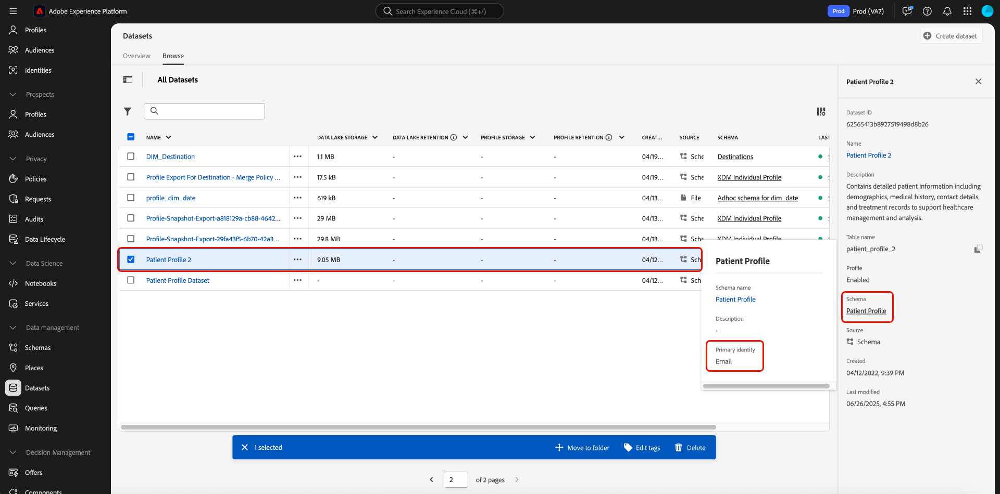
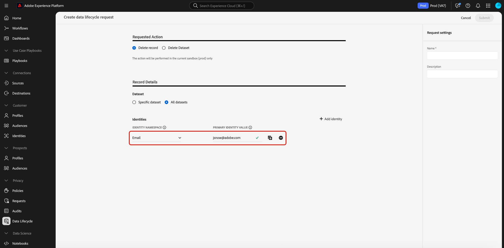
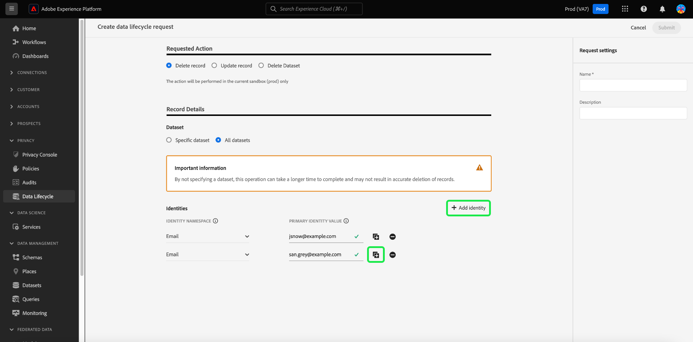

# [!BADGE Beta]{type=Informative} Delete records {#record-delete}
 
Use the [[!UICONTROL Data Lifecycle] workspace](./overview.md) to delete records in Adobe Experience Platform based on their primary identities. These records can be tied to individual consumers or any other entity that is included in the identity graph.
 
>[!IMPORTANT] 
> 
>The Record Delete feature is currently in Beta and available only in a **limited release**. It is not available to all customers. Record delete requests are only available for organizations in the limited release.
> 
> 
>Record deletions are meant to be used for data cleansing, removing anonymous data, or data minimization. They are **not** to be used for data subject rights requests (compliance) as pertaining to privacy regulations like the General Data Protection Regulation (GDPR). For all compliance use cases, use [Adobe Experience Platform Privacy Service](../../privacy-service/home.md) instead.

## Prerequisites {#prerequisites}

Deleting records requires a working understanding of how identity fields function in Experience Platform. Specifically, you must know the primary identity values of the entities whose records you want to delete, depending on the dataset (or datasets) you are deleting them from.

Refer to the following documentation for more information on identities in Platform:

* [Adobe Experience Platform Identity Service](../../identity-service/home.md): Bridges identities across devices and systems, linking datasets together based on the identity fields defined by the XDM schemas they conform to.
* [Identity namespaces](../../identity-service/features/namespaces.md): Identity namespaces define the different types of identity information that can relate to a single person, and are a required component for each identity field.
* [Real-Time Customer Profile](../../profile/home.md): Uses identity graphs to provide unified consumer profiles based on aggregated data from multiple sources, updated in near-real-time.
* [Experience Data Model (XDM)](../../xdm/home.md): Provides standard definitions and structures for Platform data through the use of schemas. All Platform datasets conform to a specific XDM schema, and the schema defines which fields are identities.
* [Identity fields](../../xdm/ui/fields/identity.md): Learn how an identity field is defined in an XDM schema.

## Create a request {#create-request}

To start the process, select **[!UICONTROL Data Lifecycle]** in the left navigation of the Platform UI. The [!UICONTROL Data lifecycle requests] workspace appears. Next, select **[!UICONTROL Create request]** from the main page in the workspace.

![The [!UICONTROL Data lifecycle requests] workspace with [!UICONTROL Create request] selected.](../images/ui/record-delete/create-request-button.png)

The request creation workflow appears. By default, the **[!UICONTROL Delete record]** option is selected under the **[!UICONTROL Requested Action]** section. Leave this option selected.

>[!IMPORTANT] 
> 
>As part of ongoing changes to improve efficiency and make dataset operations less expensive, organizations who have been moved to the Delta format can delete data from the Identity Service, Real-Time Customer Profile, and the data lake. This type of user is referred to as delta-migrated. Users from organizations who have been delta-migrated can choose to delete records from either a single or all datasets. Users from organizations who have not been delta-migrated cannot choose to delete records from either a single or all datasets as seen in the image below. In this case, continue to the [provide identities](#provide-identities) section of the guide.

![The request creation workflow with the [!UICONTROL Delete record] option selected and highlighted.](../images/ui/record-delete/delete-record.png)

## Select datasets {#select-dataset}

The next step is to determine whether you want to delete records from a single dataset or all datasets. If this option is not available to you, continue to the [provide identities](#provide-identities) section of the guide. 

Under the **[!UICONTROL Record Details]** section, use the radio button to select between a specific dataset and all datasets. If you choose **[!UICONTROL Select dataset]**, proceed to select the database icon () to open a dialog that provides a list of available datasets. Select the desired dataset from the list followed by **[!UICONTROL Done]**.  

![The [!UICONTROL Select dataset] dialog with a dataset selected and [!UICONTROL Done] highlighted.](../images/ui/record-delete/select-dataset.png)  

If you want to delete records from all datasets, select **[!UICONTROL All datasets]**.

![The [!UICONTROL Select dataset] dialog with the [!UICONTROL All datasets] option selected.](../images/ui/record-delete/all-datasets.png)

>[!NOTE]
>
>Selecting the **[!UICONTROL All datasets]** option can cause the delete operation to take longer and may not result in accurate record deletion.

## Provide identities {#provide-identities}

>[!CONTEXTUALHELP]
>id="platform_hygiene_primaryidentity"
>title="Primary identity"
>abstract="A primary identity is an attribute that ties a record to a consumer's profile in Experience Platform. The primary identity field for a dataset is defined by the schema that the dataset is based on. In this column, you must provide the type (or namespace) for the record's primary identity, such as `email` for email addresses and `ecid` for Experience Cloud IDs. To learn more, see the Data lifecycle UI guide."

>[!CONTEXTUALHELP]
>id="platform_hygiene_identityvalue"
>title="Identity value"
>abstract="In this column, you must provide the value for the record's primary identity, which must correspond with the identity type provided in the left column. If the primary identity type is `email`, the value should be the record's email address. To learn more, see the data lifecycle UI guide."

When deleting records, you must provide identity information so the system can determine which records are to be deleted. For any dataset in Platform, records are deleted based on the **primary identity** field that is defined by the dataset's schema.

Like all identity fields in Platform, a primary identity is composed of two things: a **type** (sometimes referred to as an identity namespace) and a **value**. The identity type provides context as to how the field identifies a record (such as an email address), and the value represents a record's specific identity for that type (for example, `jdoe@example.com` for the `email` identity type). Common fields used as identities include account information, device IDs, and cookie IDs.

>[!TIP]
>
>If you don't know the primary identity for a particular dataset, you can find it in the Platform UI. In the **[!UICONTROL Datasets]** workspace, select the dataset in question from the list. On the details page for the dataset, hover over the name of the dataset's schema in the right rail. The primary identity is displayed along with the schema name and description.
>
>

If you are deleting records from a single dataset, all the identities you provide must have the same type, since a dataset can only have one primary identity. If you are deleting from all datasets, you can include multiple identity types since different datasets may have different primary identities.

There are two options to provide identities when deleting records:

* [Upload a JSON file](#upload-json)
* [Enter identity values manually](#manual-identity)

### Upload a JSON file {#upload-json}

To upload a JSON file, you can drag and drop the file into the provided area, or select **[!UICONTROL Choose files]** to browse and select from your local directory.


The JSON file must be formatted as an array of objects, each object representing an identity.

```json
[
  {
    "namespaceCode": "email",
    "value": "jdoe@example.com"
  },
  {
    "namespaceCode": "email",
    "value": "san.gray@example.com"
  }
]
```

| Property | Description |
| --- | --- |
| `namespaceCode` | The identity type. |
| `value` | The identity value as denoted by the type. |

Once the file is uploaded, you can continue to [submit the request](#submit).

### Manually enter identities {#manual-identity}

To enter identities manually, select **[!UICONTROL Add identity]**.

![The request creation workflow with the [!UICONTROL Add identity] option highlighted.](../images/ui/record-delete/add-identity.png)

Controls appear that allow you to enter identities one at a time. Under **[!UICONTROL Primary Identity]**, use the dropdown menu to select the identity type. Under **[!UICONTROL Identity Value]**, provide the primary identity value for the record.



To add more identities, select the plus icon () next to one of the rows, or select **[!UICONTROL Add identity]**.



## Submit the request {#submit}

Once you have finished adding identities to the request, under **[!UICONTROL Request settings]**, provide a name and optional description for the request before selecting **[!UICONTROL Submit]**.

>[!IMPORTANT] 
> 
>There are different limits for the total number of unique identity record deletes that can be submitted each month. These limits are based on your license agreement. Organizations who have purchased all editions of Adobe Real-Time Customer Data Platform and Adobe Journey Optimizer can submit up to 100,000 identity record deletes each month. Organizations who have purchased **Adobe Healthcare Shield** or **Adobe Privacy & Security Shield** can submit up to 600,000 identity record deletes each month.<br>A single record delete request through the UI allows you to submit 10,000 IDs at one time. The [API method to delete records](../api/workorder.md#create) allows for the submission of 100,000 IDs at one time.<br>It is best practice to submit as many IDs per request as possible, up to your ID limit. When you intend to delete a high volume of IDs, submitting a low volume, or a single ID per record delete request should be avoided.

![The request setting's [!UICONTROL Name] and [!UICONTROL Description] fields with [!UICONTROL Submit] highlighted.](../images/ui/record-delete/submit.png)

A [!UICONTROL Confirm request] dialog appears to indicate that the identities cannot be recovered once deleted. Select **[!UICONTROL Submit]** to confirm the list of identities whose data you want to delete.

![The [!UICONTROL Confirm request] dialog.](../images/ui/record-delete/confirm-request.png)

After the request is submitted, a work order is created and appears on the [!UICONTROL Record] tab of the [!UICONTROL Data Lifecycle] workspace. From here, you can monitor the work order's status as it processes the request.

>[!NOTE]
>
>Refer to the overview section on [timelines and transparency](../home.md#record-delete-transparency) for details on how record deletes are processed once they are executed.

![The [!UICONTROL Record] tab of the [!UICONTROL Data Lifecycle] workspace with the new request highlighted.](../images/ui/record-delete/request-log.png)

## Next steps

This document covered how to delete records in the Experience Platform UI. For information on how to perform other data lifecycle management tasks in the UI, refer to the [Data Lifecycle UI overview](./overview.md).

To learn how to delete records using the Data Hygiene API, refer to the [work order endpoint guide](../api/workorder.md).
