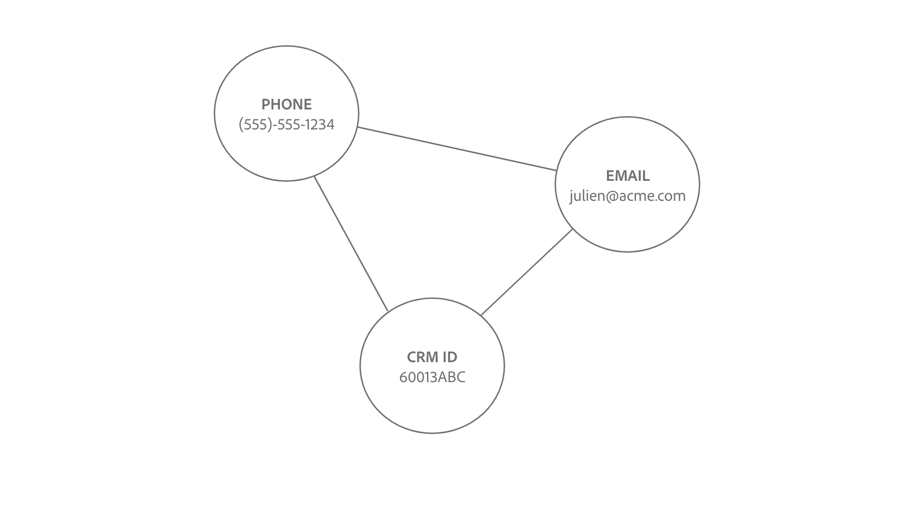
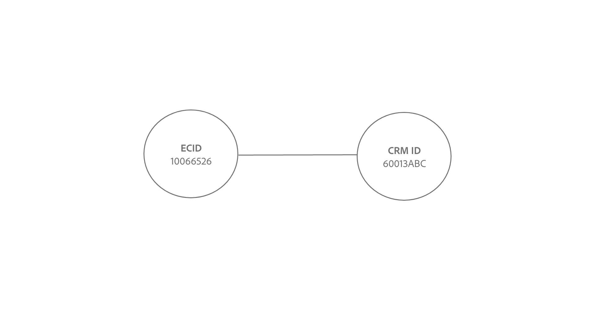
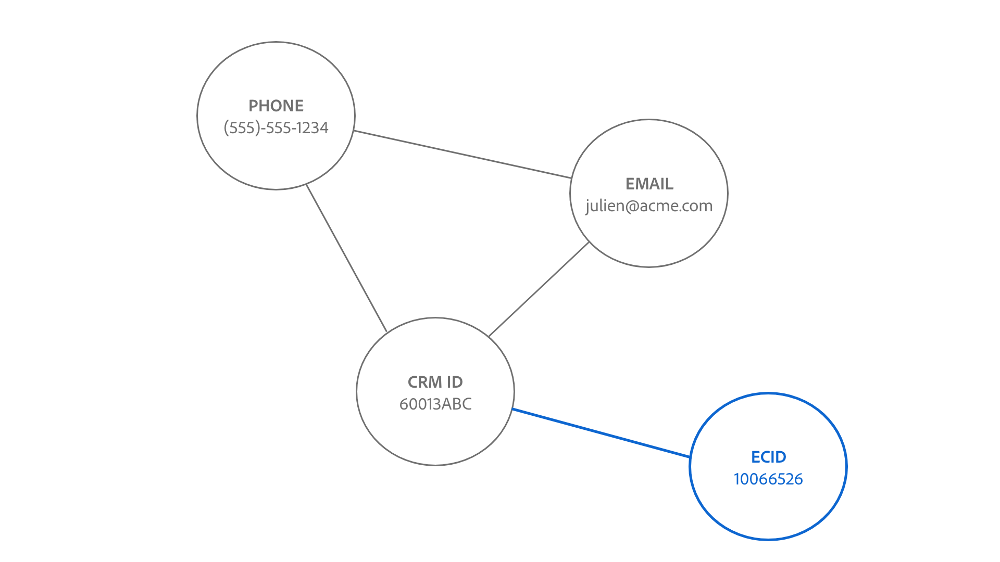
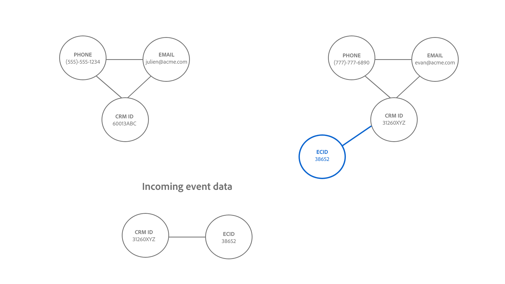
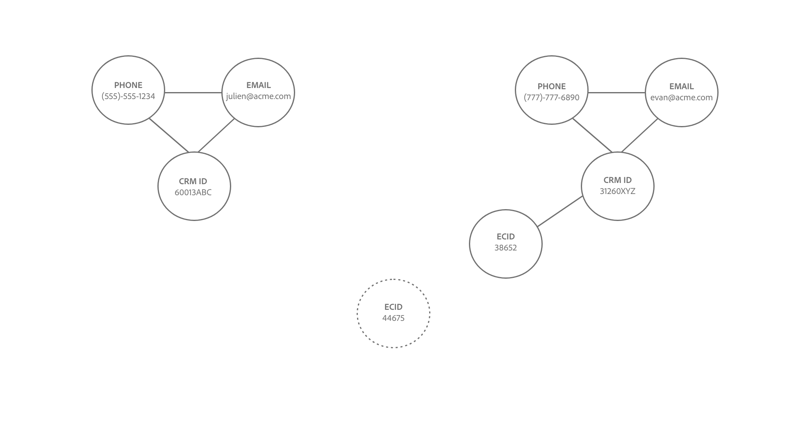
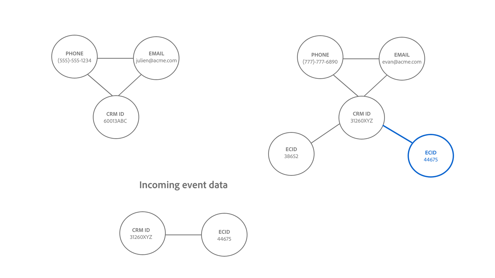

# Identity Service linking logic

A link between two identities are established when the identity namespace and the identity values match.

There are two types of identities that get linked:

* **Profile records**: These identities usually come from CRM systems.
* **Experience Events**: These identities usually come from WebSDK implementation or the Adobe Analytics source.

## Semantic meaning of establishing links

An identity represents a real-world entity. If there is a link established between two identities, this means that the two identities are associated to one another. The following are some examples that illustrate this concept:

| Action | Links established | Meaning |
| --- | --- | --- |
| An end user logs in using a computer. | CRM ID and ECID are linked together. | A person (CRM ID) owns a device with a browser (ECID). |
| An end user browses anonymously using an iPhone .| IDFA is linked with ECID. | The Apple hardware device (IDFA), such as an iPhone, is associated with the browser (ECID). |
| An end user logs in using Google Chrome, and then Firefox. | CRM ID is linked with two different ECIDs. | A person (CRM ID) is associated to 2 web browsers (**Note**: Each browser will have its own ECID). |
| A data engineer ingests a CRM record that includes two fields marked as an identity: CRM ID and Email.| CRM ID and Email are linked. | A person (CRM ID) is associated to the email address. |

## Understanding the Identity Service linking logic

An identity consists of an identity namespace and an identity value.

* An identity namespace is the context of a given identity value to. Common examples of identity namespaces include CRM ID, Email, and Phone.
* An identity value is the string that represents a real-world entity. For example: "julien@acme.com" can be an identity value for an Email namespace and 555-555-1234 can be a corresponding identity value for a Phone namespace.

>[!TIP]
>
>The identity namespace is important because without it, then the identity value loses its context and will not have enough information to successfully match identities.

See the following diagrams for a visual representation of how the Identity Service linking logic works:

>[!BEGINTABS]

>[!TAB Existing graph]

Suppose that you have an existing identity graph with three linked identities:

* PHONE:(555)-555-1234
* EMAIL:julien@acme.com
* CRM ID:60013ABC

>[!TAB Incoming data]

A pair of identities are ingested into your graph and this pair contains:

* CRM ID:60013ABC
* ECID:100066526

>[!TAB Updated graph]

Identity Service recognizes that CRM ID:60013ABC already exists within your graph, and so only links the new ECID

>[!ENDTABS]

## Customer scenario

You are a data engineer and you ingest the following CRM dataset (Profile record) to Experience Platform.

| CRM ID** | Phone* | Email* | First name | Last name |
| --- | --- | --- | --- | --- |
| 60013ABC | 555-555-1234 | julien@acme.com | Julien| Smith |
| 31260XYZ | 777-777-6890 | evan@acme.com | Evan | Smith |

>[!NOTE]
>
>* `**` - Denotes field that is marked as primary identity.
>* `*` -  Denotes field that is marked as secondary identity.
>
>Identity Service does not distinguish between primary and secondary identity. As long as a field is marked as an identity, then it will be ingested to Identity Service.

You have also implemented WebSDK and ingested a WebSDK dataset (Experience Event) with the following data tables:

| Timestamp | Identities in the event* | Event |
| --- | --- | --- |
| `t=1` | ECID:38652 | View home page |
| `t=2` | ECID:38652, CRM ID:31260XYZ | Search for shoes |
| `t=3` | ECID:44675 | View home page |
| `t=4` | ECID:44675, CRM ID: 31260XYZ | View purchase history |

The primary identity for each event will be determined based on [how you configure data element types](../../tags/extensions/client/web-sdk/data-element-types.md).

>[!NOTE]
>
>* If you select the CRM ID as the primary, then authenticated events (events with identity map containing the CRM ID and ECID) will have a primary identity of CRM ID. For unauthenticated events (events with the identity map only containing ECID) will have a primary identity of ECID. Adobe recommends this option.
>
>* If you select the ECID as the primary, irrespective of the authentication state, the ECID becomes the primary identity. 

In this example:

* `t=1`, used a desktop computer (ECID:38652) and to view the home page browse anonymously.
* `t=2`, used the same desktop computer, logged in (CRM ID:31260XYZ) and then searched for shoes.
  * Once a user is logged in, the event sends both ECID and CRM ID to Identity Service.
* `t=3`, used a laptop computer (ECID:44675) and browsed anonymously.
* `t=4`, used the same laptop computer, logged in (CRM ID: 31260XYZ) and then viewed the purchase history.

>[!BEGINTABS]

>[!TAB timestamp=0]

At `timestamp=0`, you have two identity graphs for two different customers. Both of whom are each represented by three linked identities.

| | CRM ID | Email | Phone |
| --- | --- | --- | --- |
| Customer one | 60013ABC | julien@acme.com | 555-555-1234 |
| Customer two | 31260XYZ | evan@acme.com | 777-777-6890 |

>[!TAB timestamp=1]

At `timestamp=1`, a customer uses a laptop to visit your e-commerce website, view your home page, and browse anonymously. This anonymous browsing event is identified as ECID:38652. Since Identity Service only stores events with at least two identities, this information is not stored.

>[!TAB timestamp=2]

At `timestamp=2`, a customer uses the same laptop to visit your e-commerce website. They log in with their username and password combination and they browse for shoes. Identity Service identifies the customer's account when they log in because it corresponds to their CRM ID: 31260XYZ. Additionally, Identity Service relates ECID:38562 to CRM ID:31260XYZ since they are both using the same browser on the same device.

>[!TAB timestamp=3]

At `timestamp=3` a customer uses a tablet to visit your e-commerce website and browse anonymously. This anonymous browsing event is identified as ECID:44675. Since Identity Service only stores events with at least two identities, this information is not stored.

>[!TAB timestamp=4]

At `timestamp=4`, a customer uses the same tablet, logs in to their account (CRM ID:31260XYZ) and views their purchase history. This event links their CRM ID:31260XYZ to the cookie identifier assigned to anonymous browsing activity, ECID:44675, and links ECID:44675 to customer two's identity graph.

>[!ENDTABS]
