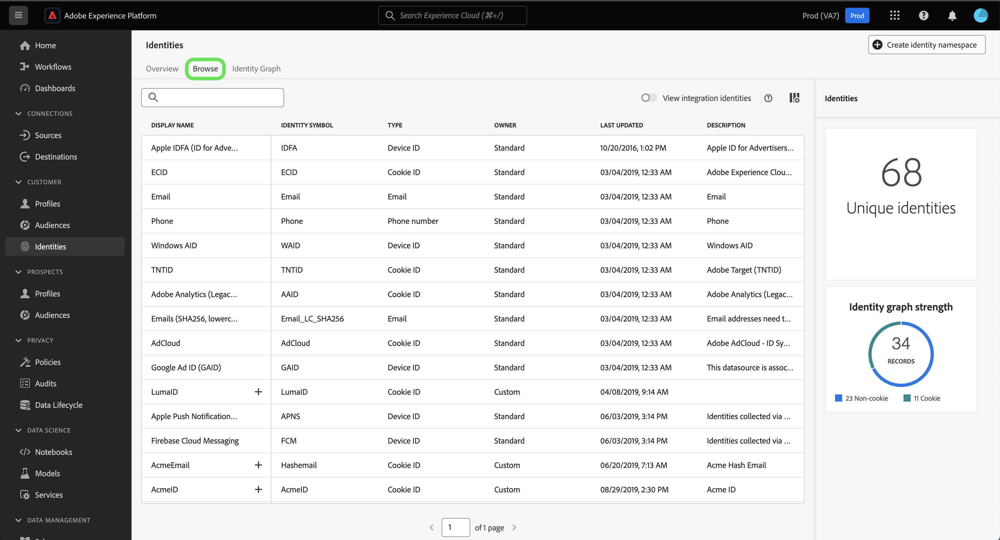
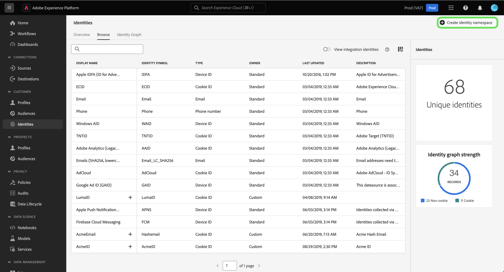
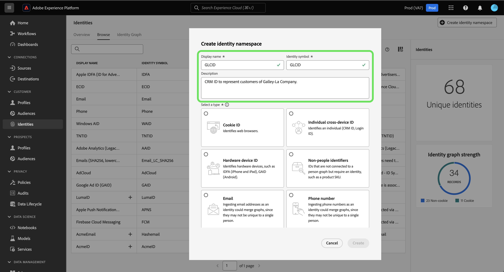
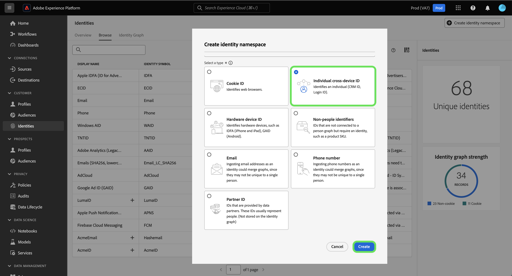

# Identity namespace overview

Read the following document to learn more about what you can do with identity namespaces in Adobe Experience Platform Identity Service.

## Getting started

Identity namespaces requires an understanding of various Adobe Experience Platform services. Before beginning to work with namespaces, please review the documentation for the following services:

* [[!DNL Real-Time Customer Profile]](../../profile/home.md): Provides a unified, customer profile in real time based on aggregated data from multiple sources.
* [[!DNL Identity Service]](../home.md): Gain a better view of individual customers and their behavior by bridging identities across devices and systems.
* [[!DNL Privacy Service]](../../privacy-service/home.md): Identity namespaces are used in compliance requests for legal privacy regulations like the General Data Protection Regulation (GDPR). Each privacy request is made relative to a namespace in order to identify which consumers' data should be affected.

## Understanding identity namespaces {#understanding-identity-namespaces}

>[!CONTEXTUALHELP]
>id="platform_identity_namespace"
>title="Identity namespaces"
>abstract="An identity namespace is the context of a given identity. For example, a namespace of `Email` could correspond with **name@acme.com**. Similarly, a namespace of `Phone` could correspond with `555-555-1234`."
>text="Learn more in documentation"

>[!CONTEXTUALHELP]
>id="platform_identity_value"
>title="Identity values"
>abstract="An identity value is an identifier that represents a unique individual, organization, or asset. The context or type of identity that the value represents is defined by a corresponding identity namespace. When matching record data across profile fragments, the namespace and identity value must match. When matching record data across profile fragments the namespace and identity value must match."
>text="Learn more in documentation"

A fully qualified identity includes two components: an **identity value** and an **identity namespace**. For example, if the value of an identity is `scott@acme.com`, then a namespace provides context to this value by distinguishing it as an email address. Similarly, a namespace can distinguish `555-123-456` as a phone number, and `3126ABC` as a CRM ID. Essentially, **a namespace provides context to a given identity**. When matching record data across profile fragments, as when [!DNL Real-Time Customer Profile] merges profile data, both the identity value and the namespace must match.

For example, two profile fragments may contain different primary IDs but they share the same value for the "Email" namespace, therefore Experience Platform is able to see that these fragments are actually the same individual and brings the data together in the identity graph for the individual.

>[!BEGINSHADEBOX]

**Identity namespace explained**

Another way to better understand the concept of namespace is to consider real world examples such as cities and their corresponding states. For example, Portland, Maine and Portland, Oregon are two different places in the United States. While the cities share the same name, the state operates as a namespace and provides necessary context that distinguishes the two cities from each other.

Applying the same logic to Identity Service:

* At a glance, the identity value of: `1-234-567-8900` can look like a phone number. However, from a system perspective, this value could have been configured as a CRM ID. Identity Service would have no way of applying the necessary context to this identity value without a corresponding namespace.
* Another example is the identity value of: `john@gmail.com`. While this identity value can be easily assumed to be an Email, it is entirely possible that it's configured as a custom namespace CRM ID. With namespace, you can distinguish `Email:john@gmail.com` from `CRM ID:john@gmail.com`.

>[!ENDSHADEBOX]

### Components of a namespace

A namespace consists of the following components:

* **Display name**: The user-friendly name for a given namespace.
* **Identity symbol**: A code used internally by Identity Service to represent a namespace.
* **Identity type**: The classification of a given namespace.
* **Description**: (Optional) Any supplemental information that you can provide regarding a given namespace.

### Identity type {#identity-type}

>[!CONTEXTUALHELP]
>id="platform_identity_create_namespace"
>title="Specify identity type"
>abstract="The identity type controls whether or not data is stored to the identity graph. Identity graphs are not generated for the following identity types: non-person identifiers and partner ID."
>text="Learn more in documentation"

One element of an identity namespace is the **identity type**. The identity type determines:

* Whether an identity graph will be generated:
  * Identity graphs are not generated for the following identity types: non-person identifiers and partner ID.
  * Identity graphs are generated for all other identity types.
* Which identities are removed from the identity graph when system limits are reached. For more information, read the [guardrails for identity data](../guardrails.md).

The following identity types are available within Experience Platform:

| Identity type | Description |
| --- | --- |
| Cookie ID | Cookie IDs identify web browsers. These identities are critical for expansion and constitute the majority of the identity graph. However, by nature they decay fast and lose their value over time. |
| Cross-Device ID | Cross-device IDs identify an individual and usually tie other IDs together. Examples include a login ID, CRM ID, and loyalty ID. This is an indication to [!DNL Identity Service] to handle the value sensitively. |
| Device ID | Device IDs identify hardware devices, such as IDFA (iPhone and iPad), GAID (Android), and RIDA (Roku), and can be shared by multiple people in households.|
| Email address | Email addresses are often associated with a single person and therefore can be used to identify that person across different channels. Identities of this type include personally identifiable information (PII). This is an indication to [!DNL Identity Service] to handle the value sensitively.|
| Non-people identifier | Non-people IDs are used for storing identifiers that require namespaces but are not connected to a person cluster. For example, a product SKU, data related to products, organizations, or stores. |
| Partner ID | <ul><li>Partner IDs are identifiers used by data partners to represent people. Partner IDs are often pseudonymous so as to not reveal a person's true identity, and may be probabilistic. In Real-Time Customer Data Platform, Partner IDs are used primarily for expanded audience activation and data enrichment, and not for building identity graph linkages.</li><li>Identity graphs are not generated when ingesting an identity that includes an identity namespace specified as Partner ID type.</li><li>Failure to ingest partner data using the identity type of Partner ID could result in reaching system graph limitations on Identity Service, as well as unwanted merging of profiles.</li><ul> |
| Phone number | Phone numbers are often associated with a single person and therefore can be used to identify that person across different channels. Identities of this type include PII. This is indication to [!DNL Identity Service] to handle the value sensitively. |

{style="table-layout:auto"}

### Standard namespaces {#standard}

Experience Platform provides several identity namespaces that are available to all organizations. These are known as standard namespaces and are visible using the [!DNL Identity Service] API or through the Platform UI.

The following standard namespaces are provided for use by all organizations within  Platform:

| Display name | Description |
| ------------ | ----------- |
| AdCloud | A namespace that represents Adobe AdCloud. |
| Adobe Analytics (Legacy ID) | A namespace that represents Adobe Analytics. See the following document on [Adobe Analytics namespaces](https://experienceleague.adobe.com/docs/analytics/admin/data-governance/gdpr-namespaces.html#namespaces) for more information. |
| Apple IDFA (ID for Advertisers) | A namespace that represents Apple ID for Advertisers. See the following document on [interest-based ads](https://support.apple.com/en-us/HT202074) for more information. |
| Apple Push Notification service | A namespace that represents identities collected using Apple Push Notification service. See the following document on [Apple Push Notification service](https://developer.apple.com/library/archive/documentation/NetworkingInternet/Conceptual/RemoteNotificationsPG/APNSOverview.html#//apple_ref/doc/uid/TP40008194-CH8-SW1) for more information. |
| ECID | A namespace that represents ECID. This namespace can also be referred to by the following aliases: "Adobe Marketing Cloud ID", "Adobe Experience Cloud ID", "Adobe Experience Platform ID". See the following document on [ECID](./ecid.md) for more information. |
| Email | A namespace that represents an email address. This type of namespace is often associated to a single person and therefore can be used to identify that person across different channels. |
| Emails (SHA256, lowercased) | A namespace for pre-hashed email address. Values provided in this namespace are converted to lowercase before hashing with SHA256. Leading and trailing spaces need to be trimmed before an email address is normalized. This setting cannot be changed retroactively. See the following document on [SHA256 hashing support](https://experienceleague.adobe.com/docs/id-service/using/reference/hashing-support.html#hashing-support) for more information. |
| Firebase Cloud Messaging | A namespace that represents identities collected using Google Firebase Cloud Messaging for push notifications. See the following document on [Google Firebase Cloud Messaging](https://firebase.google.com/docs/cloud-messaging) for more information. |
| Google Ad ID (GAID) | A namespace that represents a Google Advertising ID. See the following document on [Google Advertising ID](https://support.google.com/googleplay/android-developer/answer/6048248?hl=en) for more information. |
| Phone | A namespace that represents a phone number. This type of namespace is often associated to a single person and therefore can be used to identify that person across different channels. |
| Phone (E.164) | A namespace that represents raw phone numbers that need to be hashed in E.164 format. The E.164 format includes a plus sign (`+`), an international country calling code, a local area code, and a phone number. For example: `(+)(country code)(area code)(phone number)`. |
| Phone (SHA256) | A namespace that represents phone numbers that need to be hashed using SHA256. You must remove symbols, letters, and any leading zeroes. You must also add the country calling code as a prefix. |
| Phone (SHA256_E.164) | A namespace that represents raw phone numbers that need to be hashed using both SHA256 and E.164 format. |
| TNTID | A namespace that represents Adobe Target. See the following document on [Target](https://experienceleague.adobe.com/docs/target/using/target-home.html) for more information. |
| Windows AID | A namespace that represents a Windows Advertising ID. See the following document on [Windows Advertising ID](https://docs.microsoft.com/en-us/uwp/api/windows.system.userprofile.advertisingmanager.advertisingid?view=winrt-19041) for more information. |

### View identity namespaces {#view-identity-namespaces}

>[!CONTEXTUALHELP]
>id="platform_identity_view_integration_identities"
>title="View integration identities"
>abstract="Integration identities are namespaces that are used to connect with other systems and are not used in identity resolution or to stitch identities.   These identities are hidden by default. Use the toggle to view integration namespaces."

To view identity namespaces in the UI, select **[!UICONTROL Identities]** in the left navigation and then select **[!UICONTROL Browse]**.

A directory of namespaces in your organization appears, displaying information on their names, identity symbols, last updated dates, corresponding identity types, and description.

## Create custom namespaces {#create-namespaces}

Depending on your organizational data and use cases, you may require custom namespaces. Custom namespaces can be created using the [[!DNL Identity Service]](../api/create-custom-namespace.md) API or through the UI.

To create a custom namespace, select **[!UICONTROL Create identity namespace]**.

>[!TIP]
>
>Integration identities are namespaces that are used to connect with other systems. They are not used in identity resolution nor are they used to stitch identities. Select **[!UICONTROL View integration identities]** to update the list and include integration identities. However, integration identities are hidden by default because they are view-only and you are not required to configure them.

The [!UICONTROL Create identity namespace] window appears. First, you must provide a display name and an identity symbol for the custom namespace that you want to create. You can also optionally provide a description to add more context on the custom namespace that you are creating.

Next, select the the identity type that you want to assign to the custom namespace. When finished, select **[!UICONTROL Create]**.

>[!IMPORTANT]
>
>* Namespaces that you define are private to your organization and require a unique identity symbol in order to be created successfully.
>
>* Once a namespace has been created, it cannot be deleted and its identity symbol and type cannot be changed.
>
>* Duplicate namespaces are not supported. You cannot use an existing display name and identity symbol when creating a new namespace. 

## Namespaces in identity data

Supplying the namespace for an identity depends on the method you use for providing identity data. For details on providing data identity data, please read the [[!DNL Identity Service] implementation guide](../implementation.md).

## Next steps

Now that you understand the key concepts of identity namespaces, you can begin to learn how to work with your identity graph using the [identity graph viewer](../features/identity-graph-viewer.md).
