# Examples of graph configurations {#examples-of-graph-configurations}

>[!CONTEXTUALHELP]
>id="platform_identities_algorithmconfiguration"
>title="Algorithm Configuration"
>abstract="Configure unique namespace and namespace priority tailored to your ingested identities."

>[!NOTE]
>
>* "CRMID" and "loginID" are custom namespaces. In this document, "CRMID" is a person identifier and "loginID" is a login identifier associated with a given person.
>* To simulate the example graph scenarios outlined in this document, you must first create two custom namespaces, one with the identity symbol "CRMID" and another with the identity symbol "loginID". Identity symbols are case sensitive.

This document outlines graph configuration examples of common scenarios that you might encounter when working with [!DNL Identity Graph Linking Rules] and identity data.

## CRMID only

This is an example of a simple implementation scenario where online events (CRMID and ECID) are ingested and offline events (profile records) are only stored against the CRMID.

**Implementation:**

| Namespaces used | Web behavior collection method |
| --- | --- |
| CRMID, ECID | Web SDK |

**Events:**

You can create this scenario in graph simulation by copying the following events to text mode:

```shell
CRMID: Tom, ECID: 111
```

**Algorithm configuration:**

You can create this scenario in graph simulation by configuring the following setup for your algorithm configuration:

| Priority | Display name | Identity type | Unique per graph |
| ---| --- | --- | --- |
| 1 | CRMID | CROSS_DEVICE | Yes |
| 2 | ECID | COOKIE | No |

**Primary identity selection for Real-Time Customer Profile:**

Within the context of this configuration, the primary identity will be defined like this:

| Authentication status | Namespace(s) in events | Primary identity |
| --- | --- | --- |
| Authenticated | CRMID, ECID | CRMID |
| Unauthenticated | ECID | ECID | 

**Graph examples**

>[!BEGINTABS]

>[!TAB Ideal single-person graph]

The following is an example of an ideal single-person graph, where CRMID is unique and given the highest priority.

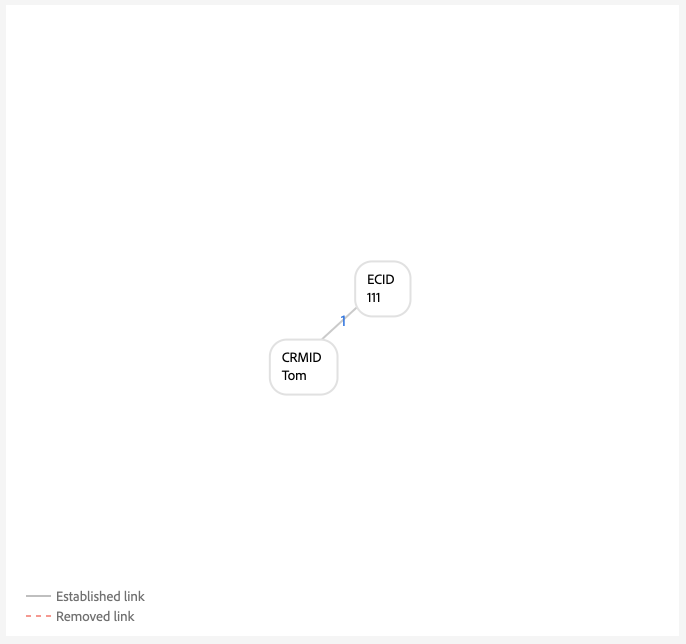

>[!TAB Multi-person graph]

The following is an example of  a multi-person graph. This example displays a "shared device" scenario, where there are two CRMIDs and the one with the older established link gets removed.


**Graph simulation events input**

```shell
CRMID: Tom, ECID: 111
CRMID: Summer, ECID: 111
```

>[!ENDTABS]

## CRMID with hashed email

In this scenario, a CRMID is ingested and represents both online (experience event) and offline (profile record) data. This scenario also involves the ingestion of a hashed email, which represents another namespace sent in the CRM record dataset along with the CRMID.

>[!IMPORTANT]
>
>**It is crucial that the CRMID is always sent for every user**. Failure to do so may result in a "dangling" login ID scenario, where a single person entity is assumed to be sharing a device with another person.

**Implementation:**

| Namespaces used | Web behavior collection method |
| --- | --- |
| CRMID, Email_LC_SHA256, ECID | Web SDK |

**Events:**

You can create this scenario in graph simulation by copying the following events to text mode:

```shell
CRMID: Tom, Email_LC_SHA256: tom<span>@acme.com
CRMID: Tom, ECID: 111
CRMID: Summer, Email_LC_SHA256: summer<span>@acme.com
CRMID: Summer, ECID: 222
```

**Algorithm configuration:**

You can create this scenario in graph simulation by configuring the following setup for your algorithm configuration:

| Priority | Display name | Identity type | Unique per graph |
| ---| --- | --- | --- |
| 1 | CRMID | CROSS_DEVICE | Yes |
| 2 | Emails (SHA256, lowercased) | Email | No |
| 3 | ECID | COOKIE | No |

**Primary identity selection for Profile:**

Within the context of this configuration, the primary identity will be defined like this:

| Authentication status | Namespace(s) in events | Primary identity |
| --- | --- | --- |
| Authenticated | CRMID, ECID | CRMID |
| Unauthenticated | ECID | ECID | 

**Graph examples**

>[!BEGINTABS]

>[!TAB Ideal single-person graph]

The following are examples of a pair of ideal single-person graphs, where each CRMID is associated with their respective hashed email namespace and ECID.

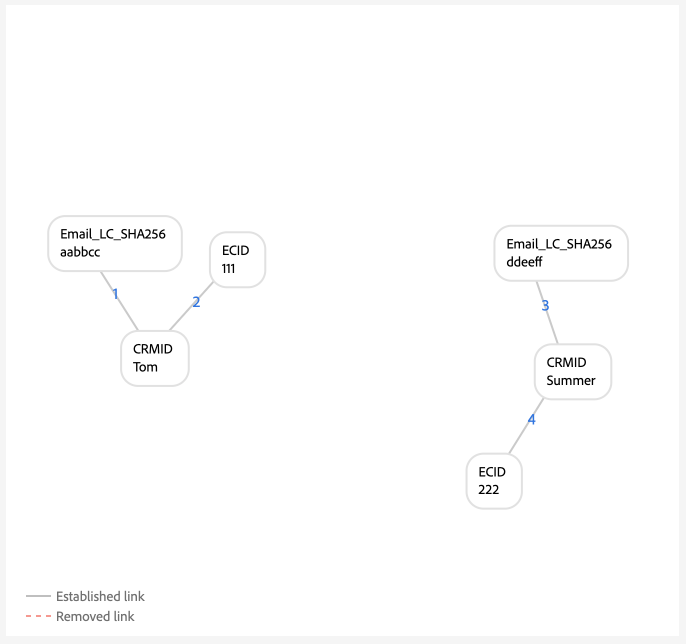

>[!TAB Multi-person graph: shared device]

The following is an example of a multi-person graph scenario where a device is shared by two people.

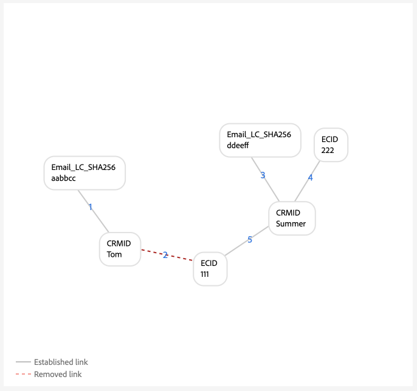

**Graph simulation events input**

```shell
CRMID: Tom, Email_LC_SHA256: aabbcc
CRMID: Tom, ECID: 111
CRMID: Summer, Email_LC_SHA256: ddeeff
CRMID: Summer, ECID: 222
CRMID: Summer, ECID: 111
```

>[!TAB Multi-person graph: non-unique email]

The following is an example of a multi-person graph scenario where email is not unique and is being associated with two different CRMIDs.

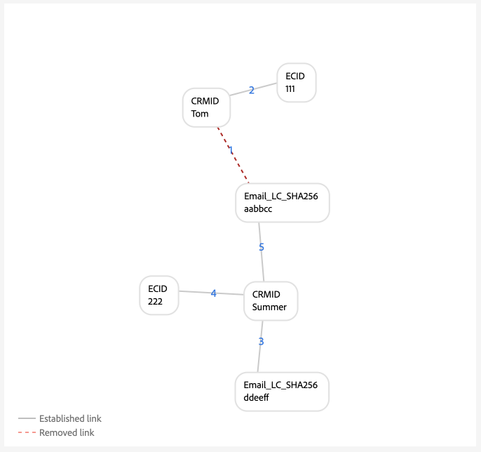

**Graph simulation events input**

```shell
CRMID: Tom, Email_LC_SHA256: aabbcc
CRMID: Tom, ECID: 111
CRMID: Summer, Email_LC_SHA256: ddeeff
CRMID: Summer, ECID: 222
CRMID: Summer, Email_LC_SHA256: aabbcc
```

>[!ENDTABS]

## CRMID with hashed email, hashed phone, GAID, and IDFA

This scenario is similar to the previous one. However, in this scenario, hashed email and phone are being marked as identities to utilize in [[!DNL Segment Match]](../../segmentation/ui/segment-match/overview.md).

>[!IMPORTANT]
>
>**It is crucial that the CRMID is always sent for every user**. Failure to do so may result in a "dangling" login ID scenario, where a single person entity is assumed to be sharing a device with another person.

**Implementation:**

| Namespaces used | Web behavior collection method |
| --- | --- |
| CRMID, Email_LC_SHA256, Phone_SHA256, GAID, IDFA, ECID | Web SDK |

**Events:**

You can create this scenario in graph simulation by copying the following events to text mode:

```shell
CRMID: Tom, Email_LC_SHA256: aabbcc, Phone_SHA256: 123-4567
CRMID: Tom, ECID: 111
CRMID: Tom, ECID: 222, IDFA: A-A-A
CRMID: Summer, Email_LC_SHA256: ddeeff, Phone_SHA256: 765-4321
CRMID: Summer, ECID: 333
CRMID: Summer, ECID: 444, GAID:B-B-B
```

**Algorithm configuration:**

You can create this scenario in graph simulation by configuring the following setup for your algorithm configuration:

| Priority | Display name | Identity type | Unique per graph |
| ---| --- | --- | --- |
| 1 | CRMID | CROSS_DEVICE | Yes |
| 2 | Emails (SHA256, lowercased) | Email | No |
| 3 | Phone (SHA256) | Phone | No |
| 4 | Google Ad ID (GAID) | DEVICE | No |
| 5 | Apple IDFA (ID for Apple) | DEVICE | No |
| 6 | ECID | COOKIE | No |

**Primary identity selection for Profile:**

Within the context of this configuration, the primary identity will be defined like this:

| Authentication status | Namespace(s) in events| Primary identity |
| --- | --- | --- |
| Authenticated | CRMID, IDFA, ECID | CRMID |
| Authenticated | CRMID, GAID, ECID | CRMID |
| Authenticated | CRMID, ECID | CRMID |
| Unauthenticated | GAID, ECID | GAID |
| Unauthenticated | IDFA, ECID | IDFA |
| Unauthenticated | ECID | ECID |

**Graph examples**

>[!BEGINTABS]

>[!TAB Ideal single-person graph]

The following is an ideal single-person graph scenario where hashed email and hashed phone are marked as identities for use in [!DNL Segment Match]. In this scenario, the graphs are split into two, to represent to disparate person entities.

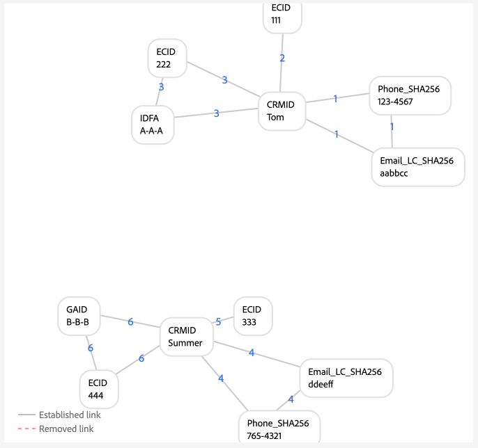

>[!TAB Multi-person graph: shared device, shared computer]

The following is a multi-person graph scenario where a device (computer) is shared by two people. In this scenario, the shared computer is represented by `{ECID: 111}` and is linked to `{CRMID: Summer}` because that link is the most recently established link. `{CRMID: Tom}` is removed because the link between `{CRMID: Tom}` and `{ECID: 111}` is older and because CRMID is the designated unique namespace in this configuration.

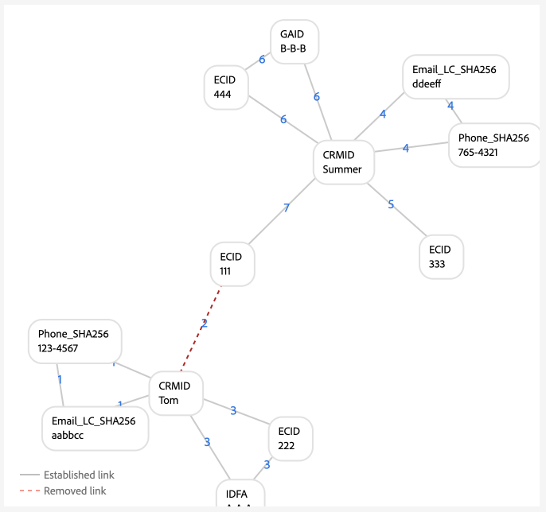

**Graph simulation events input**

```shell
CRMID: Tom, Email_LC_SHA256: aabbcc, Phone_SHA256: 123-4567
CRMID: Tom, ECID: 111
CRMID: Tom, ECID: 222, IDFA: A-A-A
CRMID: Summer, Email_LC_SHA256: ddeeff, Phone_SHA256: 765-4321
CRMID: Summer, ECID: 333
CRMID: Summer, ECID: 444, GAID:B-B-B
CRMID: Summer, ECID: 111
```

>[!TAB Multi-person graph: shared device, android mobile device]

The following is a multi-person graph scenario where an android device is shared by two people. In this scenario, CRMID is configured as a unique namespace, and therefore, the newer link of `{CRMID: Tom, GAID: B-B-B, ECID:444}` supersedes the older `{CRMID: Summer, GAID: B-B-B, ECID:444}`.

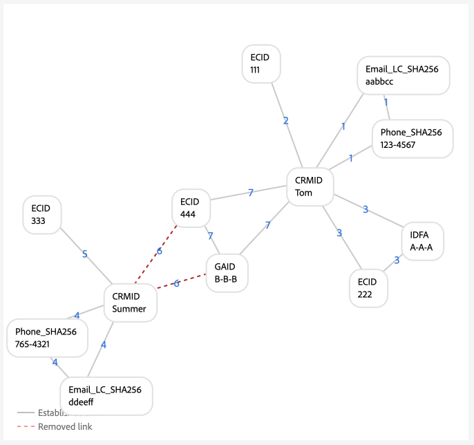

**Graph simulation events input**

```shell
CRMID: Tom, Email_LC_SHA256: aabbcc, Phone_SHA256: 123-4567
CRMID: Tom, ECID: 111
CRMID: Tom, ECID: 222, IDFA: A-A-A
CRMID: Summer, Email_LC_SHA256: ddeeff, Phone_SHA256: 765-4321
CRMID: Summer, ECID: 333
CRMID: Summer, ECID: 444, GAID: B-B-B
CRMID: Tom, ECID: 444, GAID: B-B-B
```

>[!TAB Multi-person graph: shared device, apple mobile device, no ECID reset]

The following is a multi-person graph scenario where an Apple device is shared by two people. In this scenario the IDFA is shared, but the ECID does not reset.

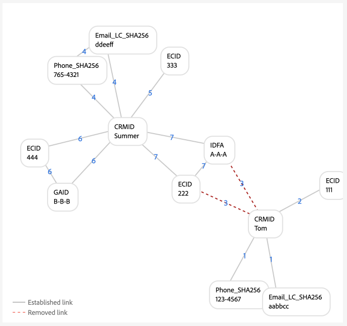

**Graph simulation events input**

```shell
CRMID: Tom, Email_LC_SHA256: aabbcc, Phone_SHA256: 123-4567
CRMID: Tom, ECID: 111
CRMID: Tom, ECID: 222, IDFA: A-A-A
CRMID: Summer, Email_LC_SHA256: ddeeff, Phone_SHA256: 765-4321
CRMID: Summer, ECID: 333
CRMID: Summer, ECID: 444, GAID: B-B-B
CRMID: Summer, ECID: 222, IDFA: A-A-A
```

>[!TAB Multi-person graph: shared device, apple, ECID resets]

The following is a multi-person graph scenario where an Apple device is shared by two people. In this scenario, the ECID resets, but the IDFA remains the same.

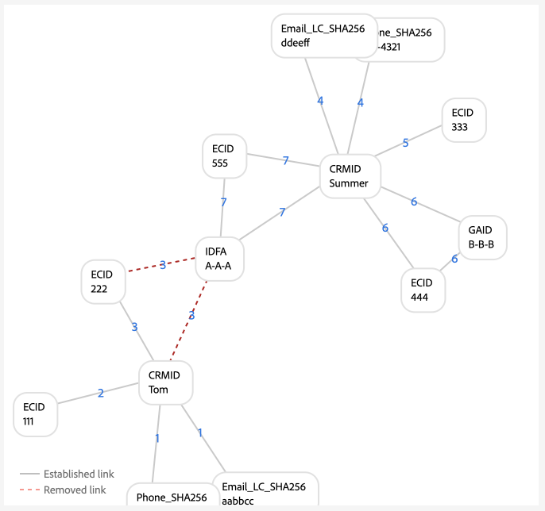

**Graph simulation events input**

```shell
CRMID: Tom, Email_LC_SHA256: aabbcc, Phone_SHA256: 123-4567
CRMID: Tom, ECID: 111
CRMID: Tom, ECID: 222, IDFA: A-A-A
CRMID: Summer, Email_LC_SHA256: ddeeff, Phone_SHA256: 765-4321
CRMID: Summer, ECID: 333
CRMID: Summer, ECID: 444, GAID: B-B-B
CRMID: Summer, ECID: 555, IDFA: A-A-A
```

>[!TAB Multi-person graph: Non-unique phone]

The following is a multi-person graph scenario where the same phone number is being shared by two people.

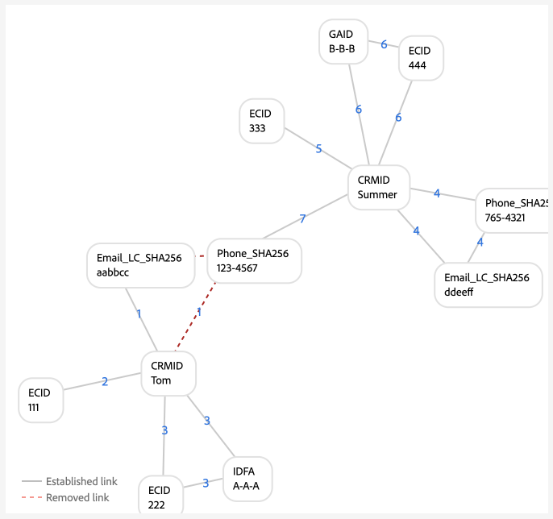

**Graph simulation events input**

```shell
CRMID: Tom, Email_LC_SHA256: aabbcc, Phone_SHA256: 123-4567
CRMID: Tom, ECID: 111
CRMID: Tom, ECID: 222, IDFA: A-A-A
CRMID: Summer, Email_LC_SHA256: ddeeff, Phone_SHA256: 765-4321
CRMID: Summer, ECID: 333
CRMID: Summer, ECID: 444, GAID: B-B-B
CRMID: Summer, Phone_SHA256: 123-4567
```

In this example, `{Phone_SHA256}` is also marked as a unique namespace. Therefore, a graph cannot have more than one identity with the `{Phone_SHA256}` namespace. In this scenario, `{Phone_SHA256: 765-4321}` is unlinked from `{CRMID: Summer}` and `{Email_LC_SHA256: ddeeff}` because it is the older link,

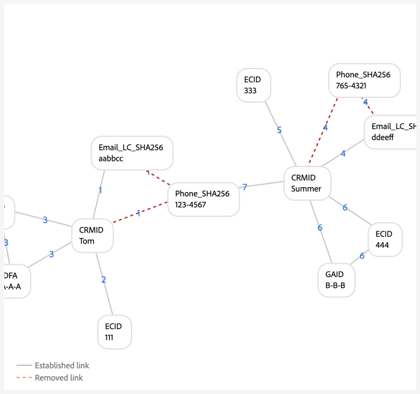

>[!TAB Multi-person graph: Non-unique email]

The following is a multi-person graph scenario where email is shared by two people.

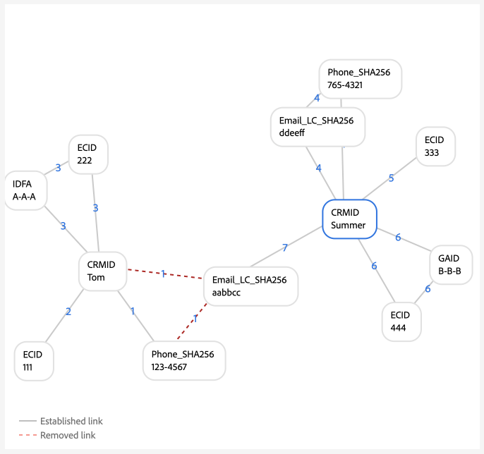

**Graph simulation events input**

```shell
CRMID: Tom, Email_LC_SHA256: aabbcc, Phone_SHA256: 123-4567
CRMID: Tom, ECID: 111
CRMID: Tom, ECID: 222, IDFA: A-A-A
CRMID: Summer, Email_LC_SHA256: ddeeff, Phone_SHA256: 765-4321
CRMID: Summer, ECID: 333
CRMID: Summer, ECID: 444, GAID: B-B-B
CRMID: Summer, Email_LC_SHA256: aabbcc
```

>[!ENDTABS]

## Single CRMID with multiple login IDs (simple version)

In this scenario, there is a single CRMID that represents a person entity. However, a person entity may have multiple login identifiers:

* A given person entity can have different account account types (personal vs. business, account by state, account by brand, etc.)
* A given person entity may use different email addresses for any number of accounts.

>[!IMPORTANT]
>
>**It is crucial that the CRMID is always sent for every user**. Failure to do so may result in a "dangling" login ID scenario, where a single person entity is assumed to be sharing a device with another person.

**Implementation:**

| Namespaces used | Web behavior collection method |
| --- | --- |
| CRMID, loginID, ECID | Web SDK |

**Events:**

You can create this scenario in graph simulation by copying the following events to text mode:

```shell
CRMID: Tom, loginID: ID_A
CRMID: Tom, loginID: ID_B
loginID: ID_A, ECID: 111
CRMID: Summer, loginID: ID_C
CRMID: Summer, loginID: ID_D
loginID: ID_C, ECID: 222
```

**Algorithm configuration:**

You can create this scenario in graph simulation by configuring the following setup for your algorithm configuration:

| Priority | Display name | Identity type | Unique per graph |
| ---| --- | --- | --- |
| 1 | CRMID | CROSS_DEVICE | Yes |
| 2 | loginID | CROSS_DEVICE | No |
| 3 | ECID | COOKIE | No |

**Primary identity selection for Profile:**

Within the context of this configuration, the primary identity will be defined like this:

| Authentication status | Namespace(s) in events| Primary identity |
| --- | --- | --- |
| Authenticated | loginID, ECID | loginID |
| Authenticated | loginID, ECID | loginID |
| Authenticated | CRMID, loginID, ECID | CRMID |
| Authenticated | CRMID, ECID | CRMID |
| Unauthenticated | ECID | ECID |

**Graph examples**

>[!BEGINTABS]

>[!TAB Ideal single-person scenario]

The following is a single-person graph scenario with a single CRMID and multiple loginIDs.

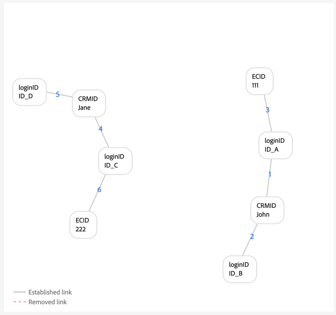

>[!TAB Multi-person graph scenario: shared device]

The following is a multi-person graph scenario where a device is shared by two people. In this scenario, `{ECID:111}` is linked with both `{loginID:ID_A}` and `{loginID:ID_C}` and the older established link of `{ECID:111, loginID:ID_A}` gets removed.

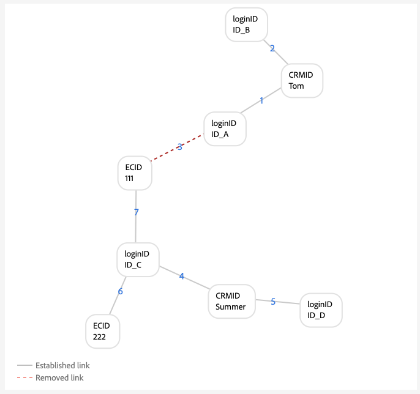

**Graph simulation events input**

```shell
CRMID: Tom, loginID: ID_A
CRMID: Tom, loginID: ID_B
loginID: ID_A, ECID: 111
CRMID: Summer, loginID: ID_C
CRMID: Summer, loginID: ID_D
loginID: ID_C, ECID: 222
loginID: ID_C, ECID: 111
```

>[!TAB Multi-person graph scenario: bad data]

The following is a multi-person graph scenario that involves bad data. In this scenario, `{loginID:ID_D}` is wrongly linked to two disparate users and the link with the older timestamp is deleted, in favor of the more recently established link.

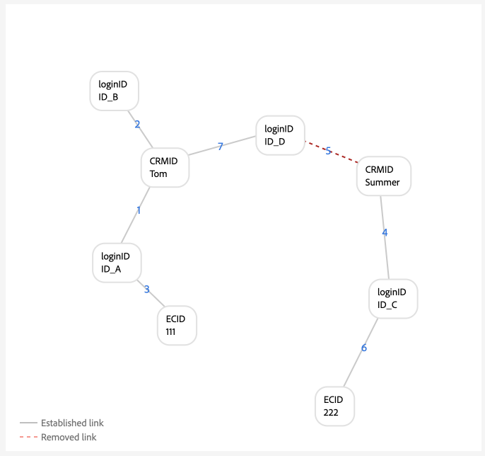

**Graph simulation events input**

```shell
CRMID: Tom, loginID: ID_A
CRMID: Tom, loginID: ID_B
loginID: ID_A, ECID: 111
CRMID: Summer, loginID: ID_C
CRMID: Summer, loginID: ID_D
loginID: ID_C, ECID: 222
CRMID: Tom, loginID: ID_D
```

>[!TAB 'Dangling' loginID]

The following graph simulates a "dangling" loginID scenario. In this example, two different loginIDs are bound to the same ECID. However, `{loginID:ID_C}` is not linked to the CRMID. Therefore, there is no way for Identity Service to detect that these two loginIDs represent two different entities. 


**Graph simulation events input**

```shell
CRMID: Tom, loginID: ID_A
CRMID: Tom, loginID: ID_B
loginID: ID_A, ECID: 111
loginID: ID_C, ECID: 111
```

>[!ENDTABS]

## Single CRMID with multiple login IDs (complex version)

In this scenario, there is a single CRMID that represents a person entity. However, a person entity may have multiple login identifiers:

* A given person entity can have different account account types (personal vs. business, account by state, account by brand, etc.)
* A given person entity may use different email addresses for any number of accounts.

>[!IMPORTANT]
>
>**It is crucial that the CRMID is always sent for every user**. Failure to do so may result in a "dangling" login ID scenario, where a single person entity is assumed to be sharing a device with another person.

**Implementation:**

| Namespaces used | Web behavior collection method |
| --- | --- |
| CRMID, Email_LC_SHA256, Phone_SHA256, loginID, ECID | Adobe Analytics source connector. <br> **Note:** By default, AAIDs are blocked in Identity Service, therefore, you must place a higher priority on your ECIDs than AAIDs, when using the Analytics source. Read the [implementation guide](./implementation-guide.md#ingest-your-data) for more information.</br> |

**Events:**

You can create this scenario in graph simulation by copying the following events to text mode:

```shell
CRMID: Tom, Email_LC_SHA256: aabbcc, Phone_SHA256: 123-4567
CRMID: Tom, loginID: ID_A
CRMID: Tom, loginID: ID_B
loginID: ID_A, ECID: 111
CRMID: Summer, Email_LC_SHA256: ddeeff, Phone_SHA256: 765-4321
CRMID: Summer, loginID: ID_C
CRMID: Summer, loginID: ID_D
loginID: ID_C, ECID: 222
```

**Algorithm configuration:**

You can create this scenario in graph simulation by configuring the following setup for your algorithm configuration:

| Priority | Display name | Identity type | Unique per graph |
| ---| --- | --- | --- | 
| 1 | CRMID | CROSS_DEVICE | Yes |
| 2 | Email_LC_SHA256 | Email | No |
| 3 | Phone_SHA256 | Phone | No |
| 4 | loginID | CROSS_DEVICE | No |
| 5 | ECID | COOKIE | No |
| 6 | AAID | COOKIE | No |

**Primary identity selection for Profile:**

Within the context of this configuration, the primary identity will be defined like this:

| Authentication status | Namespace(s) in events| Primary identity |
| --- | --- | --- |
| Authenticated | loginID, ECID | loginID |
| Authenticated | loginID, ECID | loginID |
| Authenticated | CRMID, loginID, ECID | CRMID |
| Authenticated | CRMID, ECID | CRMID |
| Unauthenticated | ECID | ECID |

**Graph examples**

>[!BEGINTABS]

>[!TAB Ideal single-person graph]

The following is an example of two single-person graphs that each have one CRMID and multiple loginIDs.

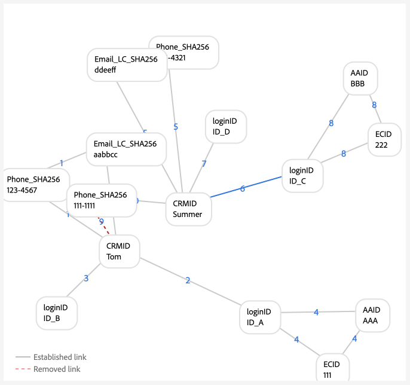

>[!TAB Multi-person graph: shared device 1]

The following is a multi-person shared device scenario where `{ECID:111}` is linked to both `{loginID:ID_A}` and `{loginID:ID_C}`. In this case, the older established links get removed in favor of the more recently established links.

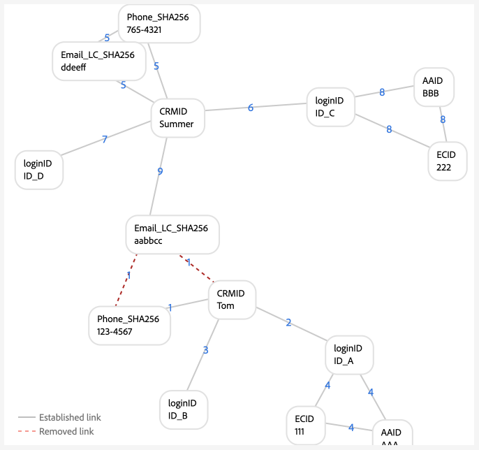

**Graph simulation events input**

```shell
CRMID: Tom, Email_LC_SHA256: aabbcc, Phone_SHA256: 123-4567
CRMID: Tom, loginID: ID_A
CRMID: Tom, loginID: ID_B
loginID: ID_A, ECID: 111
CRMID: Summer, Email_LC_SHA256: ddeeff, Phone_SHA256: 765-4321
CRMID: Summer, loginID: ID_C
CRMID: Summer, loginID: ID_D
loginID: ID_C, ECID: 222
loginID: ID_C, ECID: 111
```

>[!TAB Multi-person graph: shared device 2]

In this scenario, instead of sending only the loginID, both loginID and CRMID are sent as experience events.

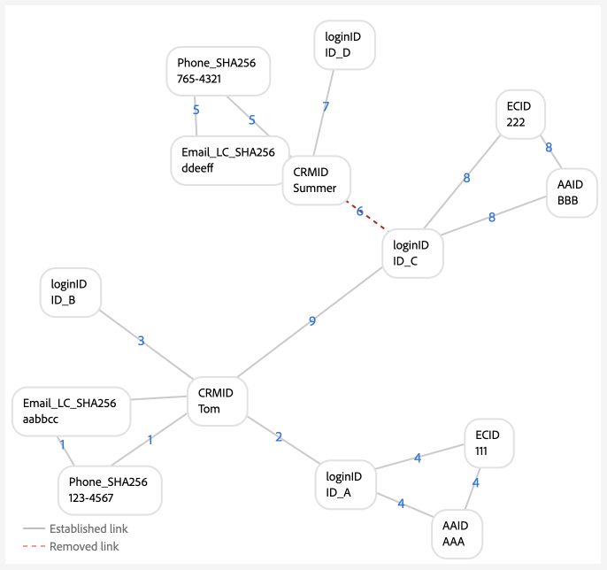

**Graph simulation events input**

```shell
CRMID: Tom, Email_LC_SHA256: aabbcc, Phone_SHA256: 123-4567
CRMID: Tom, loginID: ID_A
CRMID: Tom, loginID: ID_B
loginID: ID_A, ECID: 111
CRMID: Summer, Email_LC_SHA256: ddeeff, Phone_SHA256: 765-4321
CRMID: Summer, loginID: ID_C
CRMID: Summer, loginID: ID_D
loginID: ID_C, ECID: 222
CRMID: Summer, loginID: ID_C, ECID: 111
loginID: ID_A, ECID: 111
```

>[!TAB Multi-person graph: bad loginID data]

In this scenario, `{loginID:ID_C}` is linked to both `{CRMID:Tom}` and `{CRMID:Summer}`, and is therefore deemed to be bad data because ideal graph scenarios should not linked the same loginIDs to two disparate users. In this case, the older established links are removed in favor of the more recently established links.

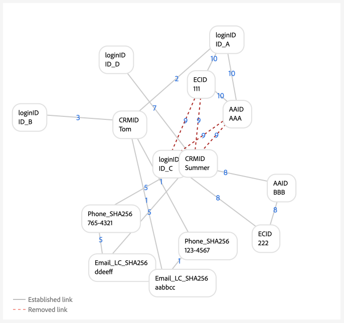

**Graph simulation events input**

```shell
CRMID: Tom, Email_LC_SHA256: aabbcc, Phone_SHA256: 123-4567
CRMID: Tom, loginID: ID_A
CRMID: Tom, loginID: ID_B
loginID: ID_A, ECID: 111
CRMID: Summer, Email_LC_SHA256: ddeeff, Phone_SHA256: 765-4321
CRMID: Summer, loginID: ID_C
CRMID: Summer, loginID: ID_D
loginID: ID_C, ECID: 222
CRMID: Tom, loginID: ID_C
```

>[!TAB Multi-person graph: non-unique email]

In this scenario, a non-unique email is being linked with two different CRMIDs, therefore, the older established links are removed in favor of the more recently established links.

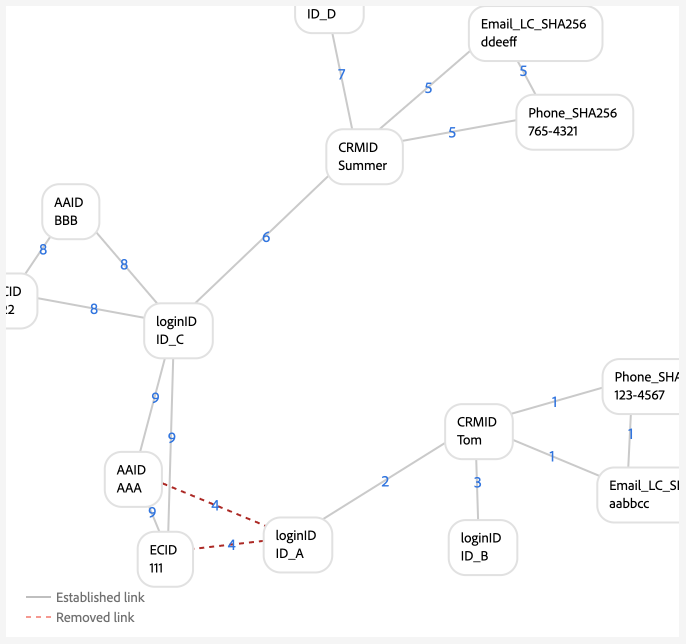

**Graph simulation events input**

```shell
CRMID: Tom, Email_LC_SHA256: aabbcc, Phone_SHA256: 123-4567
CRMID: Tom, loginID: ID_A
CRMID: Tom, loginID: ID_B
loginID: ID_A, ECID: 111
CRMID: Summer, Email_LC_SHA256: ddeeff, Phone_SHA256: 765-4321
CRMID: Summer, loginID: ID_C
CRMID: Summer, loginID: ID_D
loginID: ID_C, ECID: 222
CRMID: Summer, Email_LC_SHA256: aabbcc
```

>[!TAB Multi-person graph: non-unique phone]

In this scenario, a non-unique phone number is being linked with two different CRMIDs, the older established links are removed in favor of the more recently established links.

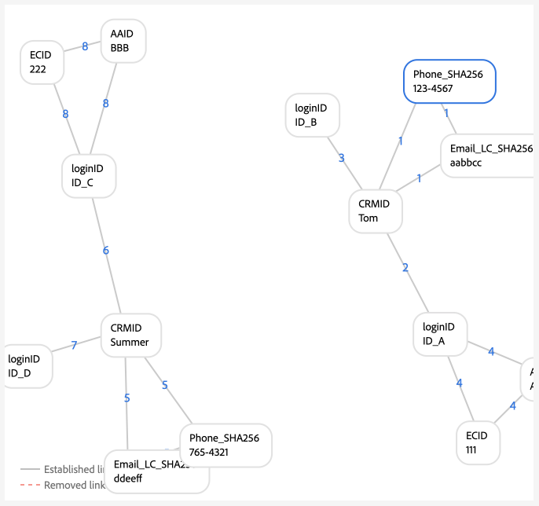

**Graph simulation events input**

```shell
CRMID: Tom, Email_LC_SHA256: aabbcc, Phone_SHA256: 123-4567
CRMID: Tom, loginID: ID_A
CRMID: Tom, loginID: ID_B
loginID: ID_A, ECID: 111
CRMID: Summer, Email_LC_SHA256: ddeeff, Phone_SHA256: 765-4321
CRMID: Summer, loginID: ID_C
CRMID: Summer, loginID: ID_D
loginID: ID_C, ECID: 222
CRMID: Tom, Phone_SHA256: 111-1111
CRMID: Summer, Phone_SHA256: 111-1111
```

>[!ENDTABS]

## Usage in other Adobe Commerce

The graph configuration examples in this section outline use cases for Adobe Commerce. The examples below are focused on retail customers with two user types:

* Registered user (users that created an account)
* Guest users (users that only have an email address)

>[!IMPORTANT]
>
>**It is crucial that the CRMID is always sent for every user**. Failure to do so may result in a "dangling" login ID scenario, where a single person entity is assumed to be sharing a device with another person.

**Implementation:**

| Namespaces used | Web behavior collection method |
| --- | --- |
| CRMID, Email, ECID | Web SDK |

**Events:**

You can create this scenario in graph simulation by copying the following events to text mode:

```shell
CRMID: Tom, Email: tom@acme.com
CRMID: Tom, ECID: 111
```

**Algorithm configuration:**

You can create this scenario in graph simulation by configuring the following setup for your algorithm configuration:

| Priority | Display name | Identity type | Unique per graph |
| ---| --- | --- | --- | 
| 1 | CRMID | CROSS_DEVICE | Yes |
| 2 | Email| Email |Yes |
| 5 | ECID | COOKIE | No |

**Primary identity selection for Profile:**

Within the context of this configuration, the primary identity will be defined like this:

| User activity | Namespace(s) in events| Primary identity |
| --- | --- | --- |
| Authenticated browsing | CRMID, ECID | CRMID |
| Guest checkout | Email, ECID | Email |
| Unauthenticated browsing | ECID | ECID |

>[!WARNING]
>
>Registered users must both CRMID and email in their profiles, in order for the following graph scenarios to work.

**Graph examples**

>[!BEGINTABS]

>[!TAB Ideal single-person graph]

The following is an example of an ideal single-person graph.

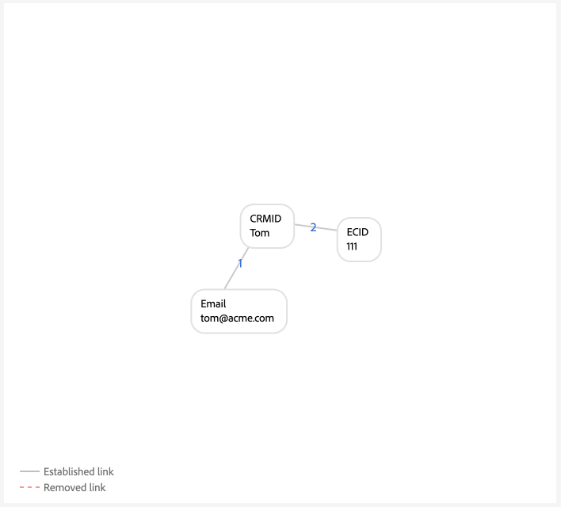

>[!TAB Multi-person graphs]

The following is an example of a multi-person graph where two registered users are browsing using the same device.

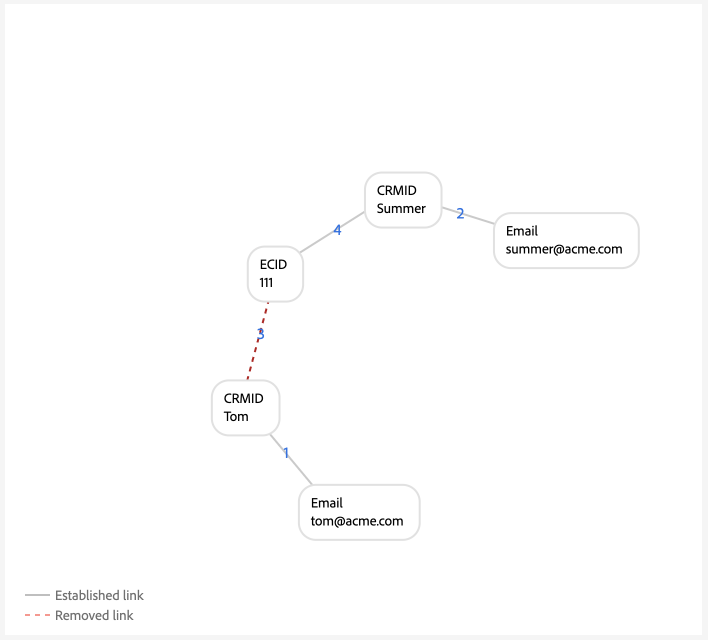

**Graph simulation events input**

```shell
CRMID: Tom, Email: tom@acme.com
CRMID: Summer, Email: summer@acme.com
CRMID: Tom, ECID: 111
CRMID: Summer, ECID: 111
```

In this scenario, a registered user and a guest user share the same device.

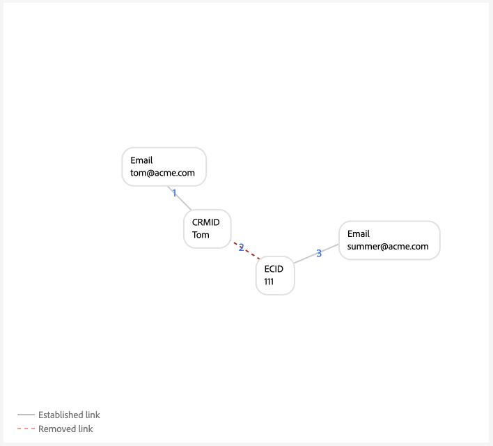

**Graph simulation events input**

```shell
CRMID: Tom, Email: tom@acme.com
CRMID: Tom, ECID: 111
Email: summer@acme.com, ECID: 111
```

In this scenario, a registered user and a guest user share a device. However, an implementation error occurs as the CRMID does not contain a corresponding email namespace. In this scenario, Tom is the registered user, and Summer is the guest user. Unlike the previous scenario, the two entities are merged since there is no common email namespaces across the two person entities.

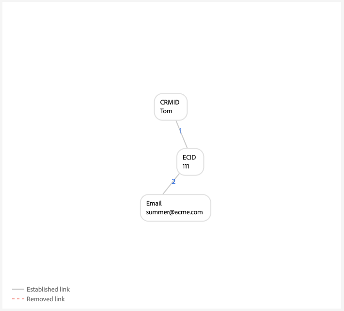

**Graph simulation events input**

```shell
CRMID: Tom, ECID: 111
Email: summer@acme.com, ECID: 111
```

In this scenario, two guest users share the same device.

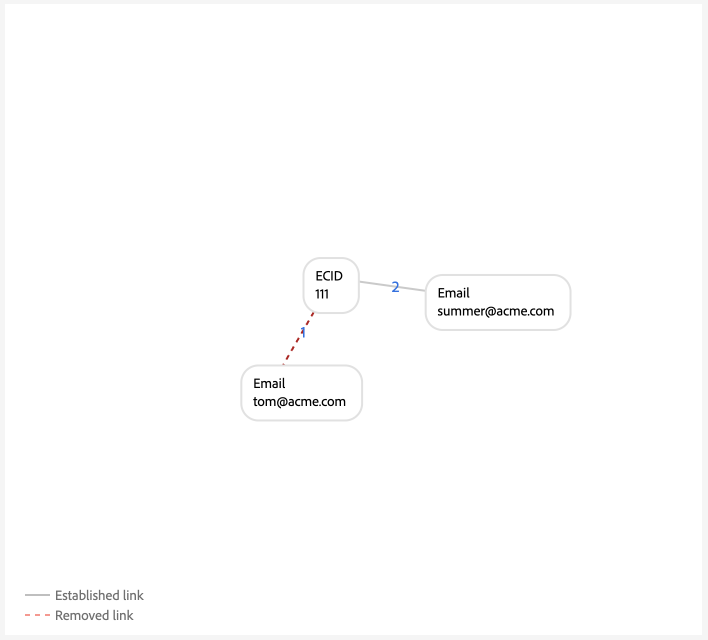

**Graph simulation events input**

```shell
Email: tom@acme.com, ECID: 111
Email: summer@acme.com, ECID: 111
```

In this scenario, a guest user checks out an item and then registers using the same device.

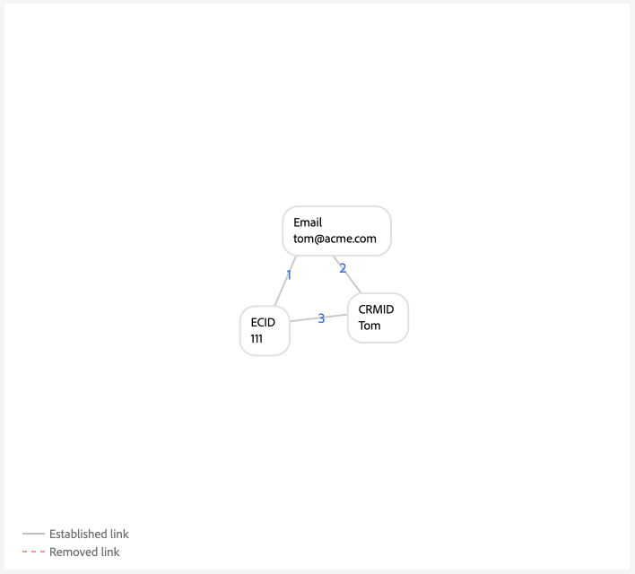

**Graph simulation events input**

```shell
Email: tom@acme.com, ECID: 111
Email: tom@acme.com, CRMID: Tom
CRMID: Tom, ECID: 111
```

>[!ENDTABS]

## Next steps

For more information on [!DNL Identity Graph Linking Rules], read the following documentation:

* [[!DNL Identity Graph Linking Rules] overview](./overview.md)
* [Identity Optimization Algorithm](./identity-optimization-algorithm.md)
* [Implementation guide](./implementation-guide.md)
* [Troubleshooting and FAQ](./troubleshooting.md)
* [Namespace priority](./namespace-priority.md)
* [Graph simulation UI](./graph-simulation.md)
* [Identity settings UI](./identity-settings-ui.md)