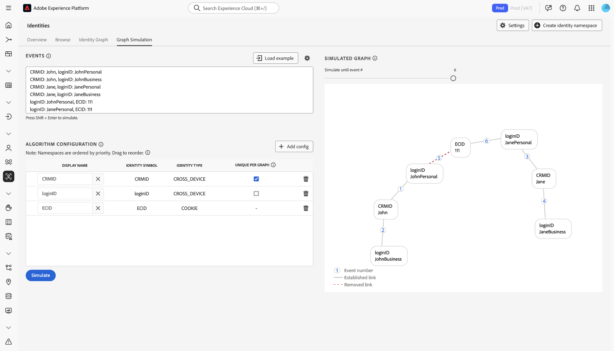

# [!DNL Identity Graph Linking Rules] configurations guide {#configurations-guide}

>[!CONTEXTUALHELP]
>id="platform_identities_algorithmconfiguration"
>title="Algorithm Configuration"
>abstract="Configure unique namespace and namespace priority tailored to your ingested identities."

>[!NOTE]
>
>* "CRMID" and "loginID" are custom namespaces. In this document, "CRMID" is a person identifier and "loginID" is a login identifier associated with a given person.
>* To simulate the example graph scenarios outlined in this document, you must first create two custom namespaces, one with the identity symbol "CRMID" and another with the identity symbol "loginID". Identity symbols are case sensitive.

Read this document to learn about different implementation types that you can configure using [!DNL Identity Graph Linking Rules].

Customer graph scenarios can be grouped into three different categories.

* **Basic**: [Basic implementations](#basic-implementations) include graphs that most often include simple implementations. These implementations tend to revolve around a single cross-device namespace (for example, CRMID). While basic implementations are fairly straightforward, graph collapse can still occur, often due to **shared device** scenarios.
* **Intermediate**: [Intermediate implementations](#intermediate-implementations) include several variables such as **multiple cross-device namespaces**, **non-unique identities**, and **multiple unique namespaces**.
* **Advanced**: [Advanced implementations](#advanced-implementations) involve complex and multi-layered graph scenarios. For advanced implementations, it is essential to establish the correct namespace priority order to ensure that the appropriate links are removed, thereby preventing graph collapse.
 
## Get started

Before diving in to the following document, ensure that you familiarize yourself with several important concepts of Identity Service and [!DNL Identity Graph Linking Rules].

* [Identity Service overview](../home.md)
* [[!DNL Identity Graph Linking Rules] overview](../identity-graph-linking-rules/namespace-priority.md)
* [Namespace priority](namespace-priority.md)
* [Unique namespace](overview.md#unique-namespace)
* [Graph Simulation](graph-simulation.md)

## Basic implementations {#basic-implementations}

>[!TIP]
>
>You must create a custom cross device namespace for "CRMID" to complete the basic implementation exercises below.

Read this section for basic implementations of [!DNL Identity Graph Linking Rules].

### Use case: simple implementation that uses one cross-device namespace

Generally, Adobe customers have a single cross-device namespace that is used across all of their properties including, web, mobile, and applications. This system is both industry and geographically agnostic as customers in retail, telecom, and financial services use this type of implementation.

Typically, an end-user is represented by a cross-device namespace (often a CRMID), therefore, the CRMID should be classified as a unique namespace. An end-user who owns a computer and an [!DNL iPhone] and does not share their device, could have an identity graph like the following.

Imagine that you are a data architect at an e-commerce company called **ACME**. John and Jane are your customers. They are end-users who live together in San Jose, California. They share a desktop computer and use this computer to browse your website. Similarly, John and Jane also share an [!DNL iPad] and occasionally use this [!DNL iPad] to browse the internet, including your website.

**Text mode**

```json
CRMID: John, ECID: 123
CRMID: John, ECID: 999, IDFA: a-b-c
```

**Algorithm configuration (Identity Settings)**

Configure the following settings in the Graph Simulation interface before you simulate your graph.

| Display name | Identity symbol | Identity type | Unique per graph | Namespace priority |
| --- | --- | --- | --- | --- |
| CRMID | CRMID | CROSS_DEVICE |  ✔️  | 1 |
| ECID | ECID | COOKIE | | 2 |
| IDFA | IDFA | DEVICE | | 3 |

**Simulated graph**

In this graph,  John (the end-user) is represented by the CRMID. {ECID: 123} represents the web browser that John used on his personal computer to visit your e-commerce platform. {ECID: 999} represents the browser that he used on his [!DNL iPhone] and {IDFA: a-b-c} represents his [!DNL iPhone].


**Exercise**

Simulate the following configuration in Graph Simulation. You can either create your own events, or copy and paste using text mode.

>[!BEGINTABS]

>[!TAB Shared device (PC)]

**Shared device (PC)**

**Text mode:**

```json
CRMID: John, ECID: 111
CRMID: Jane, ECID: 111
```

**Simulated graph**

In this graph, John and Jane are represented by their own respective CRMIDs:

* {CRMID: John}
* {CRMID: Jane}

The browser on the desktop computer that they both use to visit your e-commerce platform is represented by {ECID: 111}. In this graph scenario, Jane is the last authenticated end-user, and therefore, the link between {ECID: 111} and {CRMID: John} is removed.


>[!TAB Shared device (mobile)]

**Shared device (mobile)**

**Text mode:**

```json
CRMID: John, ECID: 111, IDFA: a-b-c
CRMID: Jane, ECID: 111, IDFA: a-b-c
```

**Simulated graph**

In this graph, John and Jane are both represented by their own respective CRMIDs. The browser that they use is represented by {ECID: 111} and the [!DNL iPad] that they share is represented by {IDFA: a-b-c}. In this graph scenario, Jane is the last authenticated end-user, and therefore, the links from {ECID: 111} and {IDFA: a-b-c} to {CRMID: John} are removed.


>[!ENDTABS]

## Intermediate implementations {#intermediate-implementations}

Read this section for intermediate implementations of [!DNL Identity Graph Linking Rules].

### Use case: Your data includes non-unique identities

>[!TIP]
>
>* A **non-unique identity** is an identity associated with a non-unique namespace.
>
>* You must create custom cross device namespaces for "CRMID" and "CChash" to complete the intermediate implementation exercises below. "CCHash" is a custom namespace that represents a hashed credit card number.

Imagine that you are a data architect working for a commercial bank that issues credit cards. Your marketing team has indicated that they want to include past credit card transaction history to a profile. This identity graph could look like the following.

**Text mode:**

```json
CRMID: John, CChash: 1111-2222 
CRMID: John, CChash: 3333-4444 
CRMID: John, ECID: 123 
CRMID: John, ECID: 999, IDFA: a-b-c
```

**Algorithm configuration (Identity Settings)**

Configure the following settings in the Graph Simulation interface before you simulate your graph.

| Display name | Identity symbol | Identity type | Unique per graph | Namespace priority |
| --- | --- | --- | --- | --- |
| CRMID | CRMID | CROSS_DEVICE |  ✔️  | 1 |
| CChash | CChash | CROSS_DEVICE | | 2 |
| ECID | ECID | COOKIE | | 3 |
| IDFA | IDFA | DEVICE | | 4 |

**Simulated graph**


There are no guarantees that these credit card numbers, or any other non-unique namespaces, will always be associated to one single end-user. Two end-users may register with the same credit card, there may be non-unique placeholder values that erroneously ingested. Simply put, there is no guarantee that non-unique namespaces will not cause graph collapse.

To solve this issue, Identity Service removes the oldest links and retains the most recent links. This ensures that you just have one CRMID in a graph, thereby preventing graph collapse.

**Exercise**

Simulate the following configurations in Graph Simulation. You can either create your own events, or copy and paste using text mode.

>[!BEGINTABS]

>[!TAB Shared device]

**Text mode:**

```json
CRMID: John, CChash: 1111-2222
CRMID: Jane, CChash: 3333-4444
CRMID: John, ECID: 123
CRMID: Jane, ECID:123
```

**Simulated graph**


>[!TAB Two end-users with the same credit card]

Two different end-users sign up for your e-commerce website with the same credit card. Your marketing team wants to prevent graph collapse by ensuring that the credit card is associated with just one single profile.

**Text mode:**

```json
CRMID: John, CChash: 1111-2222
CRMID: Jane, CChash: 1111-2222
CRMID: John, ECID: 123
CRMID: Jane, ECID:456
```

**Simulated graph**


>[!TAB Invalid credit card number]

Due to unclean data, an invalid credit card number is ingested into Experience Platform.

**Text mode:**

```json
CRMID: John, CChash: undefined
CRMID: Jane, CChash: undefined
CRMID: Jack, CChash: undefined
CRMID: Jill, CChash: undefined
```

**Simulated graph**


>[!ENDTABS]

### Use case: Your data includes both hashed and unhashed CRMIDs

>[!TIP]
>
>You must create custom cross device namespaces for "CRMID" and "CRMIDhash" to complete the intermediate implementation exercises below.

You are ingesting both an unhashed (offline) CRMID and a hashed (online) CRMID. The expectation is that there is a direct relationship between both unhashed and hashed CRMIDs. When an end-user browses with an authenticated account, the hashed CRMID is sent along with the device ID (represented on Identity Service as an ECID).

**Algorithm configuration (Identity Settings)**

Configure the following settings in the Graph Simulation interface before you simulate your graph.

| Display name | Identity symbol | Identity type | Unique per graph | Namespace priority |
| --- | --- | --- | --- | --- | 
| CRMID | CRMID | CROSS_DEVICE | ✔️ | 1 |
| CRMIDhash | CRMIDhash | CROSS_DEVICE | ✔️ | 2 |
| ECID | ECID | COOKIE | | 3 |


**Exercise**

Simulate the following configurations in Graph Simulation. You can either create your own events, or copy and paste using text mode.

>[!BEGINTABS]

>[!TAB Shared device]

John and Jane share a device.

**Text mode:**

```json
CRMID: John, CRMIDhash: John
CRMID: Jane, CRMIDhash: Jane
CRMIDhash: John, ECID: 111 
CRMIDhash: Jane, ECID: 111
```


>[!TAB Bad data]

Due to errors in the hashing process, a non-unique hashed CRMID is generated and sent to Identity Service.

**Text mode:**

```json
CRMID: John, CRMIDhash: aaaa
CRMID: Jane, CRMIDhash: aaaa
```


>[!ENDTABS]
<!-- 
### Use case: You are using Real-Time CDP and Adobe Commerce

You have two types of end-users:

* **Members**: An end-user who is assigned a CRMID and has an email account registered to your system.
* **Guests**: An end-user who is not a member. They do not have an assigned CRMID and their email accounts are not registered to your system.

In this scenario, your customers are sending data from Adobe Commerce to Real-Time CDP.

**Exercise**

Simulate the following configurations in the graph simulation tool. You can either create your own events, or copy and paste using text mode.

>[!BEGINTABS]

>[!TAB Shared device between two members]

In this scenario, two members share the same device to browse an e-commerce website.

**Text mode**

```json
CRMID: John, Email: john@g
CRMID: Jane, Email: jane@g
CRMID: John, ECID: 111
CRMID: Jane, ECID: 111
```


>[!TAB Shared device between two guests]

In this scenario, two guests share the same device to browse an e-commerce website.

**Text mode**

```json
Email: john@g, ECID: 111
Email: jane@g, ECID: 111
```


>[!TAB Shared device between a member and a guest]

In this scenario, a member and a guest share the same device to browse an e-commerce website.

**Text mode**

```json
CRMID: John, Email: john@g
CRMID: John, ECID: 111
Email: jane@g, ECID: 111
```


>[!ENDTABS] -->

### Use case: Your data includes three unique namespaces

Your customer defines a single-person entity as follows:

* An end-user with an assigned CRMID.
* An end-user who is associated to a hashed email address, so that profiles can be activated to destinations that support hashed email (for example, [!DNL Facebook]).
* An end-user associated with an email addresss, so that support personnel can look up their profile on Real-Time CDP using said email address.

| Display name | Identity symbol | Identity type | Unique per graph | Namespace priority |
| --- | --- | --- | --- | --- |
| CRMID | CRMID | CROSS_DEVICE |  ✔️  | 1 |
| Email | Email | Email | ✔️ | 2 |
| Email_LC_SHA256| Email_LC_SHA256 | Email | ✔️ | 3 |
| ECID | ECID | COOKIE | | 4 |

Simulate the following configurations in the graph simulation tool. You can either create your own events, or copy and paste using text mode.

>[!BEGINTABS]

>[!TAB Shared device]

In this scenario, John and Jane both log in to an e-commerce website.

**Text mode**

```json
CRMID: John, Email: john@g, Email_LC_SHA256: john_hash 
CRMID: Jane, Email: jane@g, Email_LC_SHA256: jane_hash 
CRMID: John, ECID: 111 
CRMID: Jane, ECID: 111
```


>[!TAB An end-user changes their email]

**Text mode**

```json
CRMID: John, Email: john@g, Email_LC_SHA256: john_hash
CRMID: John, Email: john@y, Email_LC_SHA256: john_y_hash
```


>[!ENDTABS]

## Advanced implementations {#advanced-implementations}

Advanced implementations involve complex and multi-layered graph scenarios. These types of implementations include the usage of **namespace priority** in order to identify the correct links that must be removed in order to prevent graph collapse.

**Namespace priority** is metadata that ranks namespaces by their importance. If a graph contains two identities, each with a different unique namespaces, Identity Service uses namespace priority to decide which links to remove. For more information, read the [documentation on namespace priority](../identity-graph-linking-rules/namespace-priority.md).

Namespace priority plays a critical role in complex graph scenarios. Graphs can have multiple layers - an end-user may be associated with multiple login IDs, and these login IDs could be hashed. Additionally, different ECIDs could be linked to different login IDs. In order to ensure that the right link, in the right layer is removed, your namespace priority configurations must be correct. 

Read this section for advanced implementations of [!DNL Identity Graph Linking Rules].

### Use case: You need support for multiple lines of businesses

>[!TIP]
>
>You must create custom cross device namespaces for "CRMID" and "loginID" to complete the advanced implementation exercises below.

Your end-users have two different accounts, a personal account and a business account. Each account is identified by a different ID. In this scenario, a typical graph would look like the following:

**Text mode***

```json
CRMID: John, loginID: JohnPersonal
CRMID: John, loginID: JohnBusiness
loginID: JohnPersonal, ECID: 111
loginID: JohnPersonal, ECID: 222
loginID: JohnBusiness, ECID: 222
```

**Algorithm configuration (Identity Settings)**

Configure the following settings in the Graph Simulation interface before you simulate your graph.

| Display name | Identity symbol | Identity type | Unique per graph | Namespace priority |
| --- | --- | --- | --- | --- |
| CRMID | CRMID | CROSS_DEVICE |  ✔️  | 1 |
| loginID | loginID | CROSS_DEVICE | | 2 |
| ECID | ECID | COOKIE | | 3 |

**Simulated graph**

+++Select to view simulated graph


+++


**Exercise**

Simulate the following configuration in Graph Simulation. You can either create your own events, or copy and paste using text mode.

>[!BEGINTABS]

>[!TAB Shared device]

**Text mode**

```json
CRMID: John, loginID: JohnPersonal
CRMID: John, loginID: JohnBusiness
CRMID: Jane, loginID: JanePersonal
CRMID: Jane, loginID: JaneBusiness
loginID: JohnPersonal, ECID: 111
loginID: JanePersonal, ECID: 111
```



>[!TAB Bad data is sent to Real-Time CDP]

```json
CRMID: John, loginID: JohnPersonal
CRMID: John, loginID: error
CRMID: Jane, loginID: JanePersonal
CRMID: Jane, loginID: error
loginID: JohnPersonal, ECID: 111
loginID: JanePersonal, ECID: 222
```


>[!ENDTABS]

### Use case: You have complex implementations that require multiple namespaces

>[!TIP]
>
>You must create custom cross device namespaces for "CRMID", "loyaltyID", "thirdPartyID", and "orderID" to complete the advanced implementation exercises below.

You are a media and entertainment company and your end-users have the following:

* A CRMID
* A loyalty ID

Additionally, your end-users can make a purchase on the e-commerce website and this data is tied to their email address. User data is also enriched by a third-party database provider and is sent to Experience Platform in batches.

**Text mode**

```json
CRMID: John, loyaltyID: John, Email: john@g
Email: john@g, orderID: aaa
CRMID: John, thirdPartyID: xyz
CRMID: John, ECID: 111
```

**Algorithm configuration (Identity Settings)**

Configure the following settings in the Graph Simulation interface before you simulate your graph.

| Display name | Identity symbol | Identity type | Unique per graph | Namespace priority |
| --- | --- | --- | --- | --- |
| CRMID | CRMID | CROSS_DEVICE |  ✔️  | 1 | 
| loyaltyID | loyaltyID | CROSS_DEVICE | | 2 |
| Email | Email | Email | | 3 |
| thirdPartyID | thirdPartyID | CROSS_DEVICE | | 4 |
| orderID | orderID | CROSS_DEVICE | | 5 |
| ECID | ECID | COOKIE | | 6 |

**Exercise**

Simulate the following configuration in Graph Simulation. You can either create your own events, or copy and paste using text mode.

>[!BEGINTABS]

>[!TAB Shared device]

**Text mode**

```json
CRMID: John, loyaltyID: John, Email: john@g
CRMID: Jane, loyaltyID: Jane, Email: jane@g
Email: john@g, orderID: aaa 
CRMID: John, thirdPartyID: xyz 
CRMID: John, ECID: 111
CRMID: Jane, ECID: 111
```


>[!TAB End-user changes their email address]

**Text mode**

```json
CRMID: John, loyaltyID: John, Email: john@g
CRMID: John, loyaltyID: John, Email: john@y
```


>[!TAB The thirdPartyID association changes]

**Text mode**

```json
CRMID: John, loyaltyID: John, Email: john@g
CRMID: Jane, loyaltyID: Jane, Email: jane@g
CRMID: John, thirdPartyID: xyz
CRMID: Jane, thirdPartyID: xyz
```


>[!TAB Non-unique orderID]

**Text mode**

```json
CRMID: John, loyaltyID: John, Email: john@g
CRMID: Jane, loyaltyID: Jane, Email: jane@g
Email: john@g, orderID: aaa
Email: jane@g, orderID: aaa
```


>[!TAB Erroneous loyaltyID]

**Text mode**

```json
CRMID: John, loyaltyID: aaa, Email: john@g
CRMID: Jane, loyaltyID: aaa, Email: jane@g
```


>[!ENDTABS]

## Next steps

For more information on [!DNL Identity Graph Linking Rules], read the following documentation:

* [[!DNL Identity Graph Linking Rules] overview](./overview.md)
* [Identity Optimization Algorithm](./identity-optimization-algorithm.md)
* [Implementation guide](./implementation-guide.md)
* [Troubleshooting and FAQ](./troubleshooting.md)
* [Namespace priority](./namespace-priority.md)
* [Graph simulation UI](./graph-simulation.md)
* [Identity settings UI](./identity-settings-ui.md)