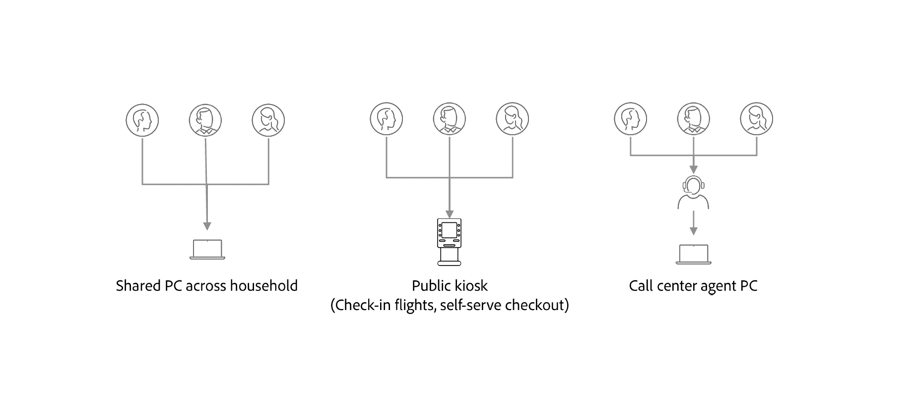
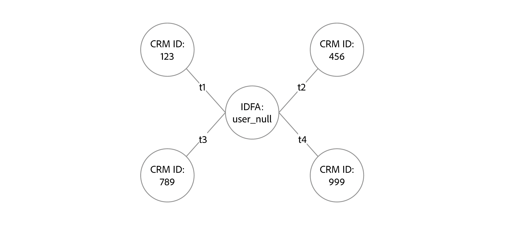

# Example scenarios for configuring identity graph linking rules

>[!IMPORTANT]
>
>Identity graph linking rules are currently in Alpha. The feature and documentation are subject to change.

This document outlines example scenarios that you may consider when configuring identity graph linking rules.

## Shared device

There are instances where multiple logins can occur on a single device:

| Shared device | Description |
| --- | --- |
| Family computers and tablets | Husband and wife both login to their respective bank accounts. |
| Public kiosk | Travelers at an airport logging on using their loyalty ID to check in bags and print boarding passes. |
| Call center | Call center personnel log in on a single device on behalf of customers calling customer support to resolve issues. |

In these cases, from a graph standpoint, with no limits enabled, a single ECID will be linked to multiple CRM IDs. 

With identity graph linking rules, you can:

* Configure the ID used for login as unique identifier. For example, you can limit a graph to store just one identity with a CRM ID namespace, and thus define that CRM ID as the unique identifier of a shared device.
  * By doing this, you can ensure that CRM IDs do not get merged by the ECID.

## Invalid email/phone scenarios

There are also instances of users who provide fake values as phone numbers and/or email addresses when registering. In these cases, if limits are not enabled, then phone/email related identities will end up being linked to multiple different CRM IDs.

With identity graph linking rules, you can:

* Configure either the CRM ID, phone number, or email address as the unique identifier and thus limit one person to just one CRM ID, phone number, and/or email address associated with their account.

## Erroneous or bad identity values

There are cases where non-unique, erroneous identity values are ingested in the system, irrespective of namespace. Examples include:

* IDFA namespace with the identity value of "user_null".
  * IDFA identity values should have 36 characters: 32 alphanumeric characters and four hyphens.
* Phone number namespace with the identity value of "not-specified".
  * Phone numbers should not have any alphabet characters.

These identities could result in the following graphs, where multiple CRM IDs are merged together with the 'bad' identity:

With identity graph linking rules you can configure the CRM ID as the unique identifier to prevent unwanted profile collapsing due to this type of data.

## Next steps

For more information on identity graph linking rules, read the following documentation:

* [Identity graph linking rules overview](./overview.md)
* [Identity optimization algorithm](./identity-optimization-algorithm.md)
* [Identity Service and Real-Time Customer Profile](identity-and-profile.md)
* [Identity linking logic](./identity-linking-logic.md)
