# [!DNL Graph Simulation] UI guide {#graph-simulation}

>[!CONTEXTUALHELP]
>id="platform_identities_graphsimulation"
>title="Graph Simulation"
>abstract="Simulate graphs to understand how Identity Service links identities, and how the identity optimization algorithm works."

>[!AVAILABILITY]
>
>* Identity graph linking rules is currently in Limited Availability. Contact your Adobe account team for information on how to access the feature in development sandboxes.
>
>* Your account must be provisioned with the **View Identity Graph** permission in order to access the [!DNL Graph Simulation] tool. For more information, read the [guide on permissions in attribute-based access control](../../access-control/abac/ui/permissions.md).

[!DNL Graph Simulation] is a tool in the Identity Service UI that you can use to simulate how an identity graph behaves given a particular combination of identities and how you configure the [identity optimization algorithm](./identity-optimization-algorithm.md).

Read this document to learn how you can use [!DNL Graph Simulation] to better understand identity graph behavior and how the graph algorithm functions.

## Get to know the [!DNL Graph Simulation] interface {#interface}

You can access [!DNL Graph Simulation] in the Adobe Experience Platform UI. Select **[!UICONTROL Identities]** from the left navigation and then select **[!UICONTROL Graph Simulation]** from the top header.

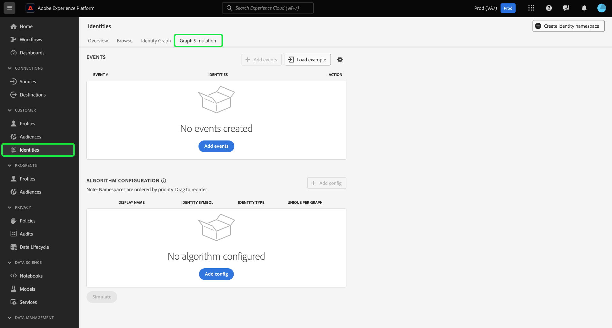

The [!DNL Graph Simulation] interface can be divided into three sections:

>[!BEGINTABS]

>[!TAB Events]

Events: Use the **[!UICONTROL Events]** panel to add identities to simulate a graph. A fully qualified identity must have an identity namespace and its corresponding identity value. You must add at least two identities in order to simulate a graph. You can also select **[!UICONTROL Load Example]** to input a pre-configured event and algorithm setup.

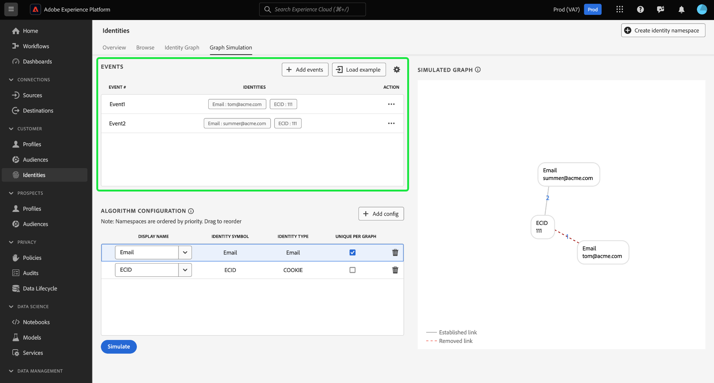

>[!TAB Algorithm configuration]

Algorithm configuration: Use the **[!UICONTROL Algorithm configuration]** panel to add and configure the optimization algorithm for your namespaces. You can drag and drop a namespace to modify their respective priority ranking. You can also select **[!UICONTROL Unique Per Graph]** to determine if a namespace is unique.

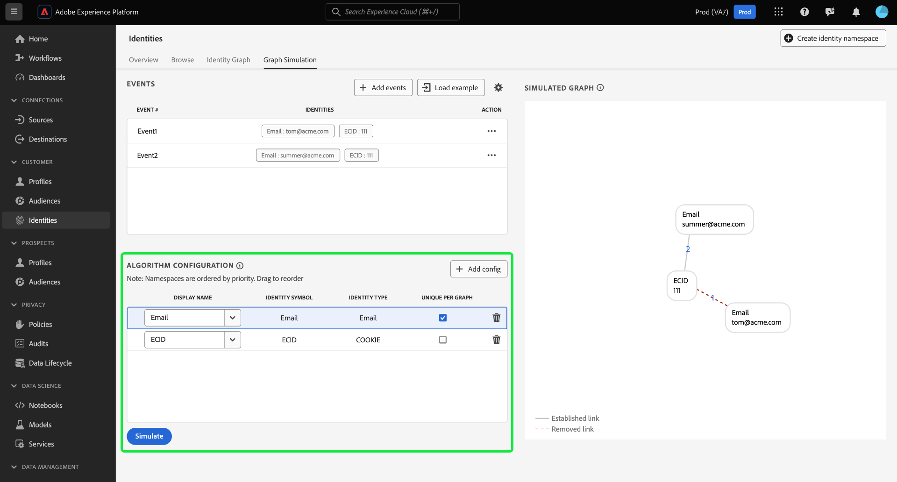

>[!TAB Simulated graph viewer]

Simulated graph viewer: The simulated graph viewer displays the resulting graph based on the events you added and the algorithm that you configured. A straight line between two identities means that a link is established. A dotted line indicates that a link has been removed.

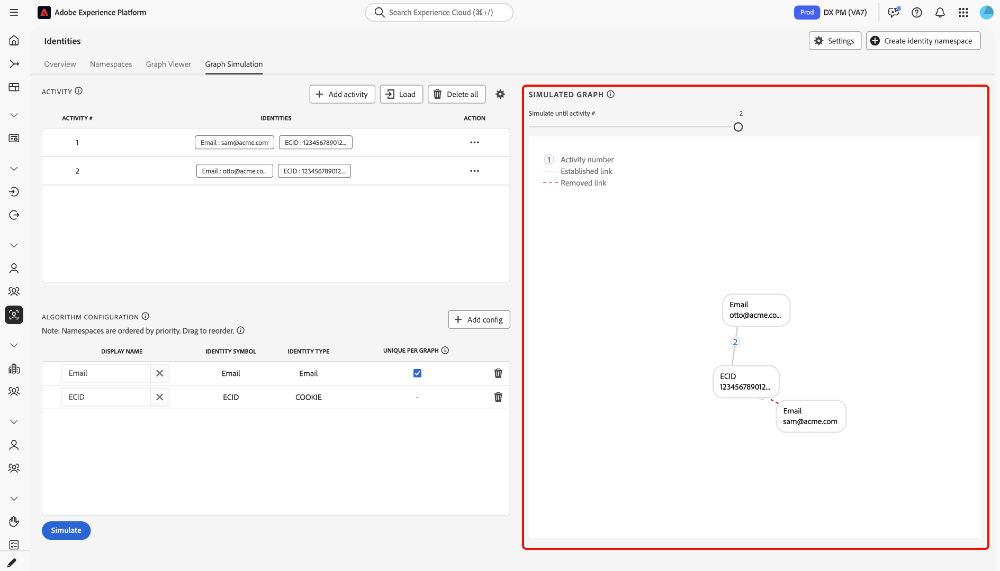

>[!ENDTABS]

## Add events {#add-events}

To begin, select **[!UICONTROL Add events]**.

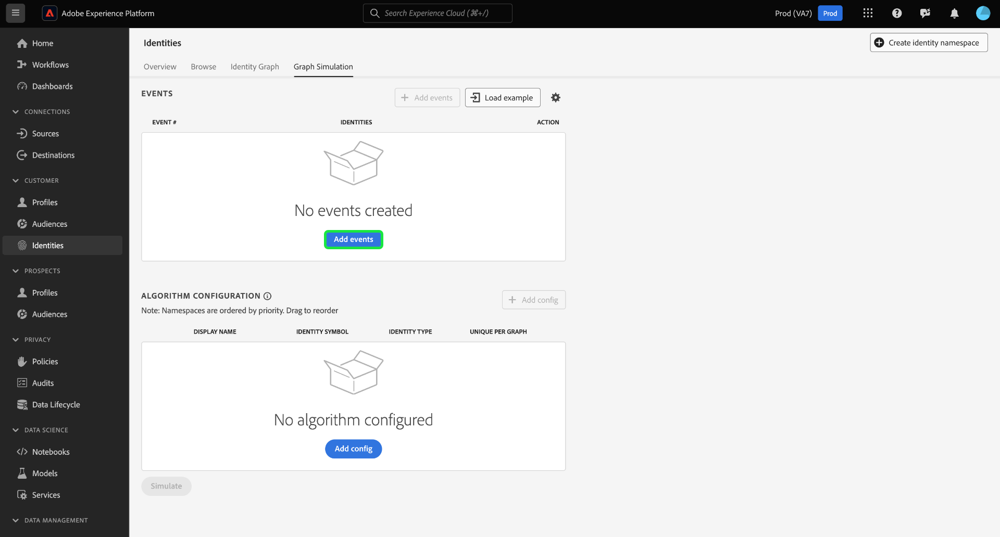

A pop-up window appears for [!UICONTROL Event #1]. From here, input your identity namespace and identity value combination. You can use the dropdown menu to select an identity namespace. Alternatively, you can type in the first few letters of a namespace and then select the options provided in the dropdown menu. Once you have selected your namespace, provide an identity value that corresponds with your namespace.

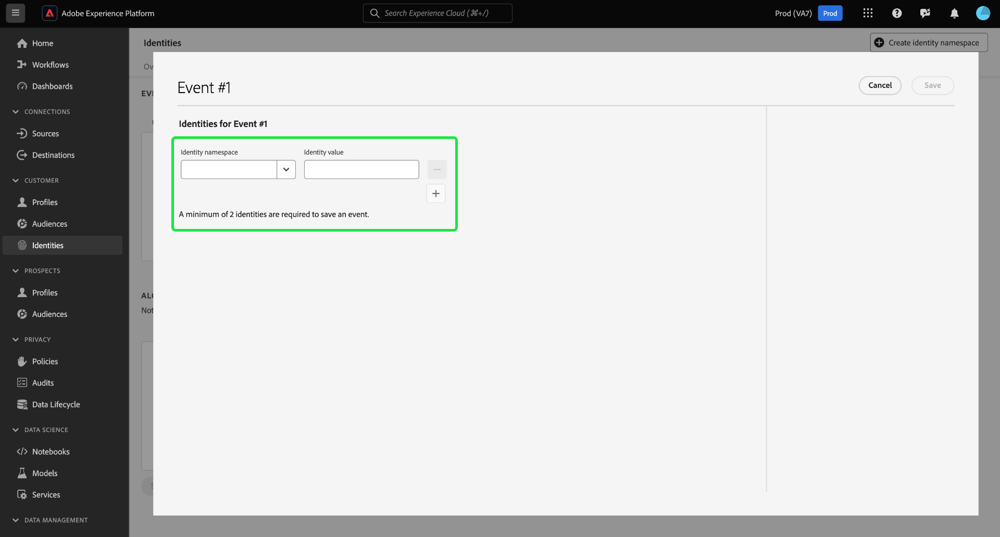

>[!TIP]
>
>The identity value that you input during [!DNL Graph Simulation] exercises do not have to be real identity values and can be simple placeholders.

Once your first identity is complete, select the add icon (**`+`**) to add a second identity. 

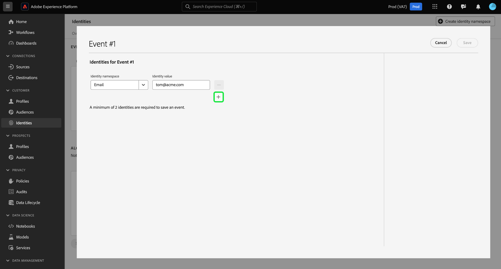

Next, repeat the same steps and add a second identity. Two fully qualified identities are required in order to generate an identity graph. In the example below, an ECID is added as a namespace and is provided with a value of `111`. When finished, select **[!UICONTROL Save]**.

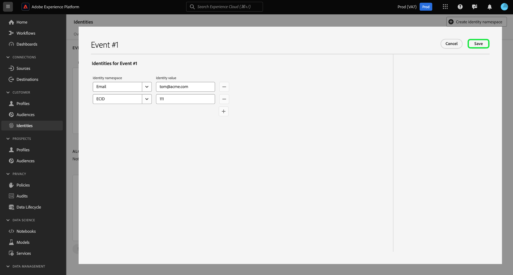

The [!UICONTROL Events] interface updates to display your first event, which in this case is: `{Email: tom@acme.com, ECID: 111}`.

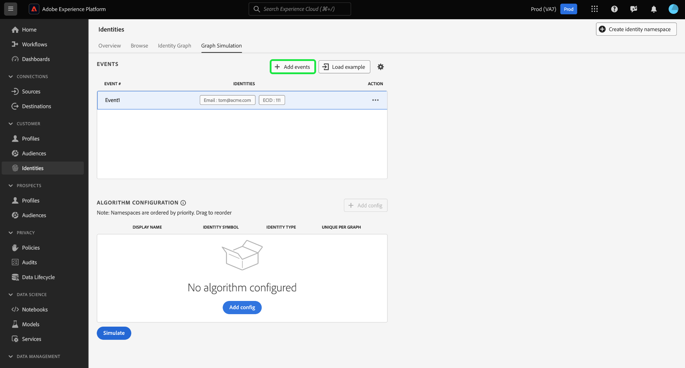

Next, repeat the same steps to add a second event. For Event #2, add `{Email: summer@acme.com}` as your first identity and then add the same `{ECID: 111}` as the second identity, thus creating a second event of: `{Email: summer@acme.com}, {ECID: 111}`. When finished, you should have two events, one for `{Email: tom@acme.com, ECID: 111}` and one for `{Email: summer@acme.com}, {ECID: 111}`.

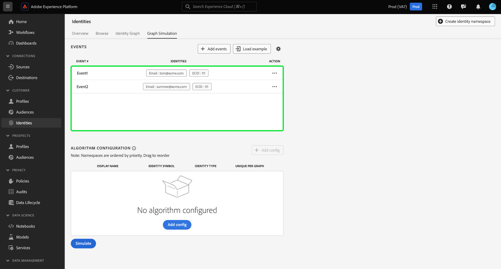

### Load example {#load-example}

Select **[!UICONTROL Load example]** to set up an example graph with a pre-set algorithm and event configuration.  

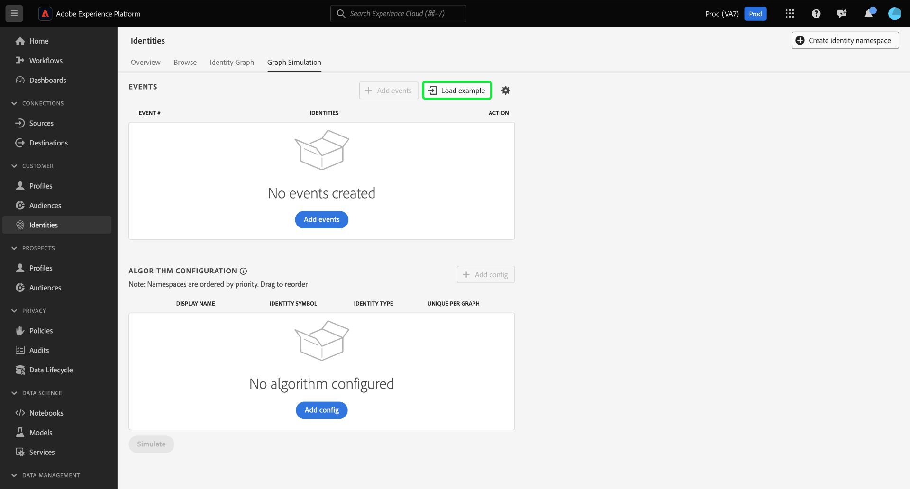

A pop-up window appears, providing you with available graph scenarios you can choose from:

| Example graph | Description | Example |
| --- | --- | --- |
| Shared Device | Shared device refers to scenarios where two different users log in to the same single device.| A husband and wife share an iPad for internet browsing and e-commerce. |
| Invalid (non-unique) phone | Invalid or non-unique phone refers to scenarios where two different users use the same phone number to create an account. | A mother and her daughter use their shared home phone number to sign up for any e-commerce accounts. |
| "Bad" identity values | "Bad" identity values refer to scenarios where Identity Service generates non-unique IDFAs due to erroneous implementation. | WebSDK erroneously sends a `user_null` value for every event due to code implementation issues. |

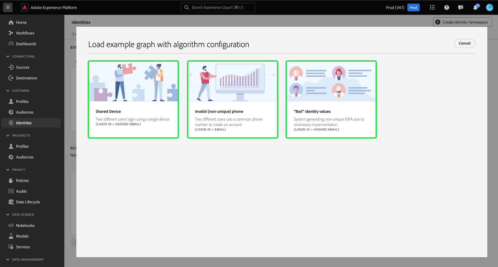

Select any of the options to load [!DNL Graph Simulation] with pre-configured events and algorithm. You can still make further configurations to any pre-loaded graph scenario examples.

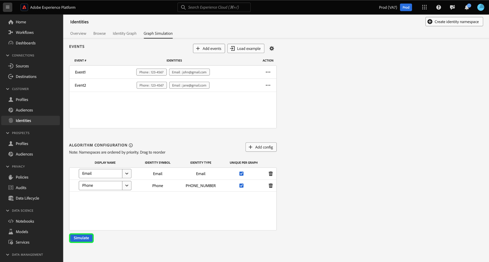

When finished, select **[!UICONTROL Simulate]**.

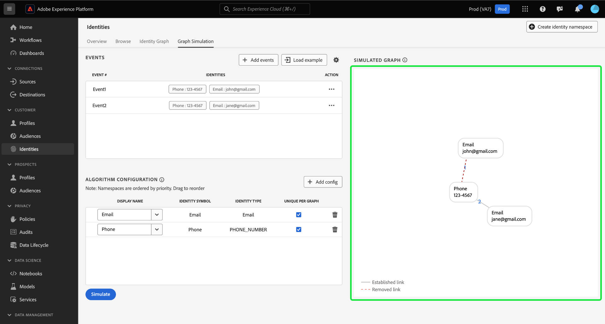

### Use text version {#use-text-version}

You can also use text mode to configure events. To use text mode, select the settings icon, and then select **[!UICONTROL Text (Advanced users)]**.

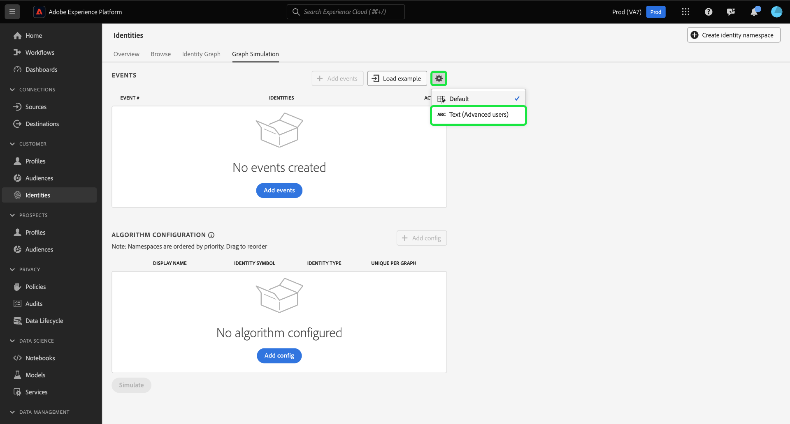

You can manually input your identities with text mode. Use a colon (`:`) to distinguish the identity value that corresponds with the namespace that you input, and then use a comma (`,`) to separate your identities. To distinguish different events from one another, use a new line for each event.

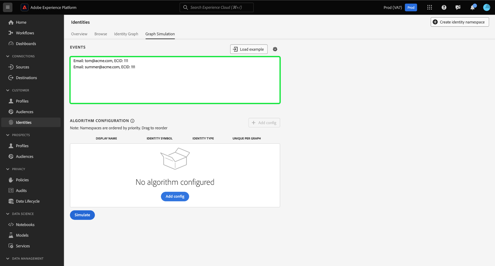

### Edit event {#edit-event}

To edit an event, select the ellipses (`...`) beside a given event, and then select **[!UICONTROL Edit]**.

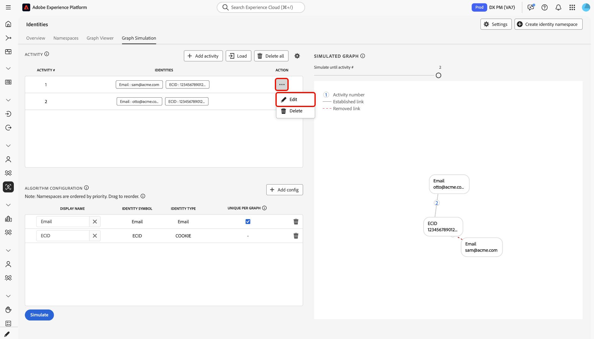

### Delete event {#delete-event}

To delete an event, select the ellipses (`...`) beside a given event, and then select **[!UICONTROL Delete]**.

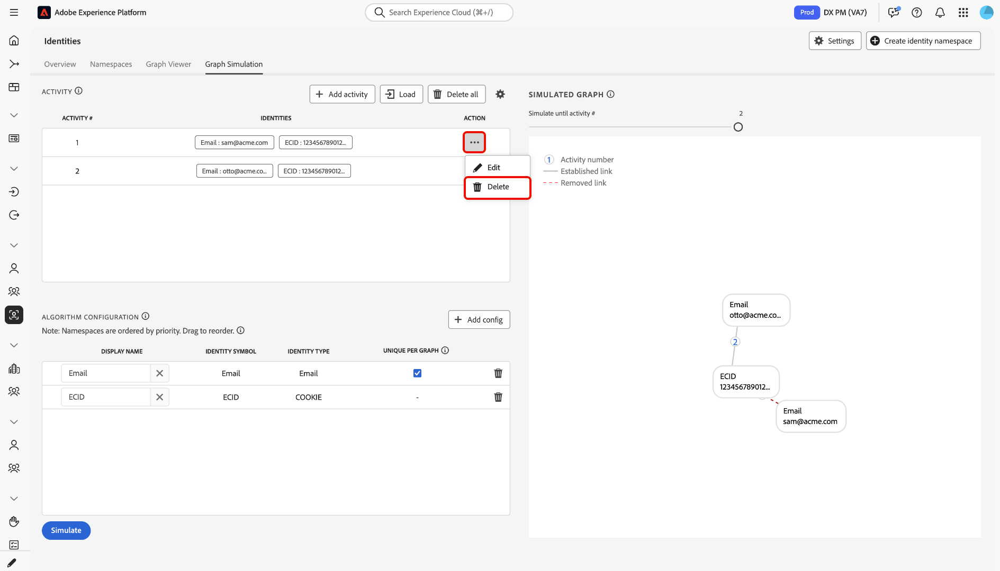

## Configure algorithm {#configure-algorithm}

>[!IMPORTANT]
>
>The algorithm that you configure dictates how Identity Service treats the namespaces that you inputted in your events. Any configuration that you put together in the [!DNL Graph Simulation UI] are not saved in identity settings.

Once you have added your events, you can now configure the algorithm that will be used to simulate your graph. To begin, select **[!UICONTROL Add config]**.

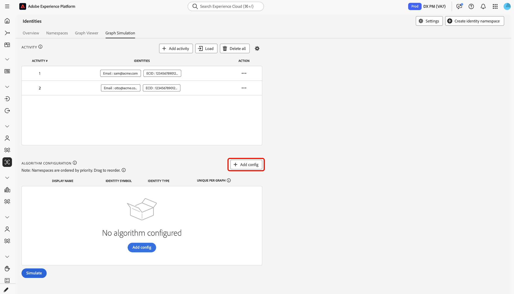

An empty configuration row appears. First, input the same namespace that you used for your events. In this case, begin by inputting Email. Once you enter your namespace, the columns for [!UICONTROL Identity Symbol] and [!UICONTROL Identity Type] auto-populates.

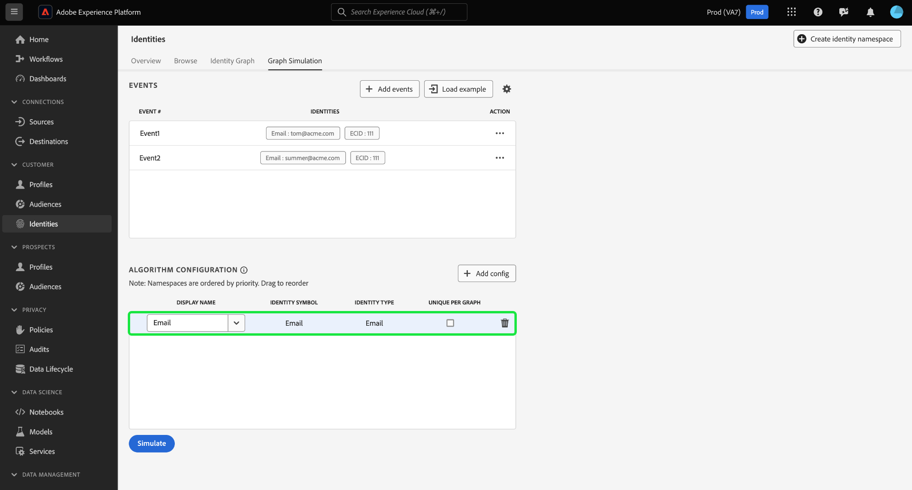

Next, repeat the same steps and add your second namespace, which in this case is the ECID. Once all of your namespaces have been entered, you can begin configuring their priorities and uniqueness.

* **Namespace priority**: The priority of a namespace determines its relative importance compared to the other namespaces in a given identity graph. For example, if your identity graph has four different namespaces: CRMID, ECID, Email and Apple IDFA, you can configure priorities to determine an order of importance for the four namespace.
* **Unique namespace**: If a namespace is designated as unique, then Identity Service will generate graphs with the caveat that only one identity with a given unique namespace can exist. For example, if the Email namespace is designated as a unique namespace, then a graph can only have one identity with Email. If there is more than one identity with the Email namespace, then the oldest link will be removed.

To configure namespace priority, select and drag the namespace rows to the priority ordering that you want, with the top row representing higher priority and the bottom row representing lower priority. To designate a namespace as unique, select the **[!UICONTROL Unique Per Graph]** checkbox.

When finished, select **[!UICONTROL Simulate]**.

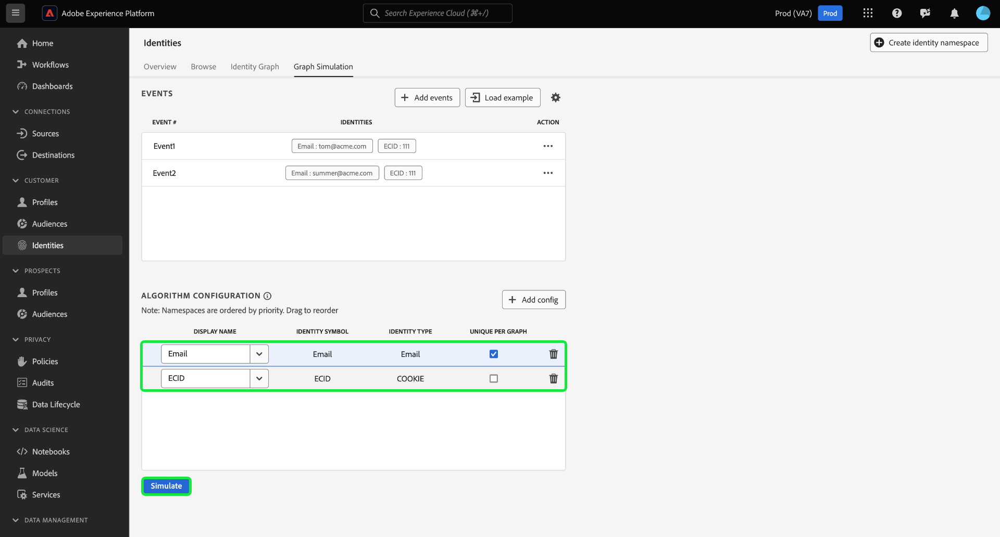

## View simulated graph

The [!UICONTROL Simulated Graph] section displays the identity graph(s) generated based on the events that you added and the algorithm that you configured.

| Graph icons | Description |
| --- | --- |
| Solid line | A solid line represents an established link between two identities. |
| Dotted line | A dotted line represents a removed link between two identities. |
| Number on line | A number on a line represents the timestamp of when that given link was generated. The lowest number (1), represents the earliest established link. |

In the example graph below, a dotted line exists between `{Email: tom@acme.com}` and `{ECID: 111}` because of the following reasons:

* Email was designated as unique during the algorithm configuration step. Therefore, only one identity with an Email namespace may exist in a graph.
* The link between `{Email: tom@acme.com}` and `{ECID: 111}` was the first established identity (Event #1). It is the oldest link and is therefore removed.

## Next steps

By reading this document, you now know how to use the [!DNL Graph Simulation] tool to better understand how your identity data is treated given a particular set of rules and configurations. For more information, read the following documents:

* [Identity graph linking rules overview](./overview.md)
* [Identity optimization algorithm](./identity-optimization-algorithm.md)
* [Implementation guide](./implementation-guide.md)
* [Troubleshooting and FAQ](./troubleshooting.md)
* [Examples of graph configurations](./example-configurations.md)
* [Namespace priority](./namespace-priority.md)
* [Identity settings UI](./identity-settings-ui.md)

### Watch the video on graph simulation {#watch}

Watch the following video for additional information on using the [!DNL Graph Simulation] interface in the Identity Service UI workspace:

>[!VIDEO](https://video.tv.adobe.com/v/3444032/?learn=on&enablevpops)