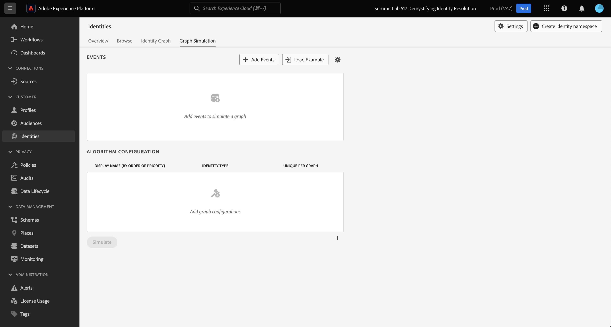
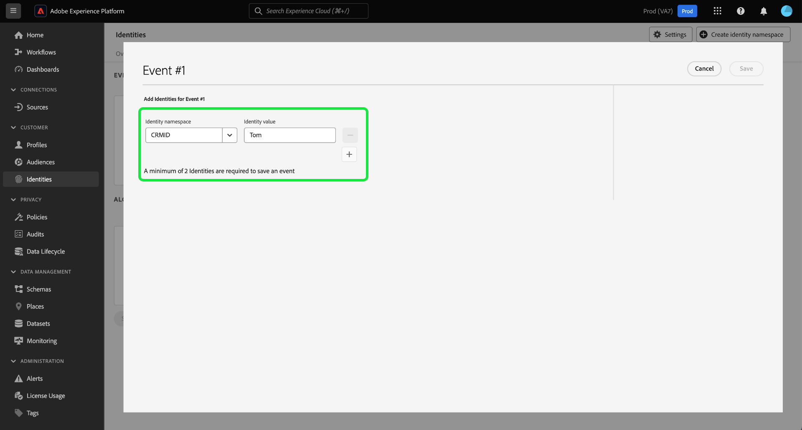
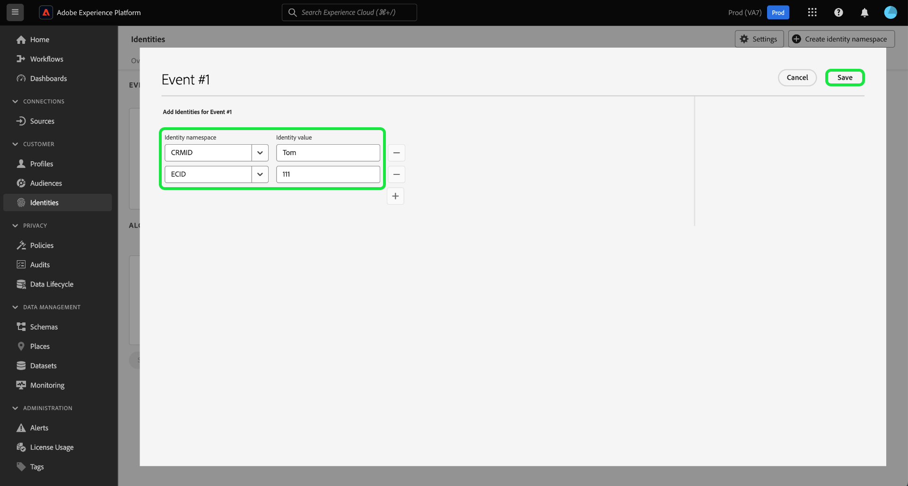
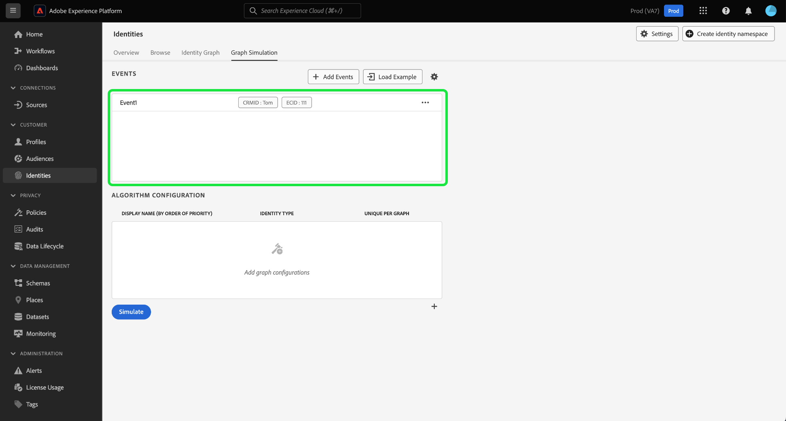

# Graph Simulation

Graph Simulation is a tool in the Identity Service UI that you can use to simulate how an identity graph behaves given a particular combination of identities and how you configure the [identity optimization algorithm](./identity-optimization-algorithm.md).

Read this document to learn how you can use Graph Simulation to better understand identity graph behavior and how the graph algorithm functions.

## Get to know the Graph Simulation interface

You can access Graph Simulation in the Adobe Experience Platform UI. Select **[!UICONTROL Identities]** from the left navigation and then select **[!UICONTROL Graph Simulation]** from the top header.

![The Graph Simulation interface in the Adobe Experience Platform UI.]

The Graph Simulation interface can be divided into three sections:

* Events: Use the **[!UICONTROL Events]** panel to add identities to simulate a graph. A fully qualified identity must have an identity namespace and its corresponding identity value. You must add at least two identities in order to simulate a graph. You can also select **[!UICONTROL Load Example]** to input a pre-configured event and algorithm setup.
* Algorithm Configuration: Use the **[!UICONTROL Algorithm Configuration]** panel to add and configure the optimization algorithm for your namespaces. You can drag and drop a namespace to modify their respective priority ranking. You can also select **[!UICONTROL Unique Per Graph]** to determine if a namespace is unique, which means...
* Simulated Graph Viewer: The simulated graph viewer displays the resulting graph based on the events you added and the algorithm that you configured. A straight line between two nodes means that a link is established. A dotted line indicates that a link has been removed.

## Add events

To begin, select **[!UICONTROL Add Events]**.

A pop-up window appears for [!UICONTROL Event #1]. From here, input your identity namespace and identity value combination. You can use the dropdown menu to select an identity namespace. Alternatively, you can type in the first few letters of a namespace and then select the options provided in the dropdown menu. Then, provide an identity value that corresponds with your namespace. When finished select add (`+`) to add a second identity.

>[!TIP]
>
>The identity value that you input during Graph Simulation exercises do not have to be real identity values and can be simple placeholders.

Next, repeat the same steps and add a second identity. Two fully qualified identities are required in order to generate an identity graph. In the example below, an ECID is added as a namespace and is provided with a value of `111`. When finished, select **[!UICONTROL Save]**.

The [!UICONTROL Events] interface updates to display your first event, which in this case is: `{CRMID: Tom, ECID: 111}`.

Next, repeat the same steps to add a second event. For Event #2, add `{CRMID: Summer}` as your first identity and then add the same `{ECID: 111}` as the second identity, thus creating a second event of: `{CRMID: Summer}, {ECID: 111}`. When finished, you should have two events, one for `{CRMID: Tom, ECID: 111}` and one for `{CRMID: Summer}, {ECID: 111}`.

### Load example

+++Select to view steps on how to use pre-loaded graph examples

To set up an example graph with a pre-configured algorithm, select **[!UICONTROL Load example]**. A pop-up window appears, providing you with available graph scenarios you can choose from:

| Example graph | Description | Example |
| --- | --- | --- |
| Shared Device | Shared device refers to scenarios where two different users log in to the same single device.| A husband and wife share an iPad for internet browsing and e-commerce. |
| Invalid (non-unique) phone | Invalid or non-unique phone refers to scenarios where two different users use the same phone number to create an account. | A mother and her daughter use their shared home phone number to sign up for any e-commerce accounts. |
| "Bad" identity values | "Bad" identity values refer to scenarios where Identity Service generates non-unique IDFAs due to erroneous implementation. | WebSDK erroneously sends a `user_null` value for every event due too code implementation issues. |

Select any of the options to load Graph Simulation with pre-configured events and algorithm. You can still make further configurations to any pre-loaded graph scenario examples.

When finished, select **[!UICONTROL Simulate]**.

+++

### Use text version

+++Select to view steps on how to use text version

You can also use text mode to configure events. To use text mode, select the gear (?) icon, and then select **[!UICONTROL Text (Advanced users)]**.

You can manually input your identities with text mode. Use a colon (`:`) to distinguish the identity value that corresponds with the namespace that you input, and then use a comma (`,`) to separate your identities. To distinguish different events from one another, use a new line for each event.

+++

### Edit event

To edit an event, select the ellipses (`...`) beside a given event, and then select **[!UICONTROL Edit]**.

### Delete event

To delete an event, select the ellipses (`...`) beside a given event, and then select **[!UICONTROL Delete]**.

## Configure algorithm

The algorithm that you configure will dictate how Identity Service treats the namespaces that you inputted in your events. Any configuration that you put together in the Graph Simulation UI are not saved in identity settings.

To begin, select add (`+`) in the bottom corner of the algorithm configuration panel.

![The algorithm configuration panel.]

An empty configuration row appears. First, input the same namespace that you used for your events. In this case, begin by inputting the CRMID. Once you enter your namespace, the columns for [!UICONTROL Identity Symbol] and [!UICONTROL Identity Type] auto-populates.

![The first configuration entry.]

Next, repeat the same steps and add your second namespace, which in this case is the ECID. Once all of your namespaces have been entered, you can begin configuring their priorities and uniqueness.

* **Namespace priority**: The priority of a namespace determines its relative importance compared to the other namespaces in a given identity graph. For example, if your identity graph has four different namespaces: CRMID, ECID, Email and Apple IDFA, you can configure priorities to determine an order of importance for the four namespace. (ADD WHY)
* **Unique namespace**: If a namespace is designated as unique, then Identity Service will generate graphs with the caveat that only one identity with a given unique namespace can exist. For example, if CRMID is designated as a unique namespace, then a graph can only have one identity with CRMID. If there is more than one identity with the CRMID namespace, then the oldest link will be removed.

To configure namespace priority, select and drag the namespace rows to the priority ordering that you want, with the top row representing higher priority and the bottom row representing lower priority. To designate a namespace as unique, select the **[!UICONTROL Unique Per Graph]** checkbox.

![All namespaces configured.]

When finished, select **[!UICONTROL Simulate]**.

## View simulated graph

The [!UICONTROL Simulated Graph] section displays the identity graph(s) generated based on the events that you added and the algorithm that you configured.

| Graph icons | Description |
| --- | --- |
| Solid line | A solid line represents an established link between two identities. |
| Dotted line | A dotted line represents a removed link between two identities. |
| Number on line | A number on a line represents the timestamp of when that given link was generated. The lowest number (1), represents the earliest established link. |

In the example graph below, a dotted line exists between `{CRMID: Tom}` and `{ECID: 111}` because of the following reasons:

* CRMID was designated as unique during the algorithm configuration step. Therefore, only one identity with a CRMID namespace may exist in a graph.
* The link between `{CRMID: Tom}` and `{ECID: 111}` was the first established identity (Event #1). It is the oldest link and is therefore removed.

## Example graph scenarios

>[!NOTE]
>
>"CRMID" is a custom namespace. Therefore, the examples below require you to create a custom namespace with a display name and identity symbol of "CRMID".

The following section examples of graph scenarios you might encounter with Graph Simulation.

### CRMID only

Events:

* CRMID: Tom, ECID: 111

Algorithm configuration:

| Priority | Display name | Identity symbol | Identity type | Unique per graph |
| ---| --- | --- | --- | --- |
| 1 | CRMID | CRMID | CROSS_DEVICE | Yes |
| 2 | ECID | ECID | COOKIE | NO |

+++Select to view simulated graph

+++

### CRMID with hashed email

In this scenario, a CRMID is ingested and represents both online (experience event) and offline (profile record) data. This scenario also involves the ingestion of a hashed email, which represents another namespace sent in the CRM record dataset along with the CRMID.

Events:

* CRMID: Tom, Email_LC_SHA256: tom@acme.com
* CRMID: Tom, ECID: 111
* CRMID: Summer, Email_LC_SHA256: summer@acme.com
* CRMID: Summer, ECID: 222

Algorithm configuration:

| Priority | Display name | Identity symbol | Identity type | Unique per graph |
| ---| --- | --- | --- | --- |
| 1 | CRMID | CRMID | CROSS_DEVICE | Yes |
| 2 | Emails (SHA256, lowercased) | Email_LC_SHA256 | Email | NO |
| 3 | ECID | ECID | COOKIE | NO |

+++Select to view simulated graph

+++

### CRMID with hashed email, hashed phone, GAID, and IDFA

Events:

* CRMID: Tom, Email_LC_SHA256: aabbcc, Phone_SHA256: 123-4567
* CRMID: Tom, ECID: 111
* CRMID: Tom, ECID: 222, IDFA: A-A-A
* CRMID: Summer, Email_LC_SHA256: ddeeff, Phone_SHA256: 765-4321
* CRMID: Summer, ECID: 333
* CRMID: Summer, ECID: 444, GAID:B-B-B

Algorithm configuration: 

| Priority | Display name | Identity symbol | Identity type | Unique per graph |
| ---| --- | --- | --- | --- |
| 1 | CRMID | CRMID | CROSS_DEVICE | Yes |
| 2 | Emails (SHA256, lowercased) | Email_LC_SHA256 | Email | NO |
| 3 | Phone (SHA256) | Phone_SHA256 | Phone | NO |
| 4 | Google Ad ID (GAID) | GAID | DEVICE | NO |
| 5 | Apple IDFA (ID for Apple) | IDFA | DEVICE | NO |
| 6 | ECID | ECID | COOKIE | NO |

+++Select to view simulated graph

+++