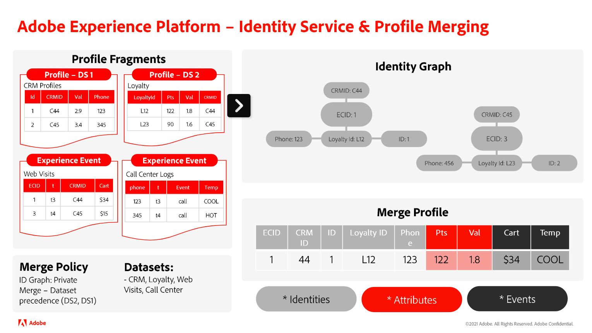

# Understanding the relationship between Identity Service and Real-Time Customer Profile

>[!IMPORTANT]
>
>* Identity graph linking rules are currently in Alpha. The feature and documentation are subject to change.
>
>* This page assumes that the merge policy is using the identity graph. For more information about merge policies in Real-Time Customer Profile, read the documentation on [merge policies and identity stitching](../../profile/merge-policies/overview.md#identity-stitching).

While you can use Identity Service and Real-Time Customer Profile in tandem, the two features of Adobe Experience Platform are not inherently the same.

* You can use Identity Service to generate and maintain the identity graph that brings together the disparate identities of an individual customer.
* You can use Real-Time Customer Profile to bring together disparate profile fragments and create a merged profile. This process requires the use of the identity graph.

This document outlines the similarities, differences, and relationship between Identity Service and Real-Time Customer Profile.

## Identity Service vs Real-Time Customer Profile

The key differences between Identity Service and Real-Time Customer Profile are as follows:

| | Identity Service | Real-Time Customer Profile |
| --- | --- |--- |
| **Purpose** | <ul><li>You can use Identity Service to create and manage identity graphs.</li></ul> | You can use Real-Time Customer Profile to: <ul><li>Create a 360-degree view of a customer profile.</li><li>View and manage profiles</li><li>Segment profiles to create audiences.</li></ul> |
| **Input** | <ul><li>To use Identity Service, you must ingest record data or time series events that have at least two fields that are marked as identity. The fields that you mark as identity are then ingested into Identity Service.</li></ul> | **To merge profiles, you must provide**: <ul><li>Profile fragments: represent a unique primary identity and the corresponding record or event data for that ID within a given dataset.</li><li>Identity graphs: Profile references the identity graph for a given customer profile, to identify all profile fragments with the same primary identities.</li></ul> **For segment qualification, you must provide**: <ul><li>Merged profiles: a merged profile is a single view of a customer, where disparate profile fragments and identities are collected into one comprehensive view.</li></ul> |
| **Process** | <ul><li>Once you have ingested at least two identities, Identity Service then links these identities together.</li></ul> | <ul><li>Real-Time Customer Profile merges profile fragments while referencing their corresponding identity graphs.</li><li>Qualify profiles to segments based on segmentation criteria</li></ul> |
| **Output** | <ul><li>The result is an identity graph, which is a set of identities related to an individual.</li></ul> | <ul><li>The result is a merged profile, which is a single and comprehensive view of a given customer.</li><li>Profiles with segment memberships defined</li></ul> |

{style="table-layout:auto"}

>[!BEGINSHADEBOX]

## How does a merged profile get created?

Read the steps below to gain a better understanding of the process of creating a merged profile:

* First, Real-Time Customer Profile references an identity graph and retrieves all identities.
* Next, Profile retrieves all profile fragments that are related to each identity.
* Once successful, Profile than merges all existing events and attributes.
  * If needed, apply precedence rules to determine which attribute or event to use

>[!ENDSHADEBOX]

### What does it mean to mark a field as identity?

To mark or designate a field as identity is an instruction for Experience Platform to ingest that particular field to Identity Service. This designation then allows for profile fragments to be merged in Real-Time Customer Profile. If there are no profile fragments associated with the identity, then do not designate it as identity.

#### Understanding primary and secondary identities

Once you mark fields as identities, they can then be defined as either primary or secondary identities. Primary and secondary identities are concepts part of Real-Time Customer Profile.

* The primary identity (sometimes referred to as "primary key") is the identity in which profile fragments are stored in.
* If there is only one identity in a given row of data, then that single identity is designated as primary.
* If there are two or more identities, then one will be designated as primary, and the remaining will be designated as secondary.

Identity Service only ingests fields designated as identity. Identity Service does not store information on whether an identity is primary or secondary.

## Next steps

For more information on identity graph linking rules, read the following documentation:

* [Identity graph linking rules overview](./overview.md)
* [Identity optimization algorithm](./identity-optimization-algorithm.md)
* [Example scenarios for configuring identity graph linking rules](./example-scenarios.md)
* [Identity linking logic](./identity-linking-logic.md)
