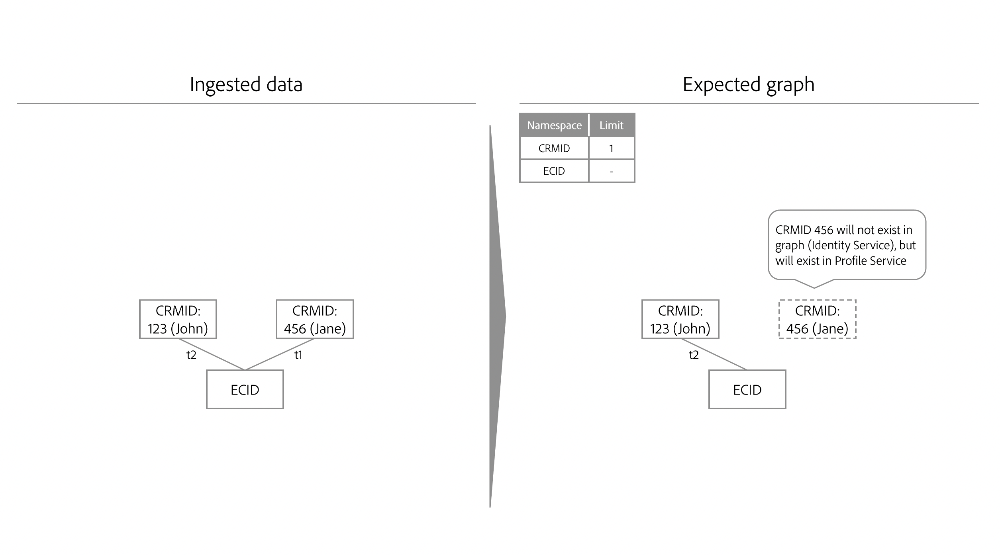
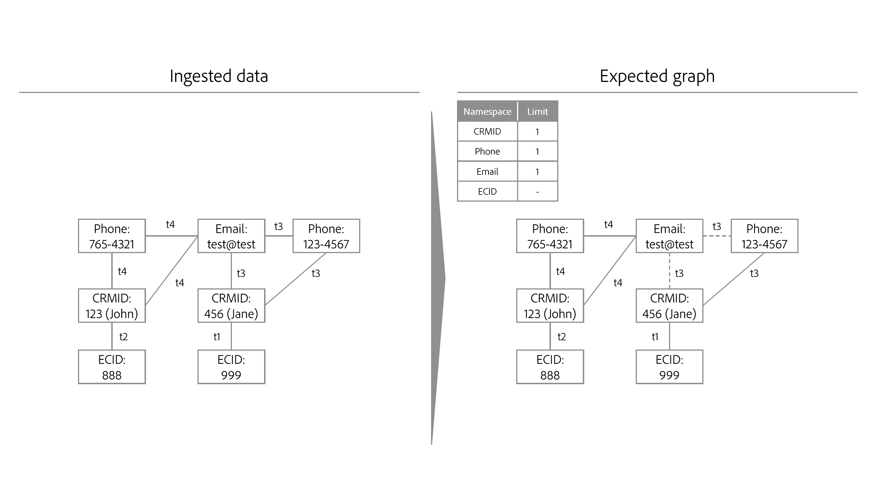
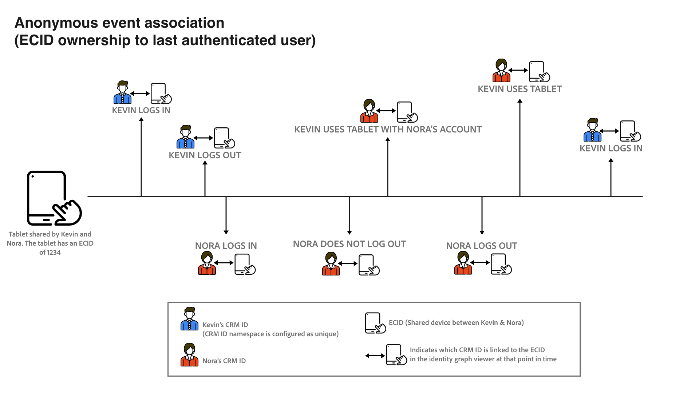

# Identity optimization algorithm

>[!IMPORTANT]
>
>The identity optimization algorithm is in Alpha. The feature and documentation are subject to change.

The identity optimization algorithm is a rule that helps ensure that an identity graph is representative of a single person, and therefore, prevents the unwanted merging of identities on Real-Time Customer Profile.

## Input parameters

A single merged profile and its corresponding identity graph should represent a single individual (person entity). A single individual is usually represented by CRM IDs and/or Login IDs. The expectation is that no two individuals (CRM IDs) are merged into a single profile or graph.

You must specify which namespaces represent a person entity in Identity Service using the identity optimization algorithm. For example, if a CRM database defines a user account to be associated with a single CRM ID and a single email address, then the identity settings for this sandbox would look like:

* CRM ID namespace = unique
* Email namespace = unique

A namespace that you declare to be unique will automatically be configured to have a maximum limit of one within a given identity graph. For example, if you declare a CRM ID namespace as unique, then an identity graph can only have one identity that contains a CRM ID namespace.

>[!NOTE]
>
>* Currently, the algorithm only supports the use of a single login identifier (one login namespace). Multiple login identifiers (multiple identity namespaces used to login), household entity graphs, and hierarchical graph structures are not supported at this time.
>
>* All namespaces that are person identifiers and that are used in the sandbox to generate identity graphs must be marked as a unique namespace. Otherwise, you may see undesirable linking results.

## Process

Upon ingesting new identities, Identity Service checks if the new identities and their corresponding namespaces will result in exceeding the configured limits. If limits are not exceeded, then the ingestion of new identities will proceed and these identities will be linked to the graph. However, if limits are exceeded, the identity optimization algorithm will update the graph such that the most recent timestamp is honored, and oldest links with the lower priority namespaces are removed.

## Example scenarios for identity optimization algorithm

The following section outlines how the identity optimization algorithm behaves, under scenarios such as shared device or ingestion of data with the same timestamp.

### Shared device

A shared device refers to a device that is used by more than one individual. For example, a shared device can be a laptop or a tablet that you share with a partner or a family member, a library computer, or a public kiosk.

>[!BEGINTABS]

>[!TAB Example one]

| Namespace | Limit |
| --- | --- |
| CRM ID | 1 |
| Email | 1 |
| ECID | N/A |

In this example, both CRM ID and Email are designated as unique namespaces. At `timestamp=0`, a CRM record dataset is ingested and creates two different graphs because of the limit configuration. Each graph contains a CRM ID and an Email namespace.

* `timestamp=1`: Jane logs in to your e-commerce website using a laptop. Jane is represented by her CRM ID and Email, while the web browser on her laptop that she uses is represented by an ECID.
* `timestamp=2`: John logs in to your e-commerce website using the same laptop. John is represented by his CRM ID and Email, while the web browser he used is already represented by an ECID. Due to the same ECID being linked to two different graphs, Identity Service is able to know that this device (laptop) is a shared device.
* However, due to the limit configuration that sets a maximum of one CRM ID namespace and one Email namespace per graph, identity optimization algorithm then splits the graph into two.
  * Finally, because John is the last authenticated user, the ECID that represents the laptop, remains linked to his graph instead of Jane's.

>[!TAB Example two]

| Namespace | Limit |
| --- | --- |
| CRM ID | 1 |
| ECID | N/A |

In this example, the CRM ID namespace is designated as a unique namespace.

* `timestamp=1`: Jane logs in to your e-commerce website using a laptop. She is represented by her CRM ID, and the web browser on the laptop is represented by the ECID.
* `timestamp=2`: John logs in to your e-commerce website using the same laptop. He is represented by his CRM ID and the web browser he uses is represented by the same ECID.
  * This event links two independent CRM IDs to the same ECID, which exceeds the configured limit of one CRM ID.
  * As a result, identity optimization algorithm removes the older link, which in this case is Jane's CRM ID that was linked at `timestamp=1`.
  * However, while Jane's CRM ID will no longer exist as a graph on Identity Service, it will still persist as a profile on Real-Time Customer Profile. This is because an identity graph must contain at least two linked identities, and as a result of removing the links, Jane's CRM ID no longer has another identity to link to.

>[!ENDTABS]

### Bad email

There are instances where a user may input bad values for their email and/or phone numbers. 

| Namespace | Limit |
| --- | --- |
| CRM ID | 1 |
| Email | 1 |
| ECID | N/A |

In this example, the CRM ID and Email namespaces are designated as unique. Consider the scenario that Jane and John have signed up to your e-commerce website using a bad email value (for example, test@test.com).

* `timestamp=1`: Jane logs in to your e-commerce website using Safari on her iPhone, establishing her CRM ID (login information) and her ECID (browser). 
* `timestamp=2`: John logs in to your e-commerce website using Google Chrome on his iPhone, establishing his CRM ID (login information) and ECID (browser).
* `timestamp=3`: Your data engineer ingests Jane's CRM record, which results in her CRM ID getting linked to the bad email.
* `timestamp=4`: Your data engineer ingests John's CRM record, which results in his CRM ID getting linked to the bad email.
  * This then becomes a violation of the configured limits as it creates a single graph with two CRM ID namespaces.
  * As a result, the identity optimization algorithm deletes the older link, which in this case is the link between Jane's identity with CRM ID namespace and the identity with test@test.

With identity optimization algorithm, bad identity values such as bogus emails or phone numbers do not get propagated across several different identity graphs.

### Anonymous event association

ECIDs store unauthenticated (anonymous) events, while CRM ID stores authenticated events. In the case of shared devices, the ECID (bearer of unauthenticated events) gets associated with the **last authenticated user**.

View the diagram below to better understand how anonymous event association works:

* Kevin and Nora share a tablet.
  * `timestamp=1`: Kevin logs in to an e-commerce website using his account, thereby establishing his CRM ID (login information) and an ECID (browser). At time of login, Kevin is now considered the last authenticated user.
  * `timestamp=2`: Nora logs in to an e-commerce website using her account, thereby establishing her CRM ID (login information) and the same ECID. At time of login, Nora is now considered the last authenticated user.
  * `timestamp=3`: Kevin uses the tablet to browse the e-commerce website, but does not log in with his account. Kevin's browsing activity are then stored in the ECID, which in turn is associated with Nora because she is the last authenticated user. At this point, Nora owns the anonymous events.
    * Until Kevin logs in again, Nora's merged profile will be associated to all the unauthenticated events stored against the ECID (with events being where ECID is the primary identity).
  * `timestamp=4`: Kevin logs in for a second time. At this point, he once again becomes the last authenticated user, and also now owns the unauthenticated events:
    * Before his initial login prior to `timestamp=1`; and
    * Any activities he or Nora did while browsing anonymously in-between Kevin's first and second logins.

## Next steps

For more information on identity graph linking rules, read the following documentation:

* [Identity graph linking rules overview](./overview.md)
* [Example scenarios for configuring identity graph linking rules](./example-scenarios.md)
* [Identity linking logic](./identity-linking-logic.md)
* [Identity Service and Real-Time Customer Profile](identity-and-profile.md)
