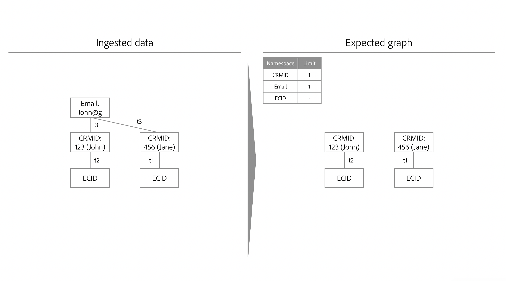

# Identity optimization algorithm

>[!IMPORTANT]
>
>The identity optimization algorithm is in Alpha. The feature and documentation are subject to change.

The identity optimization algorithm is a rule that helps ensure that an identity graph is representative of a single person, and therefore, prevents the unwanted merging of identities on Real-Time Customer Profile.

## Input parameters

You must specify which namespaces represent a person entity in Identity Service using the identity optimization algorithm. For example, if a CRM database defines a user account to be associated with a single CRM ID and a single email address, then the identity settings for this sandbox would look like:

* CRM ID namespace = unique
* Email namespace = unique

>[!IMPORTANT]
>
>Currently, the algorithm only supports the use of a single login identifier (one login namespace). Multiple login identifiers (multiple identity namespaces used to login), household entity graphs, and hierarchical graph structures are not supported at this time.

Upon ingesting new identities, Identity Service checks if the new identities and their corresponding namespaces will result in exceeding the configured limits. If limits are not exceeded, then the ingestion of new identities will proceed and these identities will be linked to the graph. However, if limits are exceeded, the identity optimization algorithm will update the graph such that the most recent timestamp is honored, and oldest links with the lower priority namespaces are removed.

## Example scenarios for identity optimization algorithm

The following section outlines how the identity optimization algorithm behaves, under scenarios such as shared device or ingestion of data with the same timestamp.

### Shared device

A shared device refers to a device that is used by more than one individual. For example, a shared device can be a laptop or a tablet that you share with a partner or a family member, a library computer, or a public kiosk.

>[!BEGINTABS]

>[!TAB Example one]

| Namespace | Limit |
| --- | --- |
| CRM ID | 1 |
| Email | 1 |
| ECID | N/A |

In this example, both CRM ID and Email are designated as unique namespaces. At `timestamp=0`, a CRM record dataset is ingested and creates two different graphs because of the limit configuration. Each graph contains a CRM ID and an Email namespace.

* `timestamp=1`: Jane logs in to your e-commerce website using a laptop. Jane's authenticated account is represented by her CRM ID and Email, while the web browser on her laptop that she uses is represented by an ECID.
* `timestamp=2`: John logs in to your e-commerce website using the same laptop. John's authenticated account is represented by his CRM ID and Email, while the web browser he used is already represented by an ECID. Due to the same ECID being linked to two different graphs, Identity Service is able to know that this device (laptop) is a shared device.
* However, due to the limit configuration that sets a maximum of one CRM ID namespace and one Email namespace per graph, identity optimization algorithm then splits the graph into two, while recognizing that the ECID represents a shared device.

>[!TAB Example two]

| Namespace | Limit |
| --- | --- |
| CRM ID | 1 |
| ECID | N/A |

>[!ENDTABS]

### Same timestamp

