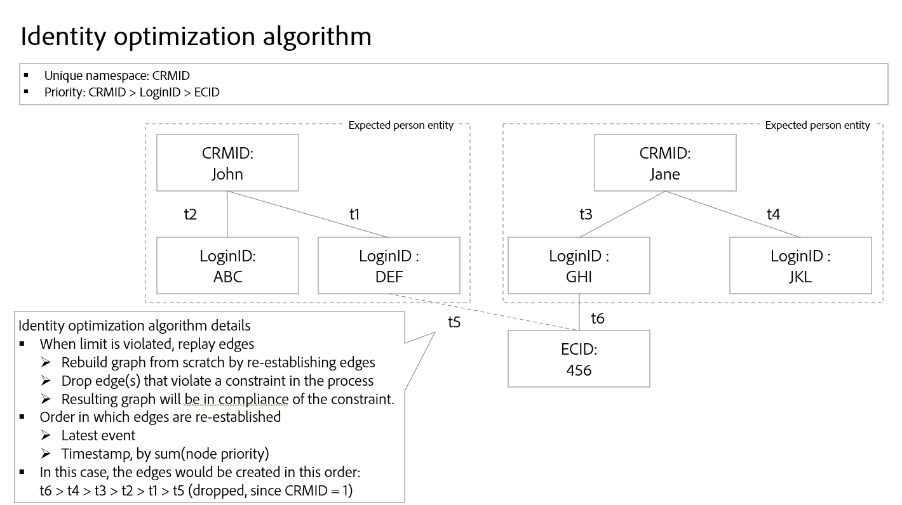

# Identity optimization algorithm {#identity-optimization-algorithm}

>[!CONTEXTUALHELP]
>id="platform_identities_uniquenamespace"
>title="Unique Namespace"
>abstract="A graph cannot have two identities with a unique namespace. If a graph tries to exceed this limit, the most recent links are kept, and the oldest links are removed."

>[!AVAILABILITY]
>
>Identity Graph Linking Rules is currently in Limited Availability, and can be accessed by all customers in development sandboxes.
>
>* **Activation requirements**: The feature will remain inactive until you configure and save your [!DNL Identity Settings]. Without this configuration, the system will continue to operate normally, with no changes in behavior.
>* **Important notes**: During this Limited Availability phase, Edge segmentation may produce unexpected segment membership results. However, streaming and batch segmentation will function as expected.
>* **Next steps**: For information on how to enable this feature in production sandboxes, please contact your Adobe account team.

The identity optimization algorithm is a graph algorithm on Identity Service that helps ensure that an identity graph is representative of a single person, and therefore, prevents the unwanted merging of identities on Real-Time Customer Profile.

## Input parameters {#input-parameters}

Read this section for information on unique namespaces and namespace priority. These two concepts serve as input parameters required by the identity optimization algorithm.

### Unique namespace {#unique-namespace}

A unique namespace determines the links that get removed if graph collapse happens.

A single merged profile and its corresponding identity graph should represent a single individual (person entity). A single individual is usually represented by CRMIDs and/or Login IDs. The expectation is that no two individuals (CRMIDs) are merged into a single profile or graph.

You must specify which namespaces represent a person entity in Identity Service using the identity optimization algorithm. For example, if a CRM database defines a user account to be associated with a single CRMID and a single email address, then the identity settings for this sandbox would look like:

* CRMID namespace = unique
* Email namespace = unique

A namespace that you declare to be unique will automatically be configured to have a maximum limit of one within a given identity graph. For example, if you declare a CRMID namespace as unique, then an identity graph can only have one identity that contains a CRMID namespace. If you do not declare a namespace to be unique, then the  graph can contain more than one identity with that namespace.

>[!NOTE]
>
>* Household entity representation ("household graphs") are not supported at this time.
>
>* All namespaces that are person identifiers and that are used in the sandbox to generate identity graphs must be marked as a unique namespace. Otherwise, you may see undesirable linking results.

### Namespace priority {#namespace-priority}

Namespace priority determines how the identity optimization algorithm removes links.

Namespaces in Identity Service have an implicit relative order of importance. Consider a graph structured like a pyramid. There is one node on the top layer, two nodes on the middle layer, and four nodes on the bottom layer. Namespace priority must reflect this relative order to ensure that a person entity is accurately represented.

For an in-depth look at namespace priority and its complete functionalities and uses, read the [namespace priority guide](./namespace-priority.md).

## Process {#process}

Upon ingesting new identities, Identity Service checks if the new identities and their corresponding namespaces adheres to unique namespace configurations. If the configurations are followed, then ingestion proceeds and the new identities are linked to the the graph. However, if configurations are not followed, then the identity optimization algorithm will:

* Ingest the most recent event, while taking namespace priority into account.
* Remove the link that would merge two person entities from the appropriate graph layer.  

## Identity optimization algorithm details

When the unique namespace constraint is violated, the identity optimization algorithm will "re-play" the links and rebuild the graph from scratch.

* Links are sorted by the following order:
  * Latest event.
  * Timestamp by sum of namespace priority (lower sum = higher order).
* The graph would re-establish based on the above order. If adding the link violates the limit constraint (e.g. the graph contains two or more identities with a unique namespace), then the links is removed.
* The resulting graph will then be compliant with the unique namespace constraint that you configured.

## Example scenarios for identity optimization algorithm

The following section outlines how the identity optimization algorithm behaves, under scenarios such as shared device or ingestion of data with the same timestamp.

### Shared device

A shared device refers to a device that is used by more than one individual. For example, a shared device can be a laptop or a tablet that you share with a partner or a family member, a library computer, or a public kiosk.

>[!BEGINTABS]

>[!TAB Example one]

| Namespace | Unique namespace |
| --- | --- |
| CRMID | Yes |
| Email | Yes |
| ECID | No |

In this example, both CRMID and Email are designated as unique namespaces. At `timestamp=0`, a CRM record dataset is ingested and creates two different graphs because of the unique namespace configuration. Each graph contains a CRMID and an Email namespace.

* `timestamp=1`: Jane logs in to your e-commerce website using a laptop. Jane is represented by her CRMID and Email, while the web browser on her laptop that she uses is represented by an ECID.
* `timestamp=2`: John logs in to your e-commerce website using the same laptop. John is represented by his CRMID and Email, while the web browser he used is already represented by an ECID. Due to the same ECID being linked to two different graphs, Identity Service is able to know that this device (laptop) is a shared device.
* However, due to the unique namespace configuration that sets a maximum of one CRMID namespace and one Email namespace per graph, identity optimization algorithm then splits the graph into two.
  * Finally, because John is the last authenticated user, the ECID that represents the laptop, remains linked to his graph instead of Jane's.

>[!TAB Example two]

| Namespace | Unique namespace |
| --- | --- |
| CRMID | Yes |
| ECID | No |

In this example, the CRMID namespace is designated as a unique namespace.

* `timestamp=1`: Jane logs in to your e-commerce website using a laptop. She is represented by her CRMID, and the web browser on the laptop is represented by the ECID.
* `timestamp=2`: John logs in to your e-commerce website using the same laptop. He is represented by his CRMID and the web browser he uses is represented by the same ECID.
  * This event links two independent CRMIDs to the same ECID, which exceeds the configured limit of one CRMID.
  * As a result, identity optimization algorithm removes the older link, which in this case is Jane's CRMID that was linked at `timestamp=1`.
  * However, while Jane's CRMID will no longer exist as a graph on Identity Service, it will still persist as a profile on Real-Time Customer Profile. This is because an identity graph must contain at least two linked identities, and as a result of removing the links, Jane's CRMID no longer has another identity to link to.

>[!ENDTABS]

### Bad email

There are instances where a user may input bad values for their email and/or phone numbers. 

| Namespace | Unique namespace |
| --- | --- |
| CRMID | Yes |
| Email | Yes |
| ECID | No |

In this example, the CRMID and Email namespaces are designated as unique. Consider the scenario that Jane and John have signed up to your e-commerce website using a bad email value (for example, test@test.com).

* `timestamp=1`: Jane logs in to your e-commerce website using Safari on her iPhone, establishing her CRMID (login information) and her ECID (browser). 
* `timestamp=2`: John logs in to your e-commerce website using Google Chrome on his iPhone, establishing his CRMID (login information) and ECID (browser).
* `timestamp=3`: Your data engineer ingests Jane's CRM record, which results in her CRMID getting linked to the bad email.
* `timestamp=4`: Your data engineer ingests John's CRM record, which results in his CRMID getting linked to the bad email.
  * This then becomes a violation of the unique namespace configuration as it creates a single graph with two CRMID namespaces.
  * As a result, the identity optimization algorithm deletes the older link, which in this case is the link between Jane's identity with CRMID namespace and the identity with test@test.

With identity optimization algorithm, bad identity values such as bogus emails or phone numbers do not get propagated across several different identity graphs.

### Anonymous event association

ECIDs store unauthenticated (anonymous) events, while CRMID stores authenticated events. In the case of shared devices, the ECID (bearer of unauthenticated events) gets associated with the **last authenticated user**.

View the diagram below to better understand how anonymous event association works:

* Kevin and Nora share a tablet.
  * `timestamp=1`: Kevin logs in to an e-commerce website using his account, thereby establishing his CRMID (login information) and an ECID (browser). At time of login, Kevin is now considered the last authenticated user.
  * `timestamp=2`: Nora logs in to an e-commerce website using her account, thereby establishing her CRMID (login information) and the same ECID. At time of login, Nora is now considered the last authenticated user.
  * `timestamp=3`: Kevin uses the tablet to browse the e-commerce website, but does not log in with his account. Kevin's browsing activity are then stored in the ECID, which in turn is associated with Nora because she is the last authenticated user. At this point, Nora owns the anonymous events.
    * Until Kevin logs in again, Nora's merged profile will be associated to all the unauthenticated events stored against the ECID (with events being where ECID is the primary identity).
  * `timestamp=4`: Kevin logs in for a second time. At this point, he once again becomes the last authenticated user, and also now owns the unauthenticated events:
    * Before his initial login prior to `timestamp=1`; and
    * Any activities he or Nora did while browsing anonymously in-between Kevin's first and second logins.

## Next steps

For more information on [!DNL Identity Graph Linking Rules], read the following documentation:

* [[!DNL Identity Graph Linking Rules] overview](./overview.md)
* [Implementation guide](./implementation-guide.md)
* [Examples of graph configurations](./example-configurations.md)
* [Troubleshooting and FAQ](./troubleshooting.md)
* [Namespace priority](./namespace-priority.md)
* [Graph simulation UI](./graph-simulation.md)
* [Identity settings UI](./identity-settings-ui.md)