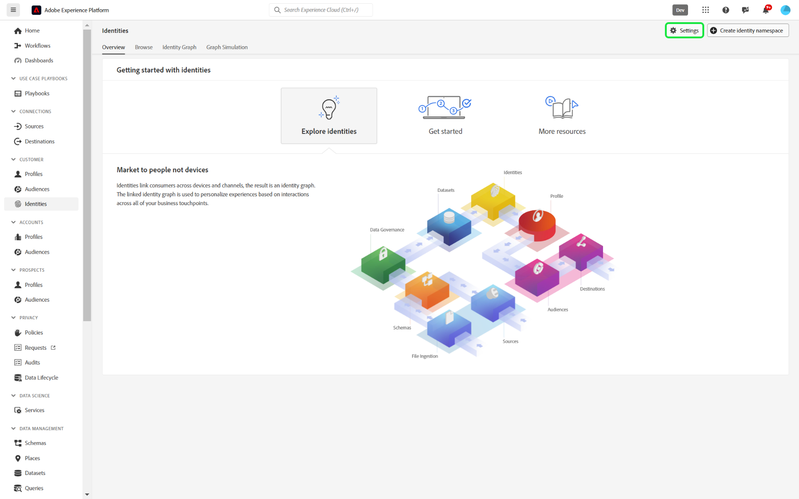
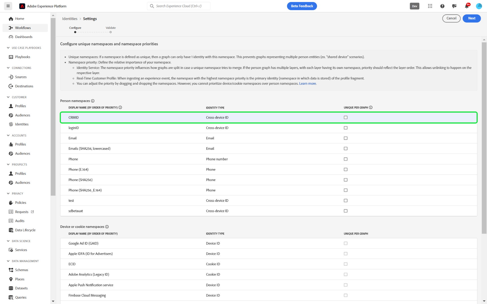
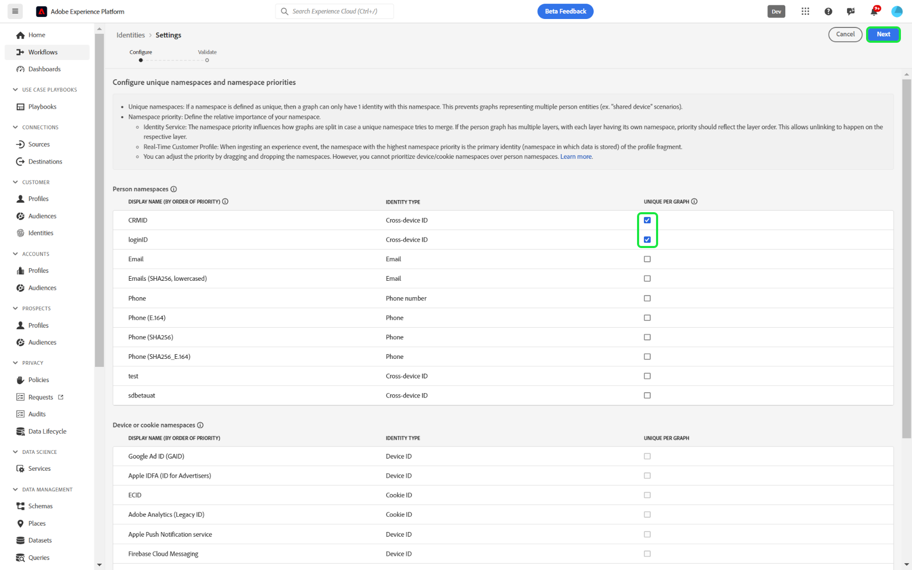
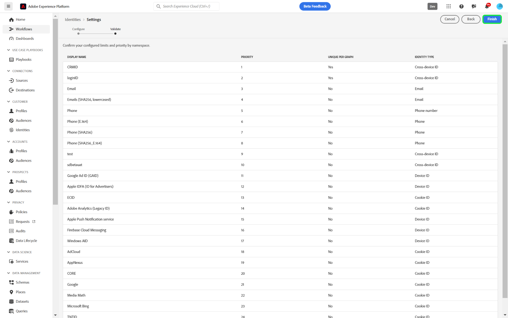
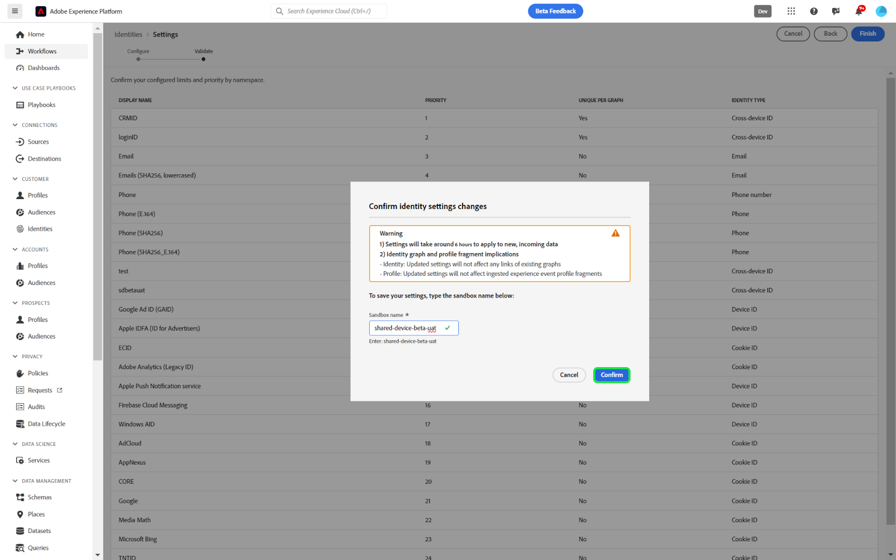

# Identity Settings UI

>[!AVAILABILITY]
>
>Identity graph linking rules is currently in Limited Availability. Contact your Adobe account team for information on how to access the feature in development sandboxes.

Identity settings is a feature in the Adobe Experience Platform Identity Service UI that you can use to designate unique namespaces and configure namespace priority.

Read this guide to learn how to configure your identity settings in the UI.

## Prerequisites 

Read the following documents before you start working with identity settings:

* [Identity graph linking rules](./overview.md)
* [Identity optimization algorithm](./identity-optimization-algorithm.md)
* [Implementation guide](./implementation-guide.md)
* [Examples of graph configurations](./example-configurations.md)
* [Namespace priority](./namespace-priority.md)
* [Graph simulation](./graph-simulation.md)

## Configure your identity settings

To access identity settings, navigate to the Identity Service workspace in the Adobe Experience Platform UI and then select **[!UICONTROL Settings]**.

The identity settings page is divided into two sections: [!UICONTROL Person namespaces] and [!UICONTROL Device or cookie namespaces]. Person namespaces are identifiers for single individuals. They can be cross-device IDs, email addresses, and phone numbers. Device or cookie namespaces are identifiers for devices and web browsers and cannot be given a higher priority than person namespaces. You also cannot designate a device or cookie namespace to be a unique namespace.

### Configure namespace priority

To configure namespace priority, select a namespace in the identity settings menu and then drag and drop that namespace to the order of your liking. Place a namespace higher on the list to give it a higher priority, and conversely, place a namespace lower on the list to give it a lower priority. The namespace with the highest priority should also be designated as a unique namespace.

### Designate your unique namespace

To designate a unique namespace, select the [!UICONTROL Unique per graph] checkbox that corresponds with that namespace. You can select up to three unique namespaces for your identity settings configuration.

Once your unique namespaces are established, graphs will no longer be able to have multiple identities that contain a unique namespace. For example, if you designated CRMID as a unique namespace, then a graph can only have one identity with the CRMID namespace. For more information, read the [identity optimization algorithm overview](./identity-optimization-algorithm.md#unique-namespace).

When you are finished with your configurations, select **[!UICONTROL Next]**. A confirmation message appears, use this opportunity to verify that your configurations are correct and then select **[!UICONTROL Finish]**.

A warning message appears, indicating that existing graphs will only be affected by the graph algorithm only if the graphs get updated **after saving your settings**, and that the primary identity of event fragments on Real-Time Customer Profile will not be updated even after namespace priority changes. Additionally, you are notified that it  will take up to **six hours** for your new or updated settings to take effect. To confirm, enter your sandbox name and then select **[!UICONTROL Confirm]**.

## Next steps

For more information on identity graph linking rules, read the following documentation:

* [Identity graph linking rules overview](./overview.md)
* [Identity optimization algorithm](./identity-optimization-algorithm.md)
* [Implementation guide](./implementation-guide.md)
* [Examples of graph configurations](./example-configurations.md)
* [Troubleshooting and FAQ](./troubleshooting.md)
* [Namespace priority](./namespace-priority.md)
* [Graph simulation UI](./graph-simulation.md)