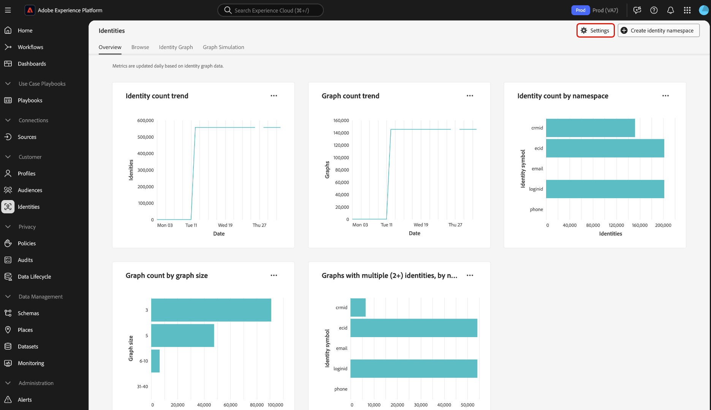
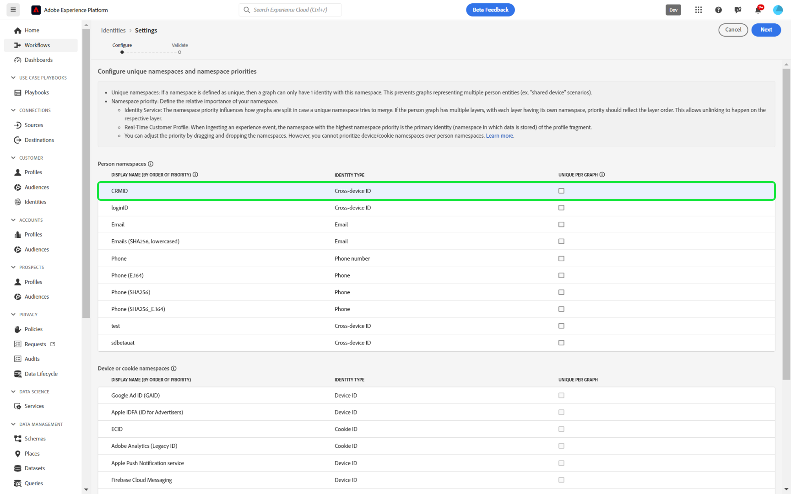
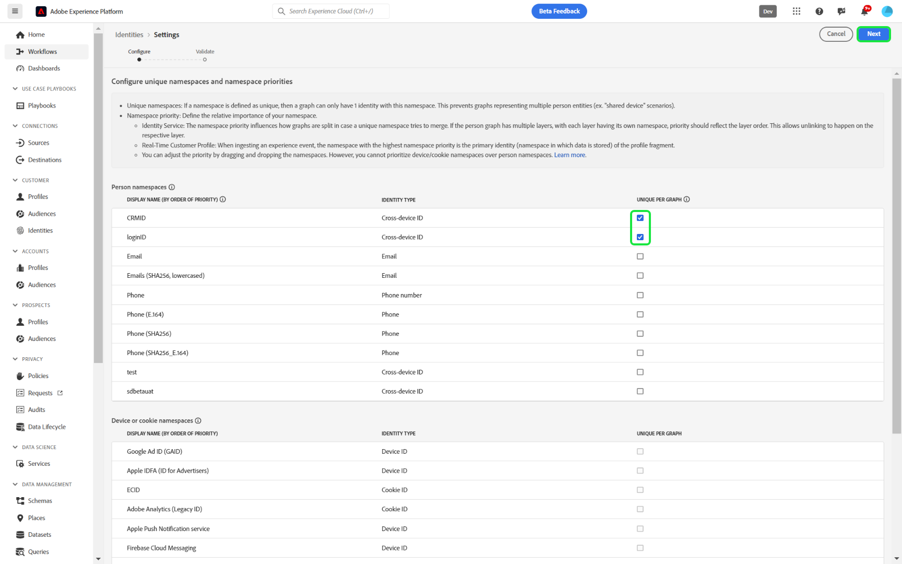
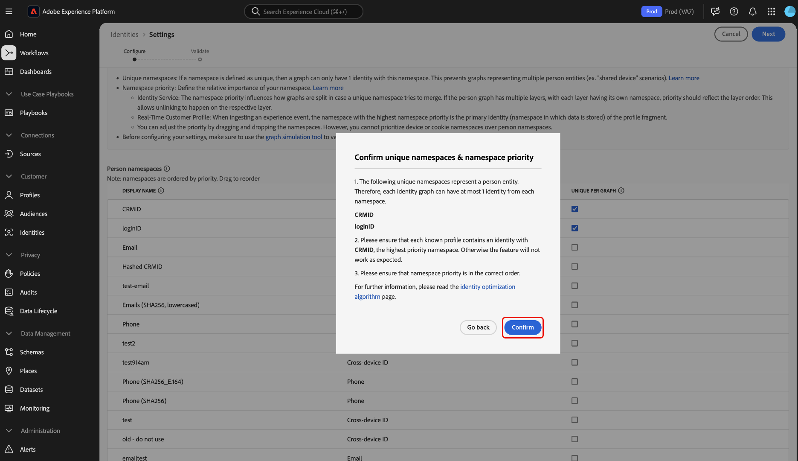
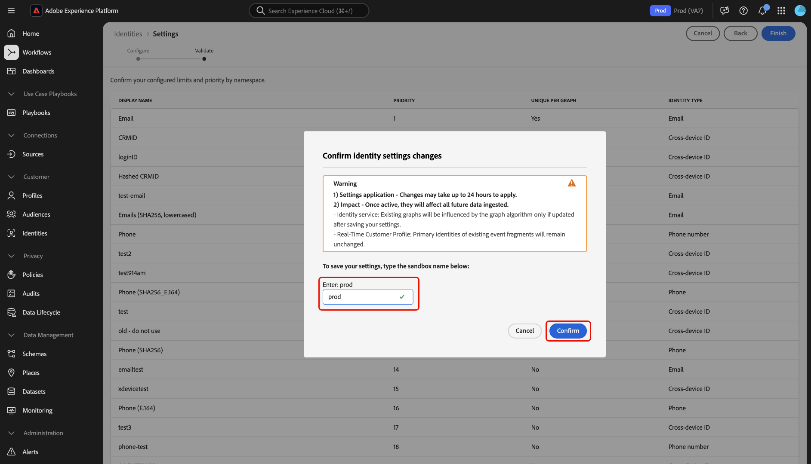

# Identity Settings UI

>[!IMPORTANT]
>
>[!DNL Identity Graph Linking Rules] is now generally available. Contact your Adobe Account Team or Adobe Support if you have an existing sandbox that requires collapsed graphs to be un-collapsed ("fixed") after you enable identity settings.

Identity settings is a feature in the Adobe Experience Platform Identity Service UI that you can use to designate unique namespaces and configure namespace priority.

Watch the following video for additional information on using the [!DNL Graph Simulation] interface in the Identity Service UI workspace:

>[!VIDEO](https://video.tv.adobe.com/v/3458487/?learn=on&enablevpops)

Read this guide to learn how to configure your identity settings in the UI.

## Prerequisites 

Read the following documents before you start working with identity settings:

* [[!DNL Identity Graph Linking Rules]](./overview.md)
* [Identity Optimization Algorithm](./identity-optimization-algorithm.md)
* [Implementation guide](./implementation-guide.md)
* [Examples of graph configurations](./example-configurations.md)
* [Namespace priority](./namespace-priority.md)
* [Graph simulation](./graph-simulation.md)

### Set permissions {#set-permissions}

Next, you must ensure that your account is provisioned with the following permissions:

* **[!UICONTROL View Identity Settings]**: Apply this permission to be able to view unique namespaces and namespace priority in the identity namespace browse page.
* **[!UICONTROL Edit Identity Settings]**: Apply this permission to be able to edit and save your identity settings.

Contact your administrator if you do not have these permissions. For more information , read the [permissions guide](../../access-control/abac/ui/permissions.md).

## Configure your identity settings

To access identity settings, navigate to the Identity Service workspace in the Adobe Experience Platform UI and then select **[!UICONTROL Settings]**.

The identity settings page is divided into two sections: [!UICONTROL Person namespaces] and [!UICONTROL Device or cookie namespaces]. Person namespaces are identifiers for single individuals. They can be cross-device IDs, email addresses, and phone numbers. Device or cookie namespaces are identifiers for devices and web browsers and cannot be given a higher priority than person namespaces. You also cannot designate a device or cookie namespace as a unique namespace.

### Configure namespace priority

To configure namespace priority, select a namespace in the identity settings menu and then drag and drop that namespace to the order of your liking. Place a namespace higher on the list to give it a higher priority, and conversely, place a namespace lower on the list to give it a lower priority. The namespace with the highest priority should also be designated as a unique namespace.

### Designate your unique namespace

To designate a unique namespace, select the [!UICONTROL Unique per graph] checkbox that corresponds with that namespace. You can select **up to a maximum of three unique namespaces** for your identity settings configuration.

Once your unique namespaces are established, graphs will no longer be able to have multiple identities that contain a unique namespace. For example, if you designated CRMID as a unique namespace, then a graph can only have one identity with the CRMID namespace. For more information, read the [Identity Optimization Algorithm overview](./identity-optimization-algorithm.md#unique-namespace).

When you are finished with your configurations, select **[!UICONTROL Next]** to proceed.

From here, you must confirm the following before proceeding to the final step:

1. The selected unique namespaces.
2. The existence of an identity with the highest prioritized unique namespace in each known profile.
3. The order of your namespace priority.

### Confirm your settings {#confirm-your-settings}

>[!IMPORTANT]
>
>* The final step is another confirmation message indicating that existing graphs will only be affected by the graph algorithm **only if the graphs get updated after saving your settings**, and that the primary identity of event fragments on Real-Time Customer Profile will not be updated even after namespace priority changes.
>
>* It will take up up to  **24 hours** for your new or updated settings to take effect. To confirm, enter your sandbox name and then select **[!UICONTROL Confirm]**. 
>
>* There will be no changes to your data until you save your identity settings.

## Next steps

For more information on [!DNL Identity Graph Linking Rules], read the following documentation:

* [[!DNL Identity Graph Linking Rules] overview](./overview.md)
* [Identity Optimization Algorithm](./identity-optimization-algorithm.md)
* [Implementation guide](./implementation-guide.md)
* [Examples of graph configurations](./example-configurations.md)
* [Troubleshooting and FAQ](./troubleshooting.md)
* [Namespace priority](./namespace-priority.md)
* [Graph simulation UI](./graph-simulation.md)