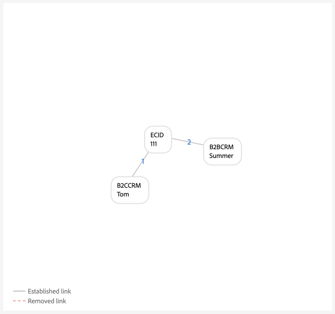
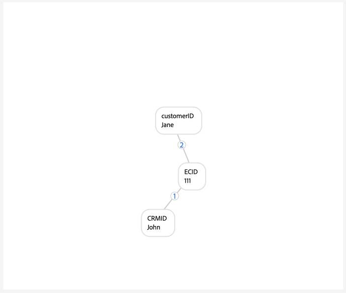
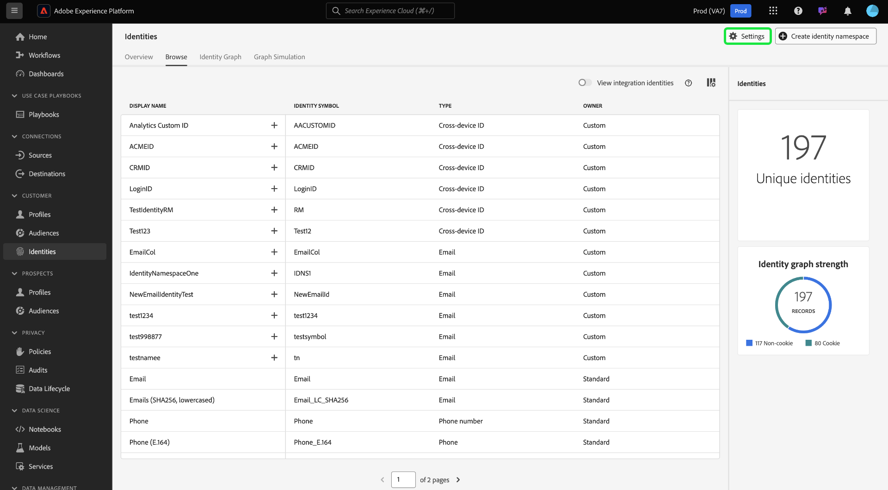
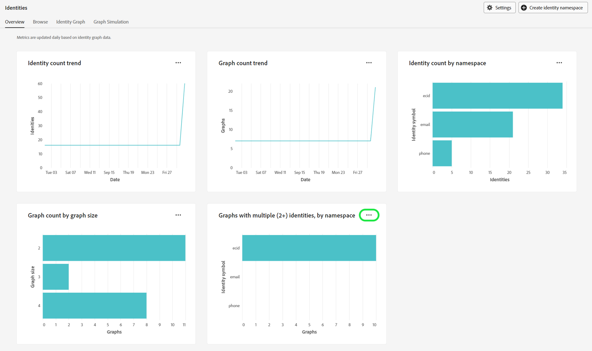
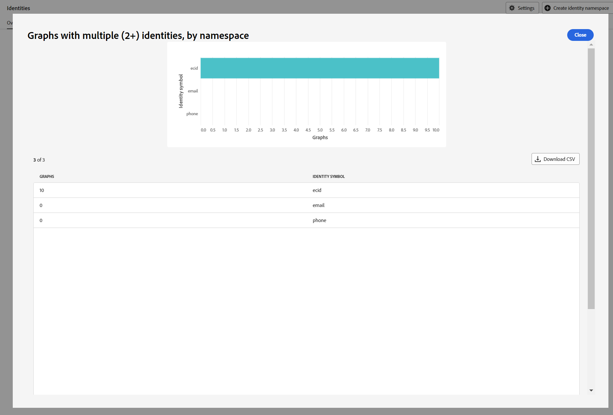
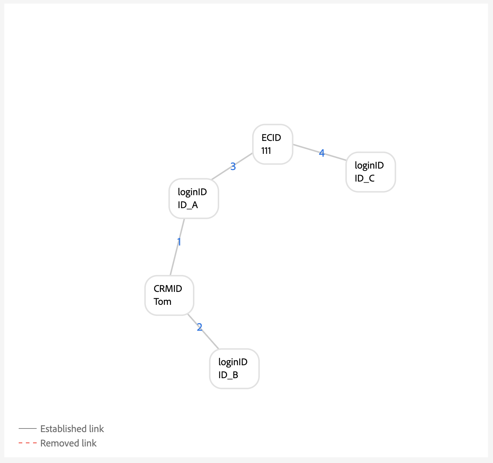
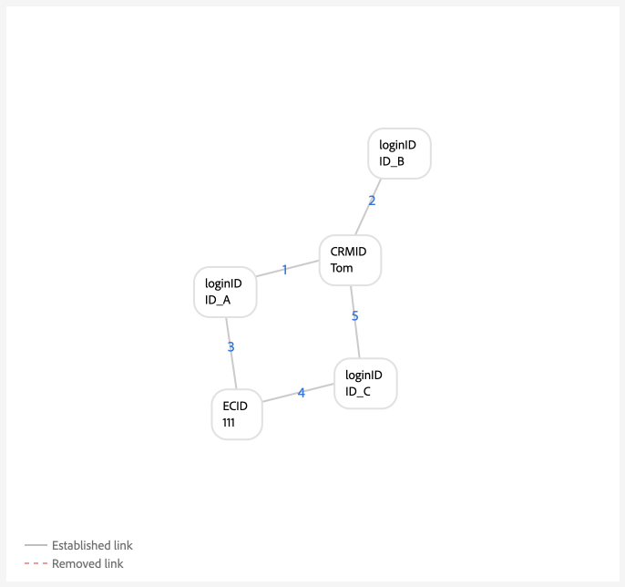
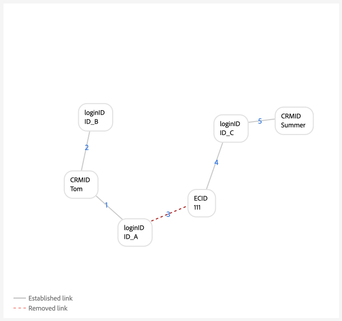

# Implementation guide for identity graph linking rules

>[!AVAILABILITY]
>
>Identity Graph Linking Rules is currently in Limited Availability, and can be accessed by all customers in development sandboxes.
>
>* **Activation requirements**: The feature will remain inactive until you configure and save your [!DNL Identity Settings]. Without this configuration, the system will continue to operate normally, with no changes in behavior.
>* **Important notes**: During this Limited Availability phase, Edge segmentation may produce unexpected segment membership results. However, streaming and batch segmentation will function as expected.
>* **Next steps**: For information on how to enable this feature in production sandboxes, please contact your Adobe account team.

>[!IMPORTANT]
>
>This document assumes that you are starting your implementation in a new sandbox without any data.

Read this document for a step-by-step by guide that you can follow when implementing your data with Adobe Experience Platform Identity Service.

Step-by-step outline:

1. [Complete prerequisites for implementation](#prerequisites-for-implementation)
2. [Create the necessary identity namespaces](#namespace)
3. [Use the graph simulation tool to familiarize yourself with the identity optimization algorithm](#graph-simulation)
4. [Use the identity settings UI to designate your unique namespaces and configure priority rankings for your namespaces](#identity-settings)
5. [Create an Experience Data Model (XDM) schema](#schema)
6. [Create a dataset](#dataset)
7. [Ingest your data to Experience Platform](#ingest)

## Prerequisites for implementation {#prerequisites-for-implementation}

This section outlines prerequisite steps that you must complete prior to implementing [!DNL Identity Graph Linking Rules] to your data.

### Unique namespace

#### Single person namespace requirement {#single-person-namespace-requirement}

You must ensure that the unique namespace with the highest priority is always present in every profile. Doing so allows Identity Service to detect the appropriate person identifier in a given graph. 

+++Select to view an example of a graph without a singular person identifier namespace

Without a unique namespace to represent your person identifiers, you may end up with a graph that links to disparate person identifiers to the same ECID. In this example, both B2BCRM and B2CCRM are linked to the same ECID at the same time. This graph suggests that Tom, using his B2C login account, shared a device with Summer, using her B2B login account. However, the system will recognize that this is one profile (graph collapse).



+++

+++Select to view an example of a graph with a single person identifier namespace

Given a unique namespace, (in this case, a CRMID instead of two disparate namespaces), Identity Service is able to discern the person identifier that was last associated with the ECID. In this example, because a unique CRMID exists, Identity Service is able to recognize a "shared device" scenario, where two entities are sharing the same device.


+++

### Namespace priority configuration

If you are using the [Adobe Analytics source connector](../../sources/tutorials/ui/create/adobe-applications/analytics.md) to ingest data, then you must give your ECIDs a higher priority than Adobe Analytics ID (AAID) because Identity Service blocks AAID. By prioritizing ECID, you can instruct Real-Time Customer Profile to store unauthenticated events to ECID instead of AAID.

### XDM experience events {#xdm-experience-events}

>[!CONTEXTUALHELP]
>id="platform_identities_linkingrules_xdm"
>title="Ensure that you have a single person identifier"
>abstract="During your pre-implementation process, you must ensure that the authenticated events that your system will send to Experience Platform always contain a **single** person identifier, such as a CRMID."

During your pre-implementation process, you must ensure that the authenticated events that your system will send to Experience Platform always contain a **single** person identifier, such as a CRMID.

* (Recommended) Authenticated events with one unique person identifier.
* (Not recommended) Authenticated events with two unique person identifiers. If you have more than one unique person identifiers, then you may encounter an unwanted graph collapse.
* (Not recommended) Authenticated events without any unique person identifiers. If you do not have any unique person identifiers, then both unauthenticated and authenticated events will be stored against the ECID.

>[!BEGINTABS]

>[!TAB Authenticated events with one person identifier]

```json
{
  "_id": "test_id",
  "identityMap": {
      "ECID": [
          {
              "id": "62486695051193343923965772747993477018",
              "primary": false
          }
      ],
      "CRMID": [
          {
              "id": "John",
              "primary": true
          }
      ]
  },
  "timestamp": "2024-09-24T15:02:32+00:00",
  "web": {
      "webPageDetails": {
          "URL": "https://business.adobe.com/",
          "name": "Adobe Business"
      }
  }
}
```

>[!TAB Authenticated events with two person identifiers]

If your system sends two person identifiers, the implementation may fail the single-person namespace requirement. For example, if the identityMap in your webSDK implementation contains a CRMID, a customerID, and an ECID namespace, then there is no guarantee that every single event will contain both CRMID and customerID.

You should **not** send a payload like below:

```json
{
  "_id": "test_id",
  "identityMap": {
      "ECID": [
          {
              "id": "62486695051193343923965772747993477018",
              "primary": false
          }
      ],
      "CRMID": [
          {
              "id": "John",
              "primary": true
          }
      ],
      "customerID": [
          {
            "id": "Jane",
            "primary": false
          }
      ],
  },
  "timestamp": "2024-09-24T15:02:32+00:00",
  "web": {
      "webPageDetails": {
          "URL": "https://business.adobe.com/",
          "name": "Adobe Business"
      }
  }
}
```

However, it is important to note that while you can send two person identifiers, there is no guarantee that an unwanted graph collapse will be prevented due to implementation or data errors. Consider the following scenario:

* `timestamp1` = John logs in -> system captures `CRMID: John, ECID: 111`. However, `customerID: John` is not present in this event payload.
* `timestamp2` = Jane logs in -> system captures `customerID: Jane, ECID: 111`. However, `CRMID: Jane` is not present in this event payload.

Therefore, it is best practice to only send just one person identifier with your authenticated events.

In graph simulation, this ingestion may look like:



>[!TAB Authenticated events without any person identifiers]

In this example, you can assume that the following event was sent to Experience Platform while John (the end-user) was browsing your website while authenticated. However, despite being authenticated, Experience Platform is unable to identify John due to the lack of person identifiers in the event. Therefore, this event gets interpreted as an anonymous user browsing the Adobe Business website, instead of recognizing it as an online activity associated specifically to John.

```json
{
    "_id": "test_id",
    "identityMap": {
        "ECID": [
            {
                "id": "62486695051193343923965772747993477018",
                "primary": false
            }
        ]
    },
    "timestamp": "2024-09-24T15:02:32+00:00",
    "web": {
        "webPageDetails": {
            "URL": "https://business.adobe.com/",
            "name": "Adobe Business"
        }
    }
}
```

>[!ENDTABS]

## Set permissions {#set-permissions}

The first step in the implementation process for Identity Service is to ensure that your Experience Platform account is added to a role that is provisioned with the necessary permissions. Your administrator can configure permissions for your account by navigating to the Permissions UI in Adobe Experience Cloud. From there, your account must be added to a role with the following permissions:

* [!UICONTROL View Identity Settings]: apply this permission to be able to view unique namespaces and namespace priority in the identity namespace browse page.
* [!UICONTROL Edit Identity Settings]: apply this permission to be able to edit and save your identity settings.

For more information on permissions, read the [permissions guide](../../access-control/abac/ui/permissions.md).

## Create your identity namespaces {#namespace}

If your data requires it, you must first create the appropriate namespaces for your organization. For steps on how to create a custom namespace, read the guide on [creating a custom namespace in the UI](../features/namespaces.md#create-custom-namespaces).

## Use graph simulation tool {#graph-simulation}

Next, navigate to the [graph simulation tool](./graph-simulation.md) in the Identity Service UI workspace. You can use the graph simulation tool to simulate identity graphs, built with a variety of different unique namespace and namespace priority configurations. 

By creating different configurations, you can use the graph simulation tool to learn and better understand how the identity optimization algorithm and certain configurations can affect how your graph behaves.

## Configure identity settings {#identity-settings}

Once you have a better idea of how you want your graph to behave, navigate to the [identity settings UI](./identity-settings-ui.md) in the Identity Service UI workspace. To access the identity settings UI, select **[!UICONTROL Identities]** from the left navigation and then select **[!UICONTROL Settings]**.



Use the identity settings UI to designate your unique namespaces and configure your namespaces by order of priority. Once you are finished with applying your settings, you must wait at least six hours before you can proceed to ingest data, as it takes at least six hours for new settings to be reflected in Identity Service.

For more information, read the [identity settings UI guide](./identity-settings-ui.md).

## Create an XDM schema {#schema}

With your unique namespaces and namespace priorities established, you can now proceed to required set up in order to ingest your data. First, you must create an XDM schema. Depending on your data, you may need to create a schema for both XDM Individual Profile and XDM ExperienceEvent.

To ingest data into Real-Time Customer Profile, you must ensure that your schema contains at least one field that has been designated as the primary identity. By setting a primary identity, you can enable a given schema for Profile ingestion.

For instructions on how to create a schema, read the guide on [creating an XDM schema in the UI](../../xdm/tutorials/create-schema-ui.md).

## Create a dataset {#dataset}

Next, create a dataset to provide a structure for the data that you are going to ingest. A dataset is a storage and management construct for a collection of data, typically a table, that contains a schema (columns) and fields (rows). Datasets work in tandem with schemas, and to ingest data to Real-Time Customer Profile, your dataset must be enabled for Profile ingestion. In order for your dataset to be enabled for Profile, it must reference a schema that is enabled for Profile ingestion.

For instructions on how to create a dataset, read the [dataset UI guide](../../catalog/datasets/user-guide.md).

## Ingest your data {#ingest}

By this point, you should have the following:

* The necessary permissions to access Identity Service features.
* Namespaces for your data.
* Designated unique namespaces and configured priorities for your namespaces.
* At least one XDM schema. (Depending on your data and specific use case, you may need to create both profile and experience event schemas.)
* A dataset that is based off of your schema.

Once you have all of the items listed above, then you can begin ingesting your data to Experience Platform. You can perform data ingestion through several different ways. You can use the following services to bring your data to Experience Platform:

* [Batch and streaming ingestion](../../ingestion/home.md) 
* [Data collection in Experience Platform](../../collection/home.md)
* [Experience Platform sources](../../sources/home.md)

>[!TIP]
>
>Once your data is ingested, the XDM raw data payload does not change. You may still see your primary identity configurations iin the UI. However, these configurations will be overridden by identity settings.

For any feedback, use the **[!UICONTROL Beta feedback]** option in the Identity Service UI workspace.

## Validate your graphs {#validate}

Use the identity dashboard for insights on the state of your identity graphs, such as your overall identity count and graph count trends, identity count by namespace, and graph count by graph size. You can also use the identity dashboard to view trends on graphs with two or more identities, organized by namespace. 

Select the ellipses (`...`) and then select **[!UICONTROL View more]** for further information and to validate that there are no collapsed graphs.



Use the window that appears to view information on your collapsed graphs. In this example, both email and phone are marked as unique namespace, so therefore, there are no collapsed graphs in your sandbox.



## Appendix {#appendix}

Read this section for additional information that you can refer to when implementing your identity settings and unique namespaces.

### Dangling loginID scenario {#dangling-loginid-scenario}

The following graph simulates a "dangling" loginID scenario. In this example, two different loginIDs are bound to the same ECID. However, `{loginID: ID_C}` is not linked to the CRMID. Therefore, there is no way for Identity Service to detect that these two loginIDs represent two different entities. 

>[!BEGINTABS]

>[!TAB Ambiguous loginID]

In this example, `{loginID: ID_C}` is left dangling and unlinked to a CRMID. Thus, the person entity that this loginID should be associated with is left ambiguous.



>[!TAB loginID is linked to a CRMID]

In this example, `{loginID: ID_C}` is linked to `{CRMID: Tom}`. Therfore, the system is able to discern that this loginID is associated with Tom.



>[!TAB loginID is linked to another CRMID]

In this example, `{loginID: ID_C}` is linked to `{CRMID: Summer}`. Therefore, the system is able to discern that this loginID is associated with another person entity, in this case, Summer. 

This example also shows that Tom and Summer are to disparate person entities that are sharing a device, which is represented by `{ECID: 111}`.



>[!ENDTABS]

## Next steps

For more information on [!DNL Identity Graph Linking Rules], read the following documentation:

* [[!DNL Identity Graph Linking Rules] overview](./overview.md)
* [Identity optimization algorithm](./identity-optimization-algorithm.md)
* [Examples of graph configurations](./example-configurations.md)
* [Troubleshooting and FAQ](./troubleshooting.md)
* [Namespace priority](./namespace-priority.md)
* [Graph simulation UI](./graph-simulation.md)
* [Identity settings UI](./identity-settings-ui.md)
