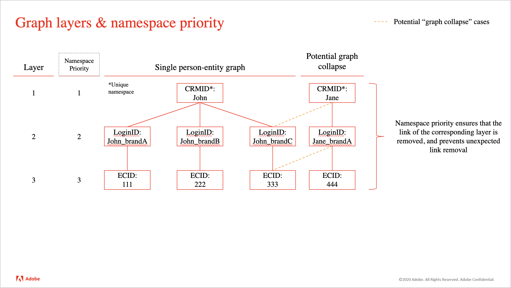
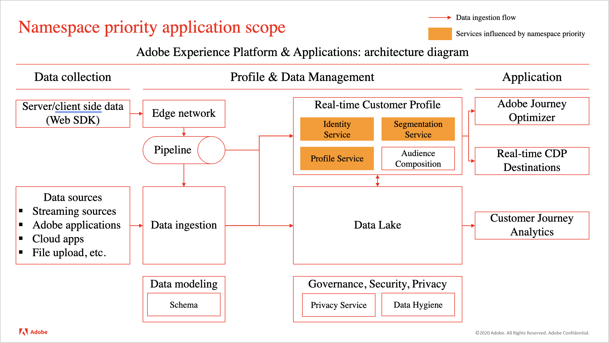
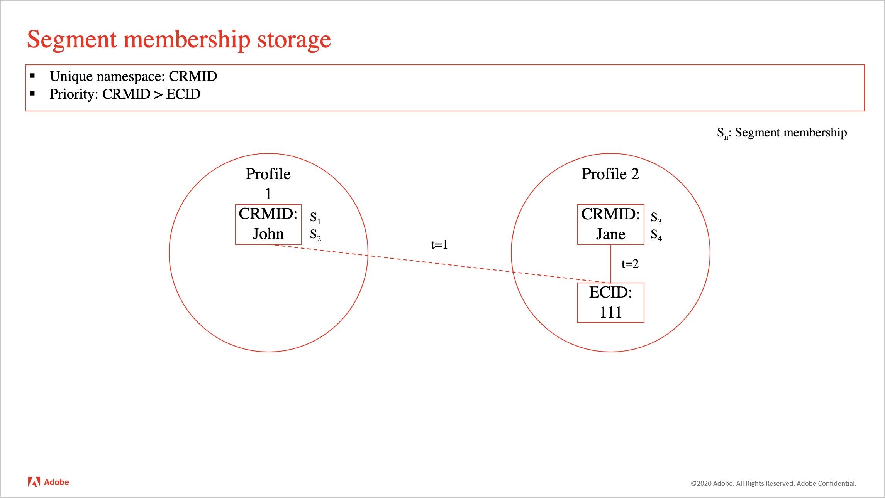

# Namespace priority {#namespace-priority}

>[!CONTEXTUALHELP]
>id="platform_identities_namespacepriority"
>title="Namespace Priority"
>abstract="Namespace priority determines how links are removed from the identity graph."

Every customer implementation is unique and tailored to meet a particular organization's goals, and as such, the importance of a given namespace varies from customer to customer. Real-world examples include:

* Your company might consider each email address to represent a single-person entity and therefore use [identity settings](./identity-settings-ui.md) to configure the email namespace as unique. Another company, however, might want to represent single-person entities as having multiple email addresses, and thus configure the email namespace as not-unique. These companies would need to use another identity namespace as unique, such as a CRMID namespace, so there can be a single-person identifier linked to the multiple email addresses.
* You might collect online behavior using a "Login ID" namespace. This Login ID could have a 1:1 relationship with the CRMID, which then stores attributes from a CRM system and may be considered the most important namespace. In this case, you are then determining that the CRMID namespace is a more accurate representation of a person, while the Login ID namespace is the second most important.

You must make configurations in Identity Service that reflect the importance of your namespaces as this influences how profiles and their related identity graphs are formed and split.

## Determine your priorities

Determination of namespace priority is based on the following factors:

### Identity graph structure

If your organization's graph structure is layered, then namespace priority should reflect this so that the correct links are removed in the case of graph collapse.

>[!TIP]
>
>* "Graph collapse" refers to scenarios where multiple disparate profiles are inadvertently merged together into a single identity graph.
>
>* A layered graph refers to identity graphs that have multiple levels of links. View the image below for an example of a graph with three layers.

{zoomable="yes"}

### Semantic meaning of the namespace

An identity represents a real-world object. There are three objects that are represented in the identity graph. In order of importance, they are:

* People (Cross-device, Email, Phone number)
* Hardware device
* Web browser (Cookie)

Person namespaces are relatively immutable compared to hardware devices (such as IDFA, GAID), which are relatively immutable compared to web browsers. Basically, you (person) will always be a single entity, who can have multiple hardware devices (phone, laptop, tablet, etc.), and use multiple browsers (Google Chrome, Safari, FireFox, etc.)

Another way to approach this topic is through cardinality. For a given person entity, how many identities will be created? In most cases, a person will have one CRMID, a handful of hardware device identifiers (IDFA/GAID resets should not happen often), and even more cookies (an individual could conceivably browse on multiple devices, use incognito mode, or reset cookies at any given time). Generally, **lower cardinality indicates a namespace with a higher priority**.

## Validate your namespace priority settings

Once you have an idea of how you will prioritize your namespaces, you can use the Graph Simulation tool in the UI to test out various graph collapse scenarios and ensure that your priority configurations are returning the expected graph results. For more information, read the guide on using the [Graph Simulation tool](./graph-simulation.md).

## Configure namespace priority

Namespace priority can be configured using the [identity settings UI](./identity-settings-ui.md). In the identity settings interface, you may drag and drop a namespace to determine its relative importance.

>[!IMPORTANT]
>
>You cannot prioritize device/cookie namespaces over person namespaces. This restriction ensures that misconfigurations do not happen.

## Namespace priority usage

Currently, namespace priority influences system behavior of Real-Time Customer Profile. The diagram below illustrates this concept. For more information, read the guide on [Adobe Experience Platform and applications architecture diagrams](https://experienceleague.adobe.com/en/docs/blueprints-learn/architecture/architecture-overview/platform-applications).

{zoomable="yes"}

## Identity Service: Identity Optimization Algorithm

For relatively complex graph structures, namespace priority plays an important role in ensuring that the correct links are removed when graph collapse scenarios happen. For more information read the [Identity Optimization Algorithm overview](../identity-graph-linking-rules/identity-optimization-algorithm.md).

## Real-Time Customer Profile: primary identity determination for experience events

* Once you have configured identity settings for a given sandbox, the primary identity for experience events will be determined by the highest namespace priority in the configuration.
  * This is because experience events are dynamic in nature. An identity map may contain three or more identities, and namespace priority ensures that the most important namespace is associated to the experience event.
* As a result, the following configurations **will no longer be used by Real-Time Customer Profile**:
  * The primary identity configuration (`primary=true`) when sending identities in the `identityMap` using the Web SDK, Mobile SDK, or Edge Network API (identity namespace and identity value will continue to be used in Profile). **Note**: Services outside of Real-Time Customer Profile like data lake storage or Adobe Target will continue to use the primary identity configuration (`primary=true`).
  * Any fields marked as primary identity on an XDM Experience Event Class schema.
  * Default primary identity settings in the Adobe Analytics source connector (ECID or AAID).
* On the other hand, **namespace priority does not determine primary identity for profile records**.
  * For profile records, you should continue to define your identity fields in the schema, including the primary identity. Read the guide on [defining identity fields in the UI](/help/xdm/ui/fields/identity.md) for more information.

>[!TIP]
>
>* Namespace priority is **a property of a namespace**. It is a numerical value assigned to a namespace to indicate its relative importance.
>
>* Primary identity is the identity in which a profile fragment is stored against. A profile fragment is a record of data that stores information about a certain user: attributes (for example, CRM records) or events (for example, web site browsing).

### Example scenario

This section provides an example of how priority configuration can affect your data.

Suppose that the following configurations are established for a given sandbox:

| Namespace | Real-world application of the namespace | Priority |
| --- | --- | --- |
| CRMID | User | 1 |
| IDFA | Apple hardware device (iPhone, IPad, etc.) | 2 |
| GAID | Google hardware device (Google Pixel, Pixelbook, etc.)| 3 |
| ECID | Web browser (Firefox, Safari, Google Chrome, etc.)| 4 |
| AAID | Web browser | 5 |

{style="table-layout:auto"}

Given the configurations outlined above, user actions and determination of primary identity, will be resolved as such:

| User action (Experience event) | Authentication state | Data source | Namespaces in event | Namespace of primary identity |
| --- | --- | --- | --- | --- |
| View credit card offer page | Unauthenticated (anonymous) | Web SDK | `{ECID}` | ECID |
| View help page | Unauthenticated | Mobile SDK | `{ECID, IDFA}` | IDFA |
| View checking account balance | Authenticated | Web SDK | `{CRMID, ECID}` | CRMID |
| Sign up for home loan | Authenticated | Analytics source connector | `{CRMID, ECID, AAID}` | CRMID |
| Transfer $1,000 from checking to savings | Authenticated | Mobile SDK | `{CRMID, GAID, ECID}` | CRMID |

{style="table-layout:auto"}

## Segmentation Service: segment membership metadata storage

{zoomable="yes"}

For a given merged profile, segment memberships will be stored against the identity with the highest namespace priority.

For example, assume that there are two profiles:

* Profile 1 represents John.
  * John's profile qualifies for S1 (segment membership 1). For example, S1 could refer to a segment of customers that identify as male.
  * John's profile also qualifies for S2 (segment membership 2). This could refer to a segment of customers whose loyalty status is gold.
* Profile 2 represents Jane.
  * Jane's profile qualifies for S3 (segment membership 3). This could refer to a segment of customers that identify as female.
  * Jane's profile also qualifies for S4 (segment membership 4). This could refer to a segment of customers whose loyalty status is platinum.

If John and Jane share a device, then the ECID (web browser) transfers from one person to another. However, this does not influence the segment membership information stored against John and Jane.

If the segment qualification criteria were solely based on anonymous events stored against the ECID, then Jane would qualify for that segment.

## Implications on other Experience Platform services {#implications}

This section outlines how namespace priority can affect other Experience Platform services.

### Advanced data lifecycle management

Data hygiene record delete requests functions in the following manner, for a given identity:

* Real-Time Customer Profile: Deletes any profile fragment with specified identity as primary identity. **The primary identity on Profile will now be determined based on namespace priority.**
* Data lake: Deletes any record with the specified identity as primary identity. Unlike Real-Time Customer Profile, primary identity in data lake is based on primary identity specified on WebSDK (`primary=true`), or a field marked as primary identity

For more information, read the [advanced lifecycle management overview](/help/hygiene/home.md).

### Computed attributes

If identity settings is enabled, then computed attributes will use namespace priority to store the computed attribute value. For a given event, the identity with the highest namespace priority will have the value of the computed attribute written against it. For more information, read the [computed attributes UI guide](/help/profile/computed-attributes/ui.md).

### Data lake

Data ingestion to data lake will continue to honor the primary identity settings configured on [Web SDK](/help/tags/extensions/client/web-sdk/data-element-types.md#identity-map) and schemas. 

Data lake will not determine primary identity based on namespace priority. For example, Adobe Customer Journey Analytics will continue to use values in the identity map even after namespace priority is enabled (such as, adding a dataset to a new connection), because Customer Journey Analytics consumes their data from data lake.

### Experience Data Model (XDM) Schemas

Any schema that is not an XDM Experience Event, such as XDM Individual Profiles, will continue to honor any [fields that you mark as an identity](/help/xdm/ui/fields/identity.md).

For more information on XDM schemas, read the [schemas overview](/help/xdm/home.md).

### Intelligent services

When selecting your data, you will need to specify a namespace, which will be used to determine the events that compute scores and the events that store the computed scores. You are recommended to select the namespace that represents a person.

* If you are collecting web behavior data using WebSDk, you are recommended to choose the CRMID namespace within the identity map.
* If you are collecting web behavior data using the Analytics source connector, then you should select the identity descriptor (CRMID).

This configuration results in computing scores only using authenticated events.

For more information, read the documents on [Attribution AI](/help/intelligent-services/attribution-ai/overview.md) and [Customer AI](/help/intelligent-services/customer-ai/overview.md).

### Partner-built destinations

Updated audience disqualification results for profiles associated to a shared device may not be sent to downstream destinations. This may happen in certain rare occurrences where:

* Audience qualification is based only on anonymous activity.
* Logins across multiple profiles occur in a short period of time.

For more information on partner-built destinations, read the [destinations overview](/help/destinations/home.md#adobe-built-and-partner-built-destinations).

### Privacy Service

[Privacy Service deletion requests](../privacy.md) function in the following manner, for a given identity:

* Real-Time Customer Profile: Deletes any profile fragment with specified identity value as primary identity. **The primary identity on Profile will now be determined based on namespace priority.**
* Data lake: Deletes any record with the specified identity as primary or secondary identity.

For more information, read the [Privacy service overview](/help/privacy-service/home.md).

### Edge segmentation and Edge Network applications

In the context of [!DNL Identity Graph Linking Rules], there are two main behavioral changes to take note of regarding Edge segmentation and Edge Network applications:

1. The `identityMap` must contain a person namespace that has been marked as unique. Fields marked as an identity (identity descriptors) are not supported.
2. The person namespace must have the `primary = true` configuration when an end-user is browsing while authenticated.

#### Edge segmentation

In a given event, ensure that all of your namespaces that represent a person entity are included in the `identityMap` because [identities sent as XDM fields](/help/xdm/ui/fields/identity.md) are ignored and are not used for segment membership metadata storage.

* **Event applicability**: This behavior applies only to events sent directly to the Edge Network (such as WebSDK and Mobile SDK). Events ingested from [Experience Platform hub](/help/landing/edge-and-hub-comparison.md), such as those ingested with the HTTP API source, other streaming sources, and batch sources, are not subject to this limitation.
* **Edge segmentation specificity**: This behavior is specific to edge segmentation. Batch and streaming segmentation are separate services evaluated on the hub and do not follow the same process. Read the [edge segmentation guide](/help/segmentation/methods/edge-segmentation.md) for more information.
* Read the [Adobe Experience Platform and applications architecture diagrams](https://experienceleague.adobe.com/en/docs/blueprints-learn/architecture/architecture-overview/platform-applications#detailed-architecture-diagram) and [Edge Network and hub comparison](/help/landing/edge-and-hub-comparison.md) pages for more information.

#### Edge Network applications

To ensure applications on the Edge Network have access to the Edge Profile without delay, make sure your events include `primary=true` on the CRMID. This ensures immediate availability without waiting for identity graph updates from hub.

* Applications on Edge Network such as Adobe Target, Offer Decisioning, and Custom Personalization Destinations will continue to depend on the primary identity in events to access profiles from Edge Profile.
* Read the [Experience Platform Web SDK & Edge Network architecture diagram](https://experienceleague.adobe.com/en/docs/blueprints-learn/architecture/architecture-overview/deployment/websdk#experience-platform-webmobile-sdk-or-edge-network-server-api-deployment) for more information on Edge Network behavior.
* Read the documentation on [Data element types](/help/tags/extensions/client/web-sdk/data-element-types.md) and [Identity data in Web SDK](/help/collection/use-cases/identity/id-overview.md) for more information on how to configure primary identity on Web SDK.
* Ensure the ECID is included in the experience event. If the ECID is missing, then it will be added to the event payload with `primary=true`, which may lead to unexpected results.