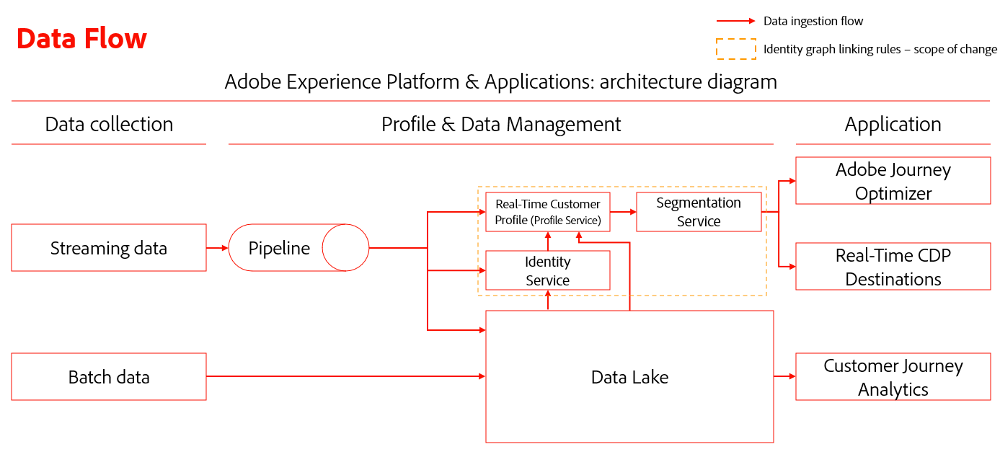
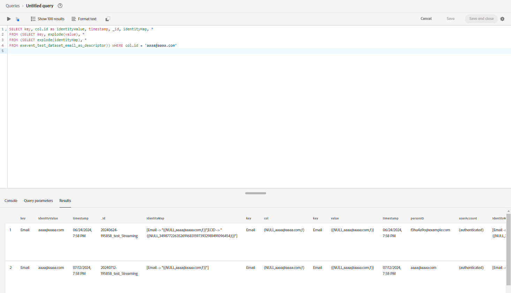
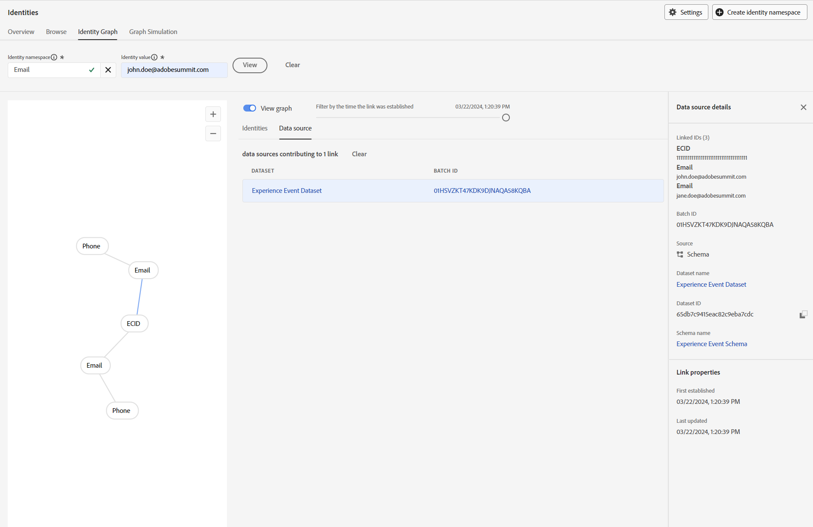
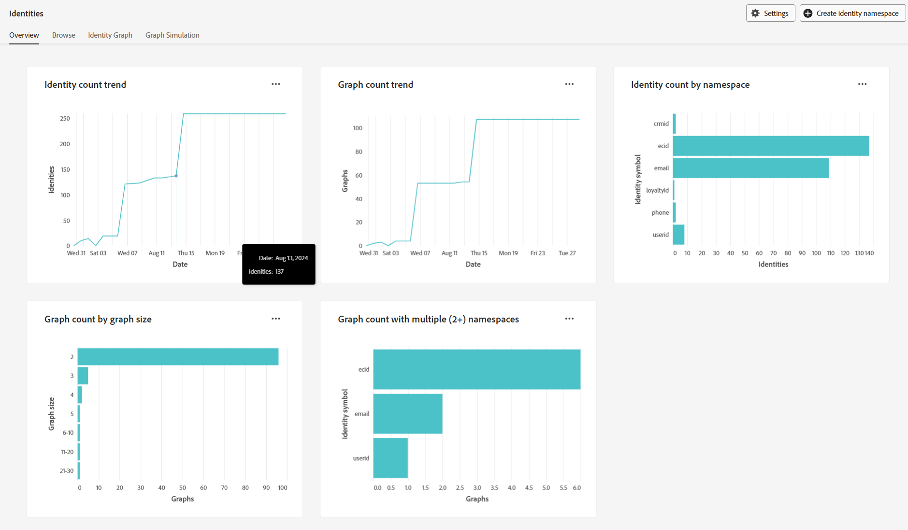

# Troubleshooting guide for [!DNL Identity Graph Linking Rules]

As you test and validate [!DNL Identity Graph Linking Rules], you may run into some issues related to data ingestion and graph behavior. Read this document to learn how to troubleshoot some common issues that you might encounter when working with [!DNL Identity Graph Linking Rules].

## Data ingestion flow overview {#data-ingestion-flow-overview}

The following diagram is a simplified representation of how data flows into Adobe Experience Platform and Applications. Use this diagram as reference to help you get a better understanding of the contents of this page.

{zoomable="yes"}

It is important to note the following factors:

* For streaming data, Real-Time Customer Profile, Identity Service, and data lake will start processing the data when the data is sent. However, the latency to complete the processing of the data is dependent on the service. Usually, data lake will take a longer time to process, compared to Profile and Identity.
  * If the data does not appear when running a query against a dataset even after a couple of hours, then it is likely that the data did not get ingested into Experience Platform.
* For batch data, all data will flow into data lake first, then the data will be propagated to Profile and Identity if the dataset is enabled for Profile and Identity.
* For ingestion-related issues, it is important that the issue is isolated at a service-level for accurate debugging and troubleshooting. There are three potential issue types to consider:

| Ingestion issue type | Does the data get ingested in data lake? | Does the data get ingested in Profile? | Does the data get ingested in Identity Service? |
| --- | --- | --- | --- |
| General ingestion issue | No | No | No |
| Graph issue | Yes | Yes | No |
| Profile fragment issue | Yes | No | Yes |

## Data ingestion issues {#data-ingestion-issues}

>[!NOTE]
>
>* This section assumes that the data has been successfully ingested into data lake and that there were no syntax or other errors that would prevent the data from being ingested into Experience Platform in the first place.
>
>* The examples use ECID as the cookie namespace and CRMID as the person namespace.

### My identities are not getting ingested into Identity Service{#my-identities-are-not-getting-ingested-into-identity-service}

There are various reasons for why this could happen, including, but not limited to the following:

* [The dataset is not enabled for Profile](../../catalog/datasets/enable-for-profile.md).
* The record is skipped because there is only one identity in the event.
* [A validation failure occurred in Identity Service](../guardrails.md#identity-value-validation).
  * For example, an ECID could have exceeded the maximum length of 38 characters.
* By default, [AAIDs are blocked from ingestion](../guardrails.md#identity-namespace-ingestion).
* The identity is removed because of [system guardrails](../guardrails.md#understanding-the-deletion-logic-when-an-identity-graph-at-capacity-is-updated).

Within the context of [!DNL Identity Graph Linking Rules], a record may be rejected from Identity Service because the incoming event has two or more identities with the same unique namespace but different identity value. This scenario usually happens due to implementation errors.

Consider the following event with two assumptions:

1. The field name CRMID is marked as an identity with the namespace CRMID.
2. The namespace CRMID is defined as a unique namespace.

The following event will return an error message indicating that ingestion has failed. 

<!-- because the ingestion of this erroneous event would have resulted in graph collapse. In the following event, two entities (Alice and Bob) are both associated with the same namespace (CRMID). -->

```json
{ 
  "_id": "random_string", 
  "eventType": "web browsing event", 
  "identityMap": { 
    "ECID": [ 
      { 
        "id": "11111111111111111111111111111111111111", 
        "primary": false 
      } 
    ], 
    "CRMID": [ 
      { 
        "id": "Alice", 
        "primary": true 
      } 
    ] 
  }, 
  "CRMID": "Bob", 
  "timestamp": "2024-08-17T15:22:51+00:00", 
  "web": { 
    "webPageDetails": { 
      "URL": "https://www.adobe.com/acrobat.html", 
      "name": "Adobe Acrobat" 
    } 
  } 
} 
```

**Troubleshooting steps**

To resolve this error, you must first collect the following information:

* The identity value (`identity_value`) you expected to be ingested in the identity graph.
* The dataset (`dataset_name`) in which the event was sent in.

Next, use [Adobe Experience Platform Query Service](../../query-service/home.md) and run the following query:

>[!TIP]
>
>Replace `dataset_name` and `identity_value` with the information that you collected.

```sql
  SELECT key, col.id as identityValue, timestamp, _id, identityMap, * 
  FROM (SELECT key, explode(value), * 
  FROM (SELECT explode(identityMap), * 
  FROM dataset_name)) WHERE col.id = 'identity_value' 
```

After running your query, find the event record that you expected to generate a graph, and then validate that the identity values are different in the same row. View the following image for an example:



>[!NOTE]
>
>If the two identities are exactly the same, and if the event is ingested via streaming, then both Identity and Profile will deduplicate the identity.

### Post-authentication ExperienceEvents are being attributed to the wrong authenticated profile

Namespace priority plays an important role in how event fragments determine primary identity.

* Once you have configured and saved your [identity settings](./identity-settings-ui.md) for a given sandbox, Profile will then use [namespace priority](namespace-priority.md#real-time-customer-profile-primary-identity-determination-for-experience-events) to determine the primary identity. In the case of identityMap, Profile will then no longer use the `primary=true` flag.
* While Profile will no longer refer to this flag, other services on Experience Platform may continue to use the `primary=true` flag.

In order for [authenticated user events](implementation-guide.md#ingest-your-data) to be tied to the person namespace, all authenticated events must contain the person namespace (CRMID). This means that even after a user logs in, the person namespace must still be present on every authenticated event.

You may continue to see `primary=true` 'events' flag when looking up a profile in profile viewer. However, this is ignored and will not be used by Profile.

AAIDs are blocked by default. Therefore, if you are using the [Adobe Analytics source connector](../../sources/tutorials/ui/create/adobe-applications/analytics.md), you must ensure that the ECID is prioritized higher than the ECID so that the unauthenticated events will have a primary identity of ECID.

**Troubleshooting steps**

1. To validate that authenticated events contain both the person and cookie namespace, read the steps outlined in the section on [troubleshooting errors regarding data not being ingested to Identity Service](#my-identities-are-not-getting-ingested-into-identity-service).
2. To validate that authenticated events have the primary identity of the person namespace (e.g. CRMID), search the person namespace on profile viewer using no-stitch merge policy (this is the merge policy that does not use private graph). This search will only return events associated to the person namespace. 

### My experience event fragments are not getting ingested into Profile {#my-experience-event-fragments-are-not-getting-ingested-into-profile}

There are various reasons that contribute as to why your experience event fragments are not getting ingested into Profile, including but not limited to:

* [The dataset is not enabled for Profile](../../catalog/datasets/enable-for-profile.md).
* [A validation failure may have occurred on Profile](../../xdm/classes/experienceevent.md).
  * For example, an experience event must contain both an `_id` and a `timestamp`.
  * Additionally, the `_id` must be unique for each event (record).

In the context of namespace priority, Profile will reject any event that contains two or more identities with the highest namespace priority in the given incoming event. For example, assume that your identity settings are configured like the following:

| Namespace | Unique per graph | Priority |
| --- | --- | --- |
| CRMID |  ✔️  | 1 |
| GAID | | 2 |
| ECID | | 3 |

For each scenario, assume that Experience Events contains the following events:

* Scenario 1: 2 GAIDs, 1 ECID
  * In this scenario, Profile does not store any Experience Events because there are multiple GAID namespaces in the incoming event. 
* Scenario 2: 2 CRMIDs, 1 GAID
  * In this scenario, Profile does not store any Experience Events because there are multiple CRMID namespaces in the incoming event.
* Scenario 3: 1 CRMID, 2 GAIDs
  * In this scenario, Profile does not store any Experience Events because there are multiple GAID namespaces in the incoming event.

Essentially, incoming events that contain two or more identities with the highest namespace priorities are considered bad data and are not ingested into Profile and Identity Service.

**Troubleshooting steps**

If your data is sent to data lake, but not Profile, and you believe that this is due to sending two or more identities with the highest namespace priority in a single event, then you may run the following query to validate that there are two different identity values sent against the same namespace:

>[!TIP]
>
>In the following queries, you must:
>
>* Replace `_testimsorg.identification.core.email` with the path sending the identity.
>* Replace `Email` with the namespace with the highest priority. This is the same namespace that is not being ingested.
>* Replace `dataset_name` with the dataset that you wish to query.

```sql
  SELECT identityMap, key, col.id as identityValue, _testimsorg.identification.core.email, _id, timestamp 
  FROM (SELECT key, explode(value), * 
  FROM (SELECT explode(identityMap), * 
  FROM dataset_name)) WHERE col.id != _testimsorg.identification.core.email and key = 'Email' 
```

This query assumes that:

* One identity is sent from the identityMap, and another identity is sent from an identity descriptor. **NOTE**: In Experience Data Model (XDM) schemas, the identity descriptor is the field marked as an identity.
* The CRMID is sent via identityMap. If the CRMID is sent as a field, remove the `key='Email'` from the WHERE clause.

>[!NOTE]
>
>**On WebSDK implementation and ECID duplication**: If the ECID field is marked as an identity (identity descriptor) instead of the identityMap, then a second ECID is generated in the identityMap. This duplication can prevent Real-Time Customer Profile from storing anonymous events due to the presence of two ECIDs in a single event.

## Graph behavior related issues {#graph-behavior-related-issues}

This section outlines common issues you may encounter regarding how the identity graph behaves.

### Unauthenticated ExperienceEvents are getting attached to the wrong authenticated profile

The Identity Optimization Algorithm will honor [the most recently established links and remove the oldest links](./identity-optimization-algorithm.md#identity-optimization-algorithm-details). Therefore, it is possible that once this feature is enabled, ECIDs could be reassigned (re-linked) from one person to another. To understand the history of how an identity gets linked over time, follow the steps below:

**Troubleshooting steps**

>[!NOTE]
>
>The following steps will retrieve information under the following assumptions:
>
>* A single dataset is in use (this will not query multiple datasets).
>
>* The data is not deleted from data lake due to deletion by [Advanced Data Lifecycle Management](../../hygiene/home.md), [Privacy Service](../../privacy-service/home.md), or other services conducting deletion.

First, you must collect the following information:

1. The identity symbol (namespaceCode) of the cookie namespace (e.g. ECID) and the person namespace (e.g. CRMID) that were sent.
  1.1. For Web SDK implementations, these are usually the namespaces included in the identityMap.
  1.2. For Analytics source connector implementations, these are the cookie identifier included in the identityMap. The person identifier is an eVar field marked as an identity.
2. The dataset in which the event was sent in (dataset_name).
3. The identity value of the cookie namespace to look up (identity_value).

Identity symbols (namespaceCode) are case sensitive. To retrieve all identity symbols for a given dataset in the identityMap, run the following query:

```sql
SELECT distinct explode(*)FROM (SELECT map_keys(identityMap) FROM dataset_name)
```

If you do not know the identity value of your cookie identifier and you would like to search for a cookie ID that would have been linked to multiple person identifiers, then you must run the following query. This query assumes ECID as the cookie namespace and CRMID as the person namespace.

>[!BEGINTABS]

>[!TAB Web SDK implementation]

```sql
  SELECT identityMap['ECID'][0]['id'], count(distinct identityMap['CRMID'][0]['id']) as crmidCount FROM dataset_name GROUP BY identityMap['ECID'][0]['id'] ORDER BY crmidCount desc 
```

>[!TAB Analytics source connector implementation]

```sql
  SELECT identityMap['ECID'][0]['id'], count(distinct personID) as crmidCount FROM dataset_name group by identityMap['ECID'][0]['id'] ORDER BY crmidCount desc 
```

**Note:** personID refers to the path of the descriptor. You can find this information under schemas.
 
>[!ENDTABS]

Now that you've identified the cookie values linked to multiple person IDs, take one from the results and use it in the following query to get a chronological view of when that cookie value was linked to a different person identifier: 

>[!BEGINTABS]

>[!TAB Web SDK implementation]

```sql
  SELECT identityMap['CRMID'][0]['id'] as personEntity, * 
  FROM dataset_name 
  WHERE identitymap['ECID'][0].id ='identity_value' 
  ORDER BY timestamp desc 
```

>[!TAB Analytics source connector implementation]

```sql
SELECT _experience.analytics.customDimensions.eVars.eVar10 as personEntity, * 
FROM dataset_name 
WHERE identitymap['ECID'][0].id ='identity_value' 
ORDER BY timestamp desc 
```

**Note**: This example assumes that `eVar10` is marked as an identity. For your configurations, you must change the eVar based on your own organization's implementation.

>[!ENDTABS]

### The Identity Optimization Algorithm is not 'working' as expected

**Troubleshooting steps**

Refer to the documentation on [Identity Optimization Algorithm](./identity-optimization-algorithm.md), as well as the types of graph structures that are supported.

* Read the [graph configuration guide](./example-configurations.md) for examples of supported graph structures.
* You can also read the [implementation guide](./implementation-guide.md#appendix) for examples of unsupported graph structures. There are two scenarios that could happen:
  * No single namespace across all your profiles.
  * A ["dangling ID"](./implementation-guide.md#dangling-loginid-scenario) scenario occurs. In this scenario, Identity Service is unable to determine if the dangling ID is associated with any of the person entities in the graphs.

You can also use the [graph simulation tool in the UI](./graph-simulation.md) to simulate events and configure your own unique namespace and namespace priority settings. Doing so can help give you a baseline understanding of how the Identity Optimization Algorithm should behave. 

If your simulation results match your graph behavior expectations, then you can check and see if your [identity settings](./identity-settings-ui.md) matches the settings that you have configured in your simulation.

### I still see collapsed graphs in my sandbox even after configuring identity settings

Identity graphs will adhere to your configured unique namespace and namespace priority _after_ the settings have been saved. Any "collapsed" graphs that exist _before_ you save your new settings will not be affected, until new data is ingested such that the collapsed graph is updated. The primary identity of event fragments on Real-Time Customer Profile will not be updated even after namespace priority changes. 

**Troubleshooting steps**

You can use the [identity graph viewer](../features/identity-graph-viewer.md) to check whether your graph was ingested before or after your settings. Examine the last updated timestamp under [!UICONTROL Link properties] to see when Identity Service ingested the graph. If the timestamp is before configuration, then that suggests that the "collapsed" graph was created before enabling the feature.



### I want to know how many "collapsed" graphs exist in my sandbox

Use the identity dashboard for insights on the state of your identity graph, such as the count of identities and graphs. Refer to the metric, "Graph count with multiple namespaces" for a count of graphs that have collapsed - these are graphs that contain two or more identities with the same namespace. Assuming that the sandbox has no data, and you have configured a namespace (e.g. CRMID) to be unique, the expectation is that there should be zero graphs that have two or more CRMIDs. In the example below, there are two graphs that contain two or more email addresses.



You can find a detailed breakdown in the [profile snapshot export dataset](../../dashboards/query.md) in data lake by running the query below:

>[!NOTE]
>
>* Replace `dataset_name` with the actual name of your dataset.
>
>* The counts may not exactly match. The identity dashboard is based on the identity graph count and the following query is based on profile count with two or more identities. The data is independently processed and updated by the service.

```sql
  SELECT key, identityCountInGraph, count(identityCountInGraph) as graphCount 
  FROM (SELECT key, cardinality(value) as identityCountInGraph 
  FROM (SELECT explode(identityMap) 
  FROM dataset_name 
  WHERE cardinality(identityMap) > 1)) /* by definition, graphs have 2 or more identities */ 
  WHERE key not in ('ecid', 'aaid', 'idfa', 'gaid') /* filter out common device/cookie namespaces */ 
  GROUP BY 1, 2 
  ORDER BY 1, 2 asc 
```

You can use the following query in profile snapshot export dataset to obtain sample identities from "collapsed" graphs.

```sql
  SELECT identityMap 
  FROM dataset_name 
  WHERE cardinality(identityMap['CRMID'])>1 /* any graphs with 2+ CRMID. Change CRMID namespace if needed */ 
```

>[!TIP]
>
>The two queries listed above will yield expected results if the sandbox is not enabled for the shared device interim approach and will behave differently from [!DNL Identity Graph Linking Rules].

## Frequently asked questions {#faq}

This section outlines a list of answers to frequently asked questions about [!DNL Identity Graph Linking Rules].

## Identity Optimization Algorithm {#identity-optimization-algorithm}

Read this section for answers to frequently asked questions about the [Identity Optimization Algorithm](./identity-optimization-algorithm.md).

### I have a CRMID for each of my business unites (B2C CRMID, B2B CRMID), but I don't have a unique namespace across all of my profiles. What will happen if I mark B2C CRMID and B2B CRMID as unique, and enable my identity settings?

This scenario is unsupported. Therefore, you may see graphs collapse in cases where a user uses their B2C CRMID to login, and another user uses their B2B CRMID to login. For more information, read the section on [single person namespace requirement](./implementation-guide.md#single-person-namespace-requirement) in the implementation page.

### Does Identity Optimization Algorithm 'fix' existing collapsed graphs?

Existing collapsed graphs will be affected ('fixed') by the graph algorithm only if these graphs get updated after you save your new settings.

### If two people log in and out using the same device, what happens to the events? Will all events transfer over to the last authenticated user?

* Anonymous events (events with ECID as primary identity on Real-Time Customer Profile) will transfer to the last authenticated user. This is because the ECID will be linked to the CRMID of the last authenticated user (on Identity Service).
* All authenticated events (events with CRMID defined as primary identity) will remain with the person.

For more information, read the guide on [determining the primary identity for experience events](../identity-graph-linking-rules/namespace-priority.md#real-time-customer-profile-primary-identity-determination-for-experience-events).

### How will journeys in Adobe Journey Optimizer be impacted when the ECID is transferring from one person to another? 

The CRMID of the last authenticated user will be linked to the ECID (shared device). ECIDs can be reassigned from one person to another based on user behavior. The impact will depend on how the journey is constructed, so it is important that customers test out the journey in a development sandbox environment to validate the behavior. 

The key points to highlight are as follows: 

* Once a profile enters a journey, ECID re-assignment does not result in the profile exiting in the middle of a journey.
  * Journey exits are not triggered by graph changes.
* If a profile is no longer associated with an ECID, then this may result in changing the journey path if there is a condition that uses audience qualification. 
  * ECID removal may change events associated to a profile, which could result in changes in audience qualification.
* Re-entry of a journey is dependent on journey properties.
  * If you disable re-entry of a journey, once a profile exits from that journey, the same profile will not re-enter for 91 days (based on global journey timeout).
* If a journey starts with an ECID namespace, the profile that enters and the profile that receives the action (ex. email, offer) may be different depending on how the journey is designed.
  * For example, if there is a wait condition between actions, and the ECID transfers during the waiting period, a different profile may be targeted.
  * With this feature, ECID are no longer always associated with one profile.
  * The recommendation is to start journeys with person namespaces (CRMID).

>[!TIP]
>
>Journeys should look up a profile with a unique namespaces because a non-unique namespace may be re-assigned to another user.
>
>* ECIDs, and non-unique email/phone namespaces could move from one person to another.
>* If a journey has a wait condition and if these non-unique namespaces are used to lookup a profile on a journey, then the journey message may be sent to the incorrect person.

## Namespace priority

Read this section for answers to frequently asked questions about [namespace priority](./namespace-priority.md).

### I've enabled my identity settings. What happens to my settings if I want to add a custom namespace after the settings has been enabled? 

There are two 'buckets' of namespaces: person namespaces and device/cookie namespaces. The newly created custom namespace will have the lowest priority in each 'bucket' so that this new custom namespace does not impact existing data ingestion.

### If Real-Time Customer Profile is no longer using the 'primary' flag on identityMap, does this value still need to be sent? 

Yes, the 'primary' flag on identityMap is used by other services. For more information, read the guide on [the implications of namespace priority on other Experience Platform services](../identity-graph-linking-rules/namespace-priority.md#implications-on-other-experience-platform-services).

### Will namespace priority apply to Profile record datasets in Real-Time Customer Profile?

No. Namespace priority will only apply to Experience Event datasets using the XDM ExperienceEvent Class.

### How does this feature work in tandem with the identity graph guardrails of 50 identities per graph? Does namespace priority affect this system defined guardrail? 

The Identity Optimization Algorithm will be applied first to ensure person entity representation. Afterwards, if the graph tries to exceed the [identity graph guardrail](../guardrails.md) (50 identities per graph), then this logic will be applied. Namespace priority does not affect the deletion logic of the 50 identity/graph guardrail. 

## Testing

Read this section for answers to frequently asked questions about testing and debugging features in [!DNL Identity Graph Linking Rules].

### What are some of the scenarios I should be testing in a development sandbox environment? 

Generally speaking, testing on a development sandbox should mimic the use cases you intend to execute on your production sandbox. Refer to the following table for some key areas to validate, when conducting comprehensive testing: 

| Test case | Test steps | Expected outcome |
| --- | --- | --- |
| Accurate person entity representation | <ul><li>Mimic anonymous browsing</li><li>Mimic two people (John, Jane) logging in using the same device</li></ul> | <ul><li>Both John and Jane should be associated to their attributes and authenticated events.</li><li>The last authenticated user should be associated to the anonymous browsing events.</li></ul> |
| Segmentation | Create four segment definitions (**NOTE**: Each pair of segment definition should have one evaluated using batch and the other streaming.) <ul><li>Segment definition A: Segment qualification based on John's authenticated events and/or attributes.</li><li>Segment definition B: Segment qualification based on Jane's authenticated events and/or attributes.</li></ul> | Regardless of shared device scenarios, John and Jane should always qualify for their respective segments. |
| Audience qualification / unitary journeys on Adobe Journey Optimizer | <ul><li>Create a journey starting with an audience qualification activity (such as the streaming segmentation created above).</li><li>Create a journey starting with a unitary event. This unitary event should be an authenticated event.</li><li>You must disable re-entry when creating these journeys.</li></ul> | <ul><li>Regardless of shared device scenarios, John and Jane should trigger the respective journeys that they should enter.</li><li>John and Jane should not re-enter the journey when the ECID is transferred back to them.</li></ul> |

{style="table-layout:auto"}

### How do I validate that this feature is working as expected?

Use the [graph simulation tool](./graph-simulation.md) to validate that the feature is working at an individual graph level.

To validate the feature at a sandbox level, refer to the [!UICONTROL Graph count with multiple namespaces] section in the identity dashboard.