# [!DNL Identity Graph Linking Rules] configurations guide

Read this document to learn about different implementation types that you can configure using [!DNL Identity Graph Linking Rules].

Customer graph scenarios can be grouped into three different categories.

* **Beginner**: Beginner-level implementations include graphs that most often include simple implementations. These implementations tend to revolve around a single cross-device namespace (for example, CRMID). While beginner-level implementations are fairly straightforward, graph collapse can still occur, often due to **shared device** scenarios.
* **Intermediate**: Intermediate-level implementations include several variables such as **multiple cross-device namespaces**, **non-unique identities**, and **multiple unique namespaces**.
* **Advanced**: Advanced-level implementations involve complex and multi-layered graph scenarios. Advanced implementations will include significant usage of **namespace priority** in order to identify the correct links that must be removed in order to prevent graph collapse.

## Get started

Before diving in to the following document, ensure that you familiarize yourself with several important concepts of Identity Service and [!DNL Identity Graph Linking Rules].

* [Identity Service overview](../home.md)
* [[!DNL Identity Graph Linking Rules] overview](../identity-graph-linking-rules/namespace-priority.md)
* [Namespace priority](namespace-priority.md)
* [Unique namespace](overview.md#unique-namespace)
* [Graph Simulation](graph-simulation.md)

## Beginner-level implementations {#beginner}

Read this section for beginner-level implementations of [!DNL Identity Graph Linking Rules].

### Use case: simple implementation that uses one cross-device namespace

Generally, Adobe customers have a single cross-device namespace that is used across all of their properties including, web, mobile, and applications. This system is both industry and geographically agnostic as customers in retail, telecom, and financial services use this type of implementation.

Typically, an end-user is represented by a cross-device namespace (often a CRMID), therefore, the CRMID should be classified as a unique namespace. An end-user who owns a computer and an [!DNL iPhone] and does not share their device, could have an identity graph like the following.

**Text mode**

```json
CRMID: John, ECID: 123
CRMID: John, ECID: 999, IDFA: a-b-c
```

**Algorithm configuration**

Configure the following settings in the Graph Simulation interface before you simulate your graph.

| Display name | Identity symbol | Identity type | Unique per graph |
| --- | --- | --- | --- |
| CRMID | CRMID | CROSS_DEVICE |  ✔️  |
| ECID | ECID | COOKIE | |
| IDFA | IDFA | DEVICE | |


**Simulated graph**

+++Select to view simulated graph

In this graph,  John (the end-user) is represented by the CRMID. {ECID: 123} represents the web browser that John used on his personal computer to visit your e-commerce platform. {ECID: 999} represents the browser that he used on his [!DNL iPhone] and {IDFA: a-b-c} represents his [!DNL iPhone].


+++

### Exercise

Simulate the following configuration in Graph Simulation. You can either create your own events, or copy and paste using text mode.

>[!BEGINTABS]

>[!TAB Shared device (PC)]

**Shared device (PC)**

You are a data architect at an e-commerce company called **ACME**. John and Jane are your customers. They are end-users who live together in San Jose, California. They share a desktop computer and use this computer to browse your website.

You can implement this use case in Graph Simulation by creating your own events or inputting the following in text mode:

**Text mode:**

```json
CRMID: John, ECID: 111
CRMID: Jane, ECID: 111
```

**Simulated graph**

+++Select to view simulated graph

In this graph, John and Jane are represented by their own respective CRMIDs:

* {CRMID: John}
* {CRMID: Jane}

The browser on the desktop computer that they both use to visit your e-commerce platform is represented by {ECID: 111}. In this graph scenario, Jane is the last authenticated (or most recently active) end-user, and therefore, the link between {ECID: 111} and {CRMID: John} is removed.

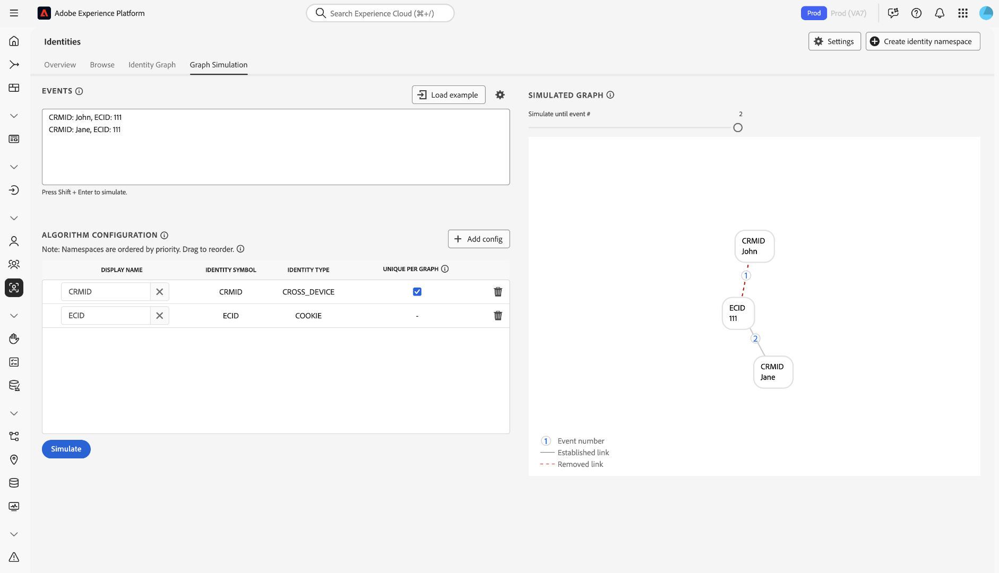

+++

>[!TAB Shared device (mobile)]

**Shared device (mobile)**

Similarly, John and Jane also share an [!DNL iPad] and occasionally use this [!DNL iPad] to browse the internet, including your website.

You can implement this use case in Graph Simulation by creating your own events or inputting the following in text mode:

**Text mode:**

```json
CRMID: John, ECID: 111, IDFA: a-b-c
CRMID: Jane, ECID: 111, IDFA: a-b-c
```

**Simulated graph**

+++Select to view simulated graph

In this graph, John and Jane are both represented by their own respective CRMIDs. The browser that they use is represented by {ECID: 111} and the [!DNL iPad] that they share is represented by {IDFA: a-b-c}. In this graph scenario, Jane is the last authenticated (or most recently active) end-user, and therefore, the links from {ECID: 111} and {IDFA: a-b-c} to {CRMID: John} are removed.

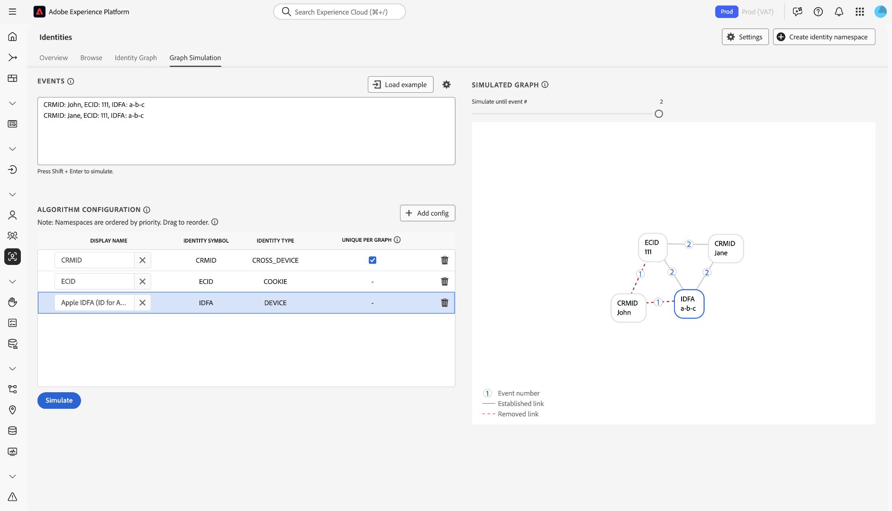

+++

>[!ENDTABS]

### Understanding anonymous event association and how authenticated events are associated

<!-- A common question is: "If the ECID is linked from John to Jane, then will John's events on Real-Time Customer Profile also move over to Jane?" -->

Authenticated events are tied to the end-user and unauthenticated events are tied to the device. There will never be a scenario where Jane's browsing events get associated with John, and vice versa.

* If John logs in and browses your website for shoes (authenticated event), then the primary identity of this authenticated event gets associated with John.
* If Jane logs in and browses your website for jackets (authenticated event), then the primary identity of this authenticated event gets associated with Jane.
* If Jane logs out, and then John uses the same device to browse your website for shoes **without logging in** (unauthenticated event), then the primary identity of this unauthenticated event gets associated with the last authenticated user, which in this case is Jane.

## Intermediate-level implementations {#intermediate}

Read this section for intermediate-level implementations of [!DNL Identity Graph Linking Rules].

### Use case: Your data includes non-unique identities

>[!TIP]
>
>A **non-unique identity** is an identity associated with a non-unique namespace. 

You are a data architect working for a commercial bank that issues credit cards. Your marketing team has indicated that they want to include past credit card transaction history to a profile. This identity graph could look like the following.

**Text mode:**

```json
CRMID: John, CChash: 1111-2222 
CRMID: John, CChash: 3333-4444 
CRMID: John, ECID: 123 
CRMID: John, ECID: 999, IDFA: a-b-c
```

**Algorithm configuration**

Configure the following settings in the Graph Simulation interface before you simulate your graph.

| Display name | Identity symbol | Identity type | Unique per graph |
| --- | --- | --- | --- |
| CRMID | CRMID | CROSS_DEVICE |  ✔️  |
| CChash | CChash | CROSS_DEVICE | |
| ECID | ECID | COOKIE | |
| IDFA | IDFA | DEVICE | |

**Simulated graph**

+++Select to view simulated graph

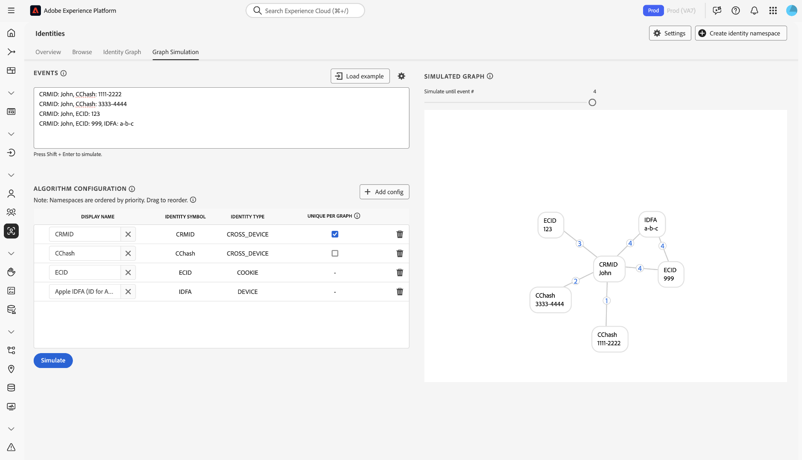

+++

There are no guarantees that these credit card numbers, or any other non-unique namespaces, will always be associated to one single end-user. Two end-users may register with the same credit card, there may be non-unique placeholder values that erroneously ingested. Simply put, non-unique namespaces will cause two CRMIDs to collapse.

To solve this issue, Identity Service removes the oldest links and retains the most recent links. This ensures that you just have one CRMID in a graph, thereby preventing graph collapse.

### Exercise

Simulate the following configurations in Graph Simulation. You can either create your own events, or copy and paste using text mode.

>[!BEGINTABS]

>[!TAB Two end-users with the same credit card]

Two different end-users sign up for your e-commerce website with the same credit card. Your marketing team wants to prevent graph collapse by ensuring that the credit card is associated with just one single profile.

**Text mode:**

```json
CRMID: John, CChash: 1111-2222
CRMID: Jane, CChash: 1111-2222
CRMID: John, ECID: 123
CRMID: Jane, ECID:456
```

**Simulated graph**

+++Select to view simulated graph

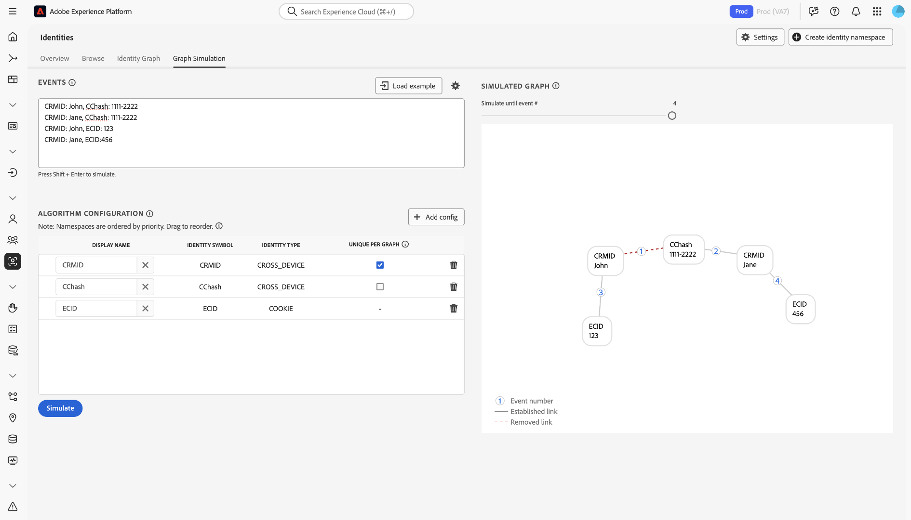

+++

>[!TAB Invalid credit card number]

Due to unclean data, an invalid credit card number is ingested into Experience Platform.

**Text mode:**

```json
CRMID: John, CChash: undefined
CRMID: Jane, CChash: undefined
CRMID: Jack, CChash: undefined
CRMID: Jill, CChash: undefined
```

**Simulated graph**

+++Select to view simulated graph

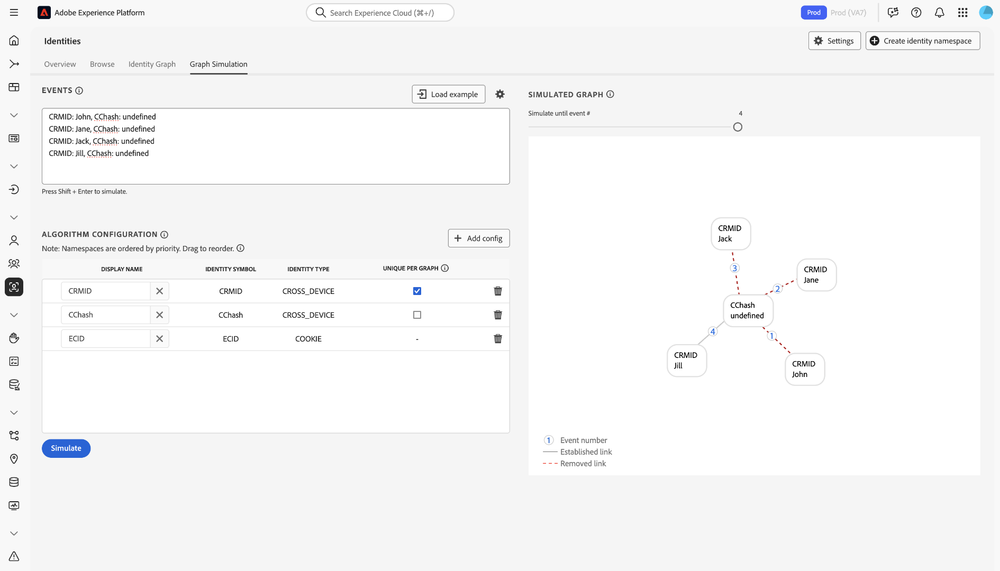

+++

>[!ENDTABS]

### Use case: Your data includes both hashed and unhashed CRMIDs

>[!TIP]
>
>What is a hashed CRMID? What is an unhashed CRMID?

Your customer is ingesting both an unhashed (offline) CRMID and a hashed (online) CRMID. They expect a direct relationship between both unhashed and hashed CRMIDs. However, when a user browses with an authenticated account, the hashed CRMID is sent along with the device ID (represented on Identity Service as an ECID).

**Algorithm configuration**

Configure the following settings in the Graph Simulation interface before you simulate your graph.

| Display name | Identity symbol | Identity type | Unique per graph |
| --- | --- | --- | --- |
| CRMID | CRMID | CROSS_DEVICE | ✔️ |
| CRMIDhash | CRMIDhash | CROSS_DEVICE | ✔️ |
| ECID | ECID | COOKIE | |


**Exercise**

Simulate the following configurations in Graph Simulation. You can either create your own events, or copy and paste using text mode.

>[!BEGINTABS]

>[!TAB Scenario 1: shared device]

John and Jane share a device.

**Text mode:**

```json
CRMID: John, CRMIDhash: John
CRMID: Jane, CRMIDhash: Jane
CRMIDhash: John, ECID: 111 
CRMIDhash: Jane, ECID: 111
```

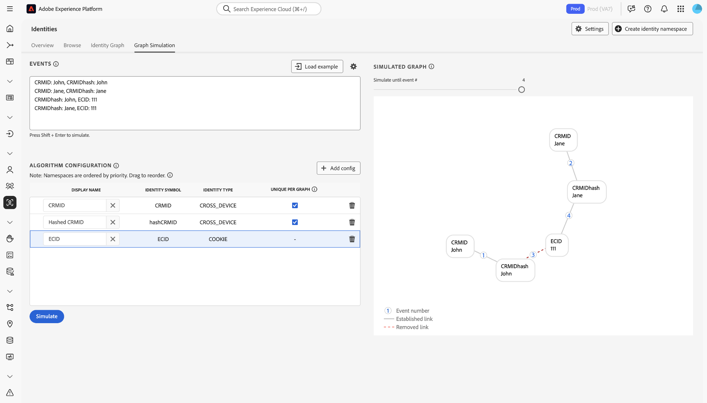

>[!TAB Scenario 2: bad data]

Due to errors in the hashing process, a non-unique hashed CRMID is generated and sent to Identity Service.

**Text mode:**

```json
CRMID: John, CRMIDhash: aaaa
CRMID: Jane, CRMIDhash: aaaa
```

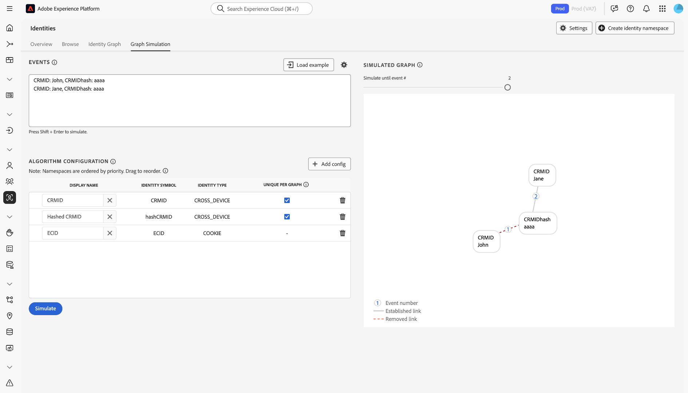

>[!ENDTABS]

### Use case: You are using Real-Time CDP and Adobe Commerce

You have two types of end-users:

* **Members**: An end-user who is assigned a CRMID and has an email account registered to your system.
* **Guests**: An end-user who is not a member. They do not have an assigned CRMID and their email accounts are not registered to your system.

In this scenario, your customers are sending data from Adobe Commerce to Real-Time CDP.

**Exercise**

Simulate the following configurations in the graph simulation tool. You can either create your own events, or copy and paste using text mode.

>[!BEGINTABS]

>[!TAB Shared device between two members]

In this scenario, two members share the same device to browse an e-commerce website.

**Text mode**

```json
CRMID: John, Email: john@g
CRMID: Jane, Email: jane@g
CRMID: John, ECID: 111
CRMID: Jane, ECID: 111
```

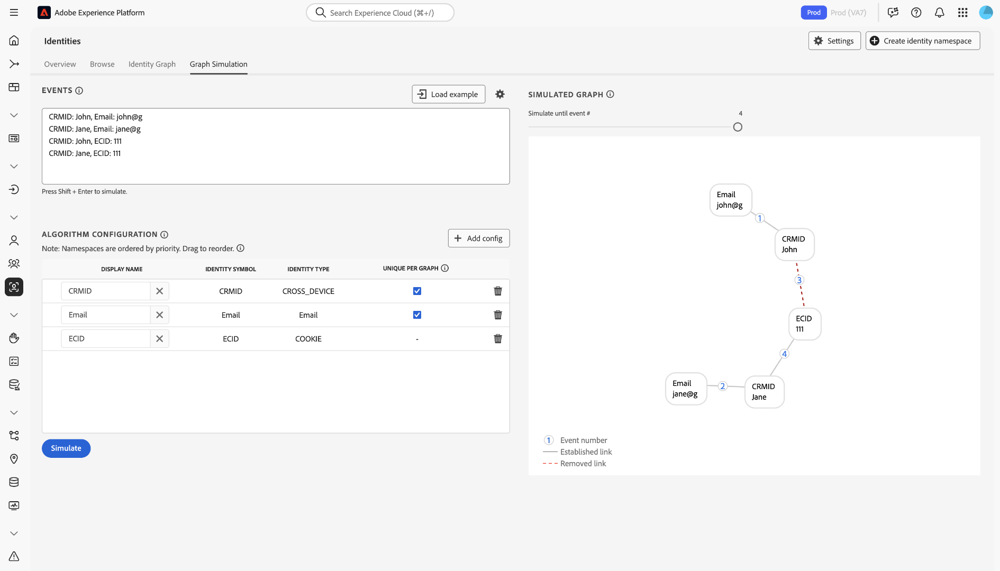

>[!TAB Shared device between two guests]

In this scenario, two guests share the same device to browse an e-commerce website.

**Text mode**

```json
Email: john@g, ECID: 111
Email: jane@g, ECID: 111
```

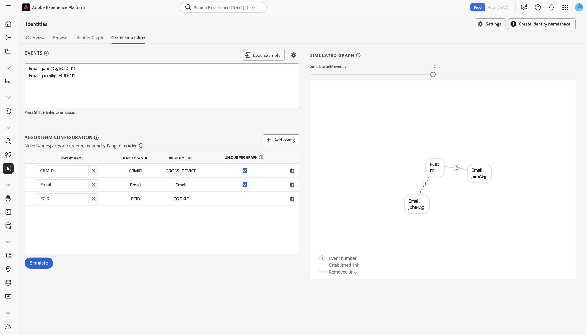

>[!TAB Shared device between a member and a guest]

In this scenario, a member and a guest share the same device to browse an e-commerce website.

**Text mode**

```json
CRMID: John, Email: john@g
CRMID: John, ECID: 111
Email: jane@g, ECID: 111
```

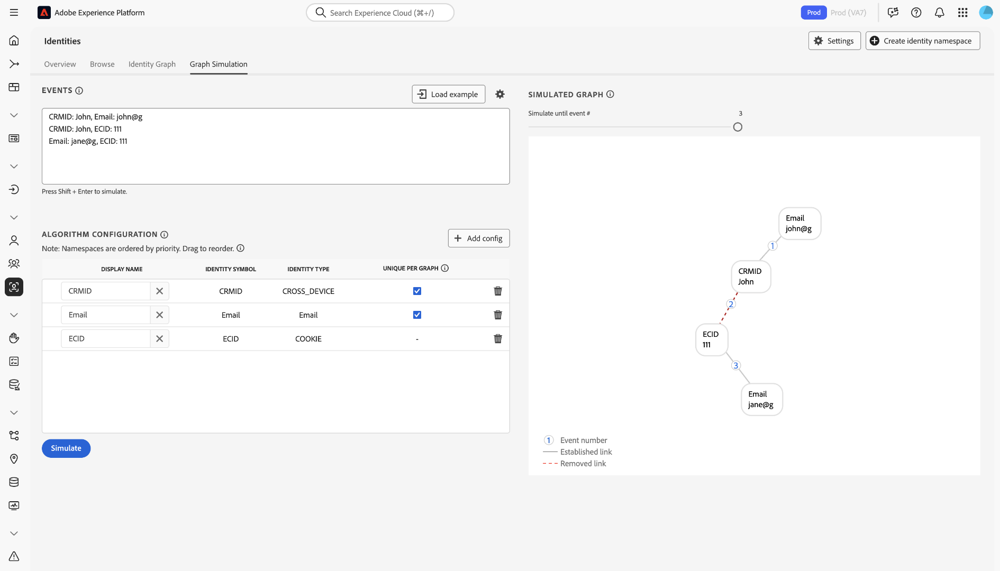

>[!ENDTABS]

### Use case: Your data includes three unique namespaces

Your customer defines a single-person entity as follows:

* An end-user with an assigned CRMID.
* An end-user who is associated to a hashed email address, so that profiles can be activated to destinations that support hashed email (for example, [!DNL Facebook]).
* An end-user associated with an email addresss, so that support personnel can look up their profile on Real-Time CDP using said email address.

| Unique namespace | Namespace priority |
| --- | --- |
| <ul><li>CRMID</li><li>Email</li><li>Email_LC_SHA256</li></ul> | <ul><li>CRMID</li><li>Email</li><li>Email_LC_SHA256</li><li>ECID</li></ul> |

Simulate the following configurations in the graph simulation tool. You can either create your own events, or copy and paste using text mode.

>[!BEGINTABS]

>[!TAB Two end-users log in]

In this scenario, John and Jane both log in to an e-commerce website.

**Text mode**

```json
CRMID: John, Email: john@g, Email_LC_SHA256: john_hash 
CRMID: Jane, Email: jane@g, Email_LC_SHA256: jane_hash 
CRMID: John, ECID: 111 
CRMID: Jane, ECID: 111
```

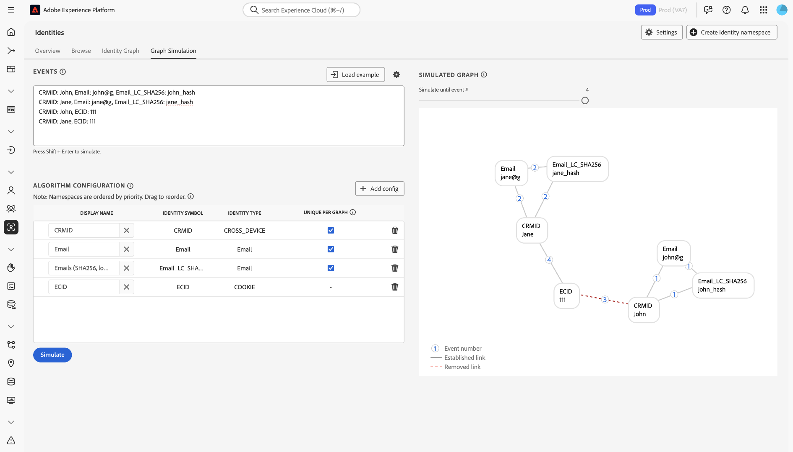

>[!TAB An end-user changes their email]

**Text mode**

```json
CRMID: John, Email: john@g, Email_LC_SHA256: john_hash
CRMID: John, Email: john@y, Email_LC_SHA256: john_y_hash
```

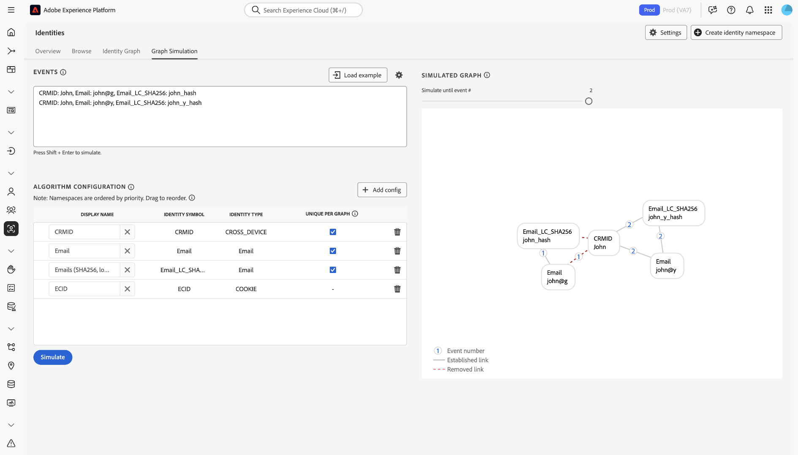

>[!ENDTABS]

## Advanced-level implementations {#advanced}

**Namespace priority** is metadata that ranks namespaces by their importance. If a graph contains two identities, each with a different unique namespaces, Identity Service uses namespace priority to decide which links to remove. For more information, read the [documentation on namespace priority](../identity-graph-linking-rules/namespace-priority.md).

Namespace priority plays a critical role in complex graph scenarios. Graphs can have multiple layers - an end-user may be associated with multiple login IDs, and these login IDs could be hashed. Additionally, different ECIDs could be linked to different login IDs. In order to ensure that the right link, in the right layer is removed, your namespace priority configurations must be correct. 

For example:

* You are a data architect at a consumer packaged goods (CPG) company that has multiple brand lines. Each brand line has its own corresponding website.
* John is an end-user represented by a CRMID. John also has three different loginIDs across different websites. Each of these loginIDs are linked to an ECID.
* Jane is an end-user who has one loginID for one of your websites.
* In a multi-layered graph structure, there could be several ways in which John and Jane's respective CRMIDs could be merged, including:
  * The existence of a non-unique login ID due to bad data.
  * A shared device scenario where John and Jane share the same device to browse your website(s).

### Experience events

Experience events, which typically send online web behavior events, usually contain the following data:

* **IdentityMap**: a set of identities keyed by namespace.
* **Events**: The user activity (purchase shoes, browse socks, etc.)

An authenticated event typically has an identityMap of `{CRMID, ECID}`. This scenario means that an authenticated person (CRMID), is browsing  your website using a device (ECID). 

An unauthenticated event typically has an identityMap that only contains an `{ECID}`. This means that someone (unknown to the system) is browsing a device (ECID).

### Primary identity

The primary identity is the key that stores events. If the primary identity of an experience event is the CRMID, then the event is tied to the end-user.

### Tying experience events and the primary identity together

For a given experience event, the identity with the highest namespace priority is the primary identity. 

| Namespace | Entity representation | Namespace priority |
| --- | --- | --- |
| CRMID | End-user | 1 |
| IDFA | Apple hardware (iPhone, iPad, etc.) | 2 |
| GAID | Google hardware (Google Pixel, etc.) | 3 |
| ECID | Web browser (Firefox, Safari, Google Chrome, etc.) | 4 |
| AAID | Web browser (Firefox, Safari, Google Chrome, etc.) | 5 |

{style="table-layout:auto"}

| User action (Experience event) | Authentication state | Data source | IdentityMap | Primary identity (primary key of profile fragment) |
| --- | --- | --- | --- | --- |
| View credit card offer page | Unauthenticated (anonymous) | Web SDK | {ECID} | ECID |
| View help page | Unauthenticated | Mobile SDK | {ECID, IDFA} | IDFA |
| View checking account balance | Authenticated | Web SDK | {CRMID, ECID} | CRMID |
| Sign up for home loan | Authenticated | Adobe Analytics source | {CRMID, ECID, AAID} | CRMID |
| Transfer $1000 from checking to savings account | Authenticated | Mobile SDK | {CRMID, GAID, ECID} | CRMID |

{style="table-layout:auto"}

### Segmentation Service

>[!NOTE]
>
>Namespace priority ensures that segment membership is associated with the user.

Just like experience events are linked to the identity with the highest namespace priority, segment membership for a profile is also linked to the identity with the highest namespace priority

### Use case: You need support for multiple lines of businesses

Your end-users have two different accounts, a personal account and a business account. Each account is identified by a different ID. In this scenario, a typical graph would look like the following:

**Text mode***

```json
CRMID: John, loginID: JohnPersonal
CRMID: John, loginID: JohnBusiness
loginID: JohnPersonal, ECID: 111
loginID: JohnPersonal, ECID: 222
loginID: JohnBusiness, ECID: 222
```

**Algorithm configuration**

Configure the following settings in the Graph Simulation interface before you simulate your graph.

| Display name | Identity symbol | Identity type | Unique per graph |
| --- | --- | --- | --- |
| CRMID | CRMID | CROSS_DEVICE |  ✔️  |
| loginID | loginID | CROSS_DEVICE | |
| ECID | ECID | COOKIE | |

**Simulated graph**

+++Select to view simulated graph

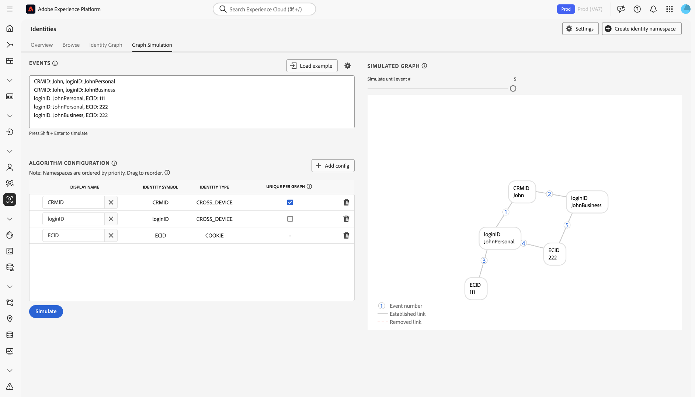

+++


**Exercise**

Simulate the following configuration in Graph Simulation. You can either create your own events, or copy and paste using text mode.

>[!BEGINTABS]

>[!TAB Shared device]

**Text mode**

```json
CRMID: John, loginID: JohnPersonal
CRMID: John, loginID: JohnBusiness
CRMID: Jane, loginID: JanePersonal
CRMID: Jane, loginID: JaneBusiness
loginID: JohnPersonal, ECID: 111
loginID: JanePersonal, ECID: 111
```

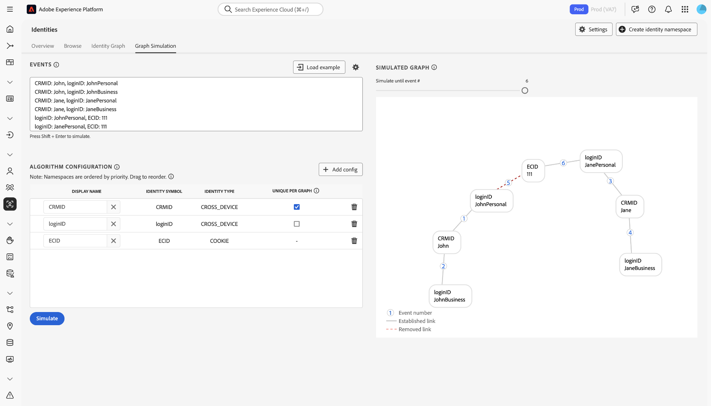

>[!TAB Bad data is sent to Real-Time CDP]

```json
CRMID: John, loginID: JohnPersonal
CRMID: John, loginID: error
CRMID: Jane, loginID: JanePersonal
CRMID: Jane, loginID: error
loginID: JohnPersonal, ECID: 111
loginID: JanePersonal, ECID: 222
```

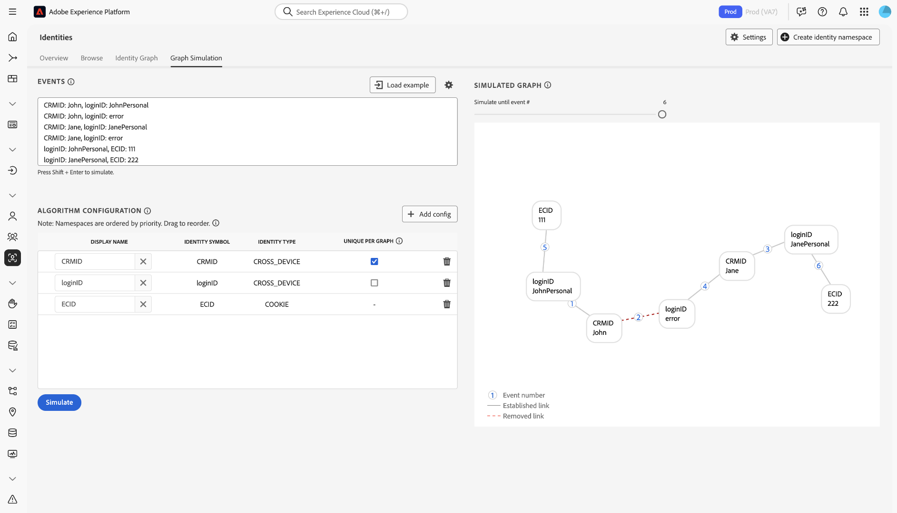

>[!ENDTABS]

### Use case: You have complex implementations that require multiple namespaces

You are a median and entertainment company and your end-users have the following:
* A CRMID
* A loyalty ID
Additionally, your end-users can make a purchase on the e-commerce website and this data is tied to their email address. User data is also enriched by a third-party database provider and is sent to Experience Platform in batches.

**Text mode**

```json
CRMID: John, loyaltyID: John, Email: john@g
Email: john@g, orderID: aaa
CRMID: John, thirdPartyID: xyz
CRMID: John, ECID: 111
```

**Algorithm configuration**

Configure the following settings in the Graph Simulation interface before you simulate your graph.

| Display name | Identity symbol | Identity type | Unique per graph |
| --- | --- | --- | --- |
| CRMID | CRMID | CROSS_DEVICE |  ✔️  |
| loyaltyID | loyaltyID | CROSS_DEVICE | |
| Email | Email | Email | |
| thirdPartyID | thirdPartyID | CROSS_DEVICE | |
| orderID | orderID | CROSS_DEVICE | |
| ECID | ECID | COOKIE | |

**Exercise**

Simulate the following configuration in Graph Simulation. You can either create your own events, or copy and paste using text mode.

>[!BEGINTABS]

>[!TAB Shared device]

**Text mode**

```json
CRMID: John, loyaltyID: John, Email: john@g
CRMID: Jane, loyaltyID: Jane, Email: jane@g
Email: john@g, orderID: aaa 
CRMID: John, thirdPartyID: xyz 
CRMID: John, ECID: 111
CRMID: Jane, ECID: 111
```

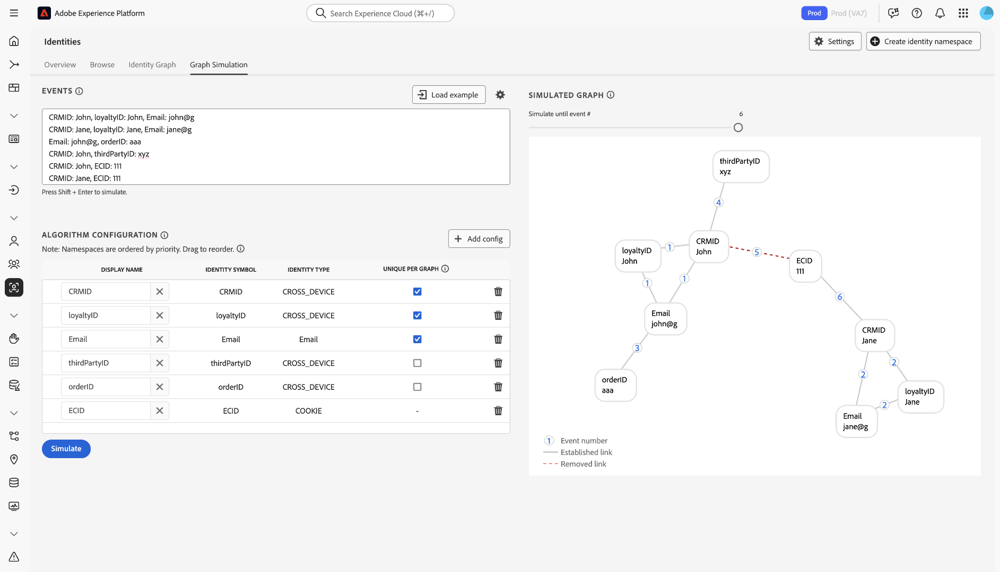

>[!TAB End-user changes their email address]

**Text mode**

```json
CRMID: John, loyaltyID: John, Email: john@g
CRMID: John, loyaltyID: John, Email: john@y
```

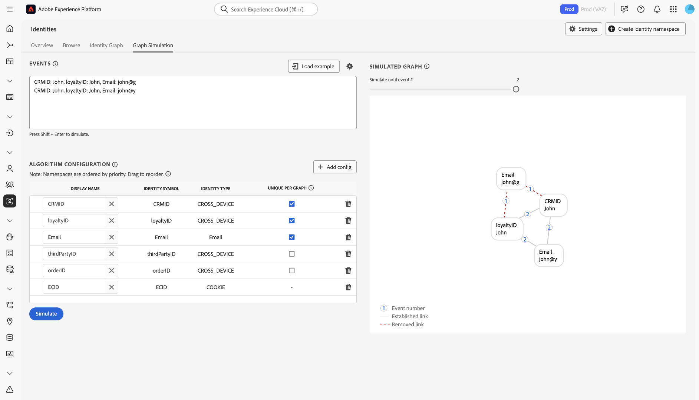

>[!TAB The thirdPartyID association changes]

**Text mode**

```json
CRMID: John, loyaltyID: John, Email: john@g
CRMID: Jane, loyaltyID: Jane, Email: jane@g
CRMID: John, thirdPartyID: xyz
CRMID: Jane, thirdPartyID: xyz
```

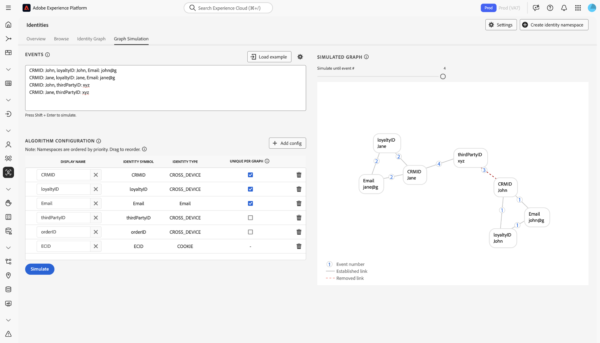

>[!TAB Non-unique orderID]

**Text mode**

```json
CRMID: John, loyaltyID: John, Email: john@g
CRMID: Jane, loyaltyID: Jane, Email: jane@g
Email: john@g, orderID: aaa
Email: jane@g, orderID: aaa
```

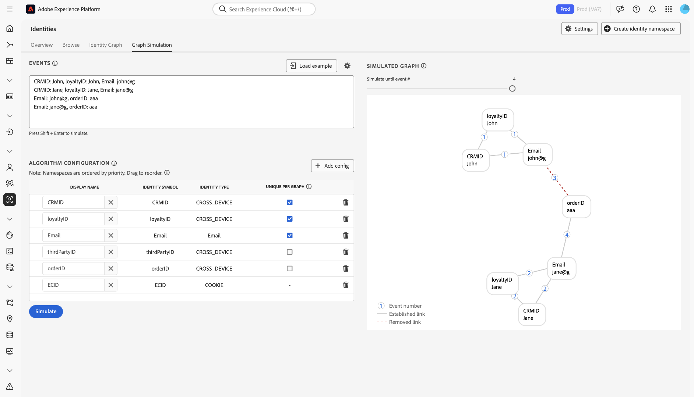

>[!TAB Erroneous loyaltyID]

**Text mode**

```json
CRMID: John, loyaltyID: aaa, Email: john@g
CRMID: Jane, loyaltyID: aaa, Email: jane@g
```

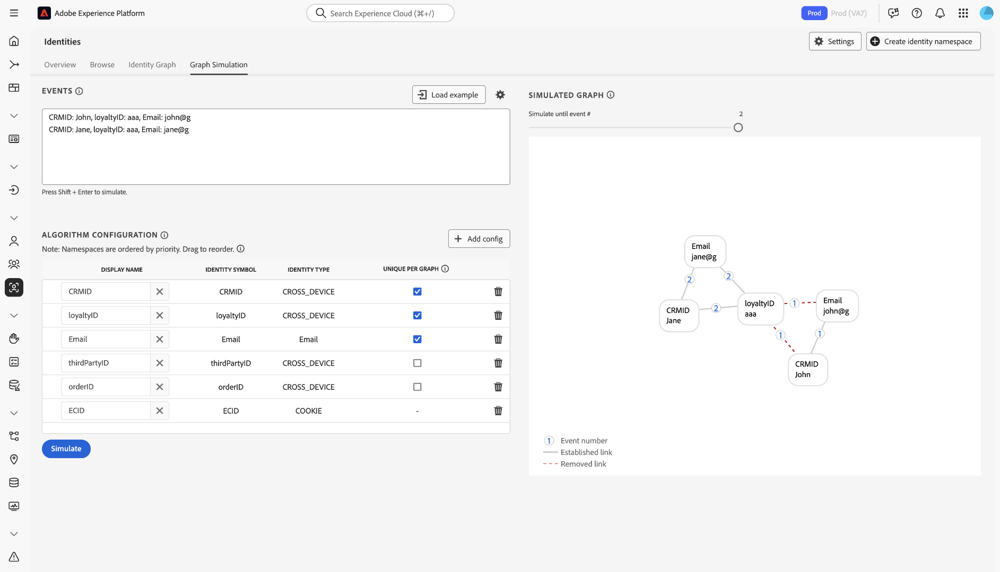

>[!ENDTABS]