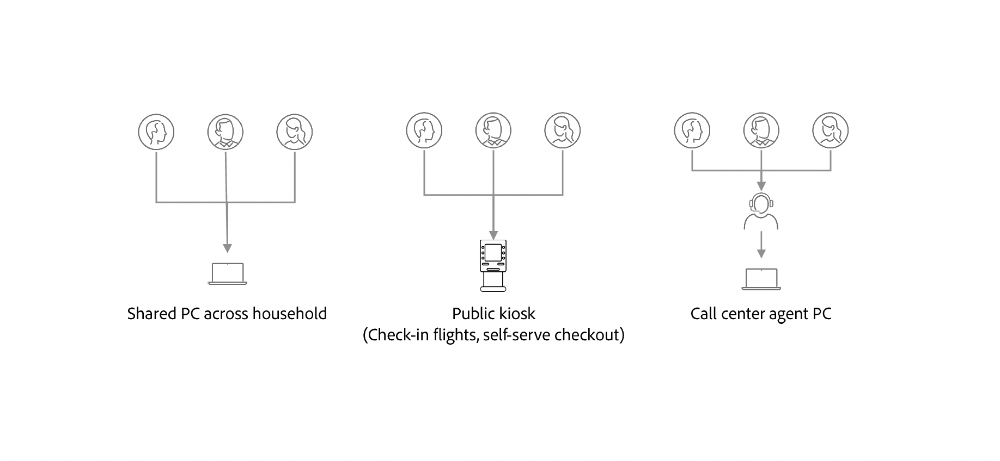

# Example scenarios for configuring identity graph linking rules

This document outlines example scenarios that you may consider when configuring identity graph linking rules

## Shared device

There are instances where multiple logins can occur on a single device:

| Shared device | Description |
| --- | --- |
| Family computers and tablets | Husband and wife both login to their respective bank accounts. |
| Public kiosk | Travelers at an airport logging on using their loyalty ID to check in bags and print boarding passes. |
| Call center | Call center personnel log in on a single device on behalf of customers calling customer support to resolve issues. |

In these cases, from a graph standpoint, with no limits enabled, a single ECID will be linked to multiple CRM IDs 

With identity graph linking rules, you can:

* Configure the ID used for login as unique identifier. For example, you can limit a graph to store just one identity with a CRM ID namespace, and thus define that CRM ID as the unique identifier of a shared device.
  * By doing this, you can ensure that CRM IDs do not get merged by the ECID.

## Invalid email/phone scenarios

There are also instances of users who provide fake values as phone numbers and/or email addresses when registering. In these case, if limits are not enabled, then a single hashed email or hashed phone number will end up being linked to multiple different CRM IDs.

With identity graph linking rules, you can:

* Configure either the CRM ID, phone number, or email address as the unique identifier and thus limit one person to just one CRM ID, phone number, and/or email address associated with their account.

## Bad data