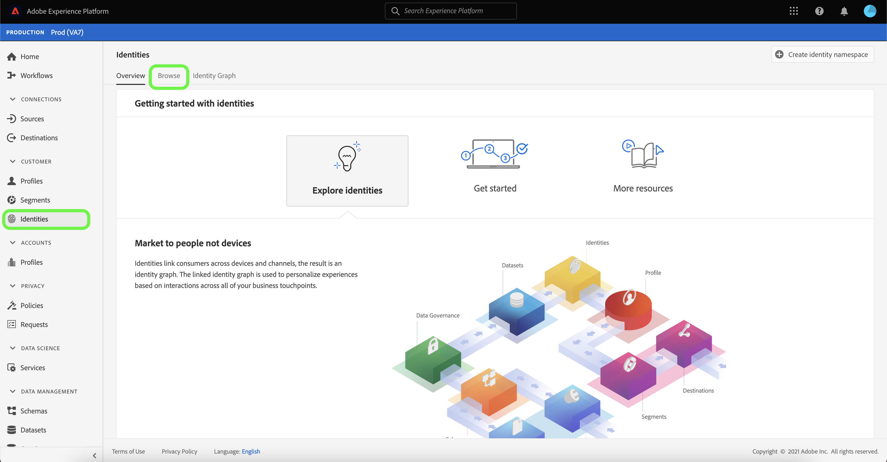
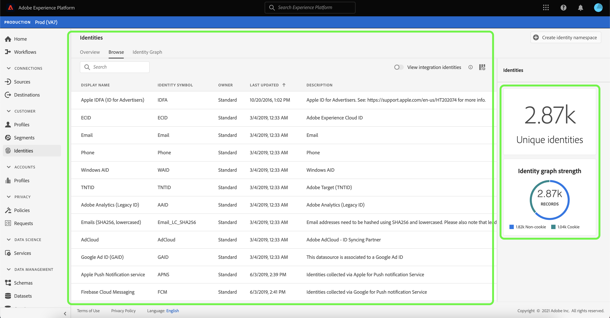
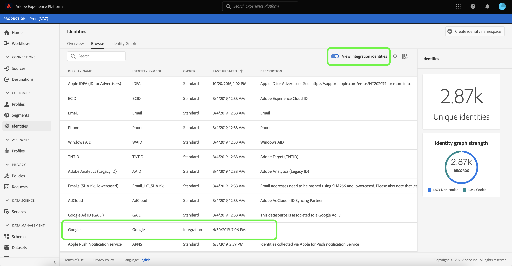
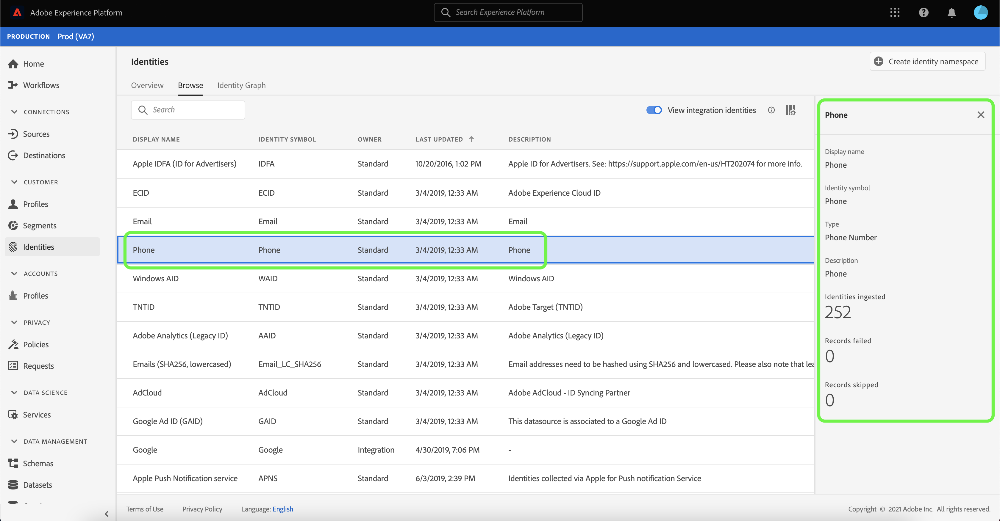
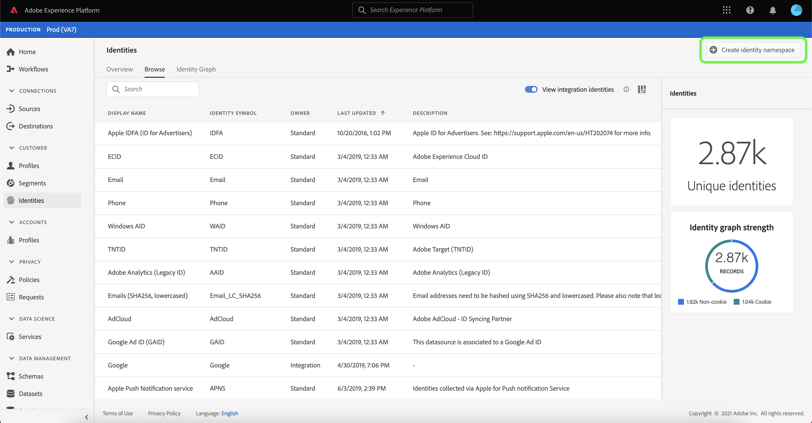
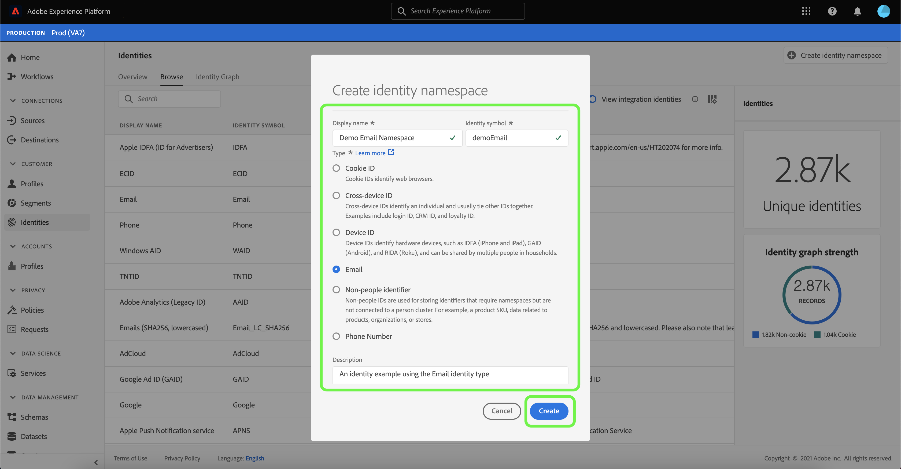

# Identity namespace overview

Identity namespaces are a component of [[!DNL Identity Service]](./home.md) that serve as indicators of the context to which an identity relates. For example, they distinguish a value of "name@email.com" as an email address or "443522" as a numeric CRM ID. 

## Getting started

Working with identity namespaces requires an understanding of the various Adobe Experience Platform services involved. Before beginning to work with namespaces, please review the documentation for the following services:

- [[!DNL Real-Time Customer Profile]](../profile/home.md): Provides a unified, customer profile in real time based on aggregated data from multiple sources.
- [[!DNL Identity Service]](./home.md): Gain a better view of individual customers and their behavior by bridging identities across devices and systems.
- [[!DNL Privacy Service]](../privacy-service/home.md): Identity namespaces are used in compliance requests for legal privacy regulations like the General Data Protection Regulation (GDPR). Each privacy request is made relative to a namespace in order to identify which consumers' data should be affected.

## Understanding identity namespaces

A fully qualified identity includes an ID value and a namespace. When matching record data across profile fragments, as when [!DNL Real-Time Customer Profile] merges profile data, both the identity value and the namespace must match.

For example, two profile fragments may contain different primary IDs but they share the same value for the "Email" namespace, therefore [!DNL Platform] is able to see that these fragments are actually the same individual and and brings the data together in the identity graph for the individual.

### Identity types {#identity-types}

>[!CONTEXTUALHELP]
>id="platform_identity_create_namespace"
>title="Specify identity type"
>abstract="The identity type controls whether or not data is stored to the identity graph. Non-people identifiers will not be stored, and all other identity types will."
>text="Learn more in documentation"

Data can be identified by several different identity types. The identity type is specified at the time the identity namespace is created and controls whether or not the data is persisted to the identity graph and any special instructions for how that data should be handled. All identity types except **Non-people identifier** follow the same behavior of stitching a namespace and its corresponding ID value to an identity graph cluster. Data is not stitched together when using **Non-people identifier**.

The following identity types are available within [!DNL Platform]:

| Identity type | Description |
| --- | --- |
| Cookie ID | Cookie IDs identify web browsers. These identities are critical for expansion and constitute the majority of the identity graph. However, by nature they decay fast and lose their value over time. |
| Cross-Device ID | Cross-device IDs identify an individual and usually tie other IDs together. Examples include a login ID, CRM ID, and loyalty ID. This is an indication to [!DNL Identity Service] to handle the value sensitively. |
| Device ID | Device IDs identify hardware devices, such as IDFA (iPhone and iPad), GAID (Android), and RIDA (Roku), and can be shared by multiple people in households.|
| Email address | Email addresses are often associated with a single person and therefore can be used to identify that person across different channels. Identities of this type include personally identifiable information (PII). This is an indication to [!DNL Identity Service] to handle the value sensitively.|
| Non-people identifier | Non-people IDs are used for storing identifiers that require namespaces but are not connected to a person cluster. For example, a product SKU, data related to products, organizations, or stores. |
| Partner ID | Partner IDs are IDs that are provided by a data partner. They usually represent people and hold probabilistic partner data in Real-Time Customer Data Platform without linking them into the identity graph. Partner IDs can be configured in the Identity Service workspace in the Adobe Experience Platform UI. |
| Phone number | Phone numbers are often associated with a single person and therefore can be used to identify that person across different channels. Identities of this type include PII. This is indication to [!DNL Identity Service] to handle the value sensitively. |

### Standard namespaces {#standard}

Experience Platform provides several identity namespaces that are available to all organizations. These are known as standard namespaces and are visible using the [!DNL Identity Service] API or through the Platform UI.

The following standard namespaces are provided for use by all organizations within  Platform:

| Display name | Description |
| ------------ | ----------- |
| AdCloud | A namespace that represents Adobe AdCloud. |
| Adobe Analytics (Legacy ID) | A namespace that represents Adobe Analytics. See the following document on [Adobe Analytics namespaces](https://experienceleague.adobe.com/docs/analytics/admin/data-governance/gdpr-namespaces.html?lang=en#namespaces) for more information. |
| Apple IDFA (ID for Advertisers) | A namespace that represents Apple ID for Advertisers. See the following document on [interest-based ads](https://support.apple.com/en-us/HT202074) for more information. |
| Apple Push Notification service | A namespace that represents identities collected using Apple Push Notification service. See the following document on [Apple Push Notification service](https://developer.apple.com/library/archive/documentation/NetworkingInternet/Conceptual/RemoteNotificationsPG/APNSOverview.html#//apple_ref/doc/uid/TP40008194-CH8-SW1) for more information. |
| CORE | A namespace that represents Adobe Audience Manager. This namespace can also be referred to by its legacy name: "Adobe AudienceManager". See the following document on [Audience Manager IDs](https://experienceleague.adobe.com/docs/audience-manager/user-guide/overview/data-privacy/data-privacy-reference/data-privacy-ids.html?lang=en#aam-ids) for more information. |
| ECID | A namespace that represents ECID. This namespace can also be referred to by the following aliases: "Adobe Marketing Cloud ID", "Adobe Experience Cloud ID", "Adobe Experience Platform ID". See the following document on [ECID](./ecid.md) for more information. |
| Email | A namespace that represents an email address. This type of namespace is often associated to a single person and therefore can be used to identify that person across different channels. |
| Emails (SHA256, lowercased) | A namespace for pre-hashed email address. Values provided in this namespace are converted to lowercase before hashing with SHA256. Leading and trailing spaces need to be trimmed before an email address is normalized. This setting cannot be changed retroactively. See the following document on [SHA256 hashing support](https://experienceleague.adobe.com/docs/id-service/using/reference/hashing-support.html?lang=en#hashing-support) for more information. |
| Firebase Cloud Messaging | A namespace that represents identities collected using Google Firebase Cloud Messaging for push notifications. See the following document on [Google Firebase Cloud Messaging](https://firebase.google.com/docs/cloud-messaging) for more information. |
| Google Ad ID (GAID) | A namespace that represents a Google Advertising ID. See the following document on [Google Advertising ID](https://support.google.com/googleplay/android-developer/answer/6048248?hl=en) for more information. |
| Google Click ID | A namespace that represents a Google Click ID. See the following document on [Click tracking in Google Ads](https://developers.google.com/adwords/api/docs/guides/click-tracking) for more information. |
| Phone | A namespace that represents a phone number. This type of namespace is often associated to a single person and therefore can be used to identify that person across different channels. |
| Phone (E.164) | A namespace that represents raw phone numbers that need to be hashed in E.164 format. The E.164 format includes a plus sign (`+`), an international country calling code, a local area code, and a phone number. For example: `(+)(country code)(area code)(phone number)`. |
| Phone (SHA256) | A namespace that represents phone numbers that need to be hashed using SHA256. You must remove symbols, letters, and any leading zeroes. You must also add the country calling code as a prefix. |
| Phone (SHA256_E.164) | A namespace that represents raw phone numbers that need to be hashed using both SHA256 and E.164 format. |
| TNTID | A namespace that represents Adobe Target. See the following document on [Target](https://experienceleague.adobe.com/docs/target/using/target-home.html?lang=en) fore more information. |
| Windows AID | A namespace that represents a Windows Advertising ID. See the following document on [Windows Advertising ID](https://docs.microsoft.com/en-us/uwp/api/windows.system.userprofile.advertisingmanager.advertisingid?view=winrt-19041) for more information. |

### View identity namespaces {#view-identity-namespaces}

>[!CONTEXTUALHELP]
>id="platform_identity_view_integration_identities"
>title="View integration identities"
>abstract="Integration identities are namespaces that are used to connect with other systems and are not used in identity resolution or to stitch identities.   These identities are hidden by default. Use the toggle to view integration namespaces."

To view identity namespaces in the UI, select **[!UICONTROL Identities]** in the left navigation and then select **[!UICONTROL Browse]**.

A list of identity namespaces appears in the main interface of the page, displaying information on their names, identity symbols, last updated date, and whether they are a standard or a custom namespace. The right rail contains information on [!UICONTROL Identity graph strength].

Platform also provides namespaces for integration purposes. These namespaces are hidden by default as they are used to connect with other systems, and not used to stitch identities. To view integration namespaces, select **[!UICONTROL View integration identities]**.

Select an identity namespace from the list to view information on a specific namespace. Selecting an identity namespace updates the display on the right rail to show metadata regarding the identity namespace that you selected, including the number of identities ingested and the number of records failed and skipped.

## Manage custom namespaces {#manage-namespaces}

Depending on your organizational data and use cases, you may require custom namespaces. Custom namespaces can be created using the [[!DNL Identity Service]](./api/create-custom-namespace.md) API or through the UI.

To create a custom namespace using the UI, navigate to the **[!UICONTROL Identities]** workspace, select **[!UICONTROL Browse]**, and then select **[!UICONTROL Create identity namespace]**.

The **[!UICONTROL Create identity namespace]** dialog box appears. Provide a unique **[!UICONTROL Display name]** and **[!UICONTROL Identity symbol]** and then select the identity type you would like to create. You can also add an optional description to add further information about the namespace. All the identity types except **Non-people identifier** follows the same behavior of stitching. If you select **Non-people identifier** as identity type when creating a namespace, stitching does not occur. For specific information regarding each identity type, refer to the table on [identity types](#identity-types).

When finished, select **[!UICONTROL Create]**.

>[!IMPORTANT]
>
>Namespaces that you define are private to your organization and require a unique identity symbol in order to be created successfully.

Similar to standard namespaces, you can select a custom namespace from the **[!UICONTROL Browse]** tab to view its details. However, with a custom namespace you can also edit its display name and description from the details area.

>[!NOTE]
>
>Once a namespace has been created, it cannot be deleted and its identity symbol and type cannot be changed.

## Namespaces in identity data

Supplying the namespace for an identity depends on the method you use for providing identity data. For details on providing data identity data, please see the section on [supplying identity data](./home.md#supplying-identity-data-to-identity-service) in the [!DNL Identity Service] overview.

## Next steps

Now that you understand the key concepts of identity namespaces, you can begin to learn how to work with your identity graph using the [identity graph viewer](./ui/identity-graph-viewer.md).
