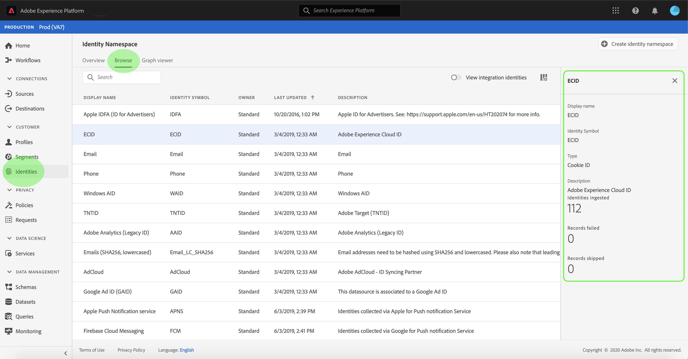
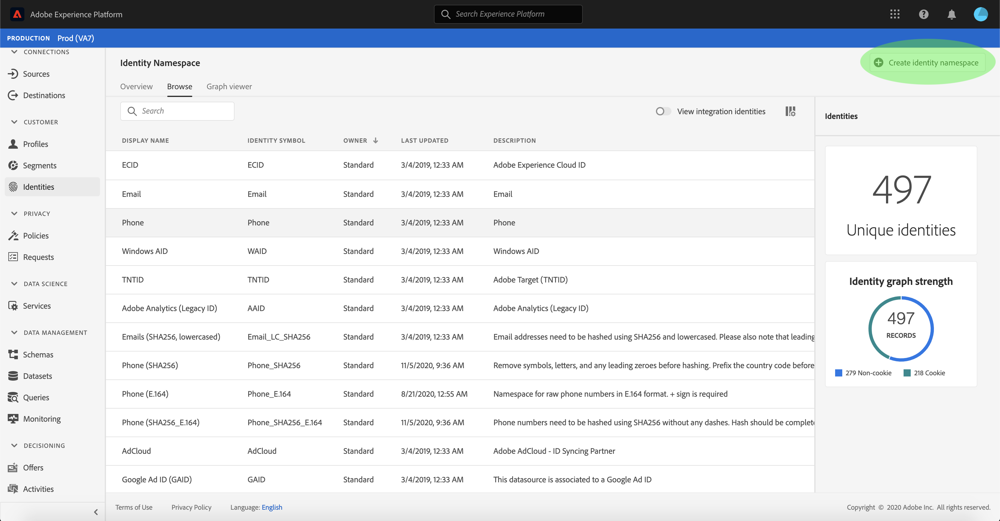
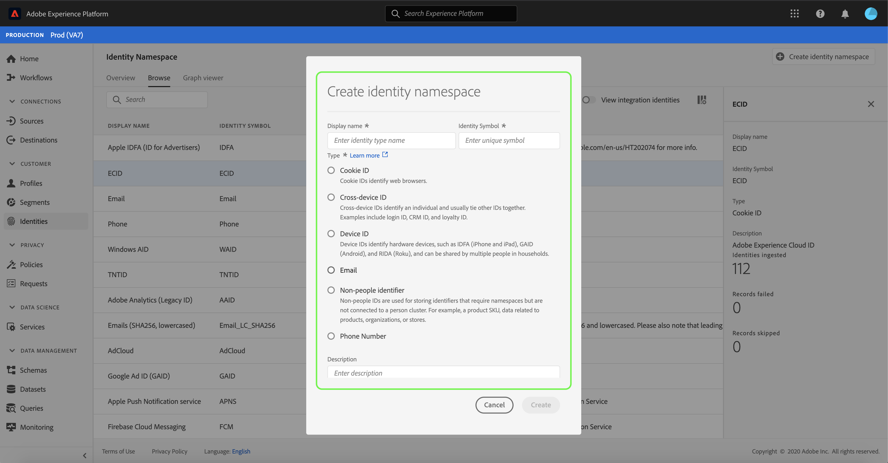

# Identity namespace overview

Identity namespaces are a component of [[!DNL Identity Service]](./home.md) that serve as indicators of the context to which an identity relates. For example, they distinguish a value of "name@email.com" as an email address or "443522" as a numeric CRM ID. 

## Getting started

Working with identity namespaces requires an understanding of the various Adobe Experience Platform services involved. Before beginning to work with namespaces, please review the documentation for the following services:

- [[!DNL Real-time Customer Profile]](../profile/home.md): Provides a unified, customer profile in real-time based on aggregated data from multiple sources.
- [[!DNL Identity Service]](./home.md): Gain a better view of individual customers and their behavior by bridging identities across devices and systems.
- [[!DNL Privacy Service]](../privacy-service/home.md): Identity namespaces are used to comply with General Data Protection Regulation (GDPR), where GDPR requests can be made relative to a namespace. 

## Understanding identity namespaces

A fully qualified identity includes an ID value and a namespace. When matching record data across profile fragments, as when [!DNL Real-time Customer Profile] merges profile data, both the identity value and the namespace must match.

For example, two profile fragments may contain different primary IDs but they share the same value for the "Email" namespace, therefore [!DNL Platform] is able to see that these fragments are actually the same individual and bring the data together in the identity graph for the individual.

### Identity types

Data can be identified by several different identity types. The identity type is specified at the time the identity namespace is created and controls whether or not the data is persisted to the identity graph and any special instructions for how that data should be handled.

The following identity types are available within [!DNL Platform]:

| Identity type | Description |
| --- | --- |
| Cookie ID | Cookie IDs identify web browsers. These identities are critical for expansion and constitute the majority of the identity graph. However, by nature they decay fast and lose their value over time. |
| Cross-Device ID | Cross-device IDs identify an individual and usually tie other IDs together. Examples include a login ID, CRM ID, and loyalty ID. This is an indication to [!DNL Identity Service] to handle the value sensitively. |
| Device ID | Device IDs identify hardware devices, such as IDFA (iPhone and iPad), GAID (Android), and RIDA (Roku), and can be shared by multiple people in households.|
| Email| Identities of this type include personally identifiable information (PII). This is an indication to [!DNL Identity Service] to handle the value sensitively.|
| Non-people identifier | Non-people IDs are used for storing identifiers that require namespaces but are not connected to a person cluster. For example, a product SKU, data related to products, organizations, or stores. |
| Phone number | Identities of this type include PII. This is indication to [!DNL Identity Service] to handle the value sensitively. |

### Standard namespaces

[!DNL Experience Platform] provides several identity namespaces that are available to all organizations. These are known as standard namespaces and are visible using the [!DNL Identity Service] API or through the [!DNL Platform] UI.

[!DNL Experience Platform] also provides namespaces for integration purposes. These namespaces are hidden by default.

The following standard namespaces are provided for use by all organizations within [!DNL Experience Platform]:

| Display name | Notes |
| ------------ | ----------- |
| AdCloud | Adobe AdCloud - ID Syncing Partner |
| Adobe Analytics | Adobe Analytics (Legacy ID) |
| Apple IDFA (ID for Advertisers) | Apple ID for Advertisers. See the following document on [interest-based ads](https://support.apple.com/en-us/HT202074) for more information. |
| Apple Push Notification service | Identities collected via Apple for Push notification Service. |
| CORE | legacy name: "Adobe AudienceManager" |
| ECID | alias: "Adobe Marketing Cloud ID", "Adobe Experience Cloud ID", "Adobe Experience Platform ID" |
| Email |
| Emails (SHA256, lowercased) | Standard namespace for pre-hashed email. Values provided in this namespace are converted to lowercase before hashing with SHA-256. Leading and trailing spaces need to be trimmed before an email address is normalized. This setting cannot be changed retroactively. |
| Firebase Cloud Messaging | Identities collected via Google for Push notification Service. |
| Google Ad ID |
| Google Click ID |
| Phone |
| Phone (E.164) | Namespace for raw phone numbers in E.164 format. The plus (`+`) sign is required. |
| Phone (SHA256_E.164) | Phone numbers need to be hashed using SHA256 without any dashes and under the E.164 format.  |
| Phone (SHA256) | Before hashing, you must remove symbols, letters, and any leading zeroes. You must also add the country code as a prefix. |
| TNTID | Adobe Target (TNTID) |
| Windows AID |

To view standard namespaces in the UI, select **[!UICONTROL Identities]** in the left-rail and then select the **[!UICONTROL Browse]** tab. A list of standard identity namespaces accessible to your organization appears on the screen. You can sort the list alphabetically by their **[!UICONTROL Display name]**, **[!UICONTROL Identity symbol]**, or **[!UICONTROL Owner]**. Alternatively, you can sort the list chronologically by their most recent update date.

Select a namespace to see more specific information on the right-rail.

## Managing namespaces for your organization

Depending on your organizational data and use cases, you may require custom namespaces. Custom namespaces can be created using the [!DNL Identity Service] API or through the UI.

To create a custom namespace using the UI, select the **[!UICONTROL Create identity namespace]** button on the top-right of the **[!UICONTROL Identity Namespace]** page

The **[!UICONTROL Create identity namespace]** dialog box appears. Provide a unique **[!UICONTROL Display name]** and a unique **[!UICONTROL Identity symbol]** and then select the identity type you would like to create. You can also add an optional description to provide further information on the namespace. When finished, select **[!UICONTROL Create]**.

Namespaces that you define are private to your organization and require a unique **[!UICONTROL Identity Symbol]** in order to be created successfully.

Similar to standard namespaces, you can click on a custom namespace from the **[!UICONTROL Browse]** tab to view its details, however with a custom namespace you can also edit its display name and description from the details area.

>[!NOTE]
>
>Once a namespace has been created, it cannot be deleted and its "Identity Symbol" and "Type" cannot be changed.

## Namespaces in identity data

Supplying the namespace for an identity depends on the method you use for providing identity data. For details on providing data identity data, please see the section on [supplying identity data](./home.md#supplying-identity-data-to-identity-service) in the [!DNL Identity Service] overview.

## Next steps

Now that you understand the key concepts of identity namespaces, you can begin to learn how to work with your identity graph using the [Identity graph viewer](./ui/identity-graph-viewer.md).
