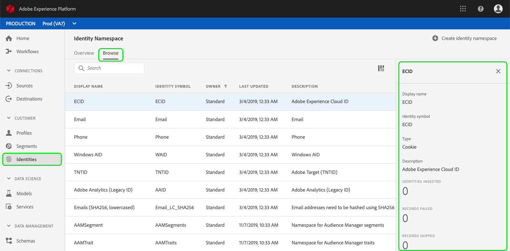

# Identity namespace overview

Identity namespaces are a component of [!DNL Identity Service](./home.md) that serve as indicators of the context to which an identity relates. For example, they distinguish a value of "name@email.com" as an email address or "443522" as a numeric CRM ID. 

## Getting started

Working with identity namespaces requires an understanding of the various Adobe Experience Platform services involved. Before beginning to work with namespaces, please review the documentation for the following services:

- [!DNL Real-time Customer Profile](../profile/home.md): Provides a unified, customer profile in real-time based on aggregated data from multiple sources.
- [!DNL Identity Service](./home.md): Gain a better view of individual customers and their behavior by bridging identities across devices and systems.
- [!DNL Privacy Service](../privacy-service/home.md): Identity namespaces are used to comply with General Data Protection Regulation (GDPR), where GDPR requests can be made relative to a namespace. 

## Understanding identity namespaces

A fully qualified identity includes an ID value and a namespace. When matching record data across profile fragments, as when [!DNL Real-time Customer Profile] merges profile data, both the identity value and the namespace must match. 

For example, two profile fragments may contain different primary IDs but they share the same value for the "Email" namespace, therefore Platform is able to see that these fragments are actually the same individual and bring the data together in the identity graph for the individual.

### Identity types

Data can be identified by several different identity types. The identity type is specified at the time the identity namespace is created and controls whether or not the data is persisted to the identity graph and any special instructions for how that data should be handled.

The following identity types are available within [!DNL Platform]:

| Identity type | Description |
| --- | --- |
| Cookie | These identities are critical for expansion and constitute the majority of the identity graph. However, by nature they decay fast and lose their value over time. Deletion of cookies is handled specially in the identity graph. |
| Cross-Device | This indicates that [!DNL Identity Service] should consider this to be a strong people identifier and hence preserve it forever. Examples include a login ID, CRM ID, loyalty ID etc. |
| Device| Includes IDFA, GAID & other IOT IDs. These can be shared by people in households.|
| Email| Identities of this type include personally identifiable information (PII). This is an indication to [!DNL Identity Service] to handle the value sensitively.|
| Mobile| Identities of this type include PII. This is an indication to [!DNL Identity Service] to handle the value sensitively.|
| Non-people| Used for storing identifiers that need namespaces, yet are not tied to a person cluster. These identifiers are then filtered from the identity graph. Possible use cases include data related to products, organizations, stores, etc. (For example, a product SKU.) |
| Phone | Identities of this type include PII. This is indication to [!DNL Identity Service] to handle the value sensitively.|

### Standard namespaces {#standard}

Adobe Experience Platform provides several identity namespaces that are available to all organizations. These are known as Standard namespaces and are visible using the [!DNL Identity Service] API or through the [!DNL Platform] UI.

To view Standard namespaces in the UI, click **[!UICONTROL Identities]** in the left-rail and then click on the *[!UICONTROL Browse]* tab. All identity namespaces accessible to your organization will be shown, however those with "[!UICONTROL Standard]" as the "[!UICONTROL Owner]" are the Standard namespaces provided by Adobe.

You can then click on one of the namespaces listed to view details.

## Managing namespaces for your organization

Depending on your organizational data and use cases, you may require custom namespaces.

These are visible in the UI as those namespaces with "[!UICONTROL Custom]" as the "[!UICONTROL Owner]". Custom namespaces can be created using the [!DNL Identity Service] API or through the user interface.

To create a custom namespace using the UI, click **[!UICONTROL Create identity namespace]**, then complete the dialog and click **[!UICONTROL Create]**.

Namespaces that you define are private to your organization and require a unique "[!UICONTROL Identity Symbol]" (or "code" if you are using the API) in order to be created successfully.

Similar to Standard namespaces, you can click on a Custom namespace from the *[!UICONTROL Browse]* tab to view its details, however with a Custom namespace you can also edit its Display Name and Description from the details area.

>[!NOTE]
>
>Once a namespace has been created, it cannot be deleted and its "Identity Symbol" (or "code" in the API) and "Type" cannot be changed.

## Namespaces in identity data

Supplying the namespace for an identity depends on the method you use for providing identity data. For details on providing data identity data, please see the section on [supplying identity data](./home.md#supplying-identity-data-to-identity-service) in the [!DNL Identity Service] overview.
