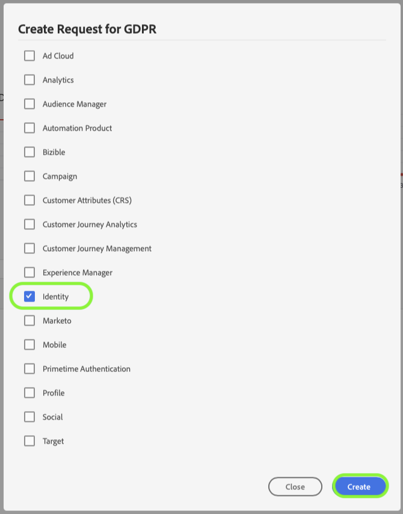

# Privacy request processing in [!DNL Identity Service]

Adobe Experience Platform [!DNL Privacy Service] processes customer requests to access, opt out of sale, or delete their personal data as delineated by privacy regulations such as the General Data Protection Regulation (GDPR) and [!DNL California Consumer Privacy Act] (CCPA).

This document covers essential concepts related to processing privacy requests for [!DNL Identity Service] within Adobe Experience Platform.

>[!NOTE]
>
>This guide only covers how to make privacy requests for the Identity data store in Experience Platform. If you also plan to make privacy requests for the Platform data lake or [!DNL Real-time Customer Profile], refer to the guide on [privacy request processing in the data lake](../catalog/privacy.md) and to the guide on [privacy request processing for Profile](../profile/privacy.md) in addition to this tutorial.
>
>For steps on how to make privacy requests for other Adobe Experience Cloud applications, refer to the [Privacy Service documentation](../privacy-service/experience-cloud-apps.md).

## Getting started

It is recommended that you have a working understanding of the following [!DNL Experience Platform] services before reading this guide:

* [[!DNL Privacy Service]](../privacy-service/home.md): Manages customer requests for accessing, opting out of sale, or deleting their personal data across Adobe Experience Cloud applications.
* [[!DNL Identity Service]](../identity-service/home.md): Solves the fundamental challenge posed by the fragmentation of customer experience data by bridging identities across devices and systems.
* [[!DNL Real-time Customer Profile]](home.md): Provides a unified, real-time consumer profile based on aggregated data from multiple sources.

## Understanding identity namespaces {#namespaces}

Adobe Experience Platform [!DNL Identity Service] bridges customer identity data across systems and devices. [!DNL Identity Service] uses **identity namespaces** to provide context to identity values by relating them to their system of origin. A namespace can represent a generic concept such as an email address ("Email") or associate the identity with a specific application, such as an Adobe Advertising Cloud ID ("AdCloud") or Adobe Target ID ("TNTID").

Identity Service maintains a store of globally defined (standard) and user-defined (custom) identity namespaces. Standard namespaces are available for all organizations (for example, "Email" and "ECID"), while your organization can also create custom namespaces to suit its particular needs.

For more information about identity namespaces in [!DNL Experience Platform], see the [identity namespace overview](../identity-service/namespaces.md).

## Submitting requests {#submit}

The sections below outline how to make privacy requests for [!DNL Identity Service] using the [!DNL Privacy Service] API or UI. Before reading these sections, it is strongly recommended that you review the [Privacy Service API](../privacy-service/api/getting-started.md) or [Privacy Service UI](../privacy-service/ui/overview.md) documentation for complete steps on how to submit a privacy job, including how to properly format user data in request payloads.

### Using the API

When creating job requests in the API, any IDs provided within `userIDs` must use a specific `namespace` and `type`. A valid [identity namespace](#namespaces) recognized by [!DNL Identity Service] must be provided for the `namespace` value, while the `type` must be either `standard` or `unregistered` (for standard and custom namespaces, respectively).

In addition, the `include` array of the request payload must include the product values for the different data stores the request is being made to. When making requests to [!DNL Identity], the array must include the value `Identity`.

The following request creates a new privacy job under the GDPR for a single customer's data in the [!DNL Identity] store. Two identity values are provided for the customer in the `userIDs` array; one using the standard `Email` identity namespace, and the other using an `ECID` namespace, It also includes the product value for [!DNL Identity] (`Identity`) in the `include` array:

>[!TIP]
>
>When deleting a custom namespace using the API, you must specify the identity symbol as the namespace, instead of the display name.

```shell
curl -X POST \
  https://platform.adobe.io/data/core/privacy/jobs \
  -H 'Authorization: Bearer <key>' \
  -H 'Content-Type: application/json' \
  -H 'x-api-key: acp_privacy_ui_gdpr' \
  -H 'x-gw-ims-org-id: sample@AdobeOrg' \
  -d '{
    "companyContexts": [
      {
        "namespace": "imsOrgID",
        "value": "sample@AdobeOrg"
      }
    ],
    "users": [
      {
        "key": "bob",
        "action": ["delete"],
        "userIDs": [
          {
            "namespace": "email",
            "value": "bob@adobe.com",
            "type": "standard"
          },
          {
            "namespace": "ECID",
            "type": "standard",
            "value":  "123451234512345123451234512345",
            "isDeletedClientSide": false
          }
        ]
      }
    ],
    "include": ["Identity"],
    "regulation": "gdpr"
}'
```

### Using the UI

>[!TIP]
>
>When deleting a custom namespace using the UI, you must specify the identity symbol as the namespace, instead of the display name. Furthermore, you cannot delete custom namespaces in the UI for non-production sandboxes.

When creating job requests in the UI, be sure to select **[!UICONTROL Identity]** under **[!UICONTROL Products]** in order to process jobs for data stored in [!DNL Identity Service].



## Delete request processing

When [!DNL Experience Platform] receives a delete request from [!DNL Privacy Service], [!DNL Platform] sends confirmation to [!DNL Privacy Service] that the request has been received and affected data has been marked for deletion. The deletion of the individual identity is based on provided namespace and/or ID value. Furthermore, the deletion takes place for all sandboxes associated with a given IMS Organization.

Depending on whether you also included Real-time Customer Profile (`ProfileService`) and the data lake (`aepDataLake`) as products in your privacy request for Identity Service (`identity`), different sets of data related to the identity are removed from the system at potentially different times:

| Products included | Effects |
| --- | --- |
| `identity` only | The identity graph associated with the provided identity is immediately deleted as soon as Platform sends the confirmation that the deletion request was received. The profile constructed from that identity graph still remains, but will not be updated as new data is ingested since the identity associations are now removed. The data associated with the profile also remains in the data lake. |
| `identity` and `ProfileService` | The identity graph and its associated profile are immediately deleted as soon as Platform sends the confirmation that the deletion request was received. The data associated with the profile remains in the data lake. |
| `identity` and `aepDataLake` |  The identity graph associated with the provided identity is immediately deleted as soon as Platform sends the confirmation that the deletion request was received. The profile constructed from that identity graph still remains, but will not be updated as new data is ingested since the identity associations are now removed.<br><br>When the data lake product responds that the request was received and is currently processing, the data associated with the profile is soft-deleted and is therefore not accessible by any [!DNL Platform] service. Once the job is completed, the data is removed from the data lake completely. |
| `identity`, `ProfileService`, and `aepDataLake` | The identity graph and its associated profile are immediately deleted as soon as Platform sends the confirmation that the deletion request was received.<br><br>When the data lake product responds that the request was received and is currently processing, the data associated with the profile is soft-deleted and is therefore not accessible by any [!DNL Platform] service. Once the job is completed, the data is removed from the data lake completely. |

Refer to the [[!DNL Privacy Service] documentation](../privacy-service/home.md#monitor) for more information on tracking job statuses.

## Next steps

By reading this document, you have been introduced to the important concepts involved with processing privacy requests in [!DNL Identity Service]. For information on processing privacy requests for other [!DNL Experience Cloud] applications, see the document on [[!DNL Privacy Service] and [!DNL Experience Cloud] applications](../privacy-service/experience-cloud-apps.md).
