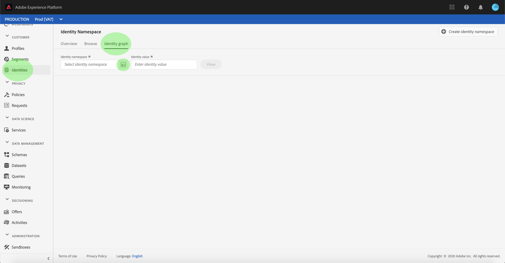
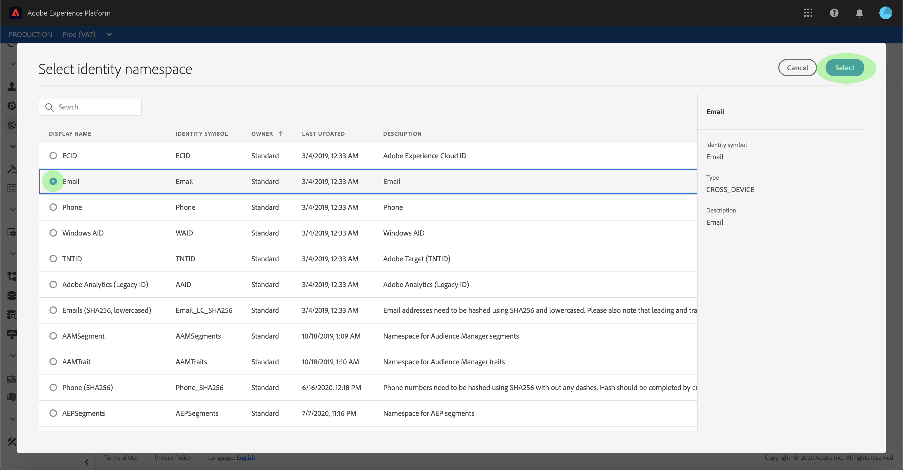
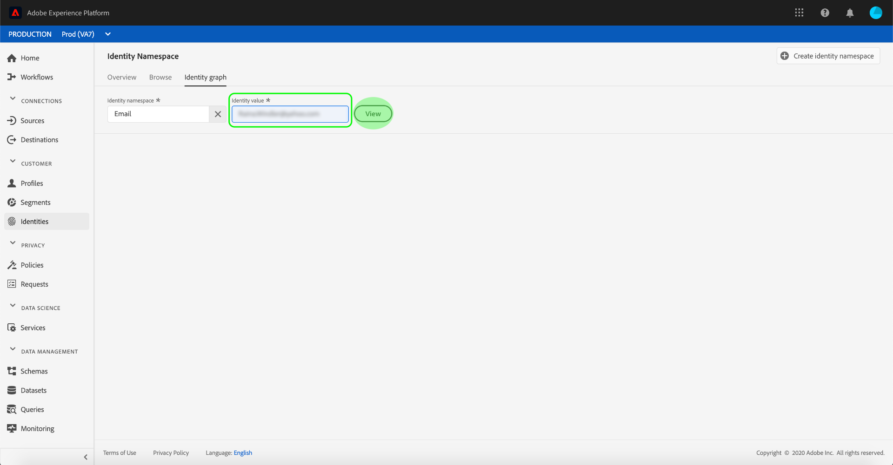
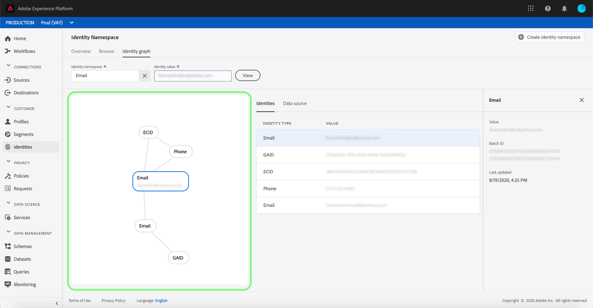
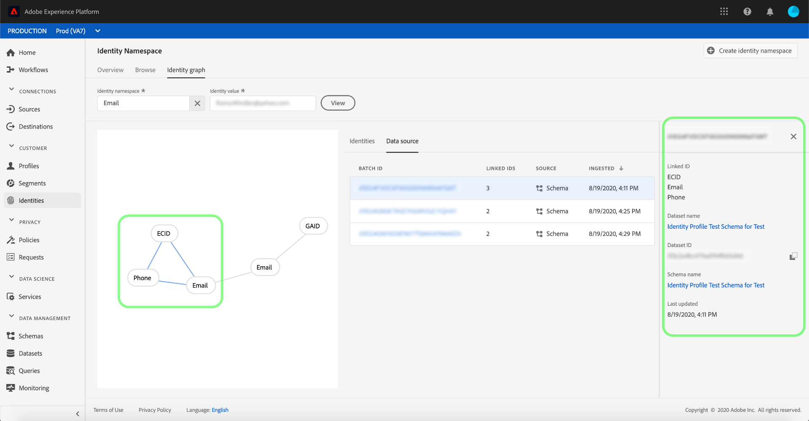
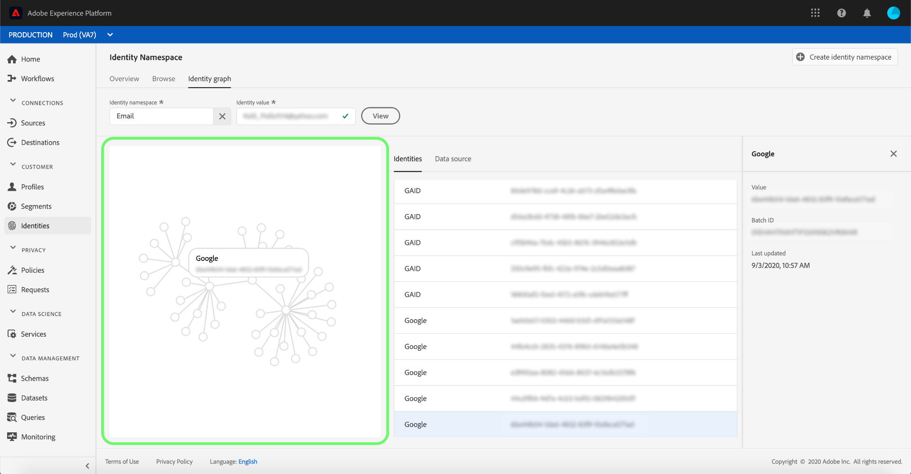

# Identity graph viewer

An identity graph is a map of relationships between different identity namespaces, providing you with a visual representation of how your customer interacts with your brand across different channels. All customer identity graphs are collectively managed and updated by [!DNL Identity Service] in near real-time, in response to customer activity.

Through the identity graph viewer, you can better view and understand what identities are stitched together and how they are stitched together. The force-directed nature of the identity graph allows you to drag different parts of the graph for a better understanding of how identities are connected. This allows for a more efficient means to debug as well as increased transparency with how information is being utilized.

## Getting started

Working with the identity graph viewer requires an understanding of the various Adobe Experience Platform services involved. Before beginning to work with the identity graph viewer, please review the documentation for the following services:

- [[!DNL Real-time Customer Profile]](../../profile/home.md): Provides a unified, customer profile in real-time based on aggregated data from multiple sources.
- [[!DNL Identity Service]](../home.md): Gain a better view of individual customers and their behavior by bridging identities across devices and systems.
- [[!DNL Privacy Service]](../../privacy-service/home.md): Identity namespaces are used to comply with General Data Protection Regulation (GDPR), where GDPR requests can be made relative to a namespace.

## Access the identity graph viewer

To use the identity graph viewer in the UI, select **[!UICONTROL Identities]** in the left-rail and then select the **[!UICONTROL Identity graph]** tab. From the **[!UICONTROL Identity Namespace]** screen, click the **[!UICONTROL Select identity namespace]** icon to search for the namespace you intend to use.

The **[!UICONTROL Select identity namespace]** panel appears. This screen contains a list of namespaces at your disposal, including information about a namespace's **[!UICONTROL Display name]**, **[!UICONTROL Identity symbol]**, **[!UICONTROL Owner]**, **[!UICONTROL Last updated]** date, and **[!UICONTROL Description]**. You can use any of the namespaces provided, so long as you have a valid identity value connected to it.

Select the namespace you intend to use and click **[!UICONTROL Select]** to proceed.

Once you have selected a namespace, enter its corresponding value in the **[!UICONTROL Identity value]** text box and select **[!UICONTROL View]**.

The identity graph viewer appears. On the left side of the screen is a force-directed graph displaying all of the identities stitched within the graph that contains the namespace you selected. You can select and identity node to see its namespace and its corresponding ID value. Alternatively, you can hover over an identity to see information about its ID value. The graph output is also displayed as a tabled list in the center of the screen.

Select an identity to update the highlighted row on the **[!UICONTROL Identity types]** table and to update the information provided on the right rail, which includes an identity's **[!UICONTROL Value]**, **[!UICONTROL Batch Id]**, and its **[!UICONTROL Last updated]** date.

Select **[!UICONTROL Data source]** from the header to see more information regarding the batch. Alternatively, you can select any of the links that connect identities together to see their corresponding batch IDs.

The **[!UICONTROL Data source]** screen displays a list of batch IDs linked to the identities within the identity graph, as well as information about its source schema and a timestamp on its last ingestion.

The right rail of the **[!UICONTROL Data source]** screen contains more information regarding the batch ID, including details about its dataset and schema. Select a batch ID to see a more comprehensive overview of that particular batch.

Identity graphs with larger clusters of identities are also accessible through the identity graph viewer. The maximum number of linked identities that can be displayed through the identity graph viewer is 150.

>[!IMPORTANT]
>
>An identity graph requires a minimum of two linked identities to be generated.

## Next steps

By reading this document, you have learned how to access the identity graph viewer and view how identities are stitched together. For more information, please refer to the [Identity Service overview](../home.md)