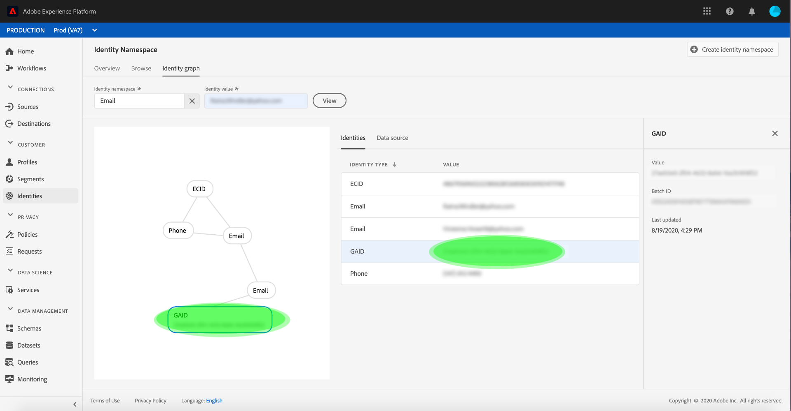
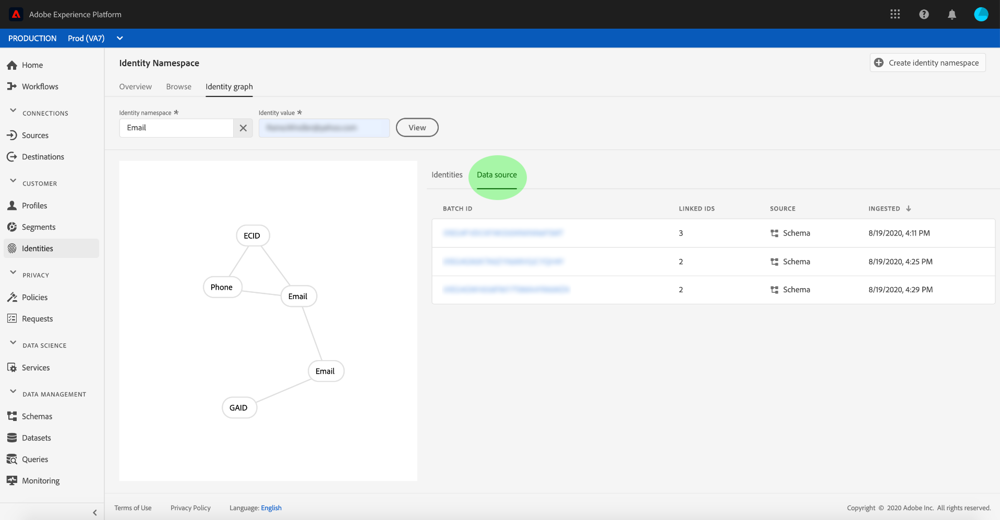

# Identity graph viewer

An identity graph is a map of relationships between different identity namespaces for a particular customer, providing you with a visual representation of how your customer interacts with your brand across different channels. All customer identity graphs are collectively managed and updated by Adobe Experience Platform Identity Service] in near real-time, in response to customer activity.

The identity graph viewer in the Platform user interface allows you to visualize and better understand what customer identities are stitched together, and in what ways. The viewer allows you to drag and interact with different parts of the graph, allowing you to examine complex identity relationships, debug more efficiently, and benefit from increased transparency with how information is being utilized.

## Getting started

Working with the identity graph viewer requires an understanding of the various Adobe Experience Platform services involved. Before beginning to work with the identity graph viewer, please review the documentation for the following services:

- [[!DNL Identity Service]](../home.md): Gain a better view of individual customers and their behavior by bridging identities across devices and systems.

## Access the identity graph viewer

To use the identity graph viewer in the UI, select **[!UICONTROL Identities]** in the left navigation and then select the **[!UICONTROL Identity graph]** tab. From the **[!UICONTROL Identity Namespace]** screen, click the **[!UICONTROL Select identity namespace]** icon to search for the namespace you intend to use.

The **[!UICONTROL Select identity namespace]** panel appears. This screen contains a list of namespaces available to your organization, including information about a namespace's **[!UICONTROL Display name]**, **[!UICONTROL Identity symbol]**, **[!UICONTROL Owner]**, **[!UICONTROL Last updated]** date, and **[!UICONTROL Description]**. You can use any of the namespaces provided as long as you have a valid identity value connected to them.

Select the namespace you intend to use and click **[!UICONTROL Select]** to proceed.

Once you have selected a namespace, enter its corresponding value for a particular customer in the **[!UICONTROL Identity value]** text box and select **[!UICONTROL View]**.

The identity graph viewer appears. On the left side of the screen is the identity graph displaying all the identities that represent a particular customer, sorted by namespace. Each identity node consists of a namespace and its corresponding ID value. You can select and hold any identity to drag and interact with the graph. Alternatively, you can hover over an identity to see information about its ID value. The graph output is also displayed as a tabled list in the center of the screen.

Select an identity to update the highlighted row on the **[!UICONTROL Identity types]** table and to update the information provided on the right rail, which includes an identity's **[!UICONTROL Value]**, **[!UICONTROL Batch Id]**, and its **[!UICONTROL Last updated]** date.

Select **[!UICONTROL Data source]** from the header to see more information regarding the batch. Alternatively, you can select any of the links that connect identities together to see their corresponding batch IDs.

The **[!UICONTROL Data source]** screen displays a list of batch IDs linked to the identities within the identity graph, as well as information about its source schema and a timestamp on its last ingestion.

Select one of the listed batches to see more information on the right rail, including details about its dataset and schema. Select a batch ID to see a more comprehensive overview of that particular batch.

Identity graphs with larger clusters of identities are also accessible through the identity graph viewer, displaying up to 150 linked identities.

>[!NOTE]
>
>An identity graph requires a minimum of two linked identities to be generated.

## Next steps

By reading this document, you have learned how to explore your customers' identity graphs in the Platform UI. For more information on identities in Platform, please refer to the [Identity Service overview](../home.md)