# Identity graph viewer

An identity graph is a map of relationships between different identities for a particular customer, providing you with a visual representation of how your customer interacts with your brand across different channels. All customer identity graphs are collectively managed and updated by Adobe Experience Platform Identity Service in near real-time, in response to customer activity.

The identity graph viewer in the Platform user interface allows you to visualize and better understand what customer identities are stitched together, and in what ways. The viewer allows you to drag and interact with different parts of the graph, allowing you to examine complex identity relationships, debug more efficiently, and benefit from increased transparency with how information is being utilized.

The following document provides steps on how to access and use the identity graph viewer in the Platform UI.

## Tutorial video

The following video is intended to support your understanding of the identity graph viewer.

>[!VIDEO](https://video.tv.adobe.com/v/331030/?quality=12&learn=on)

## Getting started

Working with the identity graph viewer requires an understanding of the various Adobe Experience Platform services involved. Before beginning to work with the identity graph viewer, please review the documentation for the following services:

- [[!DNL Identity Service]](../home.md): Gain a better view of individual customers and their behavior by bridging identities across devices and systems.
- [Real-Time Customer Profile](../../profile/home.md): Identity graphs are leveraged by Real-Time Customer Profile to create a comprehensive and singular view of your customer attributes and behavior.

### Terminology

- **Identity (node):** An identity or a node is data unique to an entity, typically a person. An identity is comprised of an identity namespace and an identity value. For example, a fully qualified identity could consist an identity namespace for **Email**, combined with an identity value of **robin@email.com**.
- **Link (edge):** A link or an edge represents the connection between identities. Identity links include properties such as first established and last updated timestamps. The first established timestamp defines the date and time in which a new identity is linked to an existing identity. The last updated timestamp defines the date and time in which an existing identity link was last updated.
- **Graph (cluster):** A graph or a cluster is a group of identities and links that represent a person.

## Access the identity graph viewer

In the Platform UI, select **[!UICONTROL Identities]** in the left navigation and then select **[!UICONTROL Identity Graph]** from the list of tabs in the header.

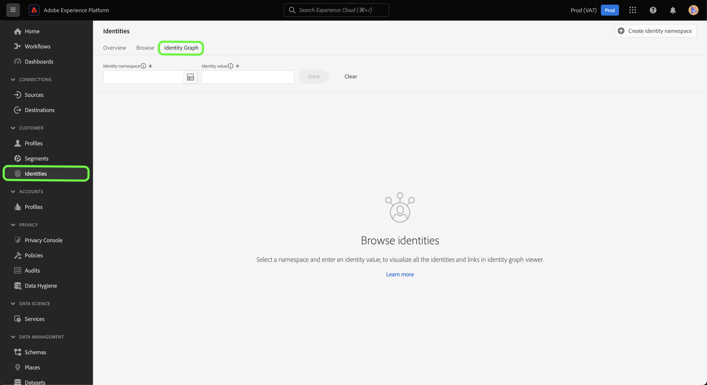

To view an identity graph, provide an identity namespace and its corresponding value and then select **[!UICONTROL View]**.

>[!TIP]
>
>Select the table icon  to see a panel with a list of all identity namespaces available in your organization. You can use any of the identity namespaces as long as you have a valid identity value connected to them. For more information, read the [identity namespace guide](../namespaces.md).

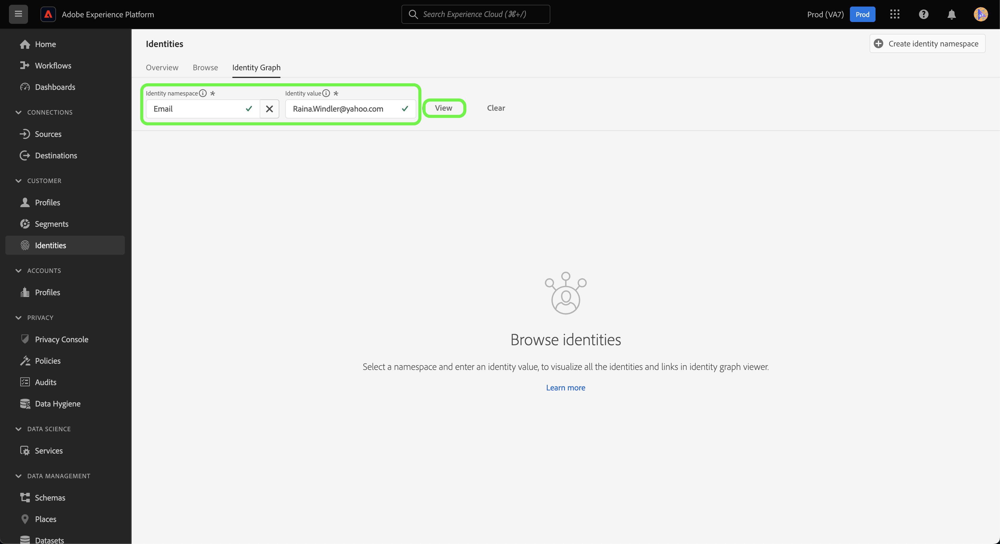

## Understanding the identity graph viewer interface

The identity graph viewer interface is made up of several elements that you can use to interact and better understand your identity data.

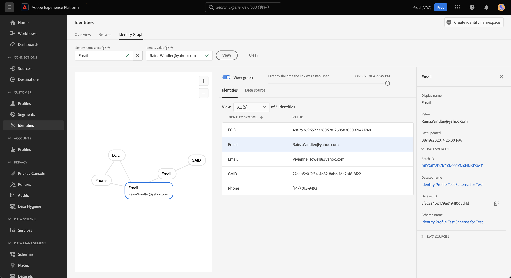

The identity graph displays all of the identities linked to the identity namespace and value combination that you entered. Each node consists of an identity namespace and its corresponding value. You can select, hold, and drag any node to interact with the graph. Alternatively, you can hover over a node to see information about its corresponding identity value. To hide or display the graph, select **[!UICONTROL View graph]**.

>[!IMPORTANT]
>
>An identity graph requires a minimum of two linked identities to be generated and a valid identity namespace and value combination. The maximum number of identities that the graph viewer can display is 150. See the [appendix](#appendix) section below for more information.

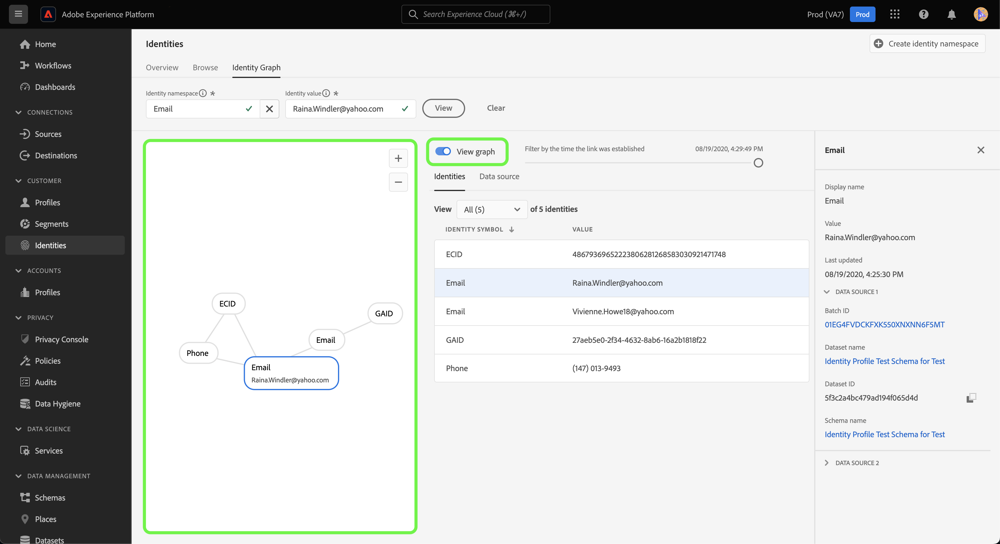

Select a link within the graph to see the dataset and batch ID that contribute to that link. Selecting a link also updates the right rail to provide more information on data source details, as well as properties like first established and last updated timestamps.

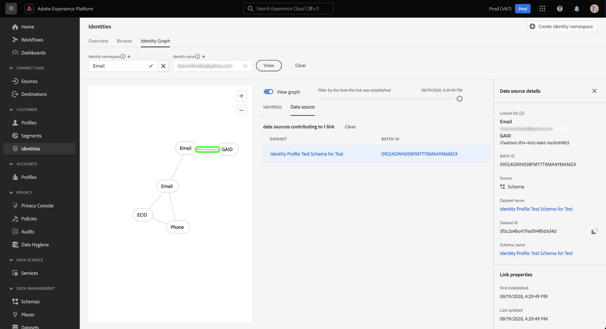

The [!UICONTROL Identities] table provides a different view of your identity data, listing out the identity namespace and the identity value combination in a tabular format. Selecting a node in the graph will update the highlighted line item in the [!UICONTROL Identities] table. 

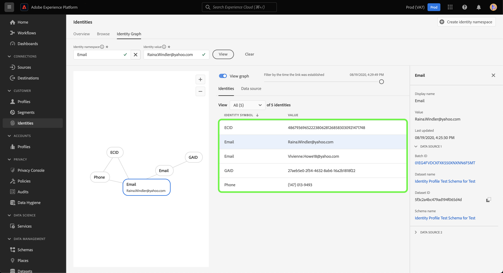

Use the dropdown menu to sort through the graph data and highlight information on a specific identity namespace. For example, select **[!UICONTROL Email]** from the menu to view data that pertains only to the email identity namespace.

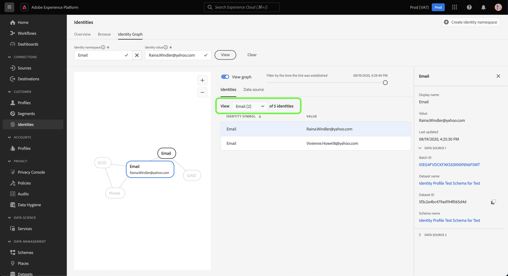

The right rail displays information on a selected identity, including its last updated timestamp. The right rail also displays information on the data source that corresponds with the selected identity, including its batch ID, dataset name, dataset ID, and schema name.

The following table provides additional information on the data source properties displayed in the right rail:

| Data source | Description |
| --- | --- | 
| Batch ID | The auto-generated identifier that corresponds with your batch data. | 
| Dataset ID | The auto-generated identifier that corresponds with your dataset. |
| Dataset name | The name of the dataset that contains your batch data. |
| Schema name | The name of the schema. The schema provides a set of rules that represent and validate the structure and format of data. |

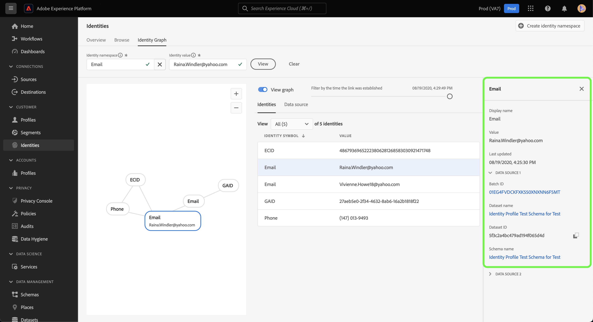

You can also view the list of data sources contributing to your identities using the *[!UICONTROL Data source]*. Select [!UICONTROL Data source] for a tabular view of your datasets and batch IDs.

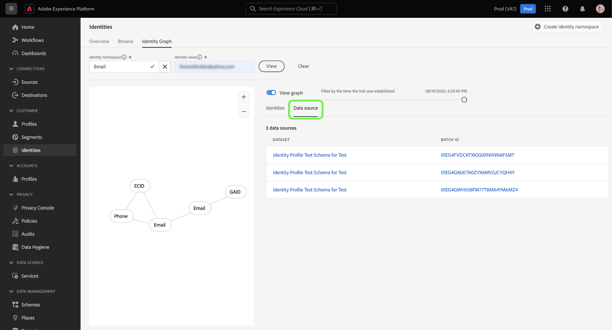

Use the slider to filter graph data by the time in which identities were first established. By default, the identity graph viewer displays all identities linked within the graph. Hold and drag the slider to adjust the time to the last timestamp in which a new identity was linked to the graph. In the example below, the graph displays that the most recent identity link (GAID), was established on **[!UICONTROL 08/19/2020, 4:29:29 PM]**.

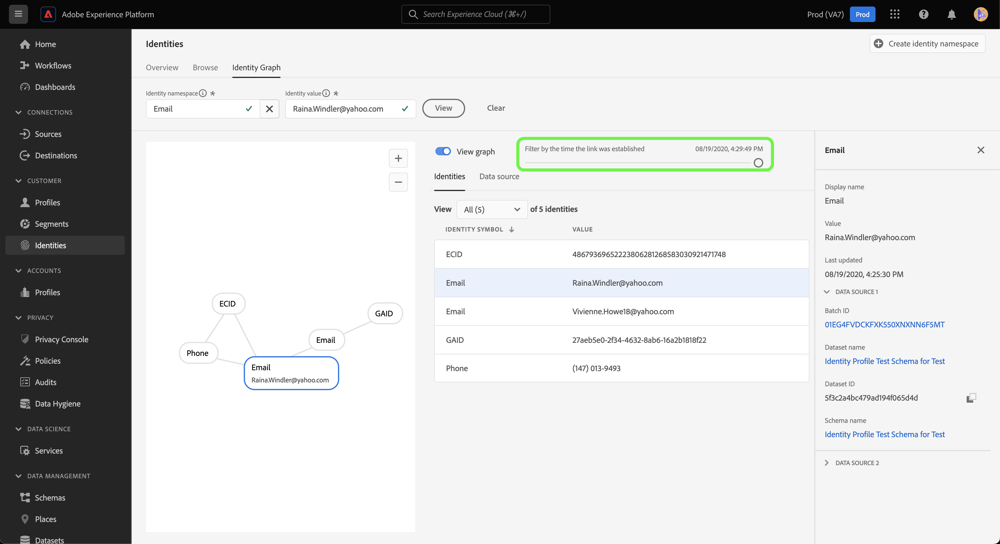

Adjust the slider to see that another identity link (Email) was established on **[!UICONTROL 08/19/2020, 4:25:30 PM]**.

You can also adjust the slider to see the earliest iteration of the graph. In the example below, the identity graph viewer displays that the graph was first created on **[!UICONTROL 08/19/2020, 4:11:49 PM]**, with its first links being ECID, Email, and Phone.

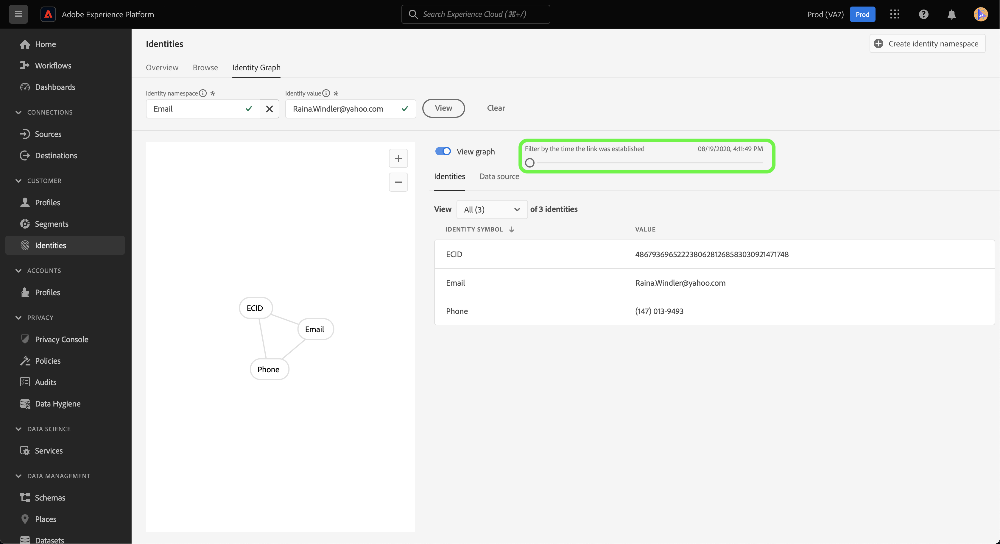

## Appendix

The following section provides additional information for working with the identity graph viewer.

### Understanding error messages

Errors may happen when accessing the identity graph viewer. The following is a list of prerequisites and limitations to take note of when working with the identity graph viewer.

- An identity value must exist in the selected namespace.
- The identity graph viewer requires a minimum of two linked identities to generate. It is possible that there is only one identity value and no linked identities, and in this case, the value would only exist in [!DNL Profile] viewer.
- The identity graph viewer cannot exceed the maximum of 150 identities.

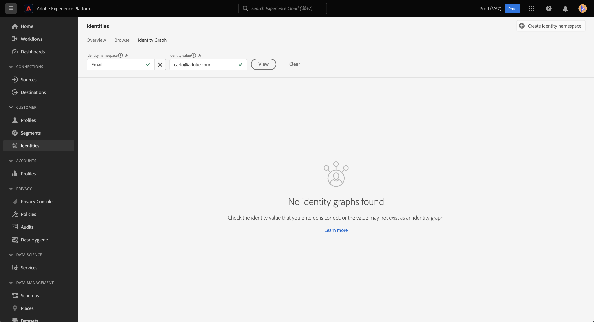

### Access the identity graph viewer from datasets

You can also access the identity graph viewer using the datasets interface. From the datasets [!UICONTROL Browse] page, select a dataset you want to interact with, and then select **[!UICONTROL Preview dataset]**

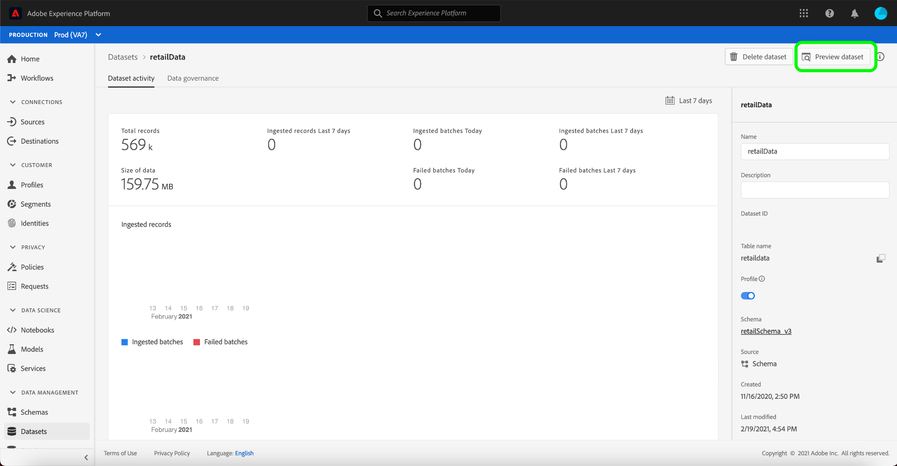

From the preview window, select a fingerprint icon to see the identities represented through the identity graph viewer.

>[!TIP]
>
>The fingerprint icon only appears if the dataset has two or more identities.

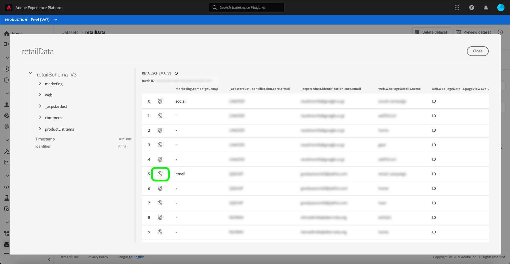

## Next steps

By reading this document, you have learned how to explore your customers' identity graphs in the Platform UI. For more information on identities in Platform, please refer to the [Identity Service overview](../home.md)

## Changelog

| Date | Action |
| ---- | ------ |
| 2021-01 | <ul><li>Added support for streaming ingested data and non-production sandbox.</li><li>Minor bug fixes.</li></ul> |
| 2021-02 | <ul><li>Identity graph viewer is made accessible through dataset preview.</li><li>Minor bug fixes.</li><li>Identity graph viewer is made Generally Available.</li></ul> |
| 2023-01 | <ul><li>UI updates.</li></ul>
