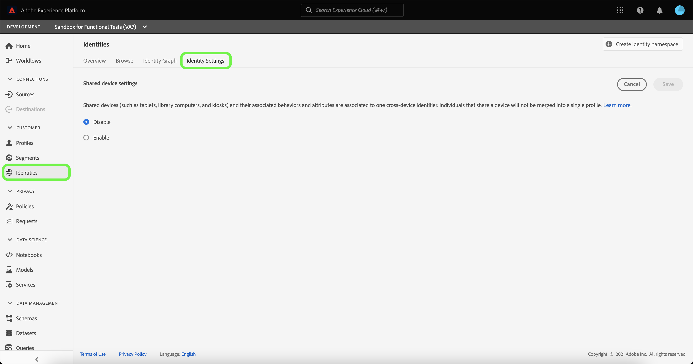
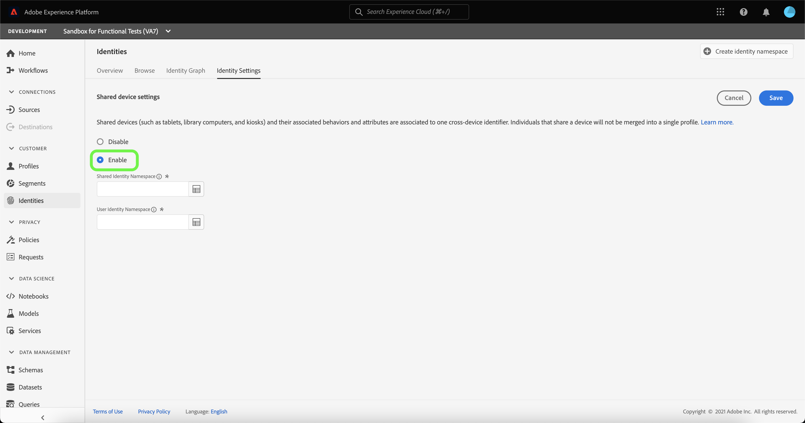
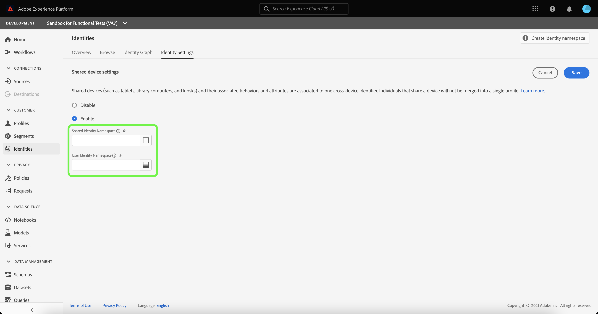
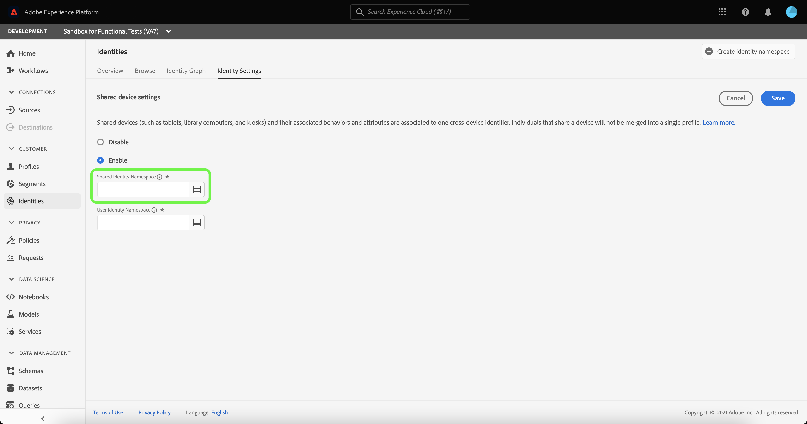
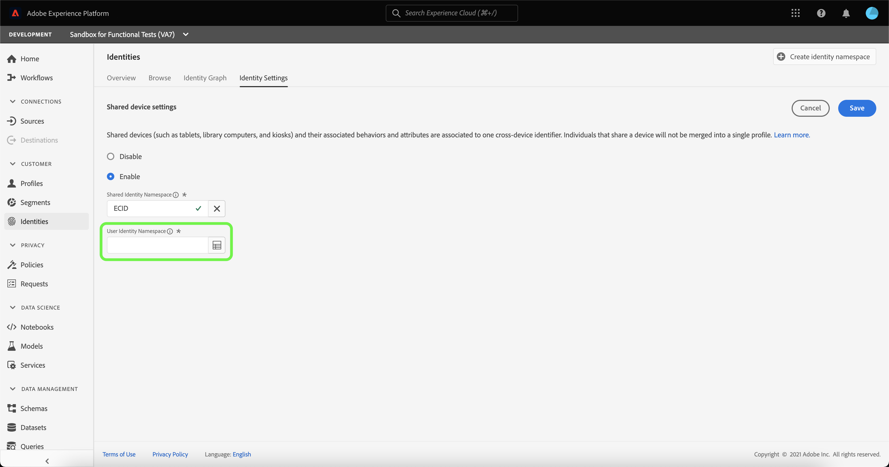
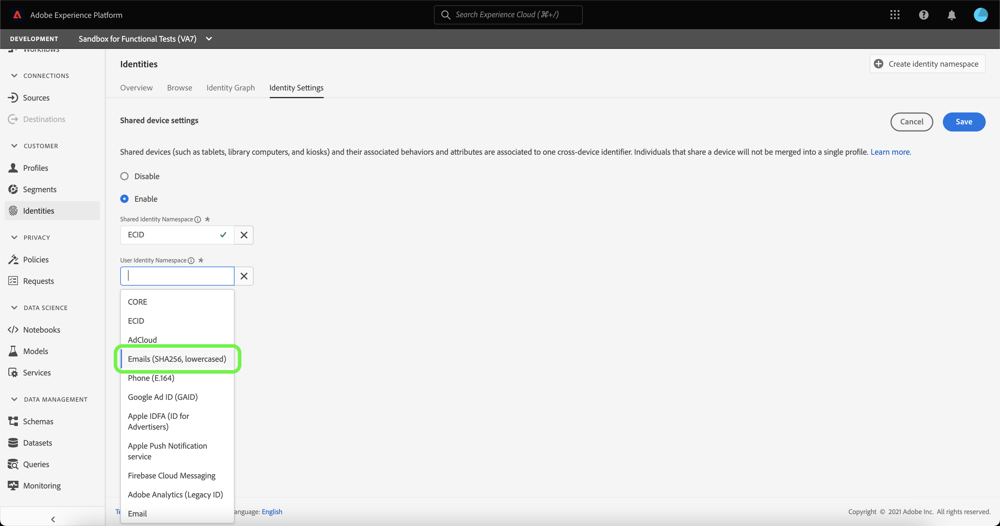
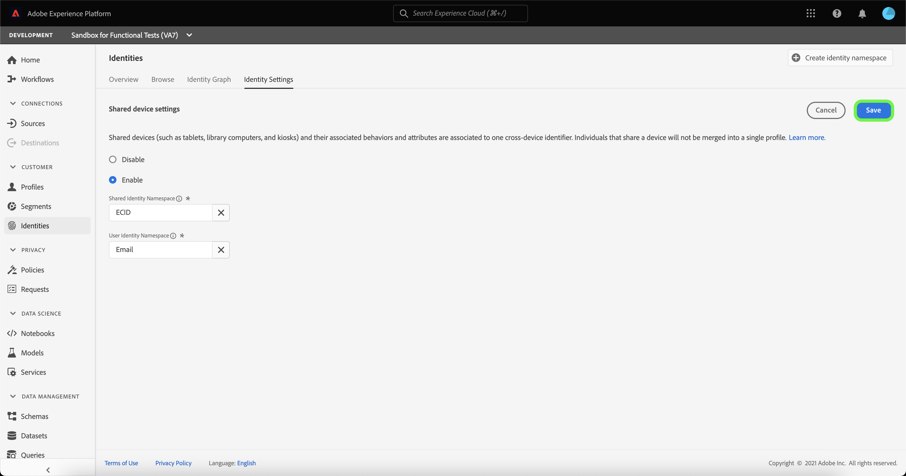
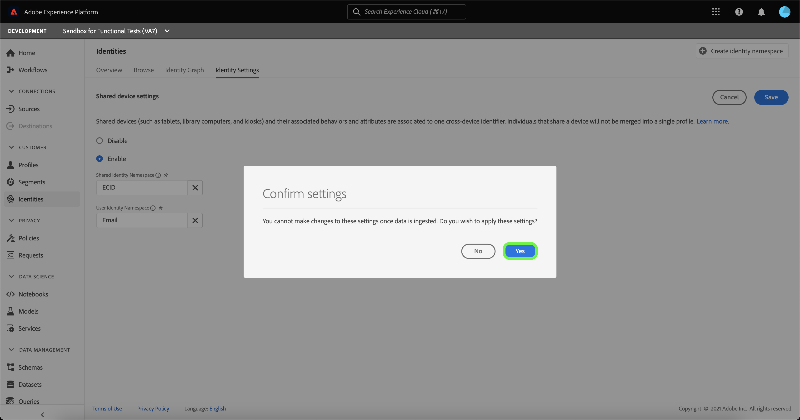

# Shared Device Detection overview (Beta) 

>[!IMPORTANT]
>
>The [!DNL Shared Device Detection] feature is in beta. Its features and documentation are subject to change.

Adobe Experience Platform [!DNL Identity Service] helps you to gain a better view of your customer and their behavior by bridging identities across devices and systems, allowing you to deliver impactful, personal digital experiences in real time.

[!DNL Shared Device] refers to devices that are used by more than one individual. Examples of a shared device include tablets, library computers, and kiosks. Through the [!DNL Shared Device Detection] feature, different users of the same device can be prevented from being merged into a single identity, allowing for more accurate representation of an individual.

With [!DNL Shared Device Detection] you can:

* Create separate identity graphs for different users of the same device;
* Prevent the mixing of data from different individuals using the same device;
* Generate a cleaner and more accurate view of your customers.

>[!TIP]
>
>Configurations for [!DNL Shared Device Detection] must be completed prior to enabling Profile for dataset because you can no longer revise settings once graphs are generated in [!DNL Identity Service].

## Getting started with [!DNL Shared Device Detection]

Working with [!DNL Shared Device Detection] requires an understanding of the various Platform services involved. Before beginning to work with [!DNL Shared Device Detection], please review the documentation for the following services:

* [[!DNL Identity Service]](../home.md): Gain a better view of individual customers and their behavior by bridging identities across devices and systems.
  * [Identity graph viewer](./identity-graph-viewer.md): Visualize and interact with the identity graph viewer to better understand how customer identities are stitched together, and in what ways.
  * [Identity namespaces](../namespaces.md): See the components of a fully qualified identity, and how identity namespaces allows you to distinguish the context and type of an identity.

## Understanding [!DNL Shared Device Detection]

It is important to understand the following terminology when working with 
[!DNL Shared Device Detection]. See the table below for a list of terms essential to understanding [!DNL Shared Device Detection].

### Terminology

| Terms | Definition |
| --- | --- |
| Shared device | A shared device is any device that is used by more than one individual. Examples of shared devices include tablets, library computers, and kiosks. |
| [!DNL Shared Device Detection] | [!DNL Shared Device Detection] refers to a configuration setting that allows for data from different users of the same device to be separated from one another. |
| Shared Identity Namespace | The Shared Identity Namespace represents the device that could be used by multiple users. The Shared Identity Namespace is usually the ECID, but can be set to other device IDs. | 
| User Identity Namespace | The User Identity Namespace represents the authenticated (logged in) user of a shared device. |
| Last authenticated user | The last authenticated user represents the user who was last logged-in to a device, if a device is being logged on by multiple accounts. |

{style="table-layout:auto"}

[!DNL Shared Device Detection] works by establishing two namespaces: the **Shared Identity Namespace** and the **User Identity Namespace**.

* The Shared Identity Namespace represents the  device that could be used by multiple users. Adobe recommends that customers use ECID as the shared device identifier. 
* The User Identity Namespace is mapped to the identity namespace that corresponds to a user's login ID, this can be a user's CRM ID, email address, hashed email, or phone number. 

A shared device, like a tablet, has a single **Shared Identity Namespace**. On the other hand, each user of a shared device has their own designated **User Identity Namespace** that corresponds with their respective login IDs. For example, a tablet that Kevin and Nora share for e-commerce use has its own ECID of `1234`, while Kevin has his own User Identity Namespace that is mapped to his `kevin@email.com` account and Nora has her own User Identity Namespace mapped to her `nora@email.com` account.

[!DNL Shared Device Detection] is able to make distinctions between several users of the same device by linking the shared identity namespace (ex. ECID) with the last authenticated user's User Identity Namespace (login ID).

### How identity data is sent to an identity graph

Consider the following example to help your understanding of how [!DNL Shared Device Detection] works:

>[!NOTE]
>
>In this diagram, the Shared Identity Namespace is configured to ECID and the User Identity Namespace is configured to CRM ID.

* Kevin and Nora share a tablet to visit an e-commerce website. However, they both have their own independent accounts that they each use to browse and shop online;
  * As a shared device, the tablet has a corresponding ECID, which represents the tablet's web browser cookie ID;
* Suppose that Kevin uses the tablet and **logs in** to his e-commerce account to browse for headphones, this then means that Kevin's CRM ID (**User Identity Namespace**) is now linked with the tablet's ECID (**Shared Identity Namespace**). The tablet's browsing data are now incorporated with Kevin's identity graph.
  * If Kevin **logs out** and Nora uses the tablet and **logs in** to her own account and buys a camera, then her CRM ID is now linked to the tablet's ECID. Therefore, the tablet's browsing data are now incorporated with Nora's identity graph.
  * If Nora **does not log out** and Kevin uses the tablet, but **does not log in**, then the tablet's browsing data are still incorporated with Nora, because she remains as the authenticated user and her CRM ID is still linked to the tablet's ECID.
  * If Nora **does log out** and Kevin uses the tablet, but **does not log in**, then the tablet's browsing data are still incorporated with Nora's identity graph, because as the **last authenticated user**, her CRM ID remains linked with the tablet's ECID.
  * If Kevin **logs in** again, then his CRM ID now gets linked to the tablet's ECID, because he is now the last authenticated user and the tablet's browsing data are now incorporated with his identity graph.

### How [!DNL Profile Service] merges profile fragments with [!DNL Shared Device Detection] enabled

[!DNL Profile Service] takes note of profile fragments and merged profiles. Each individual customer profile is composed of multiple profile fragments that have been merged to form a single view of that customer. For example, if a customer interacts with your brand across several channels, your organization will have multiple profile fragments related to that single customer appearing in multiple datasets. When these fragments are ingested into Platform, they are merged together in order to create a single profile for that customer. 

When [!DNL Shared Device Detection] is enabled, [!DNL Profile] defines the primary identity of the profile fragment based on whether the experience event is authenticated or unauthenticated

An **authenticated experience event** is an action completed by a user while logged-in to a device. For authenticated experience events, the primary identity is the **User Identity Namespace** (Login ID). An **unauthenticated experience event** is an action completed by a user who is not logged-in to a device. For unauthenticated experience events, the primary identity is the **Shared Identity Namespace** (ECID).

For more information, see the  [[!DNL Real-Time Customer Profile] overview](../../profile/home.md).

## Shared Devices UI

In the Platform UI, select **[!UICONTROL Identities]** from the left-navigation and then select **[!UICONTROL Identity settings]**.

The [!UICONTROL Shared device settings] page appears, providing you with an interface to configure shared device settings for your data. Shared device settings are disabled by default.

When enabled, shared device settings allows data from different users of the same device to be separated from one another. This configuration setting allows for a cleaner and more accurate representation of identity graphs, where user identities of the same device are not combined together.

Select **[!UICONTROL Enable]** to start modifying your shared device settings.

The [!UICONTROL Shared Identity Namespace] and [!UICONTROL User Identity Namespace] configuration options appear, allowing you to modify the identity namespaces that you want to use.

[!UICONTROL Shared Identity Namespace] represents a single device that is used by multiple different users. This namespace is always set to **[!UICONTROL ECID]** because all Platform users use **[!UICONTROL ECID]** as the web browser identifier.

The [!UICONTROL User Identity Namespace] allows you to identify different users of the same device and prevent data from being combined into the same identity graph.

Select the **[!UICONTROL User Identity Namespace]** search bar and either enter an identity namespace or select an identity namespace from the dropdown menu.

>[!TIP]
>
>The [!UICONTROL User Identity Namespace] should be mapped to the identity namespace that corresponds to the end user's login ID. Options include customer ID, email, and hashed email.

Once you have configured your [!UICONTROL Shared Device Settings], select **[!UICONTROL Save]**.

A pop up window appears prompting you to confirm your selection. Select **[!UICONTROL Yes]** to complete the configuration setting.

