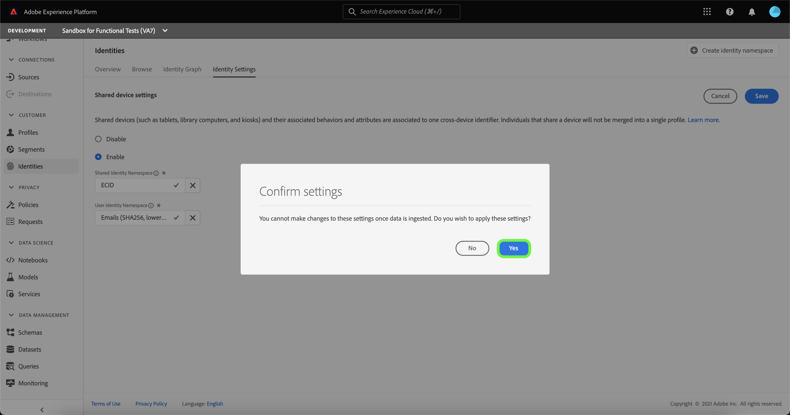

# Shared Device Detection overview (Beta) 

>[!IMPORTANT]
>
>The [!DNL Shared Device Detection] feature is in beta. Its features and documentation are subject to change.

Adobe Experience Platform [!DNL Identity Service] helps you to gain a better view of your customer and their behavior by bridging identities across devices and systems, allowing you to deliver impactful, personal digital experiences in real time.

[!DNL Shared Device] refers to devices that are used by more than one individual. Examples of a shared device include tablets, library computers, and kiosks. Through the [!DNL Shared Device Detection] feature, different users of the same device can be prevented from being merged into a single identity, allowing for more accurate representation of an individual.

With [!DNL Shared Device Detection] you can:

* Create separate identity graphs for different users of the same device;
* Prevent the mixing of data from different individuals using the same device;
* Generate a cleaner and more accurate view of your customers.

>[!TIP]
>
>Configurations for [!DNL Shared Device Detection] must be completed prior to enabling Profile for dataset because you can no longer revise settings once graphs are generated in [!DNL Identity Service].

## Getting started with [!DNL Shared Device Detection]

Working with [!DNL Shared Device Detection] requires an understanding of the various Platform services involved. Before beginning to work with [!DNL Shared Device Detection], please review the documentation for the following services:

* [[!DNL Identity Service]](../home.md): Gain a better view of individual customers and their behavior by bridging identities across devices and systems.
  * [Identity graph viewer](./identity-graph-viewer.md): Visualize and interact with the identity graph viewer to better understand how customer identities are stitched together, and in what ways.
  * [Identity namespaces](../namespaces.md): See the components of a fully qualified identity, and how identity namespaces allows you to distinguish the context and type of an identity.

## Understanding [!DNL Shared Device Detection]

### Terminology

The following table contains a list of terms that are essential to understanding [!DNL Shared Device Detection]:

| Terms | Definition |
| --- | --- |
| Shared device | A shared device is any device that is used by more than one individual. Examples of shared devices include tablets, library computers, and kiosks. |
| [!DNL Shared Device Detection] | [!DNL Shared Device Detection] refers to a configuration setting that allows for data from different users of the same device to be separated from one another. |
| [!UICONTROL Shared Identity Namespace] | A [!UICONTROL Shared Identity Namespace] is used to represent a single device that is shared by multiple different users. | 
| [!UICONTROL User Identity Namespace] | A [!UICONTROL User Identity Namespace] represents the authenticated (logged in) user of a shared device. The [!UICONTROL User Identity Namespace] also represents the last authenticated user of a device, when a device is used anonymously. |

Shared Device Detection works by assigning the Shared Identity Namespace to a shared device and then assigning the User Identity Namespace to the authenticated user of the shared device.

Consider the following example to help your understanding of how Shared Device Detection works:

* Kevin and Nora share a tablet for e-commerce purposes. However, they both have their own independent accounts that they each use to browse and shop online;
  * As a shared device, the tablet is assigned the **Shared Identity Namespace** (99% of the time, this namespace is set to ECID);
* Suppose that Kevin uses the tablet and **logs in** to his e-commerce account to browse for headphones, this then means that the **User Identity Namespace** is assigned to Kevin because he is the current authenticated user of the tablet;
  * Kevin **logs out** -> Nora uses the tablet and **logs in** (authenticated user) to buy a camera -> The **User Identity Namespace** is now assigned to her -> Data is sent to Nora's own identity graph.
  * Nora **does not** log out -> Kevin uses the tablet and **does not log in** -> Browsing data is sent to Nora's identity graph because she is still authenticated.
  * Nora **does log out** -> Kevin uses the tablet, but **does not log in** -> The **User Identity Namespace** stays with Nora because she was the **last authenticated user** -> Browsing data is then linked between the CRM ID and the ECID.
  * Kevin **logs in** again --> The **User Identity Namespace** comes back to him because he is once again the authenticated user.

## Shared Devices UI

In the Platform UI, select **[!UICONTROL Identities]** from the left-navigation and then select **[!UICONTROL Identity settings]**.

The [!UICONTROL Shared device settings] page appears, providing you with an interface to configure shared device settings for your data. Shared device settings are disabled by default.

When enabled, shared device settings allows data from different users of the same device to be separated from one another. This configuration setting allows for a cleaner and more accurate representation of identity graphs, where user identities of the same device are not combined together.

Select **[!UICONTROL Enable]** to start modifying your shared device settings.

The [!UICONTROL Shared Identity Namespace] and [!UICONTROL User Identity Namespace] configuration options appear, allowing you to modify the identity namespaces that you want to use.

[!UICONTROL Shared Identity Namespace] represents a single device that is used by multiple different users. This namespace is always set to **[!UICONTROL ECID]** because all Platform users use **[!UICONTROL ECID]** as the web browser identifier.

The [!UICONTROL User Identity Namespace] allows you to identify different users of the same device and prevent data from being combined into the same identity graph.

Select the **[!UICONTROL User Identity Namespace]** search bar and either enter an identity namespace or select an identity namespace from the dropdown menu.

>[!TIP]
>
>The [!UICONTROL User Identity Namespace] should be mapped to the identity namespace that corresponds to the end user's login ID. Options include customer ID, email, and hashed email.

Once you have configured your [!UICONTROL Shared Device Settings], select **[!UICONTROL Save]**.

A pop up window appears prompting you to confirm your selection. Select **[!UICONTROL Yes]** to complete the configuration setting.

