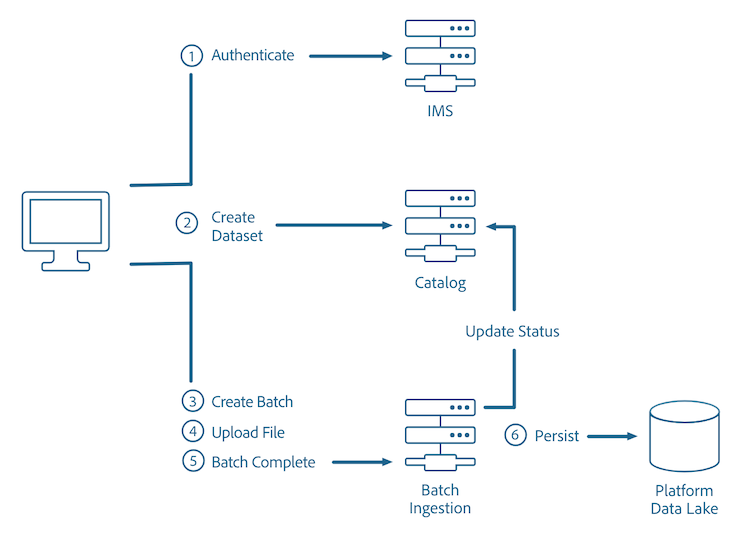

# Batch ingestion API overview

The Adobe Experience Platform Batch Ingestion API allows you to ingest data into Platform as batch files. Data being ingested can be profile data from a flat file (such as a Parquet file) or data that conforms to a known schema in the [!DNL Experience Data Model] (XDM) registry.

The [Batch Ingestion API reference](https://developer.adobe.com/experience-platform-apis/references/batch-ingestion/) provides additional information on these API calls.

The following diagram outlines the batch ingestion process:



## Getting started

The API endpoints used in this guide is part of the [Batch Ingestion API](https://developer.adobe.com/experience-platform-apis/references/batch-ingestion/). Before continuing, please review the [getting started guide](getting-started.md) for links to related documentation, a guide to reading the sample API calls in this document, and important information regarding required headers that are needed to successfully make calls to any Experience Platform API. 

### [!DNL Data Ingestion] prerequisites

- Data to upload must be either in Parquet or JSON formats.
- A dataset created in the [[!DNL Catalog services]](../../catalog/home.md).
- Contents of the Parquet file must match a subset of the schema of the dataset being uploaded into.
- Have your unique Access Token after authentication.

### Batch ingestion best practices

- The recommended batch size is between 256 MB and 100 GB.
- Each batch should contain at most 1500 files.

### Batch ingestion constraints

Batch data ingestion has some constraints:

- Maximum number of files per batch: 1500
- Maximum batch size: 100 GB
- Maximum number of properties or fields per row: 10000
- Maximum number of batches on data lake per minute, per user: 138

>[!NOTE]
>
>To upload a file larger than 512MB, the file will need to be divided into smaller chunks. Instructions to upload a large file can be found in the [large file upload section of this document](#large-file-upload---create-file).

### Types

When ingesting data, it is important to understand how [!DNL Experience Data Model] (XDM) schemas work. For more information about how XDM field types map to different formats, please read the [Schema Registry developer guide](../../xdm/api/getting-started.md).

There is some flexibility when ingesting data - if a type does not match what is in the target schema, the data will be converted to the expressed target type. If it cannot, it will fail the batch with a `TypeCompatibilityException`. 

For example, neither JSON nor CSV has a `date` or `date-time` type. As a result, these values are expressed using [ISO 8061 formatted strings](https://www.iso.org/iso-8601-date-and-time-format.html) ("2018-07-10T15:05:59.000-08:00") or Unix Time formatted in milliseconds (1531263959000) and are converted at ingestion time to the target XDM type.

The table below shows the conversions supported when ingesting data.

| Inbound (row) vs Target (col) | String  | Byte  | Short  | Integer  | Long  | Double  | Date  | Date-Time | Object | Map |
|:---:|:---:|:---:|:---:|:---:|:---:|:---:|:---:|:---:|:---:|:---:|
| String    | X | X | X | X | X | X | X | X |   |   |
| Byte      | X | X | X | X | X | X |   |   |   |   |
| Short     | X | X | X | X | X | X |   |   |   |   |
| Integer   | X | X | X | X | X | X |   |   |   |   |
| Long      | X | X | X | X | X | X | X | X |   |   |
| Double    | X | X | X | X | X | X |   |   |   |   |
| Date      |   |   |   |   |   |   | X |   |   |   |
| Date-Time |   |   |   |   |   |   |   | X |   |   |
| Object    |   |   |   |   |   |   |   |   | X | X |
| Map       |   |   |   |   |   |   |   |   | X | X |

>[!NOTE]
>
>Booleans and arrays cannot be converted to other types.

## Using the API

The [!DNL Data Ingestion] API allows you to ingest data as batches (a unit of data that consists of one or more files to be ingested as a single unit) into [!DNL Experience Platform] in three basic steps:

1. Create a new batch. 
2. Upload files to a specified dataset that matches the XDM schema of the data. 
3. Signal the end of the batch.

## Create a batch

Before data can be added to a dataset, it must be linked to a batch, which will later be uploaded into a specified dataset.

```http
POST /batches
```

**Request**

```shell
curl -X POST "https://platform.adobe.io/data/foundation/import/batches" \
  -H "Content-Type: application/json" \
  -H "x-gw-ims-org-id: {ORG_ID}" \
  -H "x-sandbox-name: {SANDBOX_NAME}" \
  -H "Authorization: Bearer {ACCESS_TOKEN}" \
  -H "x-api-key: {API_KEY}"
  -d '{ 
          "datasetId": "{DATASET_ID}" 
      }'
```

| Property | Description |
| -------- | ----------- |
| `datasetId` | The ID of the dataset to upload the files into. |

**Reponse**

```JSON
{
    "id": "{BATCH_ID}",
    "imsOrg": "{ORG_ID}",
    "updated": 0,
    "status": "loading",
    "created": 0,
    "relatedObjects": [
        {
            "type": "dataSet",
            "id": "{DATASET_ID}"
        }
    ],
    "version": "1.0.0",
    "tags": {},
    "createdUser": "{USER_ID}",
    "updatedUser": "{USER_ID}"
}
```

| Property | Description |
| -------- | ----------- |
| `id` | The ID of the batch that was just created (used in subsequent requests). |  
| `relatedObjects.id` | The ID of the dataset to upload the files into. |

## File upload

After successfully creating a new batch for uploading, files can then be uploaded to a specific dataset.

You can upload files using the Small File Upload API. However, if your files are too large and the gateway limit is exceeded (such as extended timeouts, requests for body size exceeded, and other constrictions), you can switch over to the Large File Upload API. This API uploads the file in chunks, and stitches data together using the Large File Upload Complete API call.

>[!NOTE]
>
>Batch ingestion can be used to incrementally update data in the Profile Store. For more information, see the section on [updating a batch](#patch-a-batch) in the [batch ingestion developer guide](api-overview.md). 

>[!INFO]
>
>The examples below use the [Apache Parquet](https://parquet.apache.org/docs/) file format. An example that uses the JSON file format can be found in the [batch ingestion developer guide](api-overview.md).

### Small file upload

Once a batch is created, data can be uploaded to a preexisting dataset.  The file being uploaded must match its referenced XDM schema.

```http
PUT /batches/{BATCH_ID}/datasets/{DATASET_ID}/files/{FILE_NAME}
```

| Property | Description |
| -------- | ----------- |
| `{BATCH_ID}` | The ID of the batch. |  
| `{DATASET_ID}` | The ID of the dataset to upload files. | 
| `{FILE_NAME}` | The name of file as it will be seen in the dataset. |

**Request**

```SHELL
curl -X PUT "https://platform.adobe.io/data/foundation/import/batches/{BATCH_ID}/datasets/{DATASET_ID}/files/{FILE_NAME}.parquet" \
  -H "content-type: application/octet-stream" \
  -H "x-gw-ims-org-id: {ORG_ID}" \
  -H "x-sandbox-name: {SANDBOX_NAME}" \
  -H "Authorization: Bearer {ACCESS_TOKEN}" \
  -H "x-api-key: {API_KEY}" \
  --data-binary "@{FILE_PATH_AND_NAME}.parquet"
```

| Property | Description |
| -------- | ----------- |
| `{FILE_PATH_AND_NAME}` | The path and filename of the file to be uploaded into the dataset. |

**Reponse**

```JSON
#Status 200 OK, with empty response body
```

### Large file upload - create file

To upload a large file, the file must be split into smaller chunks and uploaded one at a time.

```http
POST /batches/{BATCH_ID}/datasets/{DATASET_ID}/files/{FILE_NAME}?action=initialize
```

| Property | Description |
| -------- | ----------- |
| `{BATCH_ID}` | The ID of the batch. |  
| `{DATASET_ID}` | The ID of the dataset ingesting the files. |
| `{FILE_NAME}` | The name of file as it will be seen in the dataset. |

**Request**

```SHELL
curl -X POST "https://platform.adobe.io/data/foundation/import/batches/{BATCH_ID}/datasets/{DATASET_ID}/files/part1=a/part2=b/{FILE_NAME}.parquet?action=initialize" \
  -H "x-gw-ims-org-id: {ORG_ID}" \
  -H "x-sandbox-name: {SANDBOX_NAME}" \
  -H "Authorization: Bearer {ACCESS_TOKEN}" \
  -H "x-api-key: {API_KEY}"
``` 

**Reponse**

```JSON
#Status 201 CREATED, with empty response body
```

### Large file upload - upload subsequent parts

After the file has been created, all subsequent chunks can be uploaded by making repeated PATCH requests, one for each section of the file.

```http
PATCH /batches/{BATCH_ID}/datasets/{DATASET_ID}/files/{FILE_NAME}
```

| Property | Description |
| -------- | ----------- |
| `{BATCH_ID}` | The ID of the batch. |  
| `{DATASET_ID}` | The ID of the dataset to upload the files into. |
| `{FILE_NAME}` | Name of file as it will be seen in the dataset. |

**Request**

```SHELL
curl -X PATCH "https://platform.adobe.io/data/foundation/import/batches/{BATCH_ID}/datasets/{DATASET_ID}/files/part1=a/part2=b/{FILE_NAME}.parquet" \
  -H "content-type: application/octet-stream" \
  -H "x-gw-ims-org-id: {ORG_ID}" \
  -H "x-sandbox-name: {SANDBOX_NAME}" \
  -H "Authorization: Bearer {ACCESS_TOKEN}" \
  -H "x-api-key: {API_KEY}" \
  -H "Content-Range: bytes {CONTENT_RANGE}" \
  --data-binary "@{FILE_PATH_AND_NAME}.parquet"
``` 

| Property | Description |
| -------- | ----------- |
| `{FILE_PATH_AND_NAME}` | The path and filename of the file to be uploaded into the dataset. |

**Reponse**

```JSON
#Status 200 OK, with empty response
```

## Signal batch completion

After all files have been uploaded to the batch, the batch can be signaled for completion. By doing this, the [!DNL Catalog] DataSetFile entries are created for the completed files and associated with the batch generated above. The [!DNL Catalog] batch is then marked as successful, which triggers downstream flows to ingest the available data.

**Request**

```http
POST /batches/{BATCH_ID}?action=COMPLETE
```

| Property | Description |
| -------- | ----------- |
| `{BATCH_ID}` | The ID of the batch to be uploaded into the dataset. |

```SHELL
curl -X POST "https://platform.adobe.io/data/foundation/import/batches/{BATCH_ID}?action=COMPLETE" \
-H "x-gw-ims-org-id: {ORG_ID}" \
-H "x-sandbox-name: {SANDBOX_NAME}" \
-H "Authorization: Bearer {ACCESS_TOKEN}" \
-H "x-api-key: {API_KEY}"
```

**Reponse**

```JSON
#Status 200 OK, with empty response
```

## Check batch status

While waiting for the files to uploaded to the batch, the batch's status can be checked to see its progress.

**API format**

```http
GET /batch/{BATCH_ID}
```

| Property | Description |
| -------- | ----------- |
| `{BATCH_ID}` | The ID of the batch that is being checked. |

**Request**

```shell
curl GET "https://platform.adobe.io/data/foundation/catalog/batch/{BATCH_ID}" \
  -H "Authorization: Bearer {ACCESS_TOKEN}" \
  -H "x-gw-ims-org-id: {ORG_ID}" \
  -H "x-sandbox-name: {SANDBOX_NAME}" \
  -H "x-api-key: {API_KEY}"
```

**Reponse**

```JSON
{
    "{BATCH_ID}": {
        "imsOrg": "{ORG_ID}",
        "created": 1494349962314,
        "createdClient": "MCDPCatalogService",
        "createdUser": "{USER_ID}",
        "updatedUser": "{USER_ID}",
        "updated": 1494349963467,
        "externalId": "{EXTERNAL_ID}",
        "status": "success",
        "errors": [
            {
                "code": "err-1494349963436"
            }
        ],
        "version": "1.0.3",
        "availableDates": {
            "startDate": 1337,
            "endDate": 4000
        },
        "relatedObjects": [
            {
                "type": "batch",
                "id": "foo_batch"
            },
            {
                "type": "connection",
                "id": "foo_connection"
            },
            {
                "type": "connector",
                "id": "foo_connector"
            },
            {
                "type": "dataSet",
                "id": "foo_dataSet"
            },
            {
                "type": "dataSetView",
                "id": "foo_dataSetView"
            },
            {
                "type": "dataSetFile",
                "id": "foo_dataSetFile"
            },
            {
                "type": "expressionBlock",
                "id": "foo_expressionBlock"
            },
            {
                "type": "service",
                "id": "foo_service"
            },
            {
                "type": "serviceDefinition",
                "id": "foo_serviceDefinition"
            }
        ],
        "metrics": {
            "foo": 1337
        },
        "tags": {
            "foo_bar": [
                "stuff"
            ],
            "bar_foo": [
                "woo",
                "baz"
            ],
            "foo/bar/foo-bar": [
                "weehaw",
                "wee:haw"
            ]
        },
        "inputFormat": {
            "format": "parquet",
            "delimiter": ".",
            "quote": "`",
            "escape": "\\",
            "nullMarker": "",
            "header": "true",
            "charset": "UTF-8"
        }
    }
}
```

| Property | Description |
| -------- | ----------- |
| `{USER_ID}` | The ID of the user who created or updated the batch. |

The `"status"` field is what shows the current status of the batch requested. The batches can have one of the following states:

## Batch ingestion statuses

| Status | Description |
| ------ | ----------- |
| Abandoned | The batch has not completed in the expected timeframe. |
| Aborted | An abort operation has **explicitly** been called (via Batch Ingest API) for the specified batch. Once the batch is in a "Loaded" state, it cannot be aborted. |
| Active |  The batch has been successfully promoted and is available for downstream consumption. This status can be used interchangeably with "Success". |
| Deleted | Data for the batch has been completely removed. |
| Failed | A terminal state that results from either bad configuration and/or bad data. Data for a failed batch will **not** show up. This status can be used interchangeably with "Failure". |
| Inactive | The batch was successfully promoted, but has been reverted or has expired. The batch is no longer available for downstream consumption. |
| Loaded | Data for the batch is complete and the batch is ready for promotion. |
| Loading | Data for this batch is being uploaded and the batch is currently **not** ready to be promoted. |
| Retrying | The data for this batch is being processed. However, due to a system or transient error, the batch failed - as a result, this batch is being retried. |
| Staged | The staging phase of the promotion process for a batch is complete and the ingestion job has been run. |
| Staging | Data for the batch is being processed. |
| Stalled | The data for the batch is being processed. However, the batch promotion has stalled after a number of retries. |
