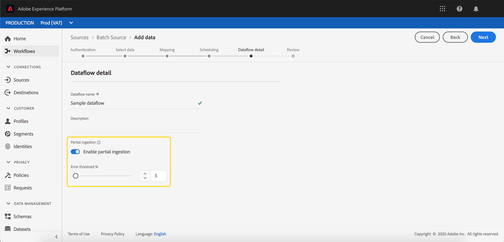
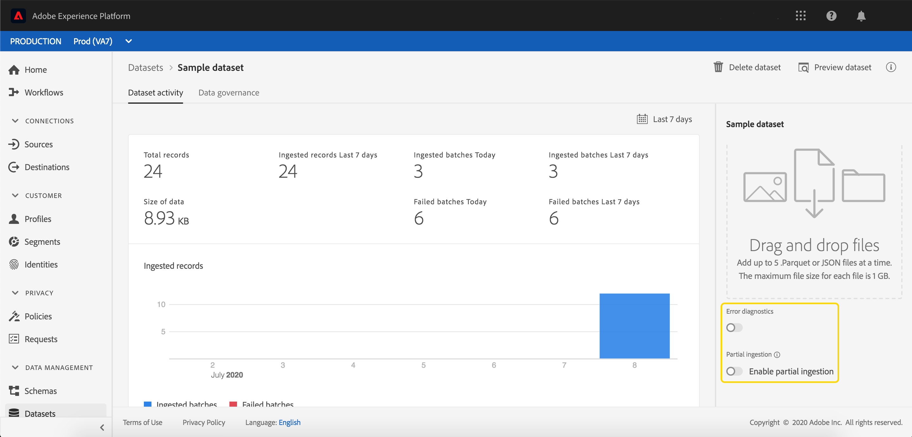
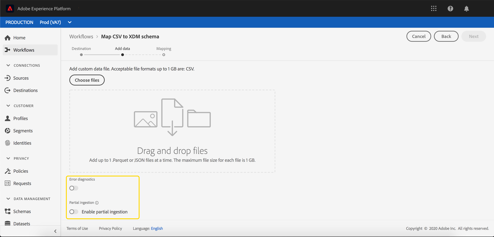
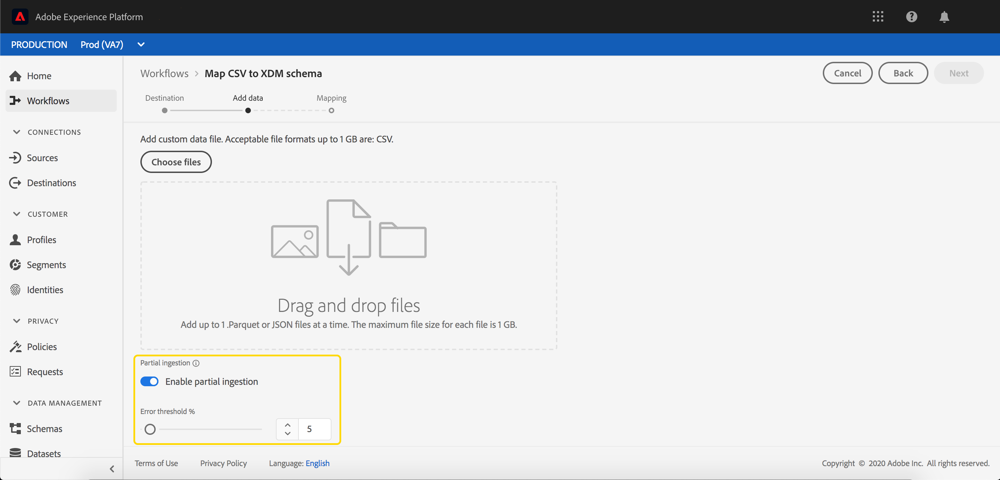

# Partial batch ingestion

Partial batch ingestion is the ability to ingest data containing errors, up to a certain threshold. With this capability, users can successfully ingest all their correct data into Adobe Experience Platform while all their incorrect data is batched separately, along with details as to why it is invalid.

This document provides a tutorial for managing partial batch ingestion. 

## Getting started

This tutorial requires a working knowledge of the various Adobe Experience Platform services involved with partial batch ingestion. Before beginning this tutorial, please review the documentation for the following services:

- [Batch ingestion](./overview.md): The method which [!DNL Platform] ingests and stores data from data files, such as CSV and Parquet.
- [[!DNL Experience Data Model (XDM)]](../../xdm/home.md): The standardized framework by which [!DNL Platform] organizes customer experience data.

The following sections provide additional information that you will need to know in order to successfully make calls to [!DNL Platform] APIs.

### Reading sample API calls

This guide provides example API calls to demonstrate how to format your requests. These include paths, required headers, and properly formatted request payloads. Sample JSON returned in API responses is also provided. For information on the conventions used in documentation for sample API calls, see the section on [how to read example API calls](../../landing/troubleshooting.md#how-do-i-format-an-api-request) in the [!DNL Experience Platform] troubleshooting guide.

### Gather values for required headers

In order to make calls to [!DNL Platform] APIs, you must first complete the [authentication tutorial](https://www.adobe.com/go/platform-api-authentication-en). Completing the authentication tutorial provides the values for each of the required headers in all [!DNL Experience Platform] API calls, as shown below:

- Authorization: Bearer `{ACCESS_TOKEN}`
- x-api-key: `{API_KEY}`
- x-gw-ims-org-id: `{ORG_ID}`

All resources in [!DNL Experience Platform] are isolated to specific virtual sandboxes. All requests to [!DNL Platform] APIs require a header that specifies the name of the sandbox the operation will take place in:

- x-sandbox-name: `{SANDBOX_NAME}`

>[!NOTE]
>
>For more information on sandboxes in [!DNL Platform], see the [sandbox overview documentation](../../sandboxes/home.md). 

## Enable a batch for partial batch ingestion in the API {#enable-api}

>[!NOTE]
>
>This section describes enabling a batch for partial batch ingestion using the API. For instructions on using the UI, please read the [enable a batch for partial batch ingestion in the UI](#enable-ui) step.

You can create a new batch with partial ingestion enabled.

To create a new batch, follow the steps in the [batch ingestion developer guide](./api-overview.md). Once you reach the **[!UICONTROL Create batch]** step, add the following field within the request body:

```json
{
    "enableErrorDiagnostics": true,
    "partialIngestionPercent": 5
}
```

| Property | Description |
| -------- | ----------- |
| `enableErrorDiagnostics` | A flag that allows [!DNL Platform] to generate detailed error messages about your batch. |
| `partialIngestionPercent` | The percentage of acceptable errors before the entire batch will fail. So, in this example, a maximum of 5% of the batch can be errors, before it will fail. |


## Enable a batch for partial batch ingestion in the UI {#enable-ui}

>[!NOTE]
>
>This section describes enabling a batch for partial batch ingestion using the UI. If you have already enabled a batch for partial batch ingestion using the API, you can skip ahead to the next section.

To enable a batch for partial ingestion through the [!DNL Platform] UI, you can create a new batch through source connections, create a new batch in an existing dataset, or create a new batch through the "[!UICONTROL Map CSV to XDM flow]". 

### Create a new source connection {#new-source}

To create a new source connection, follow the listed steps in the [Sources overview](../../sources/home.md). Once you reach the **[!UICONTROL Dataflow detail]** step, take note of the **[!UICONTROL Partial ingestion]** and **[!UICONTROL Error diagnostics]** fields.


The **[!UICONTROL Partial ingestion]** toggle allows you to enable or disable the use of partial batch ingestion.

The **[!UICONTROL Error diagnostics]** toggle only appears when the **[!UICONTROL Partial ingestion]** toggle is off. This feature allows [!DNL Platform] to generate detailed error messages about your ingested batches. If the **[!UICONTROL Partial ingestion]** toggle is turned on, enhanced error diagnostics are automatically enforced.



The **[!UICONTROL Error threshold]** allows you to set the percentage of acceptable errors before the entire batch will fail. By default, this value is set to 5%.

### Use an existing dataset {#existing-dataset}

To use an existing dataset, start by selecting a dataset. The sidebar on the right populates with information about the dataset. 



The **[!UICONTROL Partial ingestion]** toggle allows you to enable or disable the use of partial batch ingestion.

The **[!UICONTROL Error diagnostics]** toggle only appears when the **[!UICONTROL Partial ingestion]** toggle is off. This feature allows [!DNL Platform] to generate detailed error messages about your ingested batches. If the **[!UICONTROL Partial ingestion]** toggle is turned on, enhanced error diagnostics are automatically enforced.


The **[!UICONTROL Error threshold]** allows you to set the percentage of acceptable errors before the entire batch will fail. By default, this value is set to 5%.

Now, you can upload data using the **Add data** button, and it will be ingested using partial ingestion.

### Use the "[!UICONTROL Map CSV to XDM schema]" flow {#map-flow}

To use the "[!UICONTROL Map CSV to XDM schema]" flow, follow the listed steps in the [Map a CSV file tutorial](../tutorials/map-csv/overview.md). Once you reach the **[!UICONTROL Add data]** step, take note of the **[!UICONTROL Partial ingestion]** and **[!UICONTROL Error diagnostics]** fields.



The **[!UICONTROL Partial ingestion]** toggle allows you to enable or disable the use of partial batch ingestion.

The **[!UICONTROL Error diagnostics]** toggle only appears when the **[!UICONTROL Partial ingestion]** toggle is off. This feature allows [!DNL Platform] to generate detailed error messages about your ingested batches. If the **[!UICONTROL Partial ingestion]** toggle is turned on, enhanced error diagnostics are automatically enforced.



**[!UICONTROL Error threshold]** allows you to set the percentage of acceptable errors before the entire batch will fail. By default, this value is set to 5%.

## Next steps {#next-steps}

This tutorial covered how to create or modify a dataset to enable partial batch ingestion. For more information on batch ingestion, please read the [batch ingestion developer guide](./api-overview.md).

For information on monitoring partial ingestion errors, please read the [batch ingestion error diagnostics guide](../quality/error-diagnostics.md).
