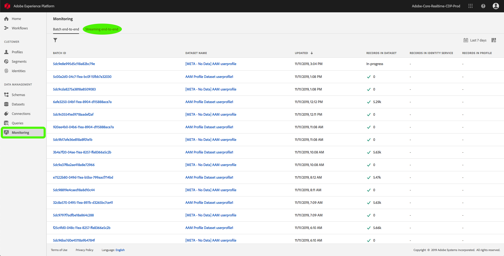
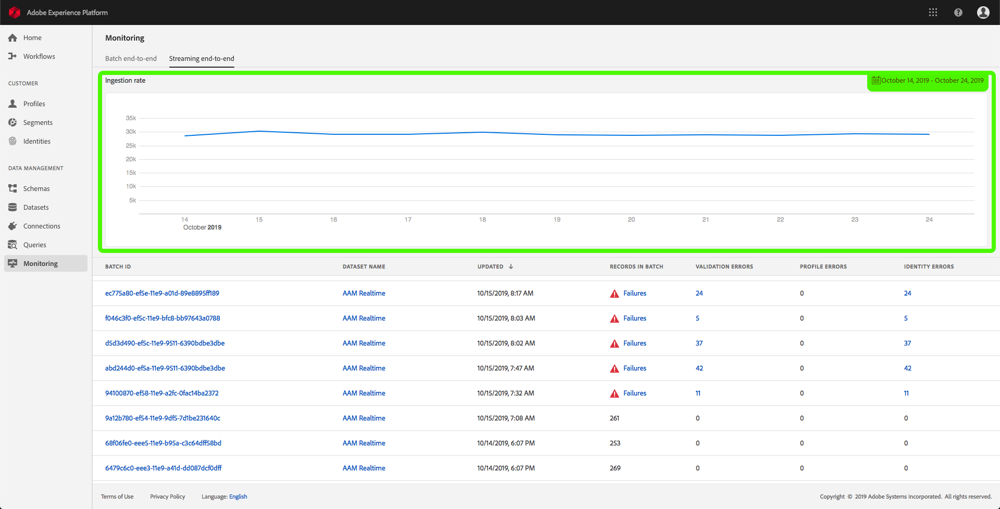
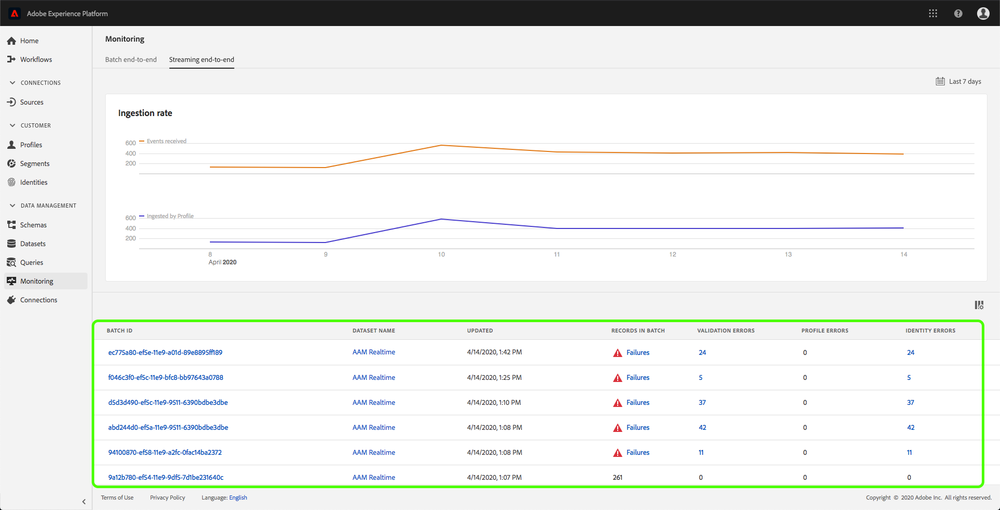
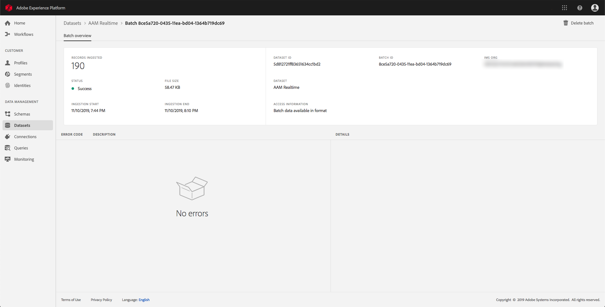
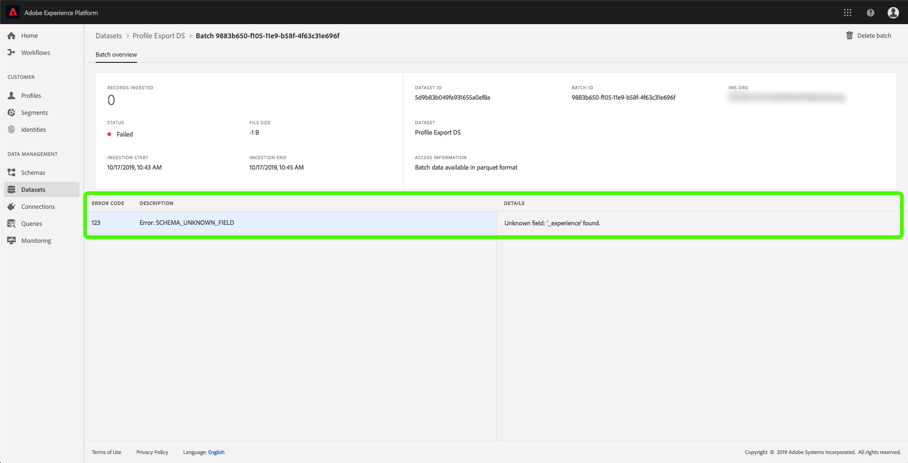
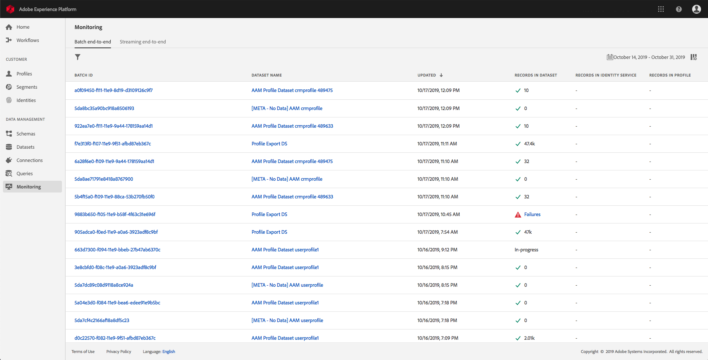
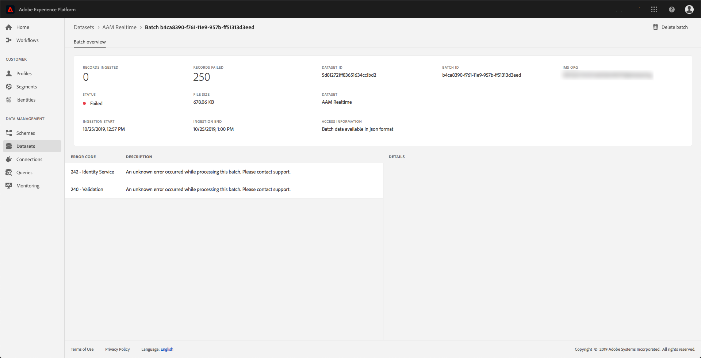
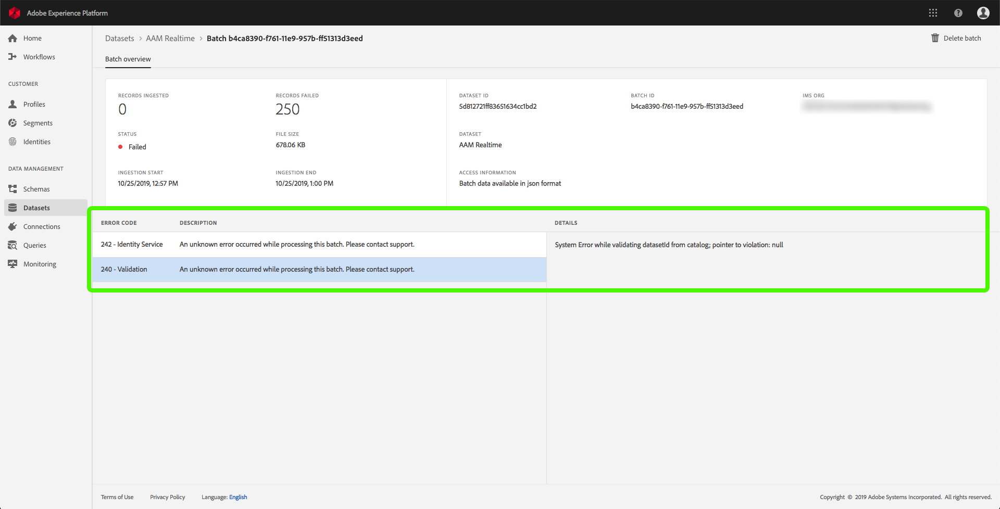

# Monitoring data ingestion

Data ingestion allows you to ingest your data to Adobe Experience Platform. You can either use batch ingestion, which allows you to insert your data using various file types (such as CSVs), or streaming ingestion, which allows you to ingest your data to Platform using streaming endpoints in real-time.

This user guide provides a steps on how to monitor your data within Adobe Experience Platform user interface. This guide requires you to have an Adobe ID and access to Adobe Experience Platform.

## Monitor streaming end-to-end data ingestion

In the [Experience Platform UI](https://platform.adobe.com), click **Monitoring** on the left navigation menu, then click **Streaming end-to-end**.

The *Streaming end-to-end* monitoring page appears. This workspace provides a graph that displays the rate of messages being streamed, as well as a detailed list of incoming data.

By default, the graph shows the rate of ingestion over the past seven days. This date range can be adjusted to show various periods of time by clicking the highlighted button.

Underneath the graph is a list of all the streaming ingestion records that correspond with the date range displayed above. Each listed batch displays its ID, dataset name, when it was last updated, the number of records in the batch, as well as the number of errors (if any exist). You can click any of the records for more detailed information about that record.

### Viewing streaming records

When viewing the details of a successfully streamed record, information such as the number of records ingested, file size, and ingestion start and end times are shown.

The details of a failed streaming record displays the same information as a successful record.

In addition, failed records provide details on the errors that ocurred while processing the batch. In the example below, there was a system error while validating the datasetId from the catalog.

## Monitor batch end-to-end data ingestion

In the [Experience Platform UI](https://platform.adobe.com), click  **Monitoring**  on the left navigation menu. 

The **Batch end-to-end** monitoring page appears, displaying a list of the previously ingested batches. You can click any of the batches for more detailed information about that record.

### Viewing batches

When viewing the details of a successful batch, information such as the number of records ingested, file size, and ingestion start and end times are shown.

The details of a failed batch displays the same information as a successful batch, with the addition of the number of records failed.

In addition, failed batches provide details on the errors that ocurred while processing the batch. In the example below, there was an error with the ingested batch because it used an unknown field of `_experience`.

