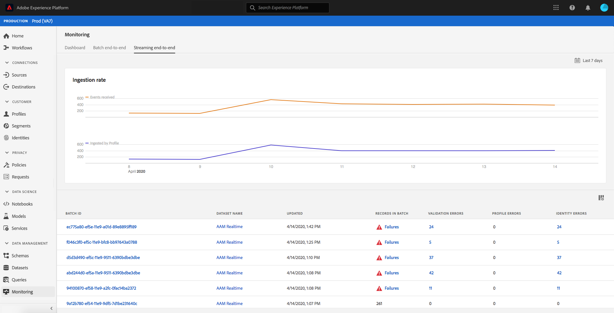
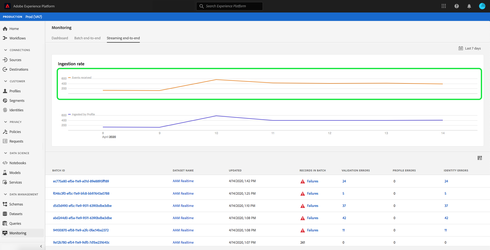
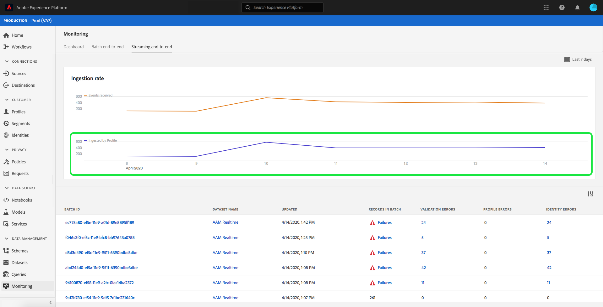
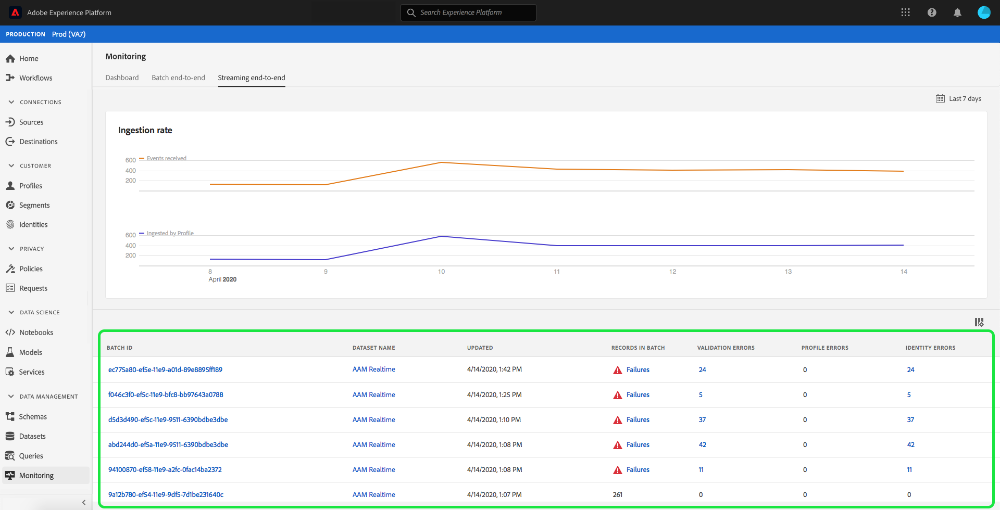
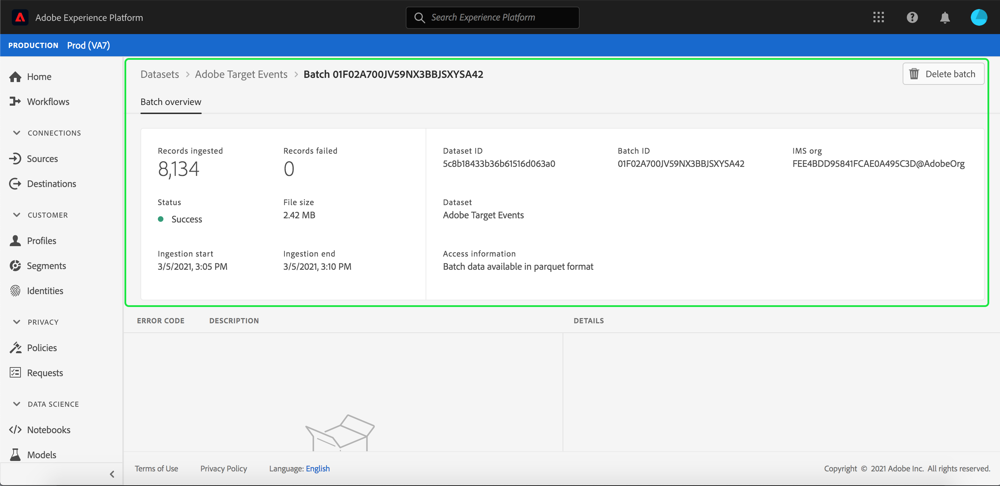
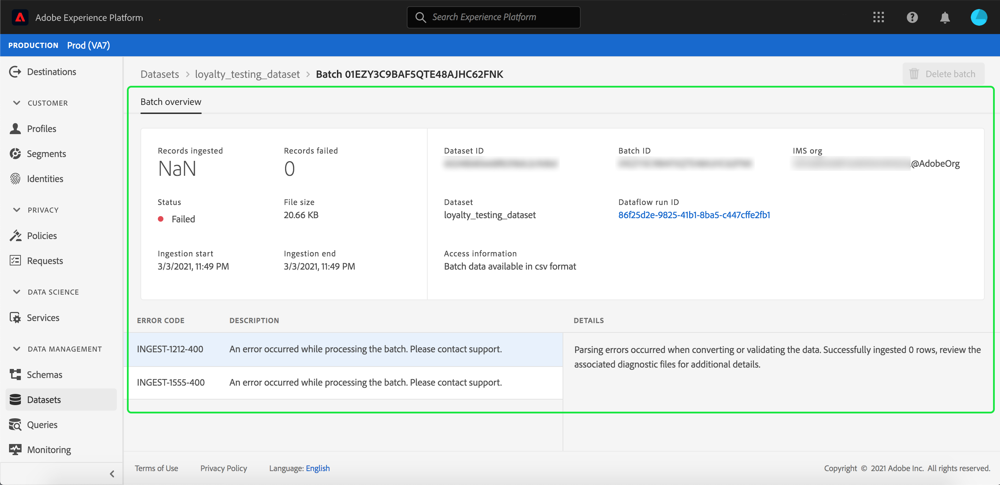
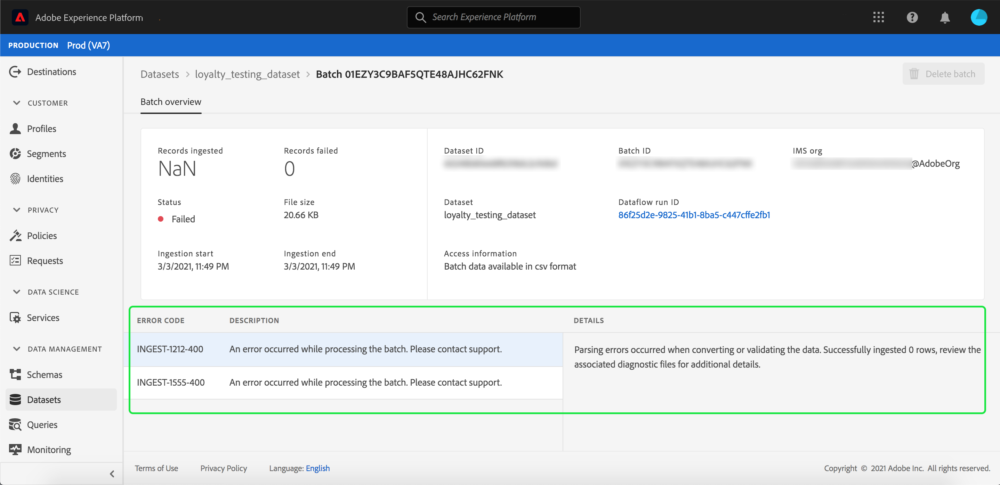
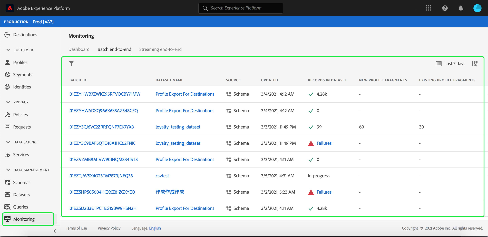
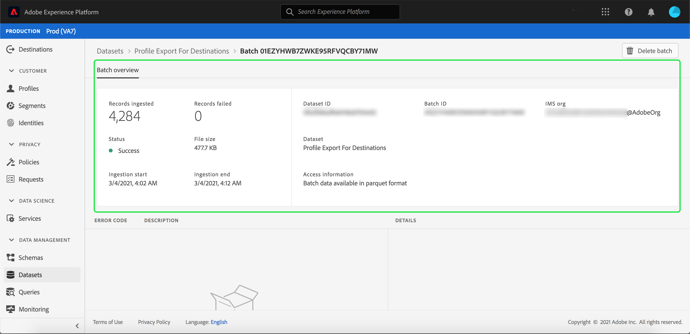
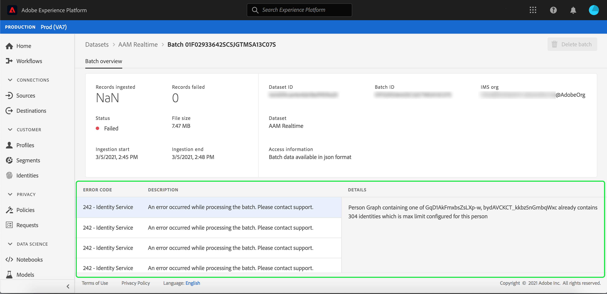

# Monitoring data ingestion

Data ingestion allows you to ingest your data to Adobe Experience Platform. You can either use batch ingestion, which allows you to insert your data using various file types (such as CSVs), or streaming ingestion, which allows you to ingest your data to [!DNL Platform] using streaming endpoints in real time.

This user guide provides steps on how to monitor your data within Adobe Experience Platform user interface. This guide requires you to have an Adobe ID and access to Adobe Experience Platform.

## Monitor streaming end-to-end data ingestion {#monitor-streaming-end-to-end-data-ingestion}

>[!CONTEXTUALHELP]
>id="platform_ingestion_streaming_ingestionrate"
>title="Ingestion rate"
>abstract="The number of events that are successfully processed per second."
>text="Learn more in the documentation"
>additional-url="http://www.adobe.com/go/monitor-dataflows-en" text="Monitor dataflows for sources in the UI"

>[!TIP]
>
>To calculate the total events on a particular date, use the expression of: `total events / day = ingestion rate * 60 * 60 * 24`.

In the [Experience Platform UI](https://platform.adobe.com), select **[!UICONTROL Monitoring]** on the left navigation menu, followed by **[!UICONTROL Streaming end-to-end]**.

The **[!UICONTROL Streaming end-to-end]** monitoring page appears. This workspace provides a graph that displays the rate of streamed events being received by [!DNL Platform], a graph that displays the rate of streamed events which were successfully processed by [[!DNL Real-Time Customer Profile]](../../profile/home.md), as well as a detailed list of incoming data.

By default, the top graph shows the rate of ingestion over the past seven days. This date range can be adjusted to show various periods of time by selecting the highlighted button.

The bottom graph shows the rate of successfully processed streamed events by [!DNL Profile] over the past seven days. This date range can be adjusted to show various periods of time by selecting the highlighted button.

>[!NOTE]
>
>In order for data to show up on this graph, the data must be **explicitly** enabled for [!DNL Profile]. To learn how to enable streaming data for [!DNL Profile], read the [datasets user guide](../../catalog/datasets/user-guide.md#enable-a-dataset-for-real-time-customer-profile).

Underneath the graphs is a list of all the streaming ingestion records that correspond with the date range displayed above. Each listed batch displays its ID, dataset name, when it was last updated, the number of records in the batch, as well as the number of errors (if any exist). You can select any of the records for more detailed information about that record.

### Viewing streaming records

When viewing the details of a successfully streamed record, information such as the number of records ingested, file size, and ingestion start and end times are shown.

The details of a failed streaming record displays the same information as a successful record.

In addition, failed records provide details on the errors that occurred while processing the batch. In the example below, there was a parsing error that occurred when converting or validating the data.

>[!NOTE]
>
>If there are errors in rows ingested, these rows will **not** be dropped unless the resulting message results in invalid XDM.

## Monitor batch end-to-end data ingestion

In the [[!DNL Experience Platform UI]](https://platform.adobe.com), select **[!UICONTROL Monitoring]** on the left navigation menu. 

The **[!UICONTROL Batch end-to-end]** monitoring page appears, displaying a list of the previously ingested batches. You can select any of the batches for more detailed information about that record.

### Viewing batches

When viewing the details of a successful batch, information such as the number of records ingested, file size, and ingestion start and end times are shown.

The details of a failed batch displays the same information as a successful batch, with the addition of the number of records failed.

In addition, failed batches provide details on the errors that occurred while processing the batch. In the example below, there was an error with the ingested batch because it has the maximum number of identities for the person.

>[!NOTE]
>
>If there are errors in rows ingested, these rows will **not** be dropped unless the resulting message results in invalid XDM.

