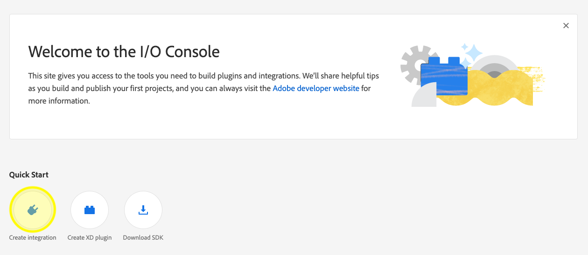
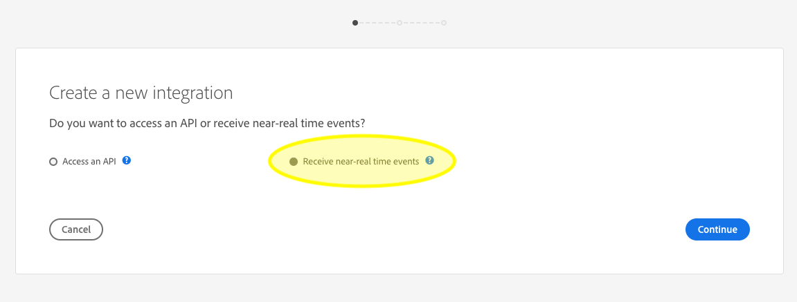
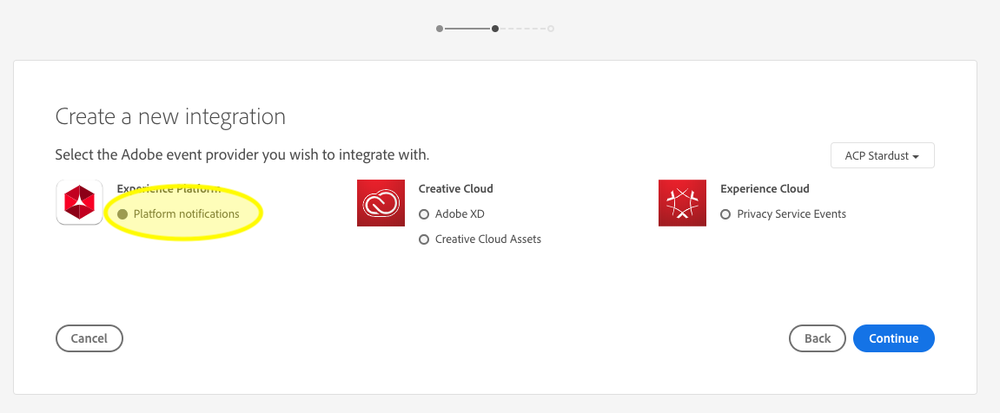
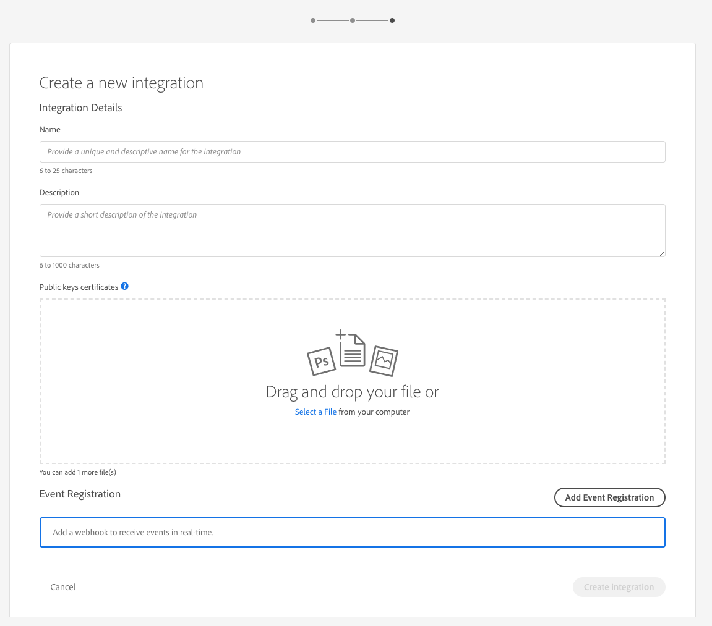

# Data ingestion notifications

The process of ingesting data into Adobe Experience Platform is comprised of multiple steps. Once you identify data files that need to be ingested into Platform, the ingestion process begins and each step occurs consecutively until the data is either successfully ingested or fails. The ingestion process can be initiated using the [Adobe Experience Platform Data Ingestion API](https://www.adobe.io/apis/experienceplatform/home/api-reference.html#!acpdr/swagger-specs/ingest-api.yaml) or using the Experience Platform user interface.

Data loaded into Platform must go through multiple steps in order to reach its destination, the Data Lake or the Real-time Customer Profile data store. Each step involves processing the data, validating the data, and then storing the data before passing it on to the next step. Depending on the amount of data being ingested, this can become a time consuming process and there is always a chance of the process failing due to validation, semantics, or processing errors. In the event of a failure, the data issues need to fixed and then the entire ingestion process must be restarted using the corrected data files. 

To assist in monitoring the ingestion process, Experience Platform makes it possible to subscribe to a set of events that are published by each step of the process, notifying you to the status of the ingested data and any possible failures. 

This document provides detailed information on data ingestion notifications, including:

- [Available status notification events](#available-status-notification-events)
- [Notification payload schema](#notification-payload-schema)
- [Subscribing to Data Ingestion Status Notifications](#subscribe-to-data-ingestion-status-notifications)
    - [Creating a new integration using Adobe I/O Console](#create-a-new-integration-using-adobe-io-console)

## Available status notification events

Below is a list of available data ingestion status notifications that you can subscribe to. 

>[!NOTE] There is only one event topic provided for all data ingestion notifications. In order to distinguish between different statuses, the event code can be used.

|Platform Service|Status| Event description | Event code|
|---|----|----|----|
|Data Landing|success|Ingestion - Batch succeeded|ing_load_success|
|Data Landing|failure|Ingestion - Batch failed|ing_load_failure|
|Real-time Customer Profile|success|Profile service - Data load batch Succeeded|ps_load_success|
|Real-time Customer Profile|failure|Profile service - Data load batch failed|ps_load_failure|
|Identity Graph|success|Identity graph - Data load batch succeeded|ig_load_success|
|Identity Graph|failure|Identity graph - Data load batch failed|ig_load_failure|

## Notification payload schema

The data ingestion notification event schema is an Experience Data Model (XDM) schema containing fields and values that provide details regarding the status of the data being ingested. Please visit the public XDM GitHub repo in order to view the latest [notification payload schema](https://github.com/adobe/xdm/blob/master/schemas/common/notifications/ingestion.schema.json).

## Subscribe to Data Ingestion Status Notifications

Through [Adobe I/O Events](https://www.adobe.io/apis/experienceplatform/events.html), you can subscribe to multiple notification types using webhooks. To learn more about webhooks, and how to subscribe to Adobe I/O Events using webhooks, please see the [introduction to Adobe I/O Events Webhooks](https://www.adobe.io/apis/experienceplatform/events/docs.html#!adobedocs/adobeio-events/master/intro/webhook_docs_intro.md) guide.

### Create a new integration using Adobe I/O Console

Sign in to [Adobe I/O Console](https://console.adobe.io/home) and click the *Integrations* tab or click **Create integration** under Quick Start. When the *Integration* screen appears, click **New Integration** to being creating a new integration.



The *Create new integration* screen appears. Select **Receive near-real time events**, then click **Continue**.



The next screen provides options to create integrations with different events, products, and services available to your organization based on your subscriptions, entitlements, and permissions. For this integration, select **Platform notifications** under Experience Platform, then click **Continue**. 
 


The *Integration Details* form appears, requiring you to provide a name and description for the integration, as well as public key certificate.

If you do not have a public certificate, you can generate one in the terminal by using the following command:
  
```shell
openssl req -x509 -sha256 -nodes -days 365 -newkey rsa:2048 -keyout private.key -out certificate_pub
```
  
Once you have generated a certificate, drag and drop the file into the **Public keys certificates** box or click **Select a File** to browse your file directory and select the certificate directly.
  
After adding your certificate, the *Event Registration* option appears. Click **Add Event Registration**.
  

    
The *Event registration details* dialog expands to show additional controls. Here you can select your desired event types and register your webhook. Enter a name for the event registration, the webhook URL *(Optional)*, as well as a brief description. Finally, select the event types you wish to subscribe to (Data ingestion notification), then click **Save**.
  


## Next Steps

Once you have created your I/O integration you can view any received notifications for that integration. Refer to the [Tracing Adobe I/O Events](https://www.adobe.io/apis/experienceplatform/events/docs.html#!adobedocs/adobeio-events/master/support/tracing.md) guide for detailed instructions on how to trace your events.
