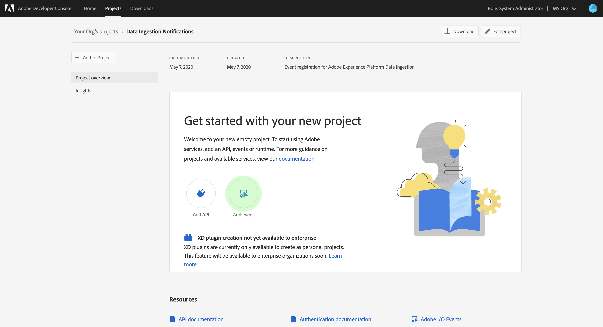
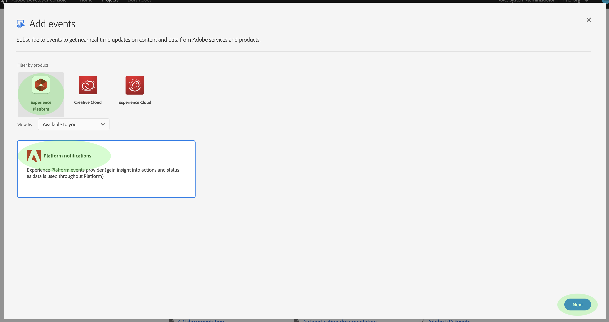
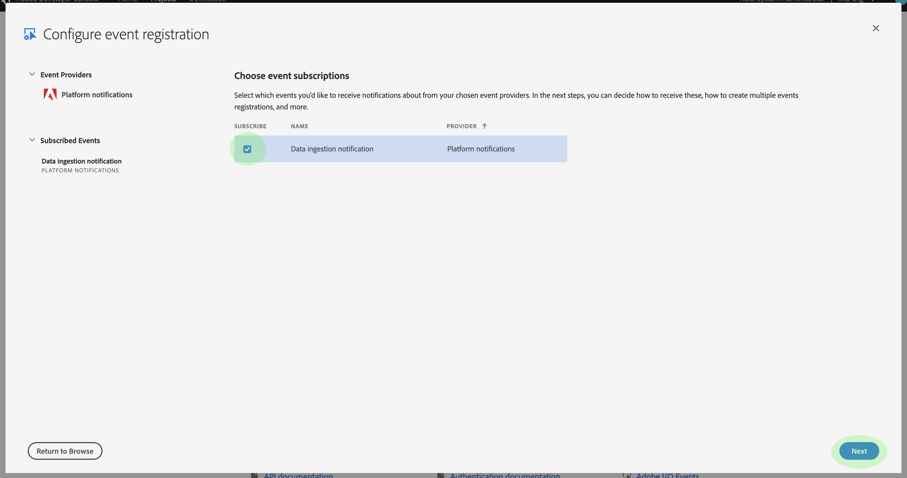
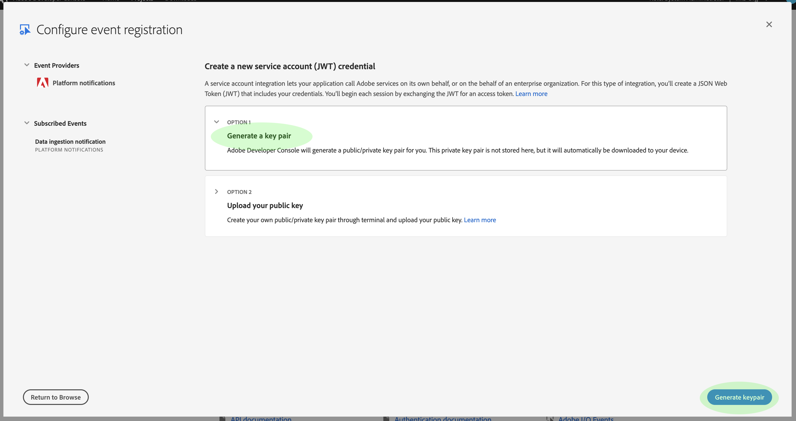
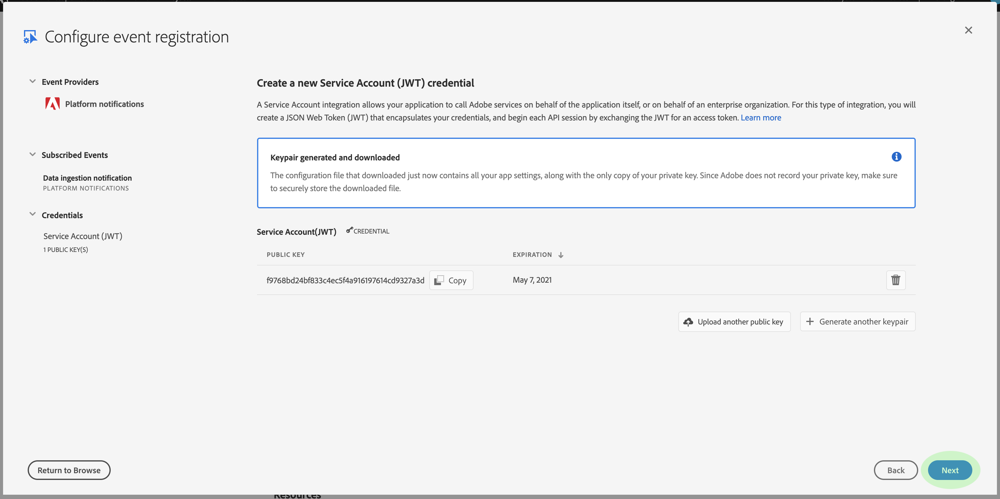
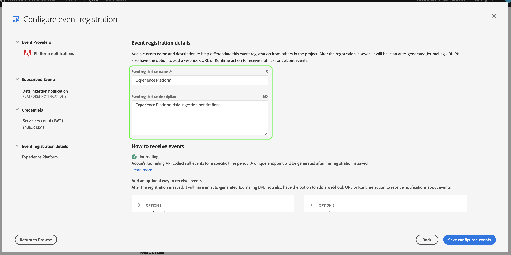
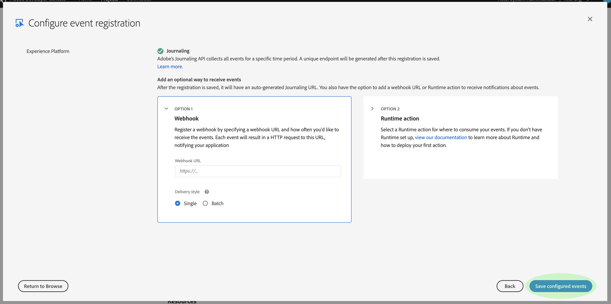
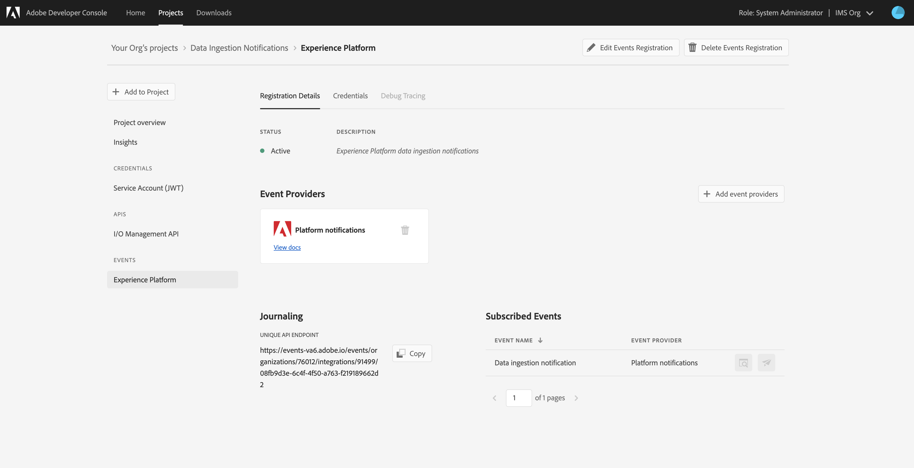

# Data ingestion notifications

The process of ingesting data into Adobe Experience Platform is comprised of multiple steps. Once you identify data files that need to be ingested into [!DNL Platform], the ingestion process begins and each step occurs consecutively until the data is either successfully ingested or fails. The ingestion process can be initiated using the [Adobe Experience Platform Data Ingestion API](https://www.adobe.io/apis/experienceplatform/home/api-reference.html#!acpdr/swagger-specs/ingest-api.yaml) or using the [!DNL Experience Platform] user interface.

Data loaded into [!DNL Platform] must go through multiple steps in order to reach its destination, the [!DNL Data Lake] or the [!DNL Real-time Customer Profile] data store. Each step involves processing the data, validating the data, and then storing the data before passing it on to the next step. Depending on the amount of data being ingested, this can become a time consuming process and there is always a chance of the process failing due to validation, semantics, or processing errors. In the event of a failure, the data issues need to fixed and then the entire ingestion process must be restarted using the corrected data files. 

To assist in monitoring the ingestion process, [!DNL Experience Platform] makes it possible to subscribe to a set of events that are published by each step of the process, notifying you to the status of the ingested data and any possible failures. 

## Available status notification events

Below is a list of available data ingestion status notifications that you can subscribe to. 

>[!NOTE]
>
>There is only one event topic provided for all data ingestion notifications. In order to distinguish between different statuses, the event code can be used.

| Platform Service | Status | Event description | Event code |
| ---------------- | ------ | ----------------- | ---------- |
| Data Landing | success | Ingestion - Batch succeeded | ing_load_success |
| Data Landing | failure | Ingestion - Batch failed | ing_load_failure |
| Real-time Customer Profile | success | Profile service - Data load batch Succeeded | ps_load_success |
| Real-time Customer Profile | failure | Profile service - Data load batch failed | ps_load_failure |
| Identity Graph | success | Identity graph - Data load batch succeeded | ig_load_success |
| Identity Graph | failure | Identity graph - Data load batch failed | ig_load_failure |

## Notification payload schema

The data ingestion notification event schema is an [!DNL Experience Data Model] (XDM) schema containing fields and values that provide details regarding the status of the data being ingested. Please visit the public XDM [!DNL GitHub] repo in order to view the latest [notification payload schema](https://github.com/adobe/xdm/blob/master/schemas/notifications/ingestion.schema.json).

## Subscribe to data ingestion status notifications

Through [Adobe I/O Events](https://www.adobe.io/apis/experienceplatform/events.html), you can subscribe to multiple notification types using webhooks. The sections below outline the steps for subscribing to [!DNL Platform] notifications for data ingestion events using Adobe Developer Console.

### Create a new project in Adobe Developer Console

Go to [Adobe Developer Console](https://www.adobe.com/go/devs_console_ui) and sign in with your Adobe ID. Next, follow the steps outlined in the tutorial on [creating an empty project](https://www.adobe.io/apis/experienceplatform/console/docs.html#!AdobeDocs/adobeio-console/master/projects-empty.md) in the Adobe Developer Console documentation.

### Add [!DNL Experience Platform] events to the project

Once you have created a new project, navigate to that project's overview screen. From here, click **[!UICONTROL Add event]**.

The _[!UICONTROL Add events]_ dialog appears. Click **[!UICONTROL Experience Platform]** to filter the list of available options, then click **[!UICONTROL Platform notifications]** before clicking **[!UICONTROL Next]**.

The next screen displays a list of event types to subscribe to. Select **[!UICONTROL Data ingestion notification]**, then click **[!UICONTROL Next]**.

The next screen prompts you to create a JSON Web Token (JWT). You are given the option to automatically generate a key pair, or upload your own public key generated in the terminal.

For the purposes of this tutorial, the first option is followed. CLick the option box for **[!UICONTROL Generate a key pair]**, then click the **[!UICONTROL Generate keypair]** button in the bottom-right corner.

When the key pair generates, it is automatically downloaded by the browser. You must store this file yourself as it is not persisted in the Developer Console.

The next screen allows you to review the details of the newly generated key pair. Click **[!UICONTROL Next]** to continue.

In the next screen, provide a name and description for the event registration. Best practice is to create a unique, easily identifiable name to help differentiate this event registration from others on the same project.

Further down on the same screen, you can optionally configure how to receive events. **[!UICONTROL Webhook]** allows you to provide a custom webhook address to receive events, whereas **[!UICONTROL Runtime action]** allows you to do the same using [Adobe I/O Runtime](https://www.adobe.io/apis/experienceplatform/runtime/docs.html).

This tutorial skips this optional configuration step. Once you are finished, click **[!UICONTROL Save configured events]** to complete the event registration.

The details page for the newly created event registration appears, where you can review received events, perform debug tracing, and edit its configuration.

## Next steps

Once you have registered [!DNL Platform] notifications to your project, you can view received events from the project dashboard. Refer to the [Tracing Adobe I/O Events](https://www.adobe.io/apis/experienceplatform/events/docs.html#!adobedocs/adobeio-events/master/support/tracing.md) guide for detailed instructions on how to trace your events.
