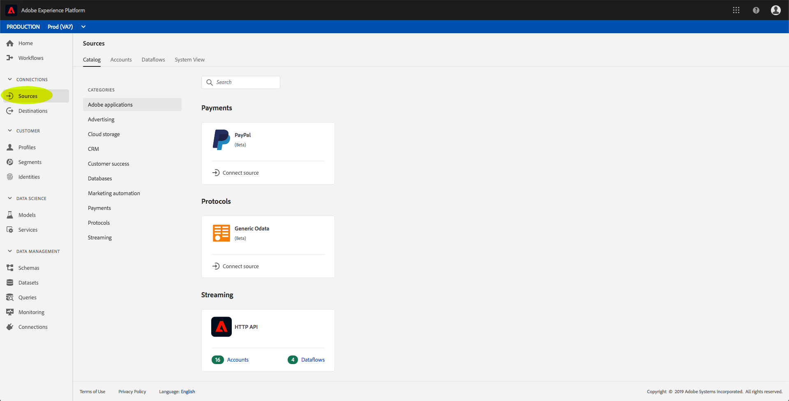
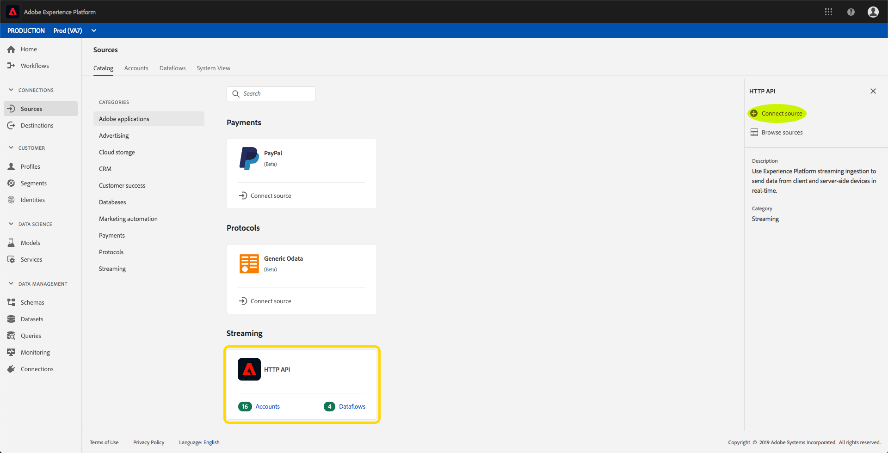
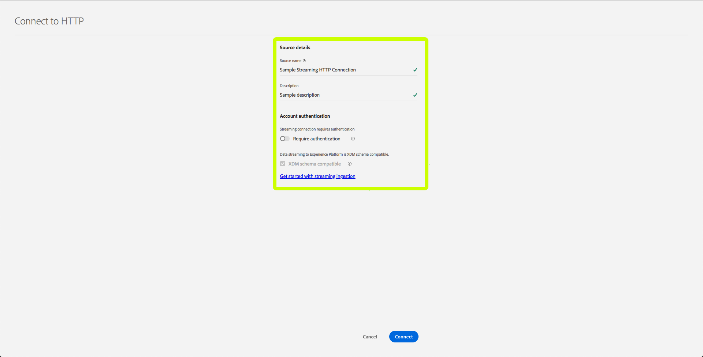
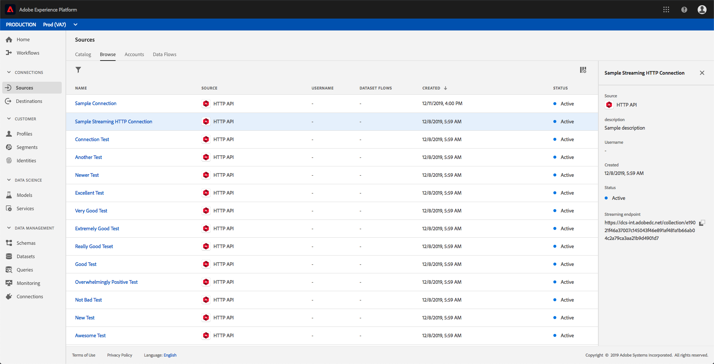
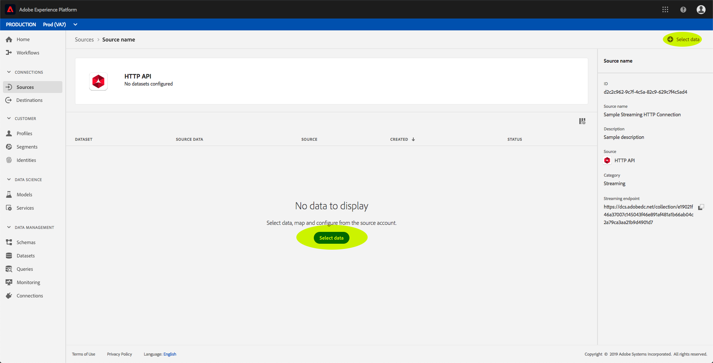
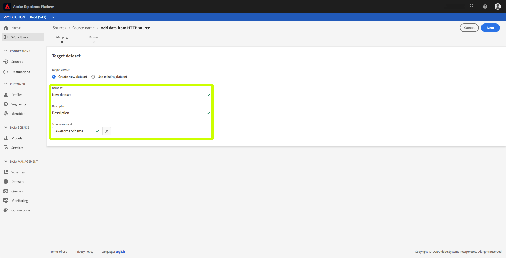
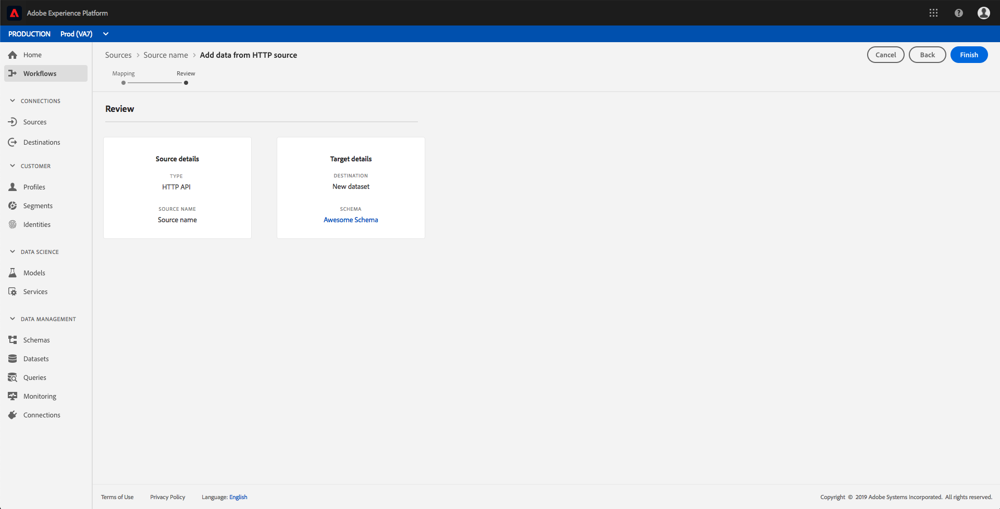
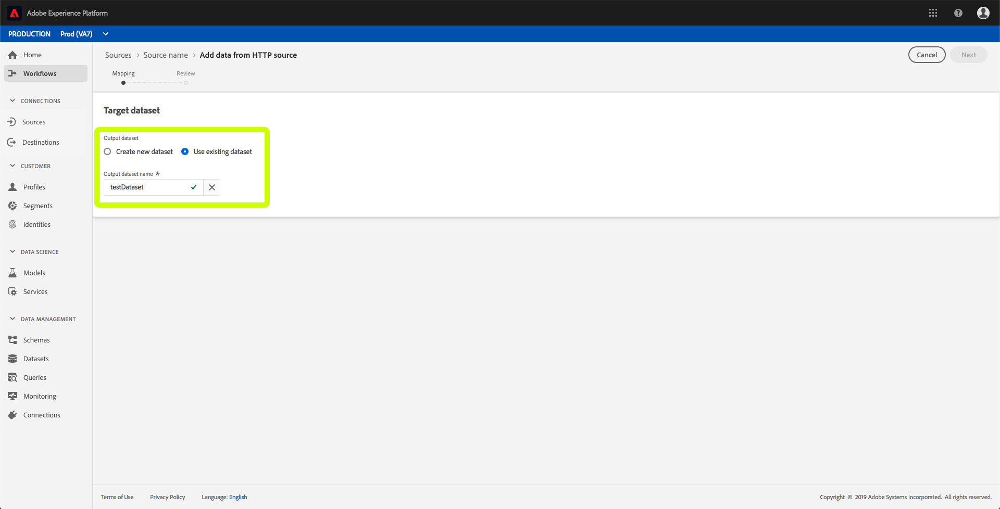

# Create a streaming connection using the UI

This UI guide will help you create a streaming connection using Adobe Experience Platform.

## Getting started

In order to start streaming data to [!DNL Experience Platform], you must first create a streaming HTTP connection. When creating a streaming connection, you need to provide key details such as the source of streaming data, and whether or not you intend to send data from a trusted (authenticated) or an untrusted (unauthenticated) source.

After registering a streaming connection you will have a unique URL which can be used to stream data to [!DNL Platform].

Please note that in order to complete this guide, you will need access to Adobe Experience Platform. If you do not have access to [!DNL Platform], please contact your system administrator before proceeding.

## Create a streaming connection

After logging in to the [!DNL Experience Platform] UI, click **[!UICONTROL Sources]** to open the **[!UICONTROL Catalog]** tab. This page displays the available source types as individual cards, with each card containing a bubble that displays the number of data flows that have been created from streaming connections to datasets. 

On the **[!UICONTROL Sources]** page, click **[!UICONTROL HTTP API]**, then **[!UICONTROL Connect source]**. 

The **[!UICONTROL Connect to HTTP]** screen appears. Under **[!UICONTROL Service details]**, provide both the **[!UICONTROL name]** and a **[!UICONTROL description]** for your new streaming connection.

Under **[!UICONTROL Account Authentication]**, select the following configuration properties for your streaming connection:

- **[!UICONTROL Authentication]:** Whether or not the streaming connection requires authentication. Authentication ensures that data is collected from trusted sources. It is recommended that this is turned on if dealing with Personally Identifiable Information (PII).
- **[!UICONTROL XDM Schema Compatibility]:** Whether or not this streaming connection will be sending events which are compatible with XDM schemas. By default, this property is turned **on**.

Once you have finished selecting your configuration properties, click **[!UICONTROL Connect]**. Your streaming HTTP connection is now created, and can now be viewed under the **[!UICONTROL Browse]** tab in the **[!UICONTROL Sources]** workspace.

From the **[!UICONTROL Browse]** tab, you can click on your newly created Streaming HTTP Connection and view the details of that connection.

By clicking on the hyperlink of the connection name, you can select data to be displayed by configuring which dataset is connected, by clicking **[!UICONTROL Select data]**.

You can either [create a new dataset](#create-a-new-dataset) or [use an existing dataset](#use-an-existing-dataset). 

### Create a new dataset

To create a new dataset, provide the **[!UICONTROL Name]**, **[!UICONTROL Description]**, as well as the target **[!UICONTROL Schema]** for the dataset.

Upon inserting all the details and clicking **[!UICONTROL Next]**, you can review the provided details before clicking **[!UICONTROL Finish]** to connect the dataset to your streaming HTTP connection.

### Use an existing dataset

To use an existing dataset, select the **[!UICONTROL Output dataset name]**.

After clicking **[!UICONTROL Next]**, you can review the details before clicking **[!UICONTROL Finish]** to connect the selected dataset to your streaming HTTP connection.

## Next steps

By following this tutorial, you have created a streaming HTTP connection, enabling you to use the streaming endpoint to access a variety of [!DNL Data Ingestion] APIs. For instructions to create a streaming connection in the API, please read the [creating a streaming connection tutorial](../tutorials/create-streaming-connection.md).
