# Ingest data into Adobe Experience Platform

Adobe Experience Platform allows you to easily import data into [!DNL Platform] as batch files. Examples of data to be ingested may include profile data from a flat file in a CRM system (such as a Parquet file) or data that conforms to a known [!DNL Experience Data Model] (XDM) schema in the Schema Registry.

## Getting started

In order to complete this tutorial, you must have access to [!DNL Experience Platform]. If you do not have access to an organization in [!DNL Experience Platform], please speak to your system administrator before proceeding. 

If you would prefer to ingest data using Data Ingestion APIs please begin by reading the [Batch Ingestion developer guide](../batch-ingestion/api-overview.md).

## Datasets workspace

The Datasets workspace within [!DNL Experience Platform] allows you to view and manage all of the datasets that your organization has made, as well as create new ones. 

View the Datasets workspace by clicking **[!UICONTROL Datasets]** in the left-hand navigation. The Datasets workspace contains a list of datasets, including columns showing name, created (date and time), source, schema, and last batch status, as well as the date and time the dataset was last updated. 

>[!NOTE]
>
>Click on the filter icon next to the Search bar to use filtering capabilities to view only those datasets enabled for [!DNL Profile].

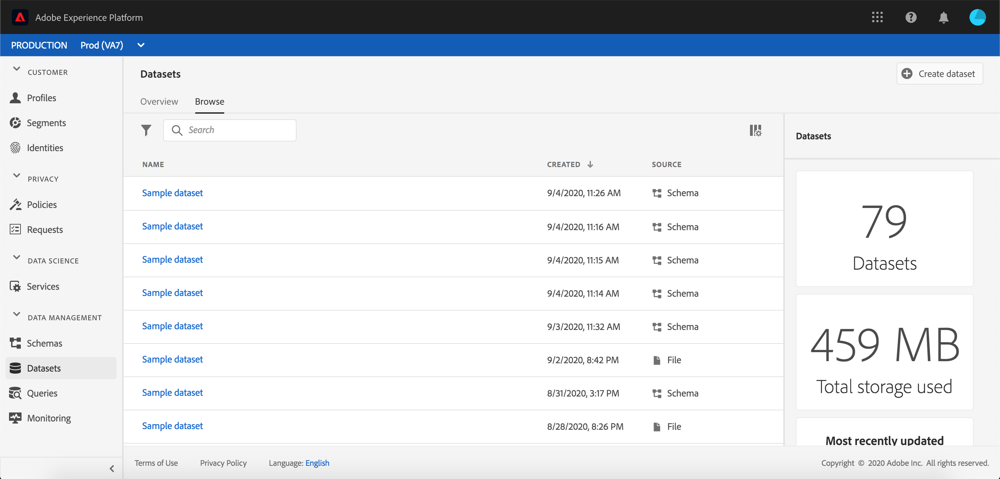

## Create a dataset

To create a dataset, click **[!UICONTROL Create Dataset]** in the top right corner of the Datasets workspace. 

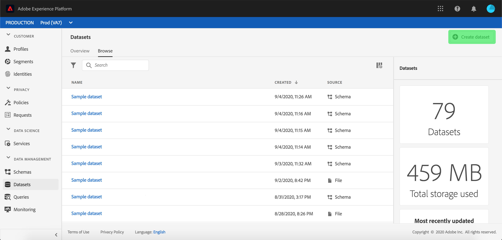

On the **[!UICONTROL Create Dataset]** screen, select whether you would like to "[!UICONTROL Create Dataset from Schema]" or "[!UICONTROL Create Dataset from CSV File]". 

For this tutorial, a schema will be used to create the dataset. Click **[!UICONTROL Create Dataset from Schema]** to continue.

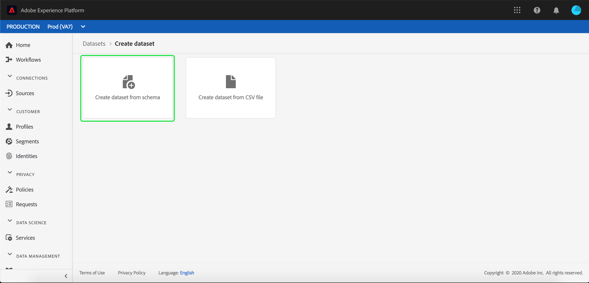

## Select dataset schema

On the **[!UICONTROL Select Schema]** screen, choose a schema by clicking the radio button beside the schema you wish to use. For this tutorial, the dataset will be made using the Loyalty Members schema. Using the search bar to filter schemas is a helpful way to find the exact schema you are looking for.

Once you have selected the radio button next to the schema you wish to use, click **[!UICONTROL Next]**.

## Configure dataset

On the **[!UICONTROL Configure Dataset]** screen, you will be required to give your dataset a name and may also provide a description of the dataset as well. 

**Notes on Dataset Names:**

- Dataset names should be short and descriptive so that the dataset can be easily found in the library later. 
- Dataset names must be unique, meaning it should also be specific enough that it will not be reused in the future. 
- It is best practice to provide additional information about the dataset using the description field, as it may help other users differentiate between datasets in the future.

Once the dataset has a name and description, click **[!UICONTROL Finish]**.

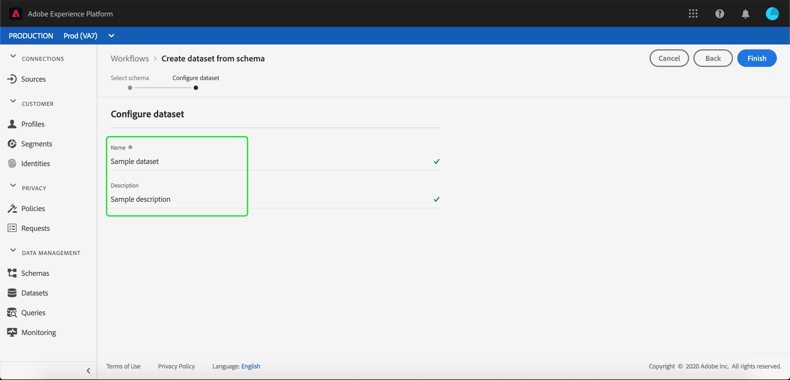

## Dataset activity

An empty dataset has now been created and you have been returned to the **[!UICONTROL Dataset Activity]** tab in the Datasets workspace. You should see the name of the dataset in the top-left corner of the workspace, along with a notification that "No batches have been added." This is to be expected since you have not added any batches to this dataset yet. 

On the right-hand side of the Datasets workspace you will see the **[!UICONTROL Info]** tab containing information related to your new dataset such as dataset ID, name, description, table name, schema, streaming, and source. The Info tab also includes information about when the dataset was created and its last modified date. 

Also in the Info tab is a  **[!UICONTROL Profile]** toggle that is used for enabling your dataset for use with [!DNL Real-Time Customer Profile]. Use of this toggle, and [!DNL Real-Time Customer Profile], will be explained in more detail in the section that follows.

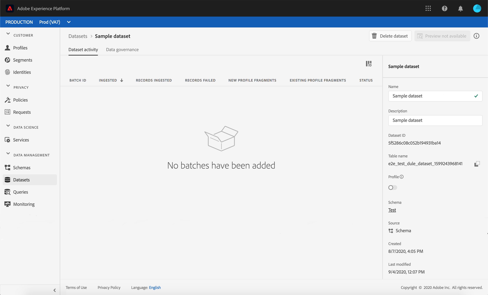

## Enable dataset for [!DNL Real-Time Customer Profile]

Datasets are used for ingesting data into [!DNL Experience Platform], and that data is ultimately used to identify individuals and stitch together information coming from multiple sources. That stitched together information is called a [!DNL Real-Time Customer Profile]. In order for [!DNL Platform] to know which information should be included in the [!DNL Real-Time Profile], datasets can be marked for inclusion using the **[!UICONTROL Profile]** toggle. 

By default, this toggle is off. If you choose to toggle on [!DNL Profile], all data ingested into the dataset will be used to help identify an individual and stitch together their [!DNL Real-Time Profile].

To learn more about [!DNL Real-Time Customer Profile] and working with identities, please review the [Identity Service](../../identity-service/home.md) documentation.

To enable the dataset for [!DNL Real-Time Customer Profile], click the **[!UICONTROL Profile]** toggle in the **[!UICONTROL Info]** tab. 

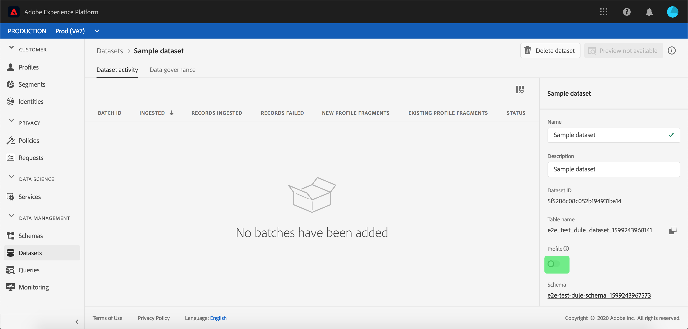

A dialog will appear asking you to confirm that you want to enable the dataset for [!DNL Real-Time Customer Profile].

Click **[!UICONTROL Enable]** and the toggle will turn blue, indicating it is on.

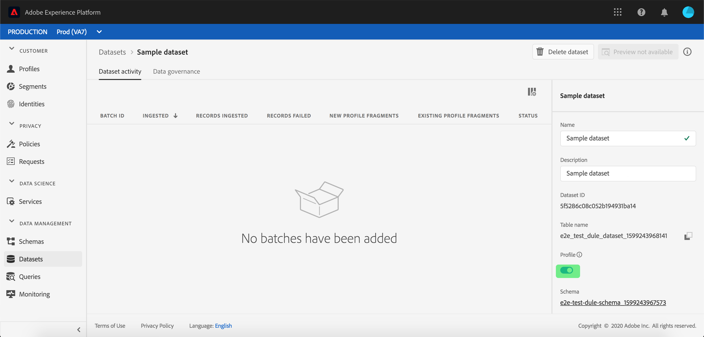

## Add data to dataset

Data can be added into a dataset in a number of different ways. You could choose to use [!DNL Data Ingestion] APIs or an ETL partner such as [!DNL Unifi] or [!DNL Informatica]. For this tutorial, data will be added to the dataset using the **[!UICONTROL Add Data]** tab within the UI.

To begin adding data to the dataset, click on the **[!UICONTROL Add Data]** tab. You can now drag and drop files or browse your computer for the files you wish to add. 

>[!NOTE]
>
>Platform supports two files types for data ingestion, Parquet or JSON. You may add up to five files at a time, with the maximum file size of each file being 1 GB.

## Upload a file

Once you drag and drop (or browse and select) a Parquet or JSON file that you wish to upload, [!DNL Platform] will immediately begin to process the file and an **[!UICONTROL Uploading]** dialog will appear on the **[!UICONTROL Add Data]** tab showing the progress of your file upload.

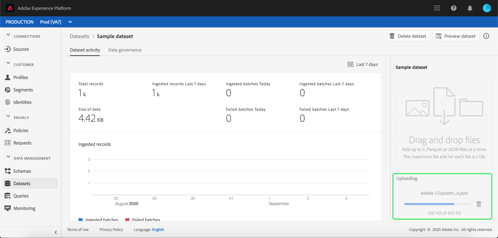

## Dataset metrics

After the file has finished uploading, the **[!UICONTROL Dataset Activity]** tab no longer shows that "No batches have been added." Instead, the **[!UICONTROL Dataset Activity]** tab now shows dataset metrics. All metrics will show "0" at this stage as the batch has not yet loaded.

At the bottom of the tab is a list showing the **[!UICONTROL Batch ID]** of the data that was just ingested through the ["Add data to dataset"](#add-data-to-dataset) process. Also included is information related to the batch, including ingested date, number of records ingested, and the current batch status.

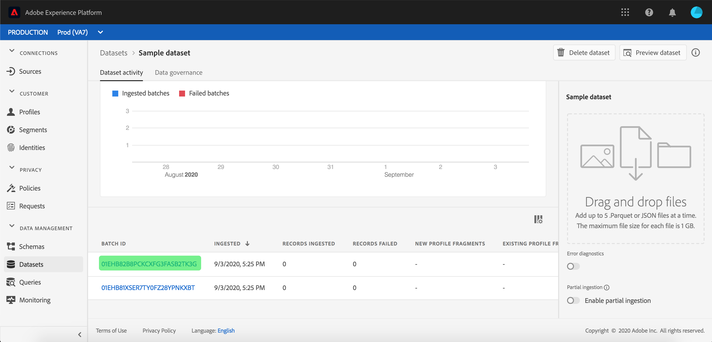

## Batch details

Click on the **[!UICONTROL Batch ID]** to view a **[!UICONTROL Batch Overview]**, showing additional details regarding the batch. Once the batch has finished loading, the information about the batch will update to show the number of records ingested and the file size. The status will also change to "Success" or "Failed". If the batch fails the **[!UICONTROL Error Code]** section will contain details regarding any errors during ingestion.

For more information and frequently asked questions regarding batch ingestion, see the [Batch Ingestion troubleshooting guide](../batch-ingestion/troubleshooting.md).

To return to the **[!UICONTROL Dataset Activity]** screen, click the name of the dataset (**[!UICONTROL Loyalty Details]**) in the breadcrumb.

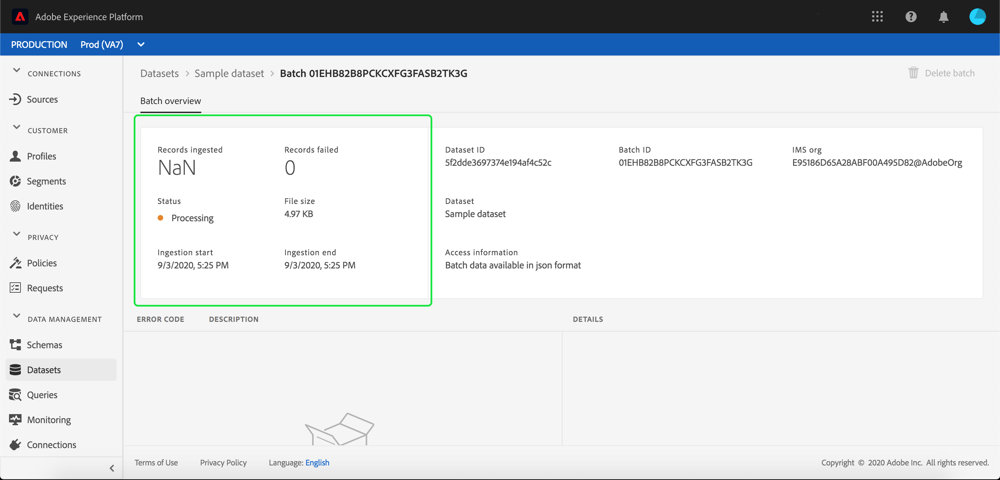

## Preview dataset

Once the dataset is ready, an option to **[!UICONTROL Preview Dataset]** appears at the top of the **[!UICONTROL Dataset Activity]** tab. 

Click **[!UICONTROL Preview Dataset]** to open a dialog showing sample data from within the dataset. If the dataset was created using a schema, details for the dataset schema will appear on the left-side of the preview. You can expand the schema using the arrows to see the schema structure. Each column header in the preview data represents a field in the dataset.

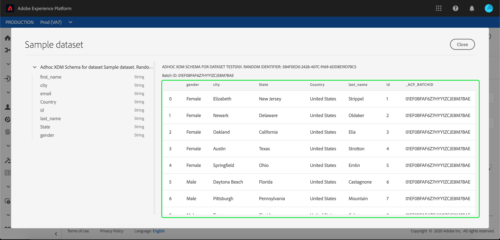

## Next steps and additional resources

Now that you have created a dataset and successfully ingested data into [!DNL Experience Platform], you can repeat these steps to create a new dataset or ingest more data into the existing dataset.

To learn more about batch ingestion, please read the [Batch Ingestion overview](../batch-ingestion/overview.md) and supplement your learning by watching the video below.

>[!WARNING]
>
>The [!DNL Platform] UI shown in the following video is out-of-date. Please refer to the documentation above for the latest UI screenshots and functionality.

>[!VIDEO](https://video.tv.adobe.com/v/27269?quality=12&learn=on)
